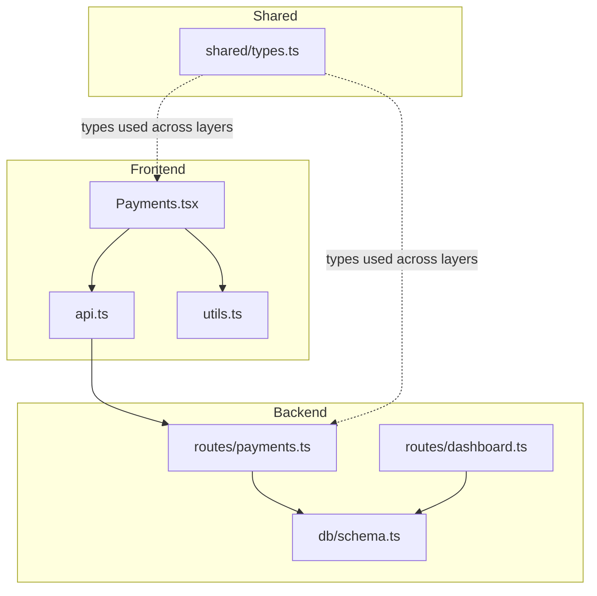
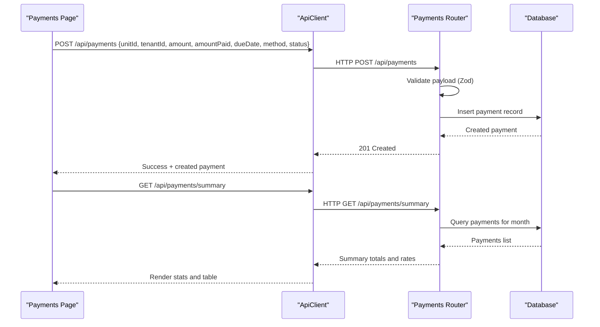
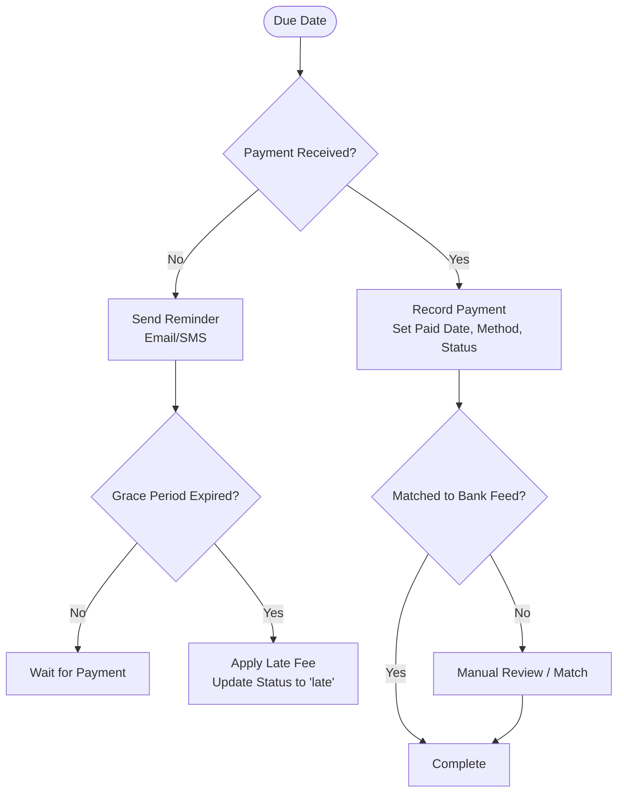
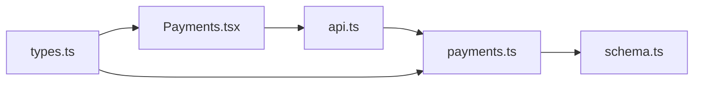

# Payment Processing

<cite>
**Referenced Files in This Document**
- [payments.ts](file://server/src/routes/payments.ts)
- [schema.ts](file://server/src/db/schema.ts)
- [types.ts](file://shared/src/types.ts)
- [Payments.tsx](file://client/src/pages/Payments.tsx)
- [api.ts](file://client/src/lib/api.ts)
- [utils.ts](file://client/src/lib/utils.ts)
- [dashboard.ts](file://server/src/routes/dashboard.ts)
- [RentLite-Product-Spec-Sheet.md](file://RentLite-Product-Spec-Sheet.md)
</cite>

## Table of Contents
1. [Introduction](#introduction)
2. [Project Structure](#project-structure)
3. [Core Components](#core-components)
4. [Architecture Overview](#architecture-overview)
5. [Detailed Component Analysis](#detailed-component-analysis)
6. [Dependency Analysis](#dependency-analysis)
7. [Performance Considerations](#performance-considerations)
8. [Troubleshooting Guide](#troubleshooting-guide)
9. [Conclusion](#conclusion)
10. [Appendices](#appendices)

## Introduction
This document explains how RentLite processes rent payments today and outlines the intended roadmap for advanced features such as automated reminders, late fee application, bank feed reconciliation, and online payment processing. It covers:
- The payment data model (amounts, dates, statuses, methods, and tenant/unit associations)
- The current API endpoints for recording, updating, listing, and summarizing payments
- The user interface for payment entry, tracking, and reporting
- Planned integrations with external processors and reconciliation workflows
- Security, auditability, and financial reporting considerations

## Project Structure
RentLite is a full-stack application with a React frontend, an Express backend, and a shared type layer. Payments are modeled in the database schema, exposed via REST endpoints, and consumed by the Payments page.

**Diagram sources**
- [Payments.tsx:1-297](file://client/src/pages/Payments.tsx#L1-L297)
- [api.ts:1-82](file://client/src/lib/api.ts#L1-L82)
- [utils.ts:1-35](file://client/src/lib/utils.ts#L1-L35)
- [payments.ts:1-137](file://server/src/routes/payments.ts#L1-L137)
- [schema.ts:268-289](file://server/src/db/schema.ts#L268-L289)
- [dashboard.ts:104-123](file://server/src/routes/dashboard.ts#L104-L123)
- [types.ts:70-90](file://shared/src/types.ts#L70-L90)

**Section sources**
- [Payments.tsx:1-297](file://client/src/pages/Payments.tsx#L1-L297)
- [payments.ts:1-137](file://server/src/routes/payments.ts#L1-L137)
- [schema.ts:268-289](file://server/src/db/schema.ts#L268-L289)
- [types.ts:70-90](file://shared/src/types.ts#L70-L90)

## Core Components
- Payment data model: Defines fields for amounts, due/paid dates, method, status, late fees, notes, and linkage to unit/tenant.
- API layer: Validates input, persists payments, supports filtering and summary calculations.
- UI layer: Provides forms to record payments, view monthly summaries, and track statuses.
- Dashboard integration: Surfaces late payment counts and financial metrics.

Key responsibilities:
- Data validation and persistence on the server
- Aggregation for collection rate and outstanding balances
- User-facing entry and reporting for landlords

**Section sources**
- [schema.ts:268-289](file://server/src/db/schema.ts#L268-L289)
- [payments.ts:11-22](file://server/src/routes/payments.ts#L11-L22)
- [payments.ts:24-137](file://server/src/routes/payments.ts#L24-L137)
- [Payments.tsx:58-107](file://client/src/pages/Payments.tsx#L58-L107)
- [dashboard.ts:104-123](file://server/src/routes/dashboard.ts#L104-L123)

## Architecture Overview
The payment flow spans client request handling, server-side validation, database operations, and UI updates.

**Diagram sources**
- [Payments.tsx:63-107](file://client/src/pages/Payments.tsx#L63-L107)
- [api.ts:26-54](file://client/src/lib/api.ts#L26-L54)
- [payments.ts:24-137](file://server/src/routes/payments.ts#L24-L137)

## Detailed Component Analysis

### Payment Data Model
- Entity: payment
- Fields include:
  - Unit and tenant references
  - Amount due and amount paid
  - Due date and paid date
  - Method (cash, check, zelle, venmo, ach, card, bank_transfer, other)
  - Status (pending, received, late, partial)
  - Late fee
  - Notes and matched transaction id
  - Timestamps

Relationships:
- Unit -> many Payments
- Tenant -> many Payments

Complexity:
- Simple relational model; queries filter by month/year/status/unit and aggregate totals.

**Section sources**
- [schema.ts:268-289](file://server/src/db/schema.ts#L268-L289)
- [types.ts:70-90](file://shared/src/types.ts#L70-L90)

### API Endpoints for Payments
- GET /api/payments
  - Filters by month, year, status, unitId
  - Returns payments with related unit and tenant
- GET /api/payments/summary
  - Computes total expected, collected, outstanding, collection rate, and counts by status for a given month/year
- POST /api/payments
  - Creates a new payment with validated fields
- PUT /api/payments/:id
  - Updates a payment (partial update), sets updatedAt
- DELETE /api/payments/:id
  - Deletes a payment if it exists

Error handling:
- Validation errors return structured messages with details
- Not found returns a clear code

Security:
- All routes protected by authentication middleware

**Section sources**
- [payments.ts:1-137](file://server/src/routes/payments.ts#L1-L137)

### User Interface for Payments
- Records payments via a modal form with fields for unit, tenant, amount due, amount paid, due date, method, and status
- Displays a dashboard-style summary: total expected, collected, outstanding, collection rate
- Lists all payments with key columns: unit, tenant, due, paid, due date, status, method
- Uses React Query for data fetching and mutations, with toast notifications for success/error

Formatting utilities:
- Currency formatting and date formatting helpers

**Section sources**
- [Payments.tsx:58-297](file://client/src/pages/Payments.tsx#L58-L297)
- [utils.ts:8-35](file://client/src/lib/utils.ts#L8-L35)

### Payment Workflow: From Due Date to Completion
Current state:
- Landlords manually create or update payments
- Statuses reflect pending, received, late, or partial
- No automatic late fee calculation or reminder automation is implemented in the codebase

Planned enhancements (from product spec):
- Automated reminders (SMS/email) with configurable grace periods
- Late fee auto-calculation based on configurable rules (flat or daily)
- Bank feed matching to reconcile incoming deposits to tenants
- Online rent payments via Stripe Connect (ACH + card)

Conceptual workflow:

[No sources needed since this diagram shows conceptual workflow, not actual code structure]

### Reporting and Dashboard Integration
- Payments summary endpoint provides monthly totals and collection rate
- Dashboard route surfaces late payment counts alongside income/expenses for a quick overview

**Section sources**
- [payments.ts:61-101](file://server/src/routes/payments.ts#L61-L101)
- [dashboard.ts:104-123](file://server/src/routes/dashboard.ts#L104-L123)

### External Integrations (Planned)
- Stripe Connect for online rent payments (ACH and card), including auto-pay and split payments
- Plaid for bank feed matching to reconcile payments automatically
- Twilio for SMS reminders and maintenance notifications
- Accounting sync (QuickBooks/Xero) and Schedule E export in later phases

These are documented in the product specification and represent future capabilities beyond the current implementation.

**Section sources**
- [RentLite-Product-Spec-Sheet.md:182-227](file://RentLite-Product-Spec-Sheet.md#L182-L227)
- [RentLite-Product-Spec-Sheet.md:291-303](file://RentLite-Product-Spec-Sheet.md#L291-L303)

## Dependency Analysis
- Frontend depends on ApiClient for HTTP requests and uses React Query for caching/mutations
- Backend routes depend on Drizzle ORM and database schema definitions
- Shared types define contracts for Payment, Lease, Tenant, etc., ensuring consistency across layers

**Diagram sources**
- [Payments.tsx:1-297](file://client/src/pages/Payments.tsx#L1-L297)
- [api.ts:1-82](file://client/src/lib/api.ts#L1-L82)
- [payments.ts:1-137](file://server/src/routes/payments.ts#L1-L137)
- [schema.ts:268-289](file://server/src/db/schema.ts#L268-L289)
- [types.ts:70-90](file://shared/src/types.ts#L70-L90)

**Section sources**
- [Payments.tsx:1-297](file://client/src/pages/Payments.tsx#L1-L297)
- [api.ts:1-82](file://client/src/lib/api.ts#L1-L82)
- [payments.ts:1-137](file://server/src/routes/payments.ts#L1-L137)
- [schema.ts:268-289](file://server/src/db/schema.ts#L268-L289)
- [types.ts:70-90](file://shared/src/types.ts#L70-L90)

## Performance Considerations
- Current summary and listing endpoints fetch all payments and filter in memory; for large datasets, consider server-side pagination and indexed queries on due_date and unit_id
- Avoid unnecessary joins when not required; only include related data when needed by the UI
- Cache frequently accessed summaries using Redis or similar to reduce database load during peak usage

[No sources needed since this section provides general guidance]

## Troubleshooting Guide
Common issues and resolutions:
- Validation errors: Ensure all required fields match the expected schema (e.g., valid UUIDs for unitId/tenantId, numeric amounts, valid enum values for method/status). The API returns structured error details to help identify invalid fields.
- Not found errors: When updating or deleting a payment, verify the ID exists before making changes.
- Unauthorized access: If the client receives a 401, it redirects to login; ensure sessions are active and credentials are valid.

Operational tips:
- Use the summary endpoint to quickly diagnose collection issues by reviewing total expected vs. collected and counts by status
- Filter payments by month/year/status/unitId to isolate problematic entries

**Section sources**
- [payments.ts:103-137](file://server/src/routes/payments.ts#L103-L137)
- [api.ts:26-54](file://client/src/lib/api.ts#L26-L54)

## Conclusion
RentLite currently provides a solid foundation for manual rent payment tracking, with clear data models, robust API endpoints, and a user-friendly interface for recording and viewing payments. While automated reminders, late fee application, and bank feed reconciliation are not yet implemented in code, the product specification outlines these as planned features. Future work should focus on:
- Automating reminders and late fee calculations
- Integrating bank feeds for reconciliation
- Enabling online payments via Stripe Connect
- Enhancing reporting and audit trails for compliance and accounting needs

[No sources needed since this section summarizes without analyzing specific files]

## Appendices

### API Reference: Payments
- GET /api/payments
  - Query params: month, year, status, unitId
  - Response: List of payments with unit and tenant details
- GET /api/payments/summary
  - Query params: month, year (defaults to current)
  - Response: Monthly totals and collection metrics
- POST /api/payments
  - Body: unitId, tenantId, amount, amountPaid, dueDate, method, status, lateFee, notes
  - Response: Created payment
- PUT /api/payments/:id
  - Body: Partial update fields
  - Response: Updated payment
- DELETE /api/payments/:id
  - Response: Deletion confirmation

**Section sources**
- [payments.ts:24-137](file://server/src/routes/payments.ts#L24-L137)

### Payment Scenarios
- Partial payments: Set amountPaid less than amount; status can be set to "partial"
- Refunds: Create a negative adjustment or separate refund entry linked to the original payment via notes and matchedTransactionId
- Adjustments: Update existing payment fields (amount, amountPaid, lateFee, notes) to reflect corrections

Note: These scenarios are supported by the current schema and update endpoint; business logic for enforcement (e.g., preventing overpayment) can be added as needed.

**Section sources**
- [schema.ts:268-289](file://server/src/db/schema.ts#L268-L289)
- [payments.ts:112-126](file://server/src/routes/payments.ts#L112-L126)

### Security and Audit Trails
- Authentication: All payment routes are protected by middleware
- Encryption: Product spec recommends TLS in transit and AES-256 at rest
- PCI compliance: Via Stripe for any future online payments
- Auditability: Maintain updated timestamps and notes; consider adding an activity log for all payment modifications

**Section sources**
- [payments.ts:1-9](file://server/src/routes/payments.ts#L1-L9)
- [RentLite-Product-Spec-Sheet.md:333-347](file://RentLite-Product-Spec-Sheet.md#L333-L347)