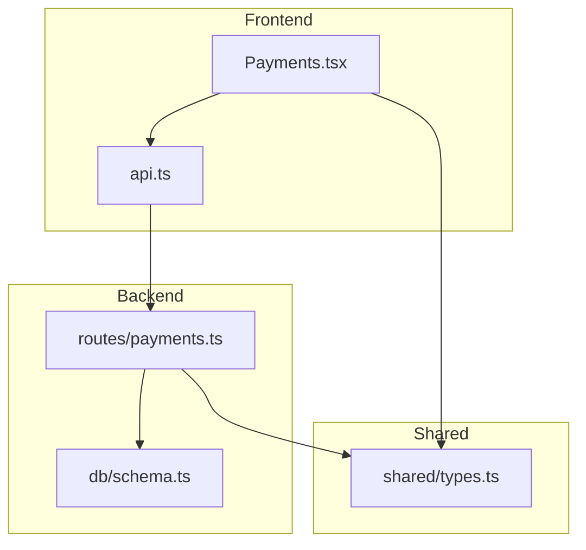
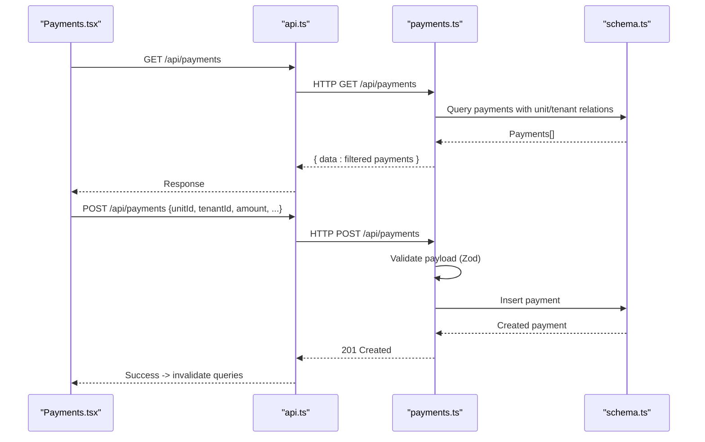
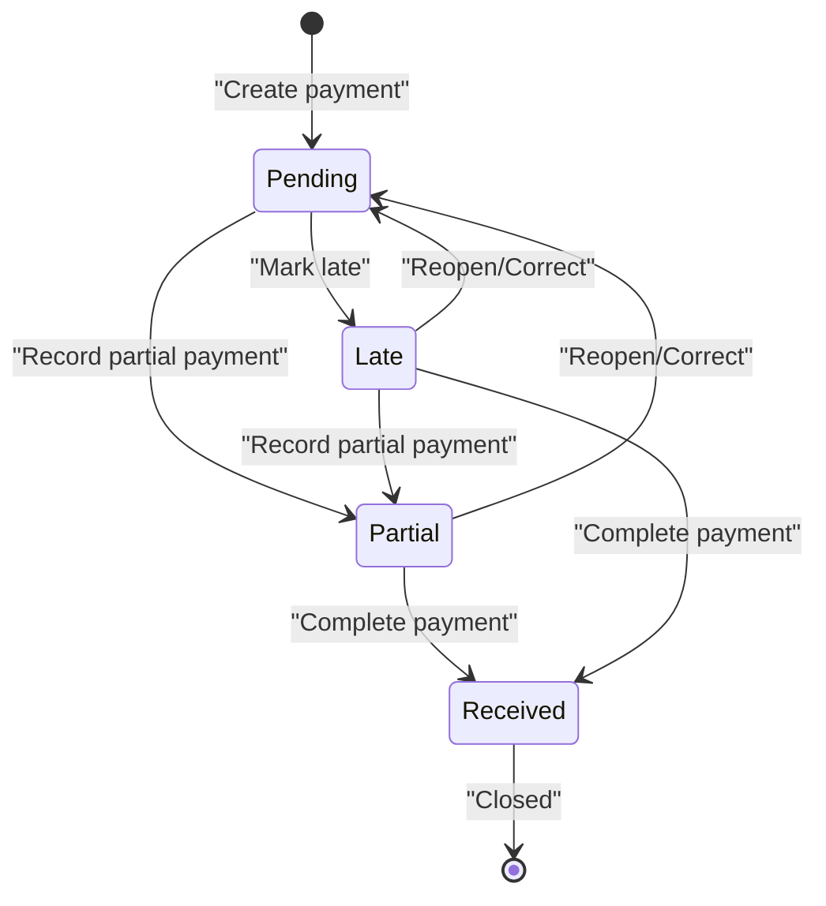
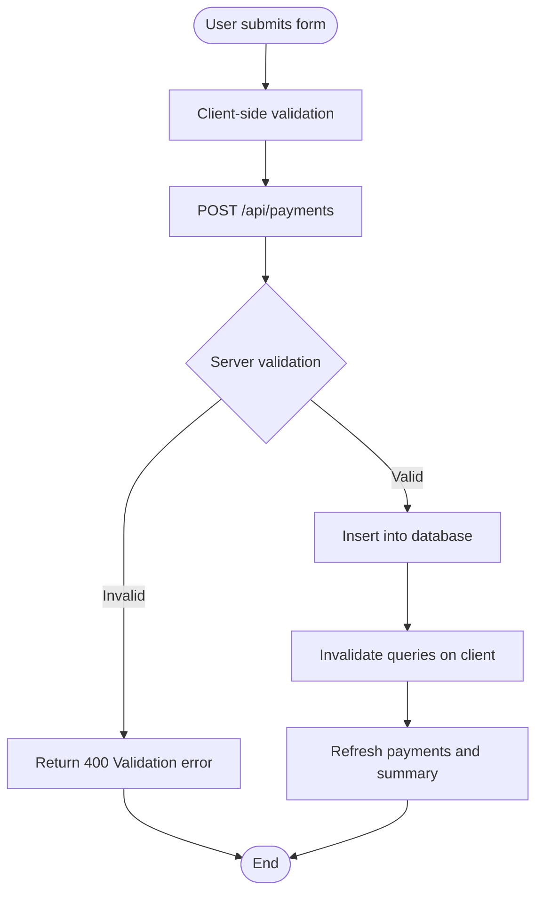
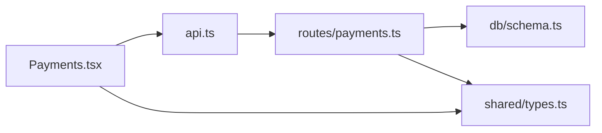

# Payment Tracking

<cite>
**Referenced Files in This Document**
- [payments.ts](file://server/src/routes/payments.ts)
- [schema.ts](file://server/src/db/schema.ts)
- [types.ts](file://shared/src/types.ts)
- [Payments.tsx](file://client/src/pages/Payments.tsx)
- [api.ts](file://client/src/lib/api.ts)
</cite>

## Table of Contents
1. Introduction
2. Project Structure
3. Core Components
4. Architecture Overview
5. Detailed Component Analysis
6. Dependency Analysis
7. Performance Considerations
8. Troubleshooting Guide
9. Conclusion
10. Appendices

## Introduction
This document explains the payment tracking functionality in RentLite. It covers the payment data model, lifecycle and status transitions, API endpoints for creating, updating, retrieving, and summarizing payments, filtering capabilities, recording workflows, validation rules, and business logic constraints. The goal is to help developers and product stakeholders understand how payments are modeled, processed, and exposed through the application’s frontend and backend.

## Project Structure
RentLite implements payment tracking across three layers:
- Frontend (React): A Payments page that lists payments, shows a monthly summary, and records new payments via modals.
- Backend (Express + Drizzle ORM): REST endpoints for CRUD operations on payments, query filters, and a monthly summary endpoint.
- Shared types: TypeScript interfaces defining the Payment model and related enums used across client and server.

**Diagram sources**
- [Payments.tsx:63-85](file://client/src/pages/Payments.tsx#L63-L85)
- [api.ts:26-78](file://client/src/lib/api.ts#L26-L78)
- [payments.ts:24-136](file://server/src/routes/payments.ts#L24-L136)
- [schema.ts:270-289](file://server/src/db/schema.ts#L270-L289)
- [types.ts:75-90](file://shared/src/types.ts#L75-L90)

**Section sources**
- [Payments.tsx:58-132](file://client/src/pages/Payments.tsx#L58-L132)
- [api.ts:1-82](file://client/src/lib/api.ts#L1-L82)
- [payments.ts:1-136](file://server/src/routes/payments.ts#L1-L136)
- [schema.ts:270-289](file://server/src/db/schema.ts#L270-L289)
- [types.ts:75-90](file://shared/src/types.ts#L75-L90)

## Core Components
- Payment data model: Defines fields such as amount, amountPaid, dueDate, paidDate, method, status, lateFee, notes, and timestamps.
- API layer: Endpoints for listing, filtering, creating, updating, deleting payments; plus a monthly summary endpoint.
- Frontend UI: Displays payment list, summary metrics, and a modal to record payments with unit/tenant selection and method/status options.

Key responsibilities:
- Server validates inputs using a schema and enforces access control per user-owned properties.
- Server computes monthly collection summaries (expected, collected, outstanding, rate).
- Client renders UI, handles form state, and triggers mutations to create/update payments.

**Section sources**
- [schema.ts:270-289](file://server/src/db/schema.ts#L270-L289)
- [payments.ts:11-22](file://server/src/routes/payments.ts#L11-L22)
- [payments.ts:24-136](file://server/src/routes/payments.ts#L24-L136)
- [Payments.tsx:58-132](file://client/src/pages/Payments.tsx#L58-L132)
- [types.ts:75-90](file://shared/src/types.ts#L75-L90)

## Architecture Overview
The payment system follows a standard layered architecture:
- Frontend components call the API client to perform GET/POST/PUT/DELETE requests.
- Backend routes validate payloads, enforce ownership by querying user properties, and persist changes via Drizzle ORM.
- Data models and enums are shared between client and server for type safety.

**Diagram sources**
- [Payments.tsx:63-85](file://client/src/pages/Payments.tsx#L63-L85)
- [api.ts:26-78](file://client/src/lib/api.ts#L26-L78)
- [payments.ts:24-136](file://server/src/routes/payments.ts#L24-L136)
- [schema.ts:270-289](file://server/src/db/schema.ts#L270-L289)

## Detailed Component Analysis

### Payment Data Model
The payment entity includes:
- Identifier and relationships: id, unitId, tenantId
- Financials: amount, amountPaid, lateFee
- Dates: dueDate, paidDate
- Classification: method, status, notes
- Audit: createdAt, updatedAt
- Optional linkage: matchedTransactionId

Constraints and defaults:
- amount and amountPaid are numeric and non-negative.
- lateFee defaults to 0 and must be non-negative.
- status defaults to pending.
- method is an enum or null.
- paidDate is optional.

Complexity:
- Storage: O(1) per record.
- Queries: Filtering and joins scale with number of payments and units.

**Section sources**
- [schema.ts:270-289](file://server/src/db/schema.ts#L270-L289)
- [types.ts:75-90](file://shared/src/types.ts#L75-L90)

### API Endpoints
- GET /api/payments
  - Filters: month, year, status, unitId
  - Returns payments scoped to user-owned units
- GET /api/payments/summary
  - Computes monthly totals: totalExpected, totalCollected, totalOutstanding, collectionRate, counts by status
- POST /api/payments
  - Creates a new payment with validated fields
- PUT /api/payments/:id
  - Updates any subset of payment fields; sets updatedAt
- DELETE /api/payments/:id
  - Deletes a payment if it exists

Notes:
- All endpoints require authentication via middleware.
- Ownership scoping ensures users only see payments for their properties’ units.

**Section sources**
- [payments.ts:24-136](file://server/src/routes/payments.ts#L24-L136)

### Filtering Capabilities
- By month/year: Filters payments based on dueDate month and year.
- By status: Exact match on status field.
- By unitId: Filters to a specific unit.

Implementation details:
- Fetches all payments once and applies client-side filters after server-side scoping by user-owned units.
- Summary endpoint also scopes by user-owned units and filters by month/year.

**Section sources**
- [payments.ts:24-59](file://server/src/routes/payments.ts#L24-L59)
- [payments.ts:62-101](file://server/src/routes/payments.ts#L62-L101)

### Payment Lifecycle and Status Transitions
Current behavior:
- Creation: New payments default to status "pending".
- Updates: Any field can be updated via PUT, including status and amountPaid. There is no enforced transition logic in the current codebase.
- Late fees: Stored but not automatically calculated or applied by the server.

Recommended lifecycle (conceptual guidance):
- pending → partial → received
- pending → late (if past due date without full payment)
- late → partial → received
- Any state can revert to pending if corrections are needed

Note: Enforcing these transitions should be implemented server-side to ensure consistency.

[No sources needed since this diagram shows conceptual workflow, not actual code structure]

### Recording Workflows and Status Updates
Recording a payment:
- User selects unit and tenant, enters amount due, optionally amount paid, due date, method, and status.
- Frontend sends POST to /api/payments.
- Server validates input and persists the record.
- Frontend invalidates queries to refresh lists and summary.

Updating status or amounts:
- Use PUT /api/payments/:id with partial fields (e.g., status, amountPaid, paidDate).
- Server updates the record and returns the updated payment.

**Diagram sources**
- [Payments.tsx:84-107](file://client/src/pages/Payments.tsx#L84-L107)
- [payments.ts:103-110](file://server/src/routes/payments.ts#L103-L110)

**Section sources**
- [Payments.tsx:84-107](file://client/src/pages/Payments.tsx#L84-L107)
- [payments.ts:103-126](file://server/src/routes/payments.ts#L103-L126)

### Validation Rules and Business Logic Constraints
Validation:
- Zod schema enforces:
  - unitId and tenantId as UUIDs
  - amount and amountPaid as numbers >= 0
  - dueDate as non-empty string
  - paidDate optional
  - method from allowed enum or null
  - status from allowed enum, default "pending"
  - lateFee number >= 0, default 0
  - notes optional

Business logic constraints:
- Access control: Payments returned are scoped to units belonging to user-owned properties.
- No automatic late fee calculation or status transitions in current implementation.
- Summary calculations rely on dueDate month/year and payment amounts.

Recommendations:
- Add server-side business rules to prevent invalid transitions (e.g., cannot mark as received if amountPaid < amount).
- Implement automated late fee computation based on dueDate and current date.
- Enforce that amountPaid cannot exceed amount.

**Section sources**
- [payments.ts:11-22](file://server/src/routes/payments.ts#L11-L22)
- [payments.ts:24-59](file://server/src/routes/payments.ts#L24-L59)
- [payments.ts:62-101](file://server/src/routes/payments.ts#L62-L101)

## Dependency Analysis
- Frontend depends on:
  - api.ts for HTTP methods and error handling
  - Payments.tsx for UI and mutation orchestration
- Backend depends on:
  - Drizzle ORM for database access
  - Zod for request validation
  - Schema definitions for table structures and enums
- Shared types provide consistent contracts between client and server.

**Diagram sources**
- [Payments.tsx:63-85](file://client/src/pages/Payments.tsx#L63-L85)
- [api.ts:26-78](file://client/src/lib/api.ts#L26-L78)
- [payments.ts:1-136](file://server/src/routes/payments.ts#L1-L136)
- [schema.ts:270-289](file://server/src/db/schema.ts#L270-L289)
- [types.ts:75-90](file://shared/src/types.ts#L75-L90)

**Section sources**
- [payments.ts:1-136](file://server/src/routes/payments.ts#L1-L136)
- [schema.ts:270-289](file://server/src/db/schema.ts#L270-L289)
- [types.ts:75-90](file://shared/src/types.ts#L75-L90)
- [Payments.tsx:63-85](file://client/src/pages/Payments.tsx#L63-L85)
- [api.ts:26-78](file://client/src/lib/api.ts#L26-L78)

## Performance Considerations
- Current GET /api/payments fetches all payments and filters in memory. For large datasets, consider server-side pagination and filtering.
- Summary endpoint aggregates in memory; consider database-level aggregation for performance at scale.
- Ensure indexes on dueDate, unitId, and status to speed up filtering and reporting.
- Avoid unnecessary re-fetches by leveraging React Query caching and invalidation patterns already in place.

[No sources needed since this section provides general guidance]

## Troubleshooting Guide
Common issues and resolutions:
- Validation errors:
  - Symptom: 400 response with VALIDATION code and details.
  - Cause: Invalid or missing fields (e.g., non-UUID unitId, negative amount).
  - Resolution: Ensure request body conforms to the schema.
- Not found:
  - Symptom: 404 response when updating or deleting a payment.
  - Cause: Payment ID does not exist.
  - Resolution: Verify the ID and existence before mutating.
- Unauthorized:
  - Symptom: 401 redirect to login.
  - Cause: Missing or expired authentication.
  - Resolution: Re-authenticate and retry.
- Empty results:
  - Symptom: No payments displayed.
  - Cause: No payments recorded or none matching filters.
  - Resolution: Record a payment or adjust filters.

**Section sources**
- [payments.ts:103-136](file://server/src/routes/payments.ts#L103-L136)
- [api.ts:39-51](file://client/src/lib/api.ts#L39-L51)

## Conclusion
RentLite’s payment tracking provides a solid foundation for recording rent payments, viewing collections, and generating monthly summaries. The current implementation focuses on flexible updates and basic filtering. To enhance reliability and automation, consider enforcing status transitions, validating payment completeness, and automating late fee calculations on the server. These improvements will strengthen data integrity and streamline landlord workflows.

[No sources needed since this section summarizes without analyzing specific files]

## Appendices

### API Reference Summary
- GET /api/payments?month=&year=&status=&unitId=
  - Returns filtered payments scoped to user-owned units
- GET /api/payments/summary?month=&year=
  - Returns monthly collection metrics
- POST /api/payments
  - Creates a new payment
- PUT /api/payments/:id
  - Updates payment fields
- DELETE /api/payments/:id
  - Deletes a payment

**Section sources**
- [payments.ts:24-136](file://server/src/routes/payments.ts#L24-L136)