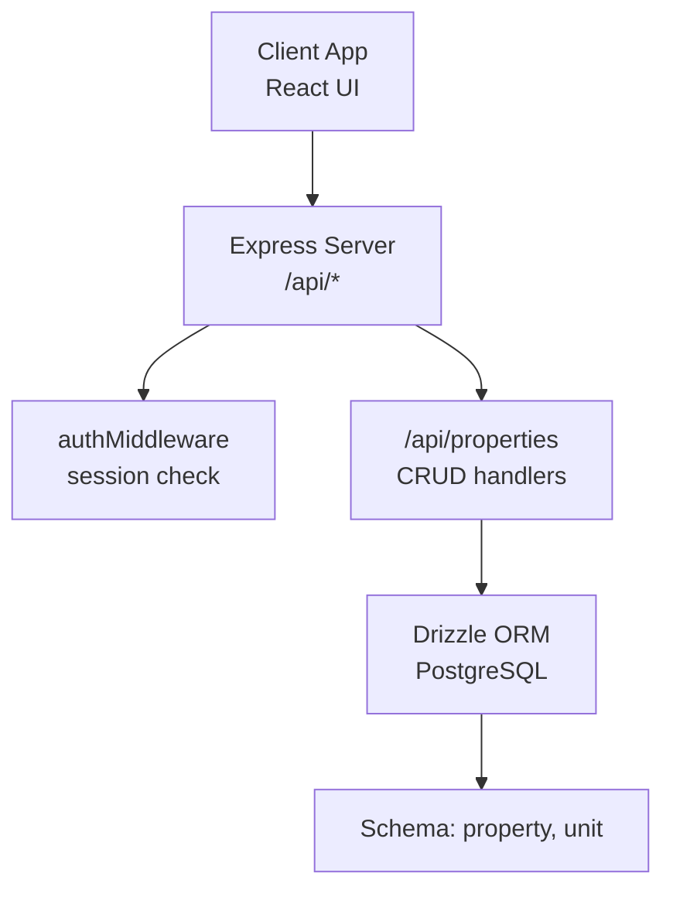
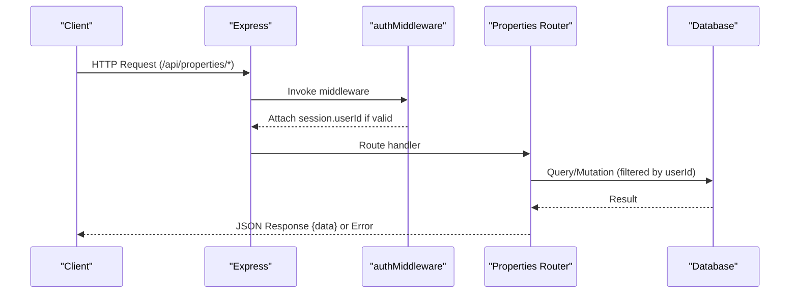
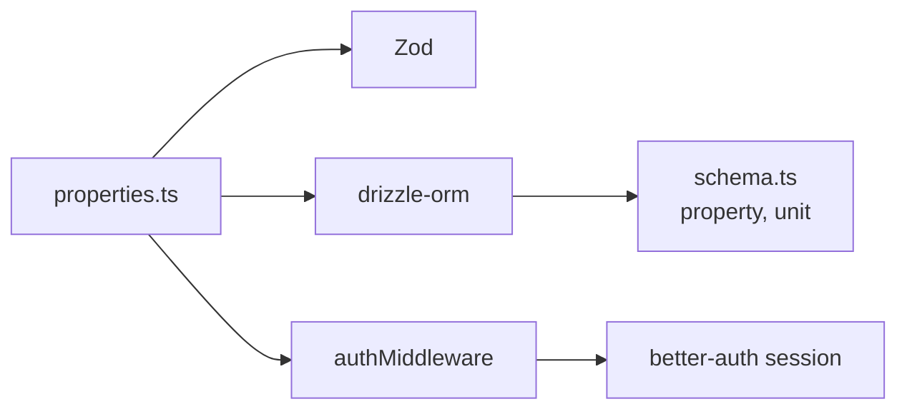

# Property CRUD Operations

<cite>
**Referenced Files in This Document**
- [server/src/routes/properties.ts](file://server/src/routes/properties.ts)
- [server/src/db/schema.ts](file://server/src/db/schema.ts)
- [server/src/auth/middleware.ts](file://server/src/auth/middleware.ts)
- [server/src/index.ts](file://server/src/index.ts)
- [shared/src/types.ts](file://shared/src/types.ts)
- [client/src/pages/Properties.tsx](file://client/src/pages/Properties.tsx)
</cite>

## Table of Contents
1. [Introduction](#introduction)
2. [Project Structure](#project-structure)
3. [Core Components](#core-components)
4. [Architecture Overview](#architecture-overview)
5. [Detailed Component Analysis](#detailed-component-analysis)
6. [Dependency Analysis](#dependency-analysis)
7. [Performance Considerations](#performance-considerations)
8. [Troubleshooting Guide](#troubleshooting-guide)
9. [Conclusion](#conclusion)
10. [Appendices](#appendices)

## Introduction
This document provides comprehensive documentation for property CRUD operations in RentLite. It covers the complete RESTful API endpoints, request/response schemas, validation rules using Zod, authentication via authMiddleware, error handling patterns, and user isolation through userId filtering. It also explains property data model fields, status tracking, type enums, and unit auto-generation on creation.

## Project Structure
RentLite’s backend is an Express application that mounts feature routers under /api. The properties router handles all property-related endpoints and enforces authentication globally for its routes. The database schema defines the property and unit tables with typed enums and timestamps. Shared TypeScript types define the contract between client and server.

**Diagram sources**
- [server/src/index.ts:34-62](file://server/src/index.ts#L34-L62)
- [server/src/routes/properties.ts:1-10](file://server/src/routes/properties.ts#L1-L10)
- [server/src/auth/middleware.ts:9-27](file://server/src/auth/middleware.ts#L9-L27)
- [server/src/db/schema.ts:191-226](file://server/src/db/schema.ts#L191-L226)

**Section sources**
- [server/src/index.ts:34-62](file://server/src/index.ts#L34-L62)
- [server/src/routes/properties.ts:1-10](file://server/src/routes/properties.ts#L1-L10)

## Core Components
- Properties Router: Implements GET, POST, PUT, DELETE for properties with authorization and validation.
- Authentication Middleware: Validates sessions and attaches userId to requests.
- Database Schema: Defines property and unit tables with enums and constraints.
- Shared Types: Define Property and Unit interfaces used across client/server.

Key responsibilities:
- Validate incoming payloads with Zod before persistence.
- Enforce user isolation by filtering queries and mutations by userId.
- Auto-generate units when creating a property with unitCount > 0.
- Return consistent error responses with message, code, and optional details.

**Section sources**
- [server/src/routes/properties.ts:11-23](file://server/src/routes/properties.ts#L11-L23)
- [server/src/auth/middleware.ts:9-27](file://server/src/auth/middleware.ts#L9-L27)
- [server/src/db/schema.ts:191-226](file://server/src/db/schema.ts#L191-L226)
- [shared/src/types.ts:7-36](file://shared/src/types.ts#L7-L36)

## Architecture Overview
The properties API follows a standard REST pattern with middleware-enforced authentication and per-route validation. All property endpoints are protected by authMiddleware, ensuring only authenticated users can access their own resources.

**Diagram sources**
- [server/src/index.ts:49-62](file://server/src/index.ts#L49-L62)
- [server/src/auth/middleware.ts:9-27](file://server/src/auth/middleware.ts#L9-L27)
- [server/src/routes/properties.ts:25-103](file://server/src/routes/properties.ts#L25-L103)

## Detailed Component Analysis

### Authentication and Authorization
- Global protection: All property routes use authMiddleware, which retrieves the session and attaches userId to the request.
- Unauthorized responses: If no session exists, the middleware returns 401 with a standardized error object.
- User isolation: Every query and mutation filters by userId to ensure users can only access their own properties.

**Section sources**
- [server/src/auth/middleware.ts:9-27](file://server/src/auth/middleware.ts#L9-L27)
- [server/src/routes/properties.ts:25-103](file://server/src/routes/properties.ts#L25-L103)

### Data Model and Validation
- Property fields: name, address, city, state, zip, type, unitCount, status, photos, notes, createdAt, updatedAt.
- Type enum values: single_family, duplex, multifamily, condo, townhouse.
- Status enum values: active, vacant, under_renovation.
- Zod schemas:
  - createPropertySchema validates required fields and defaults unitCount to 1 and status to active.
  - updatePropertySchema is a partial version allowing selective updates.

**Section sources**
- [server/src/db/schema.ts:191-208](file://server/src/db/schema.ts#L191-L208)
- [server/src/routes/properties.ts:11-23](file://server/src/routes/properties.ts#L11-L23)
- [shared/src/types.ts:7-22](file://shared/src/types.ts#L7-L22)

### Endpoints

#### GET /api/properties
- Purpose: List all properties owned by the authenticated user.
- Behavior:
  - Retrieves properties filtered by userId.
  - Includes related units in response.
  - Orders by newest first.
- Response:
  - 200 OK with { data: Property[] } including units.
- Errors:
  - 401 Unauthorized if not authenticated.

**Section sources**
- [server/src/routes/properties.ts:25-34](file://server/src/routes/properties.ts#L25-L34)

#### GET /api/properties/:id
- Purpose: Retrieve a single property by id for the authenticated user.
- Behavior:
  - Ensures the property belongs to the current user.
  - Includes related units in response.
- Response:
  - 200 OK with { data: Property }.
  - 404 Not Found if property does not exist or does not belong to user.
- Errors:
  - 401 Unauthorized if not authenticated.

**Section sources**
- [server/src/routes/properties.ts:36-46](file://server/src/routes/properties.ts#L36-L46)

#### POST /api/properties
- Purpose: Create a new property for the authenticated user.
- Validation:
  - Uses createPropertySchema; missing or invalid fields return 400 with VALIDATION error and details.
- Behavior:
  - Persists property with userId attached.
  - Auto-creates units based on unitCount:
    - Creates N units where N equals unitCount.
    - Assigns sequential unitNumber strings starting from "1".
    - Sets initial rentAmount to 0 and status to vacant.
- Response:
  - 201 Created with { data: Property }.
- Errors:
  - 400 Validation error with details.
  - 401 Unauthorized if not authenticated.

Example usage concept:
- Send a payload with name, address, city, state, zip, type, and optionally unitCount and notes.
- If unitCount is omitted, it defaults to 1 and one unit is created automatically.

**Section sources**
- [server/src/routes/properties.ts:48-71](file://server/src/routes/properties.ts#L48-L71)
- [server/src/db/schema.ts:212-226](file://server/src/db/schema.ts#L212-L226)

#### PUT /api/properties/:id
- Purpose: Update an existing property belonging to the authenticated user.
- Validation:
  - Uses updatePropertySchema (partial), allowing any subset of fields to be updated.
- Behavior:
  - Verifies ownership by matching both id and userId.
  - Updates fields and sets updatedAt timestamp.
- Response:
  - 200 OK with { data: Property } reflecting updated values.
  - 404 Not Found if property does not exist or does not belong to user.
- Errors:
  - 400 Validation error with details.
  - 401 Unauthorized if not authenticated.

Example usage concept:
- Send a partial payload such as { status: "under_renovation", notes: "Renovation started" } to update only those fields.

**Section sources**
- [server/src/routes/properties.ts:73-91](file://server/src/routes/properties.ts#L73-L91)

#### DELETE /api/properties/:id
- Purpose: Delete a property owned by the authenticated user.
- Behavior:
  - Verifies ownership by matching both id and userId.
  - Deletes the property record.
- Response:
  - 200 OK with { message: "Deleted" }.
  - 404 Not Found if property does not exist or does not belong to user.
- Errors:
  - 401 Unauthorized if not authenticated.

**Section sources**
- [server/src/routes/properties.ts:93-103](file://server/src/routes/properties.ts#L93-L103)

### Request/Response Schemas

- Common success envelope:
  - { data: ... } for list/get/create/update.
  - { message: string } for delete confirmation.

- Property fields:
  - name: string (required)
  - address: string (required)
  - city: string (required)
  - state: string (required)
  - zip: string (required)
  - type: enum ["single_family","duplex","multifamily","condo","townhouse"] (required)
  - unitCount: number >= 1 (default 1)
  - status: enum ["active","vacant","under_renovation"] (default "active")
  - photos: string[] (default [])
  - notes: string | null (optional)
  - createdAt: timestamp
  - updatedAt: timestamp

- Unit fields (auto-created):
  - propertyId: uuid
  - unitNumber: string (sequential)
  - rentAmount: number (default 0)
  - status: enum ["occupied","vacant","under_renovation"] (default "vacant")
  - bedrooms: number | null
  - bathrooms: number | null
  - photos: string[] (default [])
  - notes: string | null (optional)
  - createdAt: timestamp
  - updatedAt: timestamp

- Error envelope:
  - { message: string, code: string, details?: Record<string, unknown> }

**Section sources**
- [server/src/routes/properties.ts:11-23](file://server/src/routes/properties.ts#L11-L23)
- [server/src/db/schema.ts:191-226](file://server/src/db/schema.ts#L191-L226)
- [shared/src/types.ts:7-36](file://shared/src/types.ts#L7-L36)

### User Isolation and Permission Checks
- All property endpoints enforce ownership by filtering queries and updates/deletes by userId extracted from the authenticated session.
- This ensures tenants cannot access other users’ properties even if they guess IDs.

**Section sources**
- [server/src/auth/middleware.ts:9-27](file://server/src/auth/middleware.ts#L9-L27)
- [server/src/routes/properties.ts:25-103](file://server/src/routes/properties.ts#L25-L103)

### Frontend Integration Example
- The Properties page demonstrates listing, creating, and deleting properties via the API.
- It sends unitCount as a number and relies on the server to auto-create units.
- It handles loading states and errors gracefully.

**Section sources**
- [client/src/pages/Properties.tsx:49-77](file://client/src/pages/Properties.tsx#L49-L77)
- [client/src/pages/Properties.tsx:186-273](file://client/src/pages/Properties.tsx#L186-L273)

## Dependency Analysis
The properties module depends on:
- Express Router for routing.
- Zod for input validation.
- Drizzle ORM for database access.
- authMiddleware for session-based authorization.
- Database schema definitions for property and unit tables.

**Diagram sources**
- [server/src/routes/properties.ts:1-7](file://server/src/routes/properties.ts#L1-L7)
- [server/src/auth/middleware.ts:1-6](file://server/src/auth/middleware.ts#L1-L6)
- [server/src/db/schema.ts:191-226](file://server/src/db/schema.ts#L191-L226)

**Section sources**
- [server/src/routes/properties.ts:1-10](file://server/src/routes/properties.ts#L1-L10)
- [server/src/auth/middleware.ts:1-6](file://server/src/auth/middleware.ts#L1-L6)
- [server/src/db/schema.ts:191-226](file://server/src/db/schema.ts#L191-L226)

## Performance Considerations
- Queries include related units; consider pagination or selective inclusion for large datasets.
- Auto-creating multiple units on property creation performs a batch insert; this is efficient but should be monitored for very large unit counts.
- Indexing: Ensure indexes on property.userId and property.id for fast lookups and filtering.

[No sources needed since this section provides general guidance]

## Troubleshooting Guide
Common issues and resolutions:
- 401 Unauthorized:
  - Cause: Missing or invalid session.
  - Resolution: Ensure the client includes proper credentials/cookies when calling the API.
- 400 Validation error:
  - Cause: Missing or invalid fields in request body.
  - Resolution: Check Zod schema requirements and provide correct types and enums.
- 404 Not Found:
  - Cause: Property ID does not exist or does not belong to the authenticated user.
  - Resolution: Verify the ID and ensure the user owns the resource.

Error response format:
- { message: string, code: string, details?: Record<string, unknown> }

**Section sources**
- [server/src/auth/middleware.ts:18-21](file://server/src/auth/middleware.ts#L18-L21)
- [server/src/routes/properties.ts:51-53](file://server/src/routes/properties.ts#L51-L53)
- [server/src/routes/properties.ts:76-78](file://server/src/routes/properties.ts#L76-L78)
- [server/src/routes/properties.ts:44-45](file://server/src/routes/properties.ts#L44-L45)
- [server/src/routes/properties.ts:82-83](file://server/src/routes/properties.ts#L82-L83)
- [server/src/routes/properties.ts:99-100](file://server/src/routes/properties.ts#L99-L100)

## Conclusion
RentLite’s property API provides a secure, validated, and user-isolated set of endpoints for managing properties and units. With robust Zod validation, clear error responses, and automatic unit generation, developers can confidently build features around property management while maintaining data integrity and security.

[No sources needed since this section summarizes without analyzing specific files]

## Appendices

### API Reference Summary

- GET /api/properties
  - Auth: Required
  - Response: { data: Property[] }
  - Notes: Includes units; ordered by newest first

- GET /api/properties/:id
  - Auth: Required
  - Response: { data: Property }
  - Errors: 404 if not found or unauthorized

- POST /api/properties
  - Auth: Required
  - Body: createPropertySchema
  - Response: { data: Property }
  - Side effect: Auto-creates units based on unitCount

- PUT /api/properties/:id
  - Auth: Required
  - Body: updatePropertySchema (partial)
  - Response: { data: Property }
  - Errors: 404 if not found or unauthorized

- DELETE /api/properties/:id
  - Auth: Required
  - Response: { message: "Deleted" }
  - Errors: 404 if not found or unauthorized

**Section sources**
- [server/src/routes/properties.ts:25-103](file://server/src/routes/properties.ts#L25-L103)