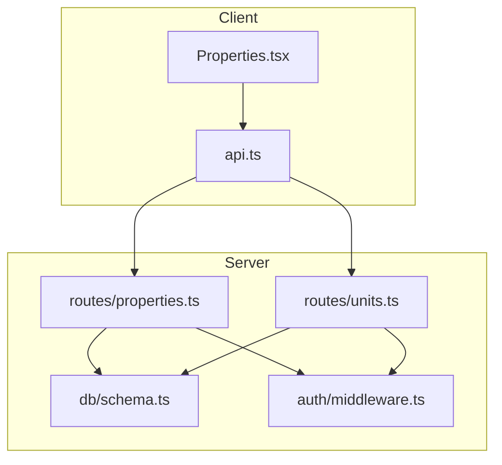
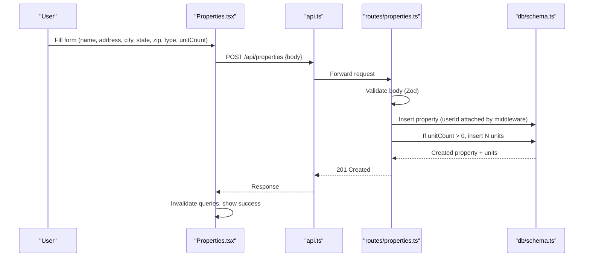
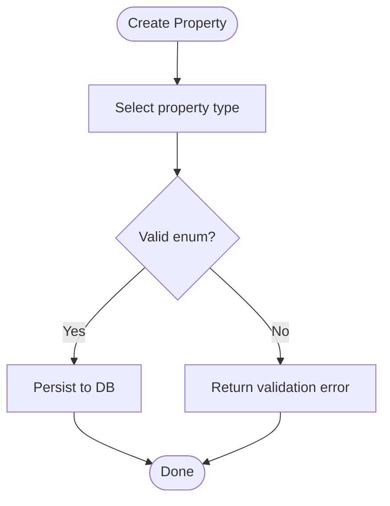
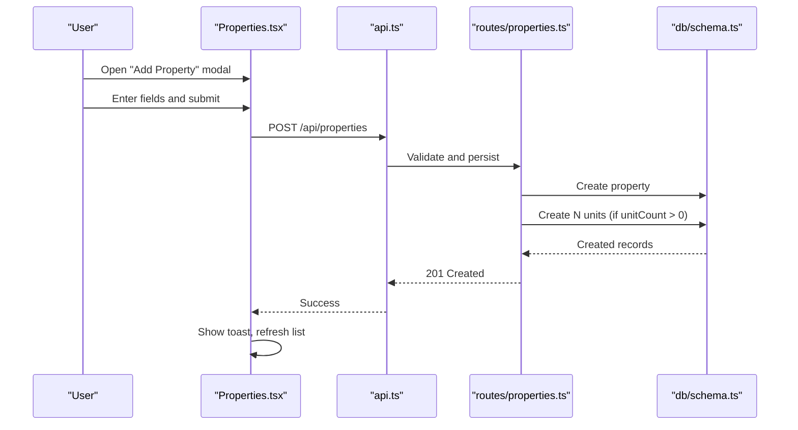
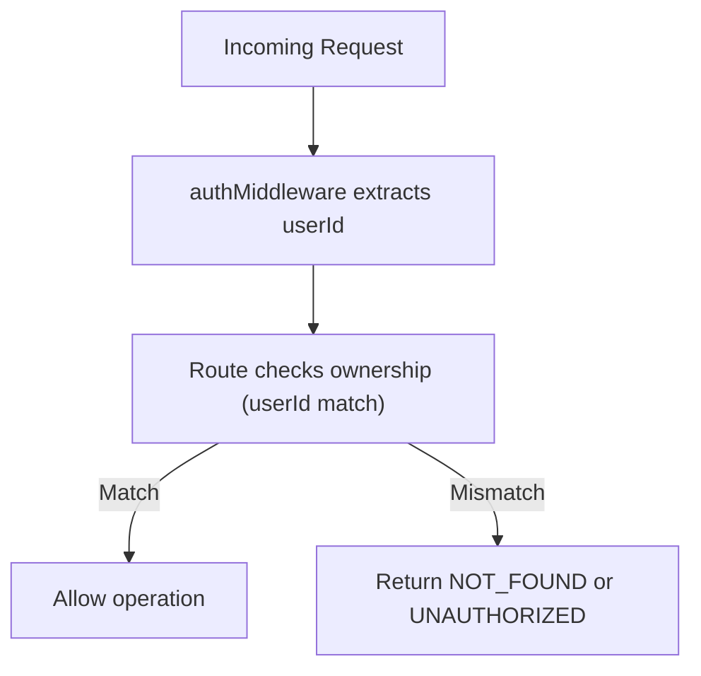
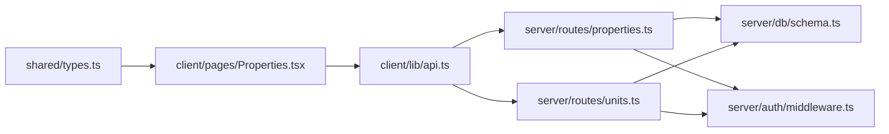

# Property Configuration

<cite>
**Referenced Files in This Document**
- [schema.ts](file://server/src/db/schema.ts)
- [properties.ts](file://server/src/routes/properties.ts)
- [units.ts](file://server/src/routes/units.ts)
- [types.ts](file://shared/src/types.ts)
- [Properties.tsx](file://client/src/pages/Properties.tsx)
- [api.ts](file://client/src/lib/api.ts)
- [middleware.ts](file://server/src/auth/middleware.ts)
- [RentLite-Product-Spec-Sheet.md](file://RentLite-Product-Spec-Sheet.md)
</cite>

## Table of Contents
1. [Introduction](#introduction)
2. [Project Structure](#project-structure)
3. [Core Components](#core-components)
4. [Architecture Overview](#architecture-overview)
5. [Detailed Component Analysis](#detailed-component-analysis)
6. [Dependency Analysis](#dependency-analysis)
7. [Performance Considerations](#performance-considerations)
8. [Troubleshooting Guide](#troubleshooting-guide)
9. [Conclusion](#conclusion)
10. [Appendices](#appendices)

## Introduction
This document explains how RentLite configures properties, including the property type system, address fields, notes, metadata, and related unit management. It also covers user interface flows for adding properties, validation rules enforced on both client and server, ownership isolation by user, and current capabilities and limitations around export/import and multi-user collaboration.

## Project Structure
Property configuration spans shared types, server schema and routes, and a client page that renders the setup wizard form. The key files are:
- Shared types define the canonical shape of Property and Unit.
- Server schema defines database tables and enums for property types and statuses.
- Server routes implement CRUD operations with validation and ownership checks.
- Client page provides the UI to create properties and lists them per user.

**Diagram sources**
- [Properties.tsx:1-280](file://client/src/pages/Properties.tsx#L1-L280)
- [api.ts:1-82](file://client/src/lib/api.ts#L1-L82)
- [properties.ts:1-106](file://server/src/routes/properties.ts#L1-L106)
- [units.ts:1-123](file://server/src/routes/units.ts#L1-L123)
- [schema.ts:191-226](file://server/src/db/schema.ts#L191-L226)
- [middleware.ts:1-45](file://server/src/auth/middleware.ts#L1-L45)

**Section sources**
- [schema.ts:191-226](file://server/src/db/schema.ts#L191-L226)
- [properties.ts:1-106](file://server/src/routes/properties.ts#L1-L106)
- [units.ts:1-123](file://server/src/routes/units.ts#L1-L123)
- [Properties.tsx:1-280](file://client/src/pages/Properties.tsx#L1-L280)
- [api.ts:1-82](file://client/src/lib/api.ts#L1-L82)
- [middleware.ts:1-45](file://server/src/auth/middleware.ts#L1-L45)

## Core Components
- Property model: name, address, city, state, zip, type, unitCount, status, photos, notes, timestamps.
- Unit model: linked to a property, with unitNumber, rentAmount, status, bedrooms, bathrooms, photos, notes, timestamps.
- Types and enums: property types (single_family, duplex, multifamily, condo, townhouse), statuses (active, vacant, under_renovation).
- API endpoints: list, get, create, update, delete properties; list/get/create/update/delete units with ownership enforcement.
- Client UI: modal-based wizard to add a property, with required fields and type selector.

**Section sources**
- [schema.ts:16-28](file://server/src/db/schema.ts#L16-L28)
- [schema.ts:191-226](file://server/src/db/schema.ts#L191-L226)
- [types.ts:1-36](file://shared/src/types.ts#L1-L36)
- [properties.ts:11-23](file://server/src/routes/properties.ts#L11-L23)
- [units.ts:11-21](file://server/src/routes/units.ts#L11-L21)
- [Properties.tsx:21-27](file://client/src/pages/Properties.tsx#L21-L27)

## Architecture Overview
The property configuration flow enforces strict validation and ownership isolation from UI to database.

**Diagram sources**
- [Properties.tsx:54-77](file://client/src/pages/Properties.tsx#L54-L77)
- [api.ts:26-67](file://client/src/lib/api.ts#L26-L67)
- [properties.ts:48-71](file://server/src/routes/properties.ts#L48-L71)
- [schema.ts:191-226](file://server/src/db/schema.ts#L191-L226)

## Detailed Component Analysis

### Property Type System
- Supported types: single_family, duplex, multifamily, condo, townhouse.
- Enforced at multiple layers:
  - Shared TypeScript union type for frontend typing.
  - Database enum for persistence integrity.
  - Request validation via Zod on create/update.
- Business implications:
  - Single-family: typically one building, one owner, straightforward maintenance and expense allocation.
  - Duplex: two units sharing structure; may require split utilities or HOA considerations.
  - Multifamily: multiple units; often shared systems, higher maintenance complexity, bulk reporting useful.
  - Condo: may involve HOA fees, restrictions on rentals, shared common areas.
  - Townhouse: attached units with individual ownership; potential shared walls and HOA rules.
- UI differences:
  - The UI presents a dropdown of these types when creating a property.
  - Cards display the type as a badge for quick identification.

**Diagram sources**
- [properties.ts:11-21](file://server/src/routes/properties.ts#L11-L21)
- [schema.ts:16-22](file://server/src/db/schema.ts#L16-L22)
- [types.ts:1-5](file://shared/src/types.ts#L1-L5)
- [Properties.tsx:21-27](file://client/src/pages/Properties.tsx#L21-L27)

**Section sources**
- [schema.ts:16-22](file://server/src/db/schema.ts#L16-L22)
- [types.ts:1-5](file://shared/src/types.ts#L1-L5)
- [properties.ts:11-21](file://server/src/routes/properties.ts#L11-L21)
- [Properties.tsx:21-27](file://client/src/pages/Properties.tsx#L21-L27)

### Address Configuration and Validation
- Fields: address, city, state, zip.
- Validation:
  - All address fields are required strings with minimum length on the server.
  - Frontend marks these inputs as required.
- Geocoding:
  - No geocoding implementation is present in the codebase.
  - Address data is stored as plain text; no coordinates or map integration are implemented.
- Recommendations:
  - Add server-side format checks (e.g., ZIP regex) if needed.
  - Integrate a geocoding service later to enrich addresses with coordinates for mapping features.

**Section sources**
- [schema.ts:191-208](file://server/src/db/schema.ts#L191-L208)
- [properties.ts:11-21](file://server/src/routes/properties.ts#L11-L21)
- [Properties.tsx:198-239](file://client/src/pages/Properties.tsx#L198-L239)

### Notes Functionality
- Property-level notes:
  - Stored as an optional text field on the property record.
  - Useful for landlord preferences, special instructions, or high-level maintenance history summaries.
- Unit-level notes:
  - Each unit has its own notes field for unit-specific details (e.g., access codes, recent repairs).
- Usage patterns:
  - Keep concise, structured entries to aid searchability and readability.
  - For detailed histories, consider linking to external documents or using maintenance records.

**Section sources**
- [schema.ts:191-208](file://server/src/db/schema.ts#L191-L208)
- [schema.ts:212-226](file://server/src/db/schema.ts#L212-L226)
- [types.ts:7-36](file://shared/src/types.ts#L7-L36)

### Metadata and Custom Configuration
- Photos:
  - Both property and unit support a JSON array of photo URLs.
- Status:
  - Properties have active, vacant, under_renovation.
  - Units have occupied, vacant, under_renovation.
- Extensibility:
  - To add custom fields, extend the schema and corresponding Zod schemas, then update the UI forms and types.
  - Use JSONB for flexible metadata if needed beyond existing fields.

**Section sources**
- [schema.ts:191-226](file://server/src/db/schema.ts#L191-L226)
- [properties.ts:11-23](file://server/src/routes/properties.ts#L11-L23)
- [units.ts:11-21](file://server/src/routes/units.ts#L11-L21)
- [types.ts:7-36](file://shared/src/types.ts#L7-L36)

### User Interface: Setup Wizard, Forms, and Templates
- Setup wizard:
  - Modal form with fields for name, address, city, state, zip, type, and unitCount.
  - Submitting creates the property and auto-generates units based on unitCount.
- Form validation:
  - Required fields enforced in UI; server validates again with Zod.
- Templates:
  - No built-in templates for prefilling property configurations exist in the current code.
  - You can implement templates by storing reusable payloads and seeding properties programmatically.

**Diagram sources**
- [Properties.tsx:54-77](file://client/src/pages/Properties.tsx#L54-L77)
- [properties.ts:48-71](file://server/src/routes/properties.ts#L48-L71)
- [schema.ts:191-226](file://server/src/db/schema.ts#L191-L226)

**Section sources**
- [Properties.tsx:172-276](file://client/src/pages/Properties.tsx#L172-L276)
- [properties.ts:48-71](file://server/src/routes/properties.ts#L48-L71)

### Ownership Assignment, Permissions, and Collaboration
- Ownership:
  - Every property belongs to a specific user via userId.
  - All property and unit endpoints enforce that the requesting user owns the resource.
- Permissions:
  - Middleware extracts session and attaches userId to requests.
  - Routes filter by userId to ensure users only access their own properties.
- Multi-user collaboration:
  - No shared ownership or role-based permissions are implemented in the current code.
  - To enable collaboration, you would need to introduce roles, invitations, and permission checks beyond simple ownership.

**Diagram sources**
- [middleware.ts:9-27](file://server/src/auth/middleware.ts#L9-L27)
- [properties.ts:26-46](file://server/src/routes/properties.ts#L26-L46)
- [units.ts:24-65](file://server/src/routes/units.ts#L24-L65)

**Section sources**
- [middleware.ts:9-27](file://server/src/auth/middleware.ts#L9-L27)
- [properties.ts:26-46](file://server/src/routes/properties.ts#L26-L46)
- [units.ts:24-65](file://server/src/routes/units.ts#L24-L65)

### Export/Import Capabilities
- Current state:
  - No explicit export/import endpoints for bulk property configuration are implemented in the codebase.
  - Data portability is mentioned in the product spec as a future capability for international expansion.
- Workarounds:
  - Use the GET endpoints to retrieve your data and construct exports manually.
  - For imports, write scripts that call the POST endpoints to seed properties and units.

**Section sources**
- [RentLite-Product-Spec-Sheet.md:323-349](file://RentLite-Product-Spec-Sheet.md#L323-L349)
- [properties.ts:26-46](file://server/src/routes/properties.ts#L26-L46)

## Dependency Analysis
- Client depends on api.ts to make HTTP calls to backend endpoints.
- Backend routes depend on:
  - auth middleware for session handling and userId extraction.
  - Drizzle ORM and schema for querying and writing data.
- Schema defines all enums and table structures used across routes.

**Diagram sources**
- [types.ts:1-36](file://shared/src/types.ts#L1-L36)
- [Properties.tsx:1-280](file://client/src/pages/Properties.tsx#L1-L280)
- [api.ts:1-82](file://client/src/lib/api.ts#L1-L82)
- [properties.ts:1-106](file://server/src/routes/properties.ts#L1-L106)
- [units.ts:1-123](file://server/src/routes/units.ts#L1-L123)
- [schema.ts:191-226](file://server/src/db/schema.ts#L191-L226)
- [middleware.ts:1-45](file://server/src/auth/middleware.ts#L1-L45)

**Section sources**
- [properties.ts:1-106](file://server/src/routes/properties.ts#L1-L106)
- [units.ts:1-123](file://server/src/routes/units.ts#L1-L123)
- [schema.ts:191-226](file://server/src/db/schema.ts#L191-L226)
- [Properties.tsx:1-280](file://client/src/pages/Properties.tsx#L1-L280)
- [api.ts:1-82](file://client/src/lib/api.ts#L1-L82)
- [middleware.ts:1-45](file://server/src/auth/middleware.ts#L1-L45)

## Performance Considerations
- Creating many units at once:
  - When unitCount > 0, the server inserts multiple units in a single batch. Ensure this remains efficient as unit counts grow.
- Querying properties:
  - Listing includes related units; consider pagination if portfolios become large.
- Validation overhead:
  - Zod validation is lightweight; keep schemas aligned with UI to avoid redundant checks.

[No sources needed since this section provides general guidance]

## Troubleshooting Guide
- Validation errors:
  - Missing or invalid fields return a validation error with details. Check the response payload for field-specific messages.
- Not found errors:
  - Occur when accessing a property or unit not owned by the current user. Verify ownership and IDs.
- Unauthorized:
  - If session is missing or expired, the middleware returns unauthorized. Re-authenticate.
- UI feedback:
  - The client shows toasts for success and error states during create/delete operations.

**Section sources**
- [properties.ts:51-52](file://server/src/routes/properties.ts#L51-L52)
- [properties.ts:76-77](file://server/src/routes/properties.ts#L76-L77)
- [properties.ts:44-45](file://server/src/routes/properties.ts#L44-L45)
- [units.ts:70-71](file://server/src/routes/units.ts#L70-L71)
- [middleware.ts:18-20](file://server/src/auth/middleware.ts#L18-L20)
- [Properties.tsx:54-72](file://client/src/pages/Properties.tsx#L54-L72)

## Conclusion
RentLite’s property configuration centers on a well-defined type system, robust validation, and strict ownership isolation. The UI provides a simple wizard to add properties and automatically generate units. Notes and photos offer basic metadata storage. Export/import and multi-user collaboration are not yet implemented but are outlined in the product roadmap. Future enhancements could include geocoding, richer metadata, templates, and collaborative permissions.

[No sources needed since this section summarizes without analyzing specific files]

## Appendices

### API Summary for Property Configuration
- List properties: GET /api/properties
- Get property: GET /api/properties/:id
- Create property: POST /api/properties
- Update property: PUT /api/properties/:id
- Delete property: DELETE /api/properties/:id
- List units: GET /api/units?propertyId=...
- Get unit: GET /api/units/:id
- Create unit: POST /api/units
- Update unit: PUT /api/units/:id
- Delete unit: DELETE /api/units/:id

**Section sources**
- [properties.ts:26-103](file://server/src/routes/properties.ts#L26-L103)
- [units.ts:24-120](file://server/src/routes/units.ts#L24-L120)