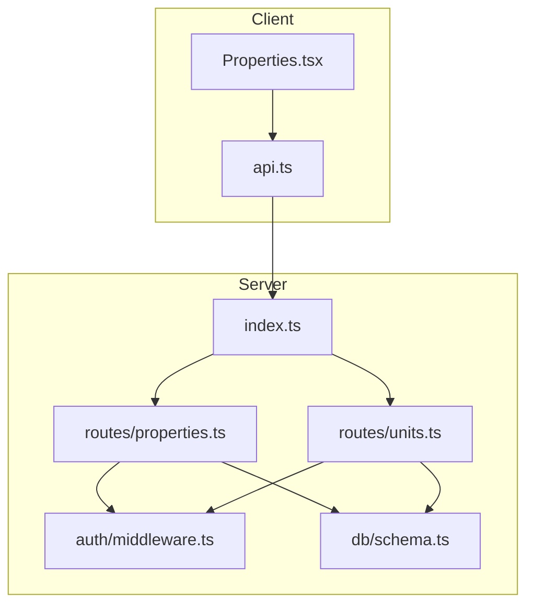
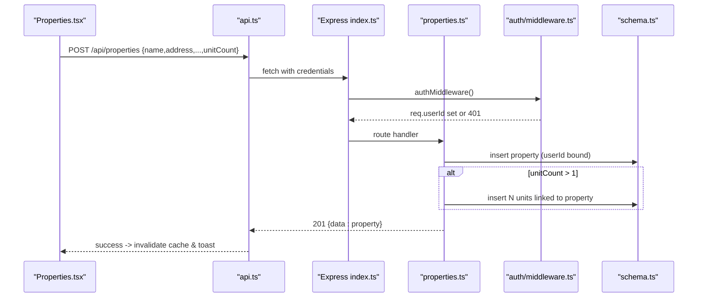
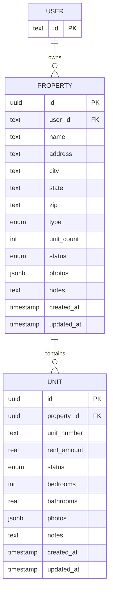
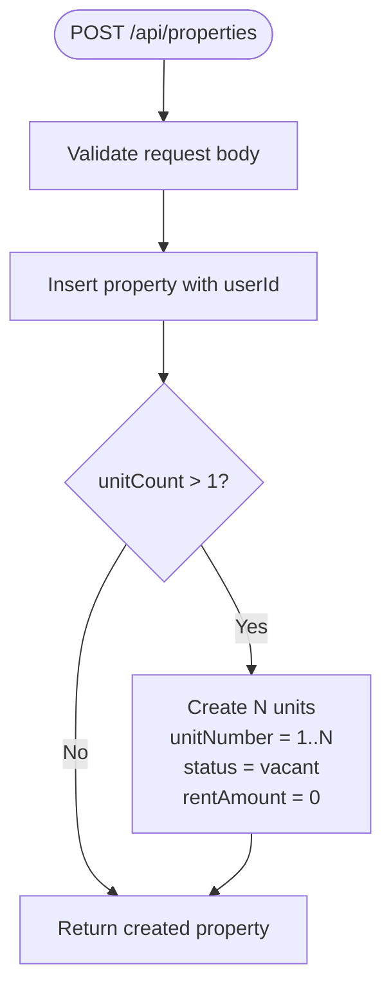
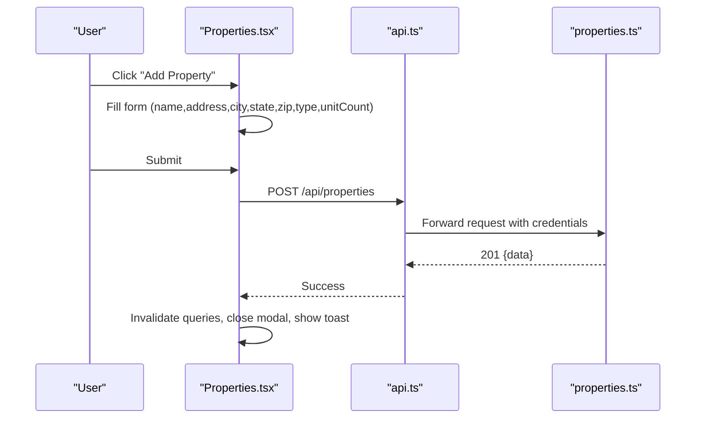
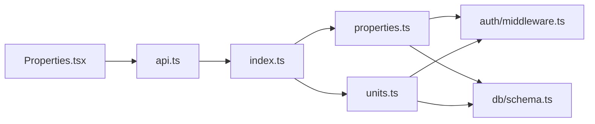

# Property Management

<cite>
**Referenced Files in This Document**
- [server/src/routes/properties.ts](file://server/src/routes/properties.ts)
- [server/src/routes/units.ts](file://server/src/routes/units.ts)
- [server/src/db/schema.ts](file://server/src/db/schema.ts)
- [server/src/auth/middleware.ts](file://server/src/auth/middleware.ts)
- [server/src/index.ts](file://server/src/index.ts)
- [client/src/pages/Properties.tsx](file://client/src/pages/Properties.tsx)
- [client/src/lib/api.ts](file://client/src/lib/api.ts)
- [shared/src/types.ts](file://shared/src/types.ts)
</cite>

## Table of Contents
1. [Introduction](#introduction)
2. [Project Structure](#project-structure)
3. [Core Components](#core-components)
4. [Architecture Overview](#architecture-overview)
5. [Detailed Component Analysis](#detailed-component-analysis)
6. [Dependency Analysis](#dependency-analysis)
7. [Performance Considerations](#performance-considerations)
8. [Troubleshooting Guide](#troubleshooting-guide)
9. [Conclusion](#conclusion)
10. [Appendices](#appendices)

## Introduction
This document explains the property management feature in RentLite, covering the full lifecycle from creation to configuration and ongoing management. It details the data model for properties and units, automatic unit creation when a property is created with multiple units, RESTful API endpoints for CRUD operations, user interface components and interaction patterns, validation rules, business constraints, error handling, common setup scenarios, edge cases, and ownership/permissions/data isolation between users.

## Project Structure
RentLite’s property management spans client and server layers:
- Server routes expose REST APIs for properties and units, enforce authentication, validate inputs, and persist data using Drizzle ORM against a PostgreSQL schema.
- The client provides a React page to list, create, and delete properties, and communicates with the server via an API client that handles credentials and errors.

**Diagram sources**
- [server/src/index.ts:35-44](file://server/src/index.ts#L35-L44)
- [server/src/routes/properties.ts:1-10](file://server/src/routes/properties.ts#L1-L10)
- [server/src/routes/units.ts:1-10](file://server/src/routes/units.ts#L1-L10)
- [server/src/auth/middleware.ts:9-27](file://server/src/auth/middleware.ts#L9-L27)
- [server/src/db/schema.ts:191-226](file://server/src/db/schema.ts#L191-L226)
- [client/src/pages/Properties.tsx:49-77](file://client/src/pages/Properties.tsx#L49-L77)
- [client/src/lib/api.ts:26-54](file://client/src/lib/api.ts#L26-L54)

**Section sources**
- [server/src/index.ts:35-44](file://server/src/index.ts#L35-L44)
- [client/src/pages/Properties.tsx:49-77](file://client/src/pages/Properties.tsx#L49-L77)
- [client/src/lib/api.ts:26-54](file://client/src/lib/api.ts#L26-L54)

## Core Components
- Data model:
  - Property fields include name, address (street), city, state, zip, type (single_family, duplex, multifamily, condo, townhouse), unitCount, status (active, vacant, under_renovation), photos, notes, and timestamps.
  - Unit fields include propertyId, unitNumber, rentAmount, status (occupied, vacant, under_renovation), bedrooms, bathrooms, photos, notes, and timestamps.
- Validation:
  - Zod schemas on the server enforce required fields, types, and ranges for both properties and units.
- Ownership and isolation:
  - All queries filter by userId attached by the auth middleware, ensuring strict per-user data isolation.
- Automatic unit creation:
  - When creating a property with unitCount > 1, the server automatically creates N units with sequential unit numbers and default statuses.

**Section sources**
- [server/src/db/schema.ts:191-226](file://server/src/db/schema.ts#L191-L226)
- [server/src/routes/properties.ts:11-23](file://server/src/routes/properties.ts#L11-L23)
- [server/src/routes/properties.ts:48-71](file://server/src/routes/properties.ts#L48-L71)
- [server/src/routes/units.ts:11-21](file://server/src/routes/units.ts#L11-L21)
- [server/src/auth/middleware.ts:9-27](file://server/src/auth/middleware.ts#L9-L27)

## Architecture Overview
The property management flow uses a standard Express + Drizzle architecture with Better-Auth for session-based authentication.

**Diagram sources**
- [client/src/pages/Properties.tsx:54-77](file://client/src/pages/Properties.tsx#L54-L77)
- [client/src/lib/api.ts:26-54](file://client/src/lib/api.ts#L26-L54)
- [server/src/index.ts:35-44](file://server/src/index.ts#L35-L44)
- [server/src/auth/middleware.ts:9-27](file://server/src/auth/middleware.ts#L9-L27)
- [server/src/routes/properties.ts:48-71](file://server/src/routes/properties.ts#L48-L71)
- [server/src/db/schema.ts:191-226](file://server/src/db/schema.ts#L191-L226)

## Detailed Component Analysis

### Data Model
- Property:
  - Identifier: uuid id
  - Ownership: userId reference to user
  - Addressing: address, city, state, zip
  - Classification: type enum (single_family, duplex, multifamily, condo, townhouse)
  - Capacity: unitCount integer default 1
  - Status: property_status enum (active, vacant, under_renovation) default active
  - Media and notes: photos jsonb array, notes text nullable
  - Timestamps: createdAt, updatedAt
- Unit:
  - Identifier: uuid id
  - Ownership linkage: propertyId reference to property (cascade delete)
  - Identity: unitNumber string
  - Financial: rentAmount real
  - Status: unit_status enum (occupied, vacant, under_renovation) default vacant
  - Details: bedrooms integer nullable, bathrooms real nullable
  - Media and notes: photos jsonb array, notes text nullable
  - Timestamps: createdAt, updatedAt

**Diagram sources**
- [server/src/db/schema.ts:139-147](file://server/src/db/schema.ts#L139-L147)
- [server/src/db/schema.ts:191-226](file://server/src/db/schema.ts#L191-L226)

**Section sources**
- [server/src/db/schema.ts:191-226](file://server/src/db/schema.ts#L191-L226)
- [shared/src/types.ts:7-36](file://shared/src/types.ts#L7-L36)

### REST API Endpoints

#### Properties
- GET /api/properties
  - Lists all properties for the authenticated user, including related units.
  - Response: { data: Property[] }
- GET /api/properties/:id
  - Returns a single property owned by the authenticated user, including units.
  - Response: { data: Property } or 404 if not found.
- POST /api/properties
  - Creates a new property for the authenticated user.
  - Request body validated by Zod schema; auto-creates units if unitCount > 1.
  - Response: 201 { data: Property }
- PUT /api/properties/:id
  - Updates a property owned by the authenticated user.
  - Partial update allowed; validates provided fields.
  - Response: { data: Property } or 404 if not found.
- DELETE /api/properties/:id
  - Deletes a property owned by the authenticated user.
  - Response: { message: "Deleted" } or 404 if not found.

#### Units
- GET /api/units?propertyId=xxx
  - Lists units optionally filtered by propertyId; results are restricted to the authenticated user’s properties.
  - Response: { data: Unit[] }
- GET /api/units/:id
  - Returns a unit if it belongs to a property owned by the authenticated user.
  - Response: { data: Unit } or 404 if not found.
- POST /api/units
  - Creates a unit under a specified propertyId; verifies ownership before insertion.
  - Response: 201 { data: Unit } or 404 if property not found or unauthorized.
- PUT /api/units/:id
  - Updates a unit if it belongs to a property owned by the authenticated user.
  - Response: { data: Unit } or 404 if not found.
- DELETE /api/units/:id
  - Deletes a unit if it belongs to a property owned by the authenticated user.
  - Response: { message: "Deleted" } or 404 if not found.

**Section sources**
- [server/src/routes/properties.ts:25-103](file://server/src/routes/properties.ts#L25-L103)
- [server/src/routes/units.ts:23-120](file://server/src/routes/units.ts#L23-L120)

### Automatic Unit Creation Workflow
When a property is created with unitCount greater than one, the server automatically generates N units with sequential unit numbers and default values.

**Diagram sources**
- [server/src/routes/properties.ts:48-71](file://server/src/routes/properties.ts#L48-L71)

**Section sources**
- [server/src/routes/properties.ts:48-71](file://server/src/routes/properties.ts#L48-L71)

### User Interface Components and Interaction Patterns
- Properties page:
  - Displays a grid of property cards showing name, location, type badge, status badge, and unit count.
  - Provides “Add Property” modal with form fields: name, address, city, state, zip, type selector, and unitCount input.
  - Uses React Query for data fetching and mutations; invalidates queries on success to refresh the list.
  - Shows loading spinner and empty state guidance.
  - On submit, posts to /api/properties and shows success/error toasts.
  - Delete action prompts confirmation and calls DELETE /api/properties/:id.

**Diagram sources**
- [client/src/pages/Properties.tsx:36-83](file://client/src/pages/Properties.tsx#L36-L83)
- [client/src/pages/Properties.tsx:172-276](file://client/src/pages/Properties.tsx#L172-L276)
- [client/src/lib/api.ts:26-54](file://client/src/lib/api.ts#L26-L54)
- [server/src/routes/properties.ts:48-71](file://server/src/routes/properties.ts#L48-L71)

**Section sources**
- [client/src/pages/Properties.tsx:36-83](file://client/src/pages/Properties.tsx#L36-L83)
- [client/src/pages/Properties.tsx:172-276](file://client/src/pages/Properties.tsx#L172-L276)

### Validation Rules and Business Constraints
- Property creation/update:
  - Required fields: name, address, city, state, zip, type.
  - type must be one of: single_family, duplex, multifamily, condo, townhouse.
  - unitCount must be an integer >= 1; defaults to 1.
  - status must be one of: active, vacant, under_renovation; defaults to active.
  - notes optional and nullable.
- Unit creation/update:
  - propertyId must be a valid UUID.
  - unitNumber must be non-empty string.
  - rentAmount must be numeric >= 0.
  - status must be one of: occupied, vacant, under_renovation; defaults to vacant.
  - bedrooms integer nullable; bathrooms numeric nullable.
  - notes optional and nullable.
- Ownership enforcement:
  - All reads/writes are scoped to the authenticated user’s resources.
  - Unit creation verifies property ownership before insertion.
  - Unit updates/deletes verify ownership via associated property’s userId.

**Section sources**
- [server/src/routes/properties.ts:11-23](file://server/src/routes/properties.ts#L11-L23)
- [server/src/routes/units.ts:11-21](file://server/src/routes/units.ts#L11-L21)
- [server/src/routes/units.ts:67-82](file://server/src/routes/units.ts#L67-L82)
- [server/src/routes/units.ts:84-105](file://server/src/routes/units.ts#L84-L105)
- [server/src/routes/units.ts:107-120](file://server/src/routes/units.ts#L107-L120)

### Error Handling
- Authentication:
  - Missing or invalid session returns 401 with code UNAUTHORIZED.
- Validation:
  - Invalid payloads return 400 with code VALIDATION and details containing field-level errors.
- Not Found:
  - Accessing non-existent or unauthorized resources returns 404 with code NOT_FOUND.
- Client-side:
  - Unauthorized responses redirect to login and throw errors.
  - Non-ok responses parse error JSON or fallback to generic messages.
  - UI displays toasts for success and error states.

**Section sources**
- [server/src/auth/middleware.ts:9-27](file://server/src/auth/middleware.ts#L9-L27)
- [server/src/routes/properties.ts:25-103](file://server/src/routes/properties.ts#L25-L103)
- [server/src/routes/units.ts:23-120](file://server/src/routes/units.ts#L23-L120)
- [client/src/lib/api.ts:26-54](file://client/src/lib/api.ts#L26-L54)
- [client/src/pages/Properties.tsx:54-83](file://client/src/pages/Properties.tsx#L54-L83)

### Common Setup Scenarios and Edge Cases
- Single-family home:
  - Create property with unitCount = 1; no extra units beyond default behavior.
- Duplex or multifamily:
  - Set unitCount to number of units; server auto-creates units with sequential numbers and vacant status.
- Condo/townhouse:
  - Same workflow; ensure correct type selection.
- Renovation scenario:
  - Update property status to under_renovation; units can also be set to under_renovation during work.
- Vacant listing:
  - Keep property status active but mark specific units as vacant until tenants move in.
- Edge case: Deleting a property:
  - Cascades to units due to foreign key constraints; ensure backups or archival strategy if needed.
- Edge case: Unit ownership mismatch:
  - Attempting to create/update/delete a unit under another user’s property returns 404 for security.

[No sources needed since this section summarizes usage patterns]

### Ownership, Permissions, and Data Isolation
- Every route applies authMiddleware, which extracts the session and attaches userId to the request.
- All database queries filter by userId or verify ownership through joins/relations.
- This ensures strict multi-tenant isolation: users can only see and modify their own properties and units.

**Section sources**
- [server/src/auth/middleware.ts:9-27](file://server/src/auth/middleware.ts#L9-L27)
- [server/src/routes/properties.ts:25-46](file://server/src/routes/properties.ts#L25-L46)
- [server/src/routes/units.ts:23-65](file://server/src/routes/units.ts#L23-L65)

## Dependency Analysis
- Client dependencies:
  - Properties.tsx depends on api.ts for HTTP requests and uses React Query for caching and mutations.
- Server dependencies:
  - index.ts mounts routers for properties and units.
  - properties.ts and units.ts depend on auth middleware for session checks and on db schema for models.
  - Both routers use Drizzle ORM queries to enforce ownership and relationships.

**Diagram sources**
- [client/src/pages/Properties.tsx:49-77](file://client/src/pages/Properties.tsx#L49-L77)
- [client/src/lib/api.ts:26-54](file://client/src/lib/api.ts#L26-L54)
- [server/src/index.ts:35-44](file://server/src/index.ts#L35-L44)
- [server/src/routes/properties.ts:1-10](file://server/src/routes/properties.ts#L1-L10)
- [server/src/routes/units.ts:1-10](file://server/src/routes/units.ts#L1-L10)
- [server/src/auth/middleware.ts:9-27](file://server/src/auth/middleware.ts#L9-L27)
- [server/src/db/schema.ts:191-226](file://server/src/db/schema.ts#L191-L226)

**Section sources**
- [server/src/index.ts:35-44](file://server/src/index.ts#L35-L44)
- [server/src/routes/properties.ts:1-10](file://server/src/routes/properties.ts#L1-L10)
- [server/src/routes/units.ts:1-10](file://server/src/routes/units.ts#L1-L10)

## Performance Considerations
- Batch unit creation:
  - Creating multiple units in a single transaction reduces round-trips and improves performance when setting up multi-unit properties.
- Query optimization:
  - Listing properties includes related units; consider pagination for large portfolios to reduce payload size.
- Indexing:
  - Ensure indexes on userId, propertyId, and frequently filtered fields (e.g., status) to speed up queries.
- Payload limits:
  - Server sets a JSON body limit; ensure property/unit payloads stay within reasonable sizes.

[No sources needed since this section provides general guidance]

## Troubleshooting Guide
- 401 Unauthorized:
  - Verify the client sends credentials and the session is valid; check CORS and cookie settings.
- 400 Validation error:
  - Inspect the response details to identify missing or invalid fields; ensure enums match allowed values.
- 404 Not found:
  - Confirm resource IDs exist and belong to the current user; verify ownership checks in unit endpoints.
- UI issues:
  - If the properties list does not refresh after creation, ensure query invalidation is triggered on mutation success.
  - For persistent errors, check browser network tab for exact request/response payloads.

**Section sources**
- [server/src/auth/middleware.ts:9-27](file://server/src/auth/middleware.ts#L9-L27)
- [server/src/routes/properties.ts:25-103](file://server/src/routes/properties.ts#L25-L103)
- [server/src/routes/units.ts:23-120](file://server/src/routes/units.ts#L23-L120)
- [client/src/pages/Properties.tsx:54-83](file://client/src/pages/Properties.tsx#L54-L83)
- [client/src/lib/api.ts:26-54](file://client/src/lib/api.ts#L26-L54)

## Conclusion
RentLite’s property management feature provides a robust, secure, and user-friendly way to manage rental properties and their units. The system enforces strong validation, clear ownership boundaries, and automated workflows like unit creation. The client offers intuitive interactions with immediate feedback, while the server ensures data integrity and multi-tenant isolation. With these foundations, landlords can efficiently onboard properties, configure units, and maintain accurate records across their portfolio.

## Appendices

### API Reference Summary
- Properties
  - GET /api/properties
  - GET /api/properties/:id
  - POST /api/properties
  - PUT /api/properties/:id
  - DELETE /api/properties/:id
- Units
  - GET /api/units?propertyId=xxx
  - GET /api/units/:id
  - POST /api/units
  - PUT /api/units/:id
  - DELETE /api/units/:id

**Section sources**
- [server/src/routes/properties.ts:25-103](file://server/src/routes/properties.ts#L25-L103)
- [server/src/routes/units.ts:23-120](file://server/src/routes/units.ts#L23-L120)