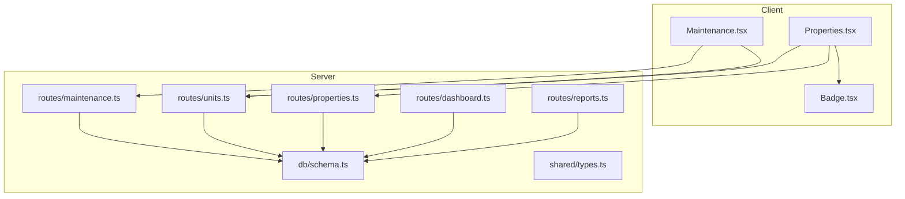
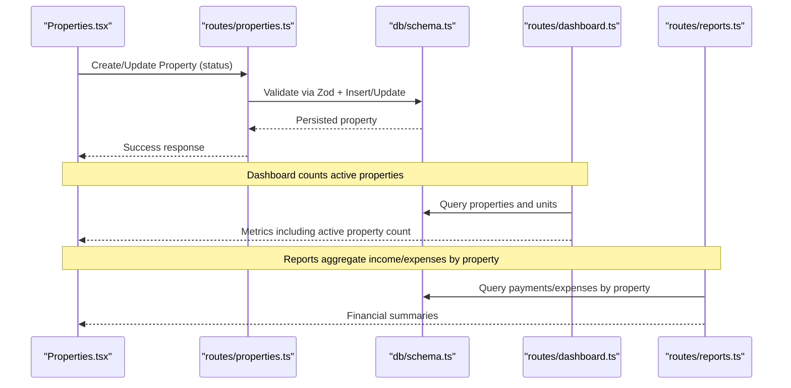
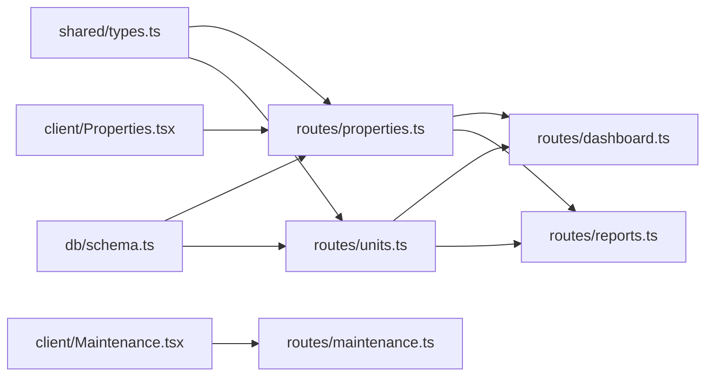
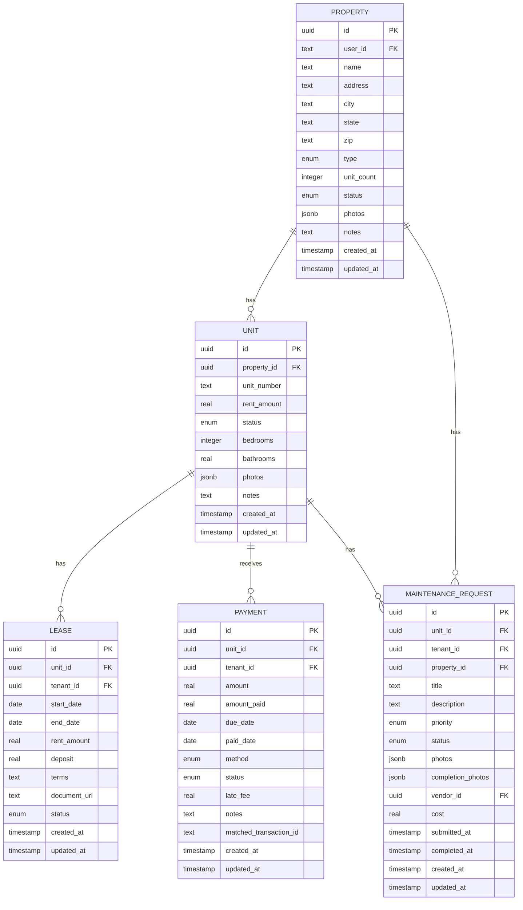

# Property Status Tracking

<cite>
**Referenced Files in This Document**
- [schema.ts](file://server/src/db/schema.ts)
- [types.ts](file://shared/src/types.ts)
- [properties.ts](file://server/src/routes/properties.ts)
- [units.ts](file://server/src/routes/units.ts)
- [maintenance.ts](file://server/src/routes/maintenance.ts)
- [reports.ts](file://server/src/routes/reports.ts)
- [dashboard.ts](file://server/src/routes/dashboard.ts)
- [Properties.tsx](file://client/src/pages/Properties.tsx)
- [Maintenance.tsx](file://client/src/pages/Maintenance.tsx)
- [Badge.tsx](file://client/src/components/ui/Badge.tsx)
</cite>

## Table of Contents
1. [Introduction](#introduction)
2. [Project Structure](#project-structure)
3. [Core Components](#core-components)
4. [Architecture Overview](#architecture-overview)
5. [Detailed Component Analysis](#detailed-component-analysis)
6. [Dependency Analysis](#dependency-analysis)
7. [Performance Considerations](#performance-considerations)
8. [Troubleshooting Guide](#troubleshooting-guide)
9. [Conclusion](#conclusion)
10. [Appendices](#appendices)

## Introduction
This document explains how property status tracking works in RentLite, focusing on the property-level statuses (active, vacant, under_renovation), their business meanings, and how they interact with units, tenants, maintenance, and financial reporting. It also covers UI components for updating and viewing status, database schema details, and edge cases such as mixed unit statuses within a property.

## Project Structure
RentLite is organized into:
- Server routes handling CRUD and business logic for properties, units, maintenance, reports, and dashboard metrics.
- Database schema defining enums and tables for properties, units, leases, payments, expenses, and maintenance requests.
- Shared TypeScript types mirroring server-side enums for frontend consistency.
- Client pages and UI components that display and update property and unit statuses.

**Diagram sources**
- [Properties.tsx:1-280](file://client/src/pages/Properties.tsx#L1-L280)
- [Maintenance.tsx:1-368](file://client/src/pages/Maintenance.tsx#L1-L368)
- [Badge.tsx:1-28](file://client/src/components/ui/Badge.tsx#L1-L28)
- [properties.ts:1-106](file://server/src/routes/properties.ts#L1-L106)
- [units.ts:1-123](file://server/src/routes/units.ts#L1-L123)
- [maintenance.ts:1-103](file://server/src/routes/maintenance.ts#L1-L103)
- [reports.ts:1-186](file://server/src/routes/reports.ts#L1-L186)
- [dashboard.ts:1-124](file://server/src/routes/dashboard.ts#L1-L124)
- [schema.ts:1-403](file://server/src/db/schema.ts#L1-L403)
- [types.ts:1-251](file://shared/src/types.ts#L1-L251)

**Section sources**
- [schema.ts:14-34](file://server/src/db/schema.ts#L14-L34)
- [types.ts:1-36](file://shared/src/types.ts#L1-L36)
- [properties.ts:11-23](file://server/src/routes/properties.ts#L11-L23)
- [units.ts:11-21](file://server/src/routes/units.ts#L11-L21)
- [Properties.tsx:29-34](file://client/src/pages/Properties.tsx#L29-L34)
- [Badge.tsx:3-14](file://client/src/components/ui/Badge.tsx#L3-L14)

## Core Components
- Property status enum and table define allowed values and default behavior at the property level.
- Unit status enum and table define per-unit availability and condition.
- Routes validate inputs using Zod schemas aligned to the shared types and DB enums.
- Dashboard and reports compute occupancy and financials based on unit statuses and payments/expenses.
- UI displays status badges and allows creating/updating properties and units.

Key definitions:
- Property statuses: active, vacant, under_renovation
- Unit statuses: occupied, vacant, under_renovation

These are enforced by:
- Database enums
- Zod validation in routes
- Shared TypeScript types used across client/server boundaries

**Section sources**
- [schema.ts:24-34](file://server/src/db/schema.ts#L24-L34)
- [types.ts:3-5](file://shared/src/types.ts#L3-L5)
- [properties.ts:11-23](file://server/src/routes/properties.ts#L11-L23)
- [units.ts:11-21](file://server/src/routes/units.ts#L11-L21)

## Architecture Overview
The system enforces property and unit statuses through layered validation and consistent data models:

**Diagram sources**
- [properties.ts:48-91](file://server/src/routes/properties.ts#L48-L91)
- [schema.ts:191-208](file://server/src/db/schema.ts#L191-L208)
- [dashboard.ts:11-121](file://server/src/routes/dashboard.ts#L11-L121)
- [reports.ts:28-77](file://server/src/routes/reports.ts#L28-L77)

## Detailed Component Analysis

### Property Status Enum and Schema
- Allowed values: active, vacant, under_renovation
- Default value: active
- Stored in the property table with timestamps for created_at and updated_at

Business meaning:
- active: Property is available for leasing or currently generating revenue.
- vacant: Property has no tenant(s) occupying units; may still be rentable if units are vacant.
- under_renovation: Property is undergoing work; typically not available for new tenants until completed.

Validation:
- Zod schema in property creation/update enforces these values.
- DB enum ensures integrity at the storage layer.

**Section sources**
- [schema.ts:24-28](file://server/src/db/schema.ts#L24-L28)
- [schema.ts:191-208](file://server/src/db/schema.ts#L191-L208)
- [properties.ts:11-23](file://server/src/routes/properties.ts#L11-L23)

### Unit Status Enum and Schema
- Allowed values: occupied, vacant, under_renovation
- Default value: vacant
- Stored in the unit table with timestamps for created_at and updated_at

Business meaning:
- occupied: A tenant is actively renting the unit.
- vacant: No tenant; unit can be leased.
- under_renovation: Unit is being worked on; not available for lease until completed.

Validation:
- Zod schema in unit creation/update enforces these values.
- DB enum ensures integrity at the storage layer.

**Section sources**
- [schema.ts:30-34](file://server/src/db/schema.ts#L30-L34)
- [schema.ts:212-226](file://server/src/db/schema.ts#L212-L226)
- [units.ts:11-21](file://server/src/routes/units.ts#L11-L21)

### Status Transition Rules and Validation Constraints
Current implementation notes:
- Property status transitions are permitted by the update route without explicit transition rules. The Zod schema accepts any of the three values.
- Unit status transitions are similarly permitted by the update route without explicit transition rules.
- There is no built-in guard preventing invalid transitions (e.g., setting a unit to occupied while a lease is expired). Such constraints would require additional business logic in routes or middleware.

Recommended constraints (for future enhancement):
- Prevent setting a unit to occupied if there is no active lease.
- Prevent setting a property to active if all units are under_renovation.
- Enforce that a property cannot be marked under_renovation if it has active leases.

**Section sources**
- [properties.ts:73-91](file://server/src/routes/properties.ts#L73-L91)
- [units.ts:84-105](file://server/src/routes/units.ts#L84-L105)

### Impact on Unit Availability and Tenant Assignment
- Unit availability is directly represented by unit.status:
  - occupied: Not available for new tenants.
  - vacant: Available for leasing.
  - under_renovation: Not available until renovation completes.
- Tenant assignment should align with unit.status and lease status. Currently, routes do not enforce this alignment automatically.

Dashboard occupancy calculation:
- Occupancy rate is computed from unit.status (occupied vs total units).

**Section sources**
- [units.ts:23-50](file://server/src/routes/units.ts#L23-L50)
- [dashboard.ts:54-57](file://server/src/routes/dashboard.ts#L54-L57)

### Impact on Financial Calculations
- Payments and expenses are tied to units and properties. Reports aggregate income and expenses per property regardless of property status.
- Dashboard metrics include monthly income/expenses and collection rates based on payment records.
- Property status does not alter financial aggregation logic in current routes; however, business rules could exclude certain periods when a property is under_renovation.

**Section sources**
- [reports.ts:28-77](file://server/src/routes/reports.ts#L28-L77)
- [reports.ts:131-183](file://server/src/routes/reports.ts#L131-L183)
- [dashboard.ts:59-66](file://server/src/routes/dashboard.ts#L59-L66)

### Maintenance Requests and Property Status
- Maintenance requests are linked to units and properties. They have their own status lifecycle (submitted, acknowledged, in_progress, completed).
- Current routes allow filtering by maintenance status and priority but do not restrict creation based on property/unit status.
- In practice, properties or units under_renovation may generate more maintenance requests; completion timestamps are recorded when status becomes completed.

**Section sources**
- [maintenance.ts:25-45](file://server/src/routes/maintenance.ts#L25-L45)
- [maintenance.ts:69-90](file://server/src/routes/maintenance.ts#L69-L90)

### UI Components and User Interactions
- Properties page:
  - Displays property cards with type and status badges.
  - Status badge variant maps to visual styling (success for active, warning for vacant, outline for under_renovation).
  - Allows creating properties with defaults (unitCount creates vacant units).
- Maintenance page:
  - Kanban-style view for maintenance request statuses.
  - Provides next-step actions to advance status.

Status indicators:
- Badge component renders variants for different statuses.
- Properties page uses a helper to map property status to badge variants.

**Section sources**
- [Properties.tsx:29-34](file://client/src/pages/Properties.tsx#L29-L34)
- [Properties.tsx:135-169](file://client/src/pages/Properties.tsx#L135-L169)
- [Badge.tsx:3-14](file://client/src/components/ui/Badge.tsx#L3-L14)
- [Maintenance.tsx:20-51](file://client/src/pages/Maintenance.tsx#L20-L51)

### Database Schema Implementation and Audit Trails
- Property and unit tables include createdAt and updatedAt timestamps.
- Maintenance requests include submittedAt and completedAt timestamps to track lifecycle events.
- No dedicated audit log table exists for status changes; updates rely on updatedAt and specific timestamps like completedAt for maintenance.

To enhance auditability:
- Add an audit trail table recording entity, field, old/new values, and changedAt.
- Use database triggers or application hooks to capture status transitions.

**Section sources**
- [schema.ts:191-208](file://server/src/db/schema.ts#L191-L208)
- [schema.ts:212-226](file://server/src/db/schema.ts#L212-L226)
- [schema.ts:293-325](file://server/src/db/schema.ts#L293-L325)

### Edge Cases and Reporting Implications
Mixed unit statuses within a property:
- A property can have units in different statuses (occupied, vacant, under_renovation).
- Dashboard occupancy rate reflects unit-level occupancy, not property-level status.
- Financial reports aggregate by property regardless of unit statuses.

Status impact on maintenance:
- Units under_renovation may have open maintenance requests; completion timestamps help track resolution.
- No automatic linkage between property status and maintenance workflow is enforced.

Reporting implications:
- Income and expenses are calculated based on payments and expenses tied to units/properties.
- Property status does not filter out financial data in current report endpoints.

**Section sources**
- [dashboard.ts:54-57](file://server/src/routes/dashboard.ts#L54-L57)
- [reports.ts:28-77](file://server/src/routes/reports.ts#L28-L77)
- [maintenance.ts:69-90](file://server/src/routes/maintenance.ts#L69-L90)

### Typical Status Workflows
Acquisition to active rental:
- Create property with default status active; auto-create units set to vacant.
- Assign tenants and create leases; update unit status to occupied.
- Dashboard shows increased occupancy and income.

Renovation cycle:
- Set property or specific units to under_renovation.
- Create maintenance requests; track progress and completion.
- After completion, revert units/property to appropriate status (vacant or active).

Sale or offboarding:
- Mark property as vacant or under_renovation during sale preparation.
- Ensure all units are vacated and maintenance completed before finalizing sale workflows.

Note: These workflows assume adding validation rules to enforce transitions; current routes allow direct status updates.

[No sources needed since this section provides conceptual workflow guidance]

## Dependency Analysis
Property and unit statuses depend on:
- DB enums for integrity.
- Zod schemas for input validation.
- Shared types for cross-layer consistency.
- Routes for business logic and queries.
- UI components for visualization and interaction.

**Diagram sources**
- [types.ts:1-36](file://shared/src/types.ts#L1-L36)
- [schema.ts:14-34](file://server/src/db/schema.ts#L14-L34)
- [properties.ts:1-106](file://server/src/routes/properties.ts#L1-L106)
- [units.ts:1-123](file://server/src/routes/units.ts#L1-L123)
- [dashboard.ts:1-124](file://server/src/routes/dashboard.ts#L1-L124)
- [reports.ts:1-186](file://server/src/routes/reports.ts#L1-L186)
- [Properties.tsx:1-280](file://client/src/pages/Properties.tsx#L1-L280)
- [Maintenance.tsx:1-368](file://client/src/pages/Maintenance.tsx#L1-L368)
- [maintenance.ts:1-103](file://server/src/routes/maintenance.ts#L1-L103)

**Section sources**
- [types.ts:1-36](file://shared/src/types.ts#L1-L36)
- [schema.ts:14-34](file://server/src/db/schema.ts#L14-L34)
- [properties.ts:1-106](file://server/src/routes/properties.ts#L1-L106)
- [units.ts:1-123](file://server/src/routes/units.ts#L1-L123)
- [dashboard.ts:1-124](file://server/src/routes/dashboard.ts#L1-L124)
- [reports.ts:1-186](file://server/src/routes/reports.ts#L1-L186)
- [Properties.tsx:1-280](file://client/src/pages/Properties.tsx#L1-L280)
- [Maintenance.tsx:1-368](file://client/src/pages/Maintenance.tsx#L1-L368)
- [maintenance.ts:1-103](file://server/src/routes/maintenance.ts#L1-L103)

## Performance Considerations
- Queries filter by user ownership to limit dataset size.
- Dashboard and reports compute aggregates in memory after fetching relevant rows; consider indexing userId, propertyId, unitId, and date fields for large datasets.
- Avoid unnecessary joins; use selective column retrieval where possible.

[No sources needed since this section provides general guidance]

## Troubleshooting Guide
Common issues and checks:
- Validation errors: Ensure status values match allowed enums in both Zod schemas and DB enums.
- Not found errors: Verify property/unit ownership checks in routes.
- Occupancy discrepancies: Confirm unit.status reflects actual tenant presence and lease status.
- Maintenance delays: Check maintenance status and timestamps; ensure completion sets completedAt.

Where to inspect:
- Route responses for validation errors and not found codes.
- Dashboard metrics for occupancy and collection rates.
- Maintenance endpoints for status transitions and timestamps.

**Section sources**
- [properties.ts:48-91](file://server/src/routes/properties.ts#L48-L91)
- [units.ts:67-105](file://server/src/routes/units.ts#L67-L105)
- [maintenance.ts:57-90](file://server/src/routes/maintenance.ts#L57-L90)
- [dashboard.ts:11-121](file://server/src/routes/dashboard.ts#L11-L121)

## Conclusion
RentLite defines property and unit statuses with clear enums and validation, enabling consistent representation across the stack. While current routes allow flexible status updates, adding explicit transition rules would strengthen business integrity. Statuses influence UI indicators, occupancy metrics, and maintenance workflows, while financial reporting remains independent of property status. Enhancements such as an audit trail and stricter transition validations would improve traceability and correctness.

[No sources needed since this section summarizes without analyzing specific files]

## Appendices

### Data Models Diagram

**Diagram sources**
- [schema.ts:191-208](file://server/src/db/schema.ts#L191-L208)
- [schema.ts:212-226](file://server/src/db/schema.ts#L212-L226)
- [schema.ts:249-266](file://server/src/db/schema.ts#L249-L266)
- [schema.ts:270-289](file://server/src/db/schema.ts#L270-L289)
- [schema.ts:293-325](file://server/src/db/schema.ts#L293-L325)