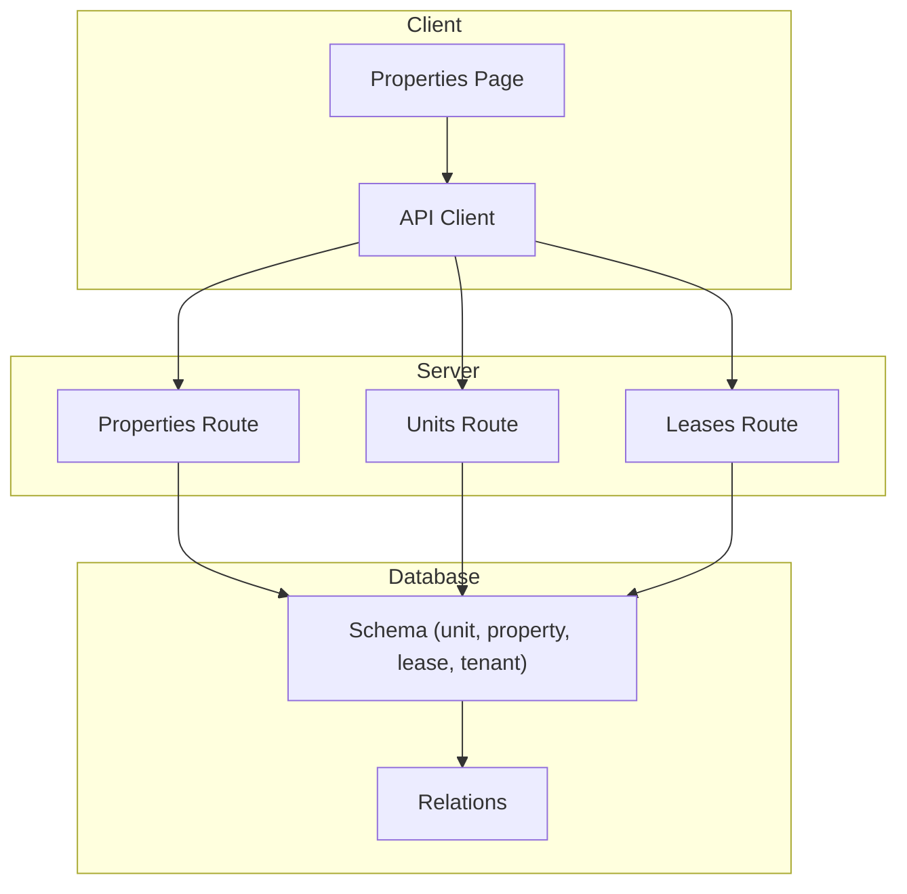
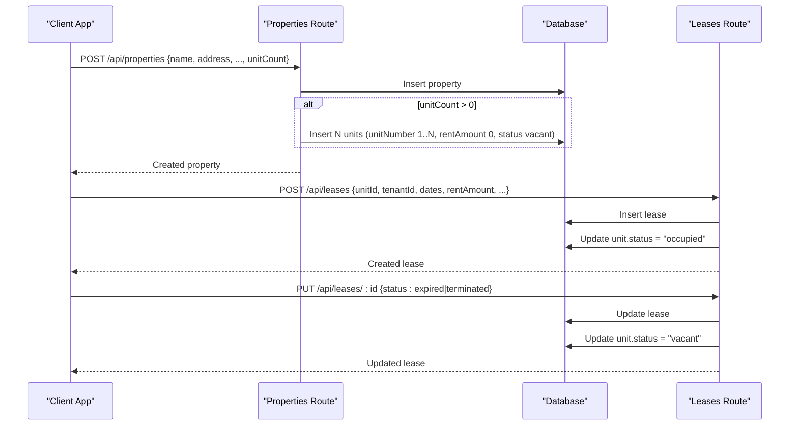
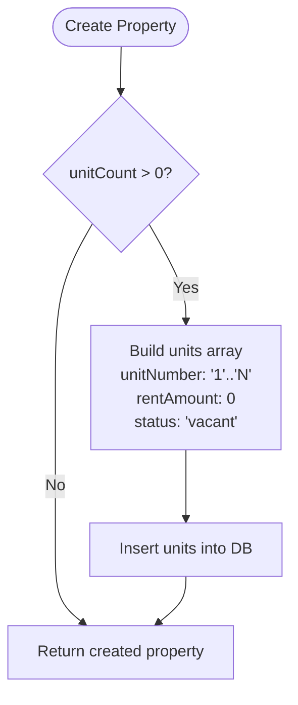
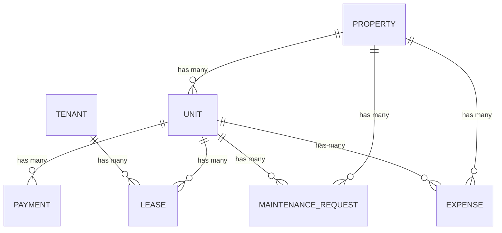
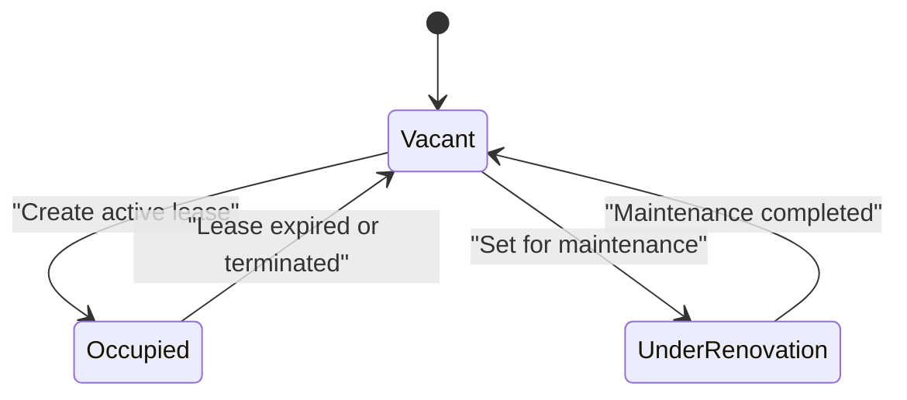
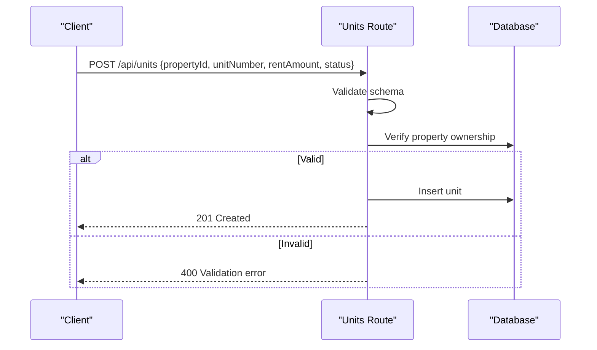
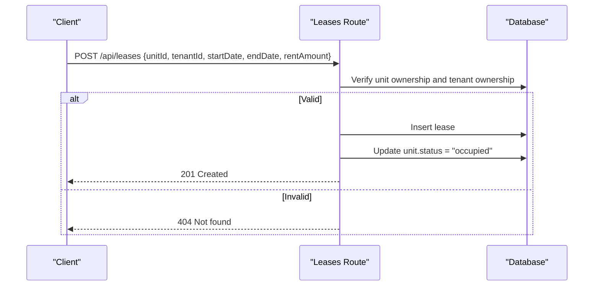
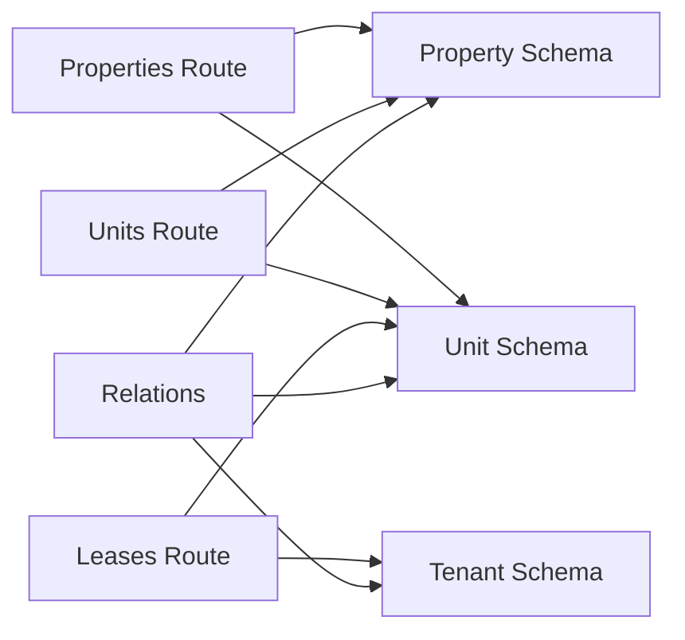

# Unit Management

<cite>
**Referenced Files in This Document**
- [server/src/routes/properties.ts](file://server/src/routes/properties.ts)
- [server/src/routes/units.ts](file://server/src/routes/units.ts)
- [server/src/routes/leases.ts](file://server/src/routes/leases.ts)
- [server/src/db/schema.ts](file://server/src/db/schema.ts)
- [server/src/db/relations.ts](file://server/src/db/relations.ts)
- [shared/src/types.ts](file://shared/src/types.ts)
- [client/src/pages/Properties.tsx](file://client/src/pages/Properties.tsx)
- [client/src/lib/api.ts](file://client/src/lib/api.ts)
</cite>

## Table of Contents
1. [Introduction](#introduction)
2. [Project Structure](#project-structure)
3. [Core Components](#core-components)
4. [Architecture Overview](#architecture-overview)
5. [Detailed Component Analysis](#detailed-component-analysis)
6. [Dependency Analysis](#dependency-analysis)
7. [Performance Considerations](#performance-considerations)
8. [Troubleshooting Guide](#troubleshooting-guide)
9. [Conclusion](#conclusion)
10. [Appendices](#appendices)

## Introduction
This document explains unit management in RentLite, focusing on how units are automatically created when a property is created with unitCount > 0, the unit data model and relationships, lifecycle transitions (vacant, occupied, under_renovation), and integration points with tenants and leases. It also covers validation rules, business constraints, and common setup patterns for managing units across properties.

## Project Structure
RentLite’s unit management spans server routes, database schema and relations, shared types, and client UI:
- Server routes handle CRUD for properties, units, tenants, and leases, including automatic unit creation and status synchronization.
- Database schema defines tables and enums for units, properties, tenants, leases, payments, maintenance, expenses, vendors, notifications, and subscriptions.
- Relations define entity associations used by queries and updates.
- Shared types provide TypeScript interfaces for frontend and backend contracts.
- Client pages and API client enable users to create properties (with unitCount) and manage related entities.

**Diagram sources**
- [server/src/routes/properties.ts:48-71](file://server/src/routes/properties.ts#L48-L71)
- [server/src/routes/units.ts:23-82](file://server/src/routes/units.ts#L23-L82)
- [server/src/routes/leases.ts:88-136](file://server/src/routes/leases.ts#L88-L136)
- [server/src/db/schema.ts:191-226](file://server/src/db/schema.ts#L191-L226)
- [server/src/db/relations.ts:37-52](file://server/src/db/relations.ts#L37-L52)

**Section sources**
- [server/src/routes/properties.ts:48-71](file://server/src/routes/properties.ts#L48-L71)
- [server/src/routes/units.ts:23-82](file://server/src/routes/units.ts#L23-L82)
- [server/src/routes/leases.ts:88-136](file://server/src/routes/leases.ts#L88-L136)
- [server/src/db/schema.ts:191-226](file://server/src/db/schema.ts#L191-L226)
- [server/src/db/relations.ts:37-52](file://server/src/db/relations.ts#L37-L52)
- [shared/src/types.ts:24-36](file://shared/src/types.ts#L24-L36)
- [client/src/pages/Properties.tsx:49-77](file://client/src/pages/Properties.tsx#L49-L77)
- [client/src/lib/api.ts:26-53](file://client/src/lib/api.ts#L26-L53)

## Core Components
- Automatic unit creation: When a property is created with unitCount > 0, the system generates N units with sequential unitNumber values starting from “1”, default rentAmount of 0, and status set to vacant.
- Unit CRUD: Units can be listed per user and optionally filtered by propertyId, retrieved individually, created, updated, and deleted with ownership checks.
- Lease-driven occupancy: Creating or updating leases triggers unit status changes to occupied or back to vacant depending on lease status.
- Data model: Units store propertyId, unitNumber, rentAmount, status, bedrooms, bathrooms, photos, notes, and timestamps, with strong relationships to properties, leases, payments, maintenance requests, and expenses.

**Section sources**
- [server/src/routes/properties.ts:48-71](file://server/src/routes/properties.ts#L48-L71)
- [server/src/routes/units.ts:23-120](file://server/src/routes/units.ts#L23-L120)
- [server/src/routes/leases.ts:88-136](file://server/src/routes/leases.ts#L88-L136)
- [server/src/db/schema.ts:212-226](file://server/src/db/schema.ts#L212-L226)
- [server/src/db/relations.ts:45-52](file://server/src/db/relations.ts#L45-L52)
- [shared/src/types.ts:24-36](file://shared/src/types.ts#L24-L36)

## Architecture Overview
The unit lifecycle integrates property creation, unit management, and lease operations:
- Property creation triggers batch unit insertion with sequential numbering and default values.
- Unit endpoints enforce ownership and allow granular control over unit attributes like rentAmount and status.
- Lease endpoints synchronize unit occupancy state based on lease status changes.

**Diagram sources**
- [server/src/routes/properties.ts:48-71](file://server/src/routes/properties.ts#L48-L71)
- [server/src/routes/leases.ts:88-136](file://server/src/routes/leases.ts#L88-L136)

## Detailed Component Analysis

### Automatic Unit Creation on Property Creation
When a property is created with unitCount > 0, the system creates units with:
- Sequential unitNumber values using String(i + 1) for i from 0 to unitCount - 1.
- Default rentAmount of 0.
- Default status of vacant.

This ensures that every new property starts with properly numbered, available units ready for assignment.

**Diagram sources**
- [server/src/routes/properties.ts:48-71](file://server/src/routes/properties.ts#L48-L71)

**Section sources**
- [server/src/routes/properties.ts:48-71](file://server/src/routes/properties.ts#L48-L71)

### Unit Data Model and Relationships
Unit fields include:
- propertyId: links to the owning property.
- unitNumber: string identifier for the unit within the property.
- rentAmount: numeric value representing base rent.
- status: enumerated state (vacant, occupied, under_renovation).
- bedrooms, bathrooms: optional physical attributes.
- photos, notes: optional metadata.
- createdAt, updatedAt: timestamps.

Relationships:
- One-to-many from property to units.
- One-to-many from unit to leases and payments.
- Many-to-one from lease to unit and tenant.
- Optional links to maintenance requests and expenses.

**Diagram sources**
- [server/src/db/schema.ts:191-226](file://server/src/db/schema.ts#L191-L226)
- [server/src/db/schema.ts:228-266](file://server/src/db/schema.ts#L228-L266)
- [server/src/db/schema.ts:268-348](file://server/src/db/schema.ts#L268-L348)
- [server/src/db/relations.ts:37-52](file://server/src/db/relations.ts#L37-L52)

**Section sources**
- [server/src/db/schema.ts:191-226](file://server/src/db/schema.ts#L191-L226)
- [server/src/db/relations.ts:37-52](file://server/src/db/relations.ts#L37-L52)
- [shared/src/types.ts:24-36](file://shared/src/types.ts#L24-L36)

### Unit Lifecycle and Status Transitions
- Creation: Units start as vacant upon property creation.
- Assignment: Creating a lease sets unit status to occupied.
- Termination/Expiration: Updating a lease to terminated or expired reverts unit status to vacant.
- Manual Updates: Unit status can be updated directly via unit update endpoint if needed (e.g., setting under_renovation during maintenance).

**Diagram sources**
- [server/src/routes/leases.ts:88-136](file://server/src/routes/leases.ts#L88-L136)
- [server/src/routes/units.ts:84-105](file://server/src/routes/units.ts#L84-L105)

**Section sources**
- [server/src/routes/leases.ts:88-136](file://server/src/routes/leases.ts#L88-L136)
- [server/src/routes/units.ts:84-105](file://server/src/routes/units.ts#L84-L105)

### Unit-Specific Operations
- List units: GET /api/units supports filtering by propertyId; results are scoped to user-owned properties.
- Get unit: GET /api/units/:id returns unit with associated property for ownership verification.
- Create unit: POST /api/units validates input and verifies property ownership before insertion.
- Update unit: PUT /api/units/:id allows partial updates (excluding propertyId) with ownership checks.
- Delete unit: DELETE /api/units/:id removes unit after ownership verification.

Validation rules enforced via schemas:
- propertyId must be a valid UUID.
- unitNumber must be a non-empty string.
- rentAmount must be a number >= 0.
- status must be one of the allowed enum values, defaulting to vacant.
- Optional fields: bedrooms, bathrooms, notes.

**Diagram sources**
- [server/src/routes/units.ts:67-82](file://server/src/routes/units.ts#L67-L82)

**Section sources**
- [server/src/routes/units.ts:23-120](file://server/src/routes/units.ts#L23-L120)

### Integration with Tenant Assignment Workflows
- Lease creation requires valid unitId and tenantId, with ownership checks ensuring the unit belongs to the authenticated user’s properties and the tenant belongs to the user.
- On successful lease creation, unit status is automatically updated to occupied.
- On lease termination or expiration, unit status is reverted to vacant.

**Diagram sources**
- [server/src/routes/leases.ts:88-114](file://server/src/routes/leases.ts#L88-L114)

**Section sources**
- [server/src/routes/leases.ts:88-114](file://server/src/routes/leases.ts#L88-L114)

### Business Constraints and Validation Rules
- Ownership enforcement: All unit and lease operations verify that the requesting user owns the relevant property or tenant.
- Enum constraints: Unit and property statuses are restricted to defined enums to ensure consistency.
- Numeric constraints: rentAmount and other numeric fields are validated to prevent invalid entries.
- Cascading deletes: Deleting a property cascades to related units and other dependent records through foreign key constraints.

**Section sources**
- [server/src/routes/units.ts:67-120](file://server/src/routes/units.ts#L67-L120)
- [server/src/routes/leases.ts:88-136](file://server/src/routes/leases.ts#L88-L136)
- [server/src/db/schema.ts:191-226](file://server/src/db/schema.ts#L191-L226)

### Examples of Unit Setup Scenarios and Common Patterns
- Multi-unit property creation: Set unitCount to the desired number when creating a property to auto-generate sequentially numbered units.
- Setting rent amounts: Use unit update endpoint to set rentAmount for each unit according to market rates or property strategy.
- Managing occupancy: Create leases to move units to occupied; terminate or expire leases to free units back to vacant.
- Maintenance workflows: Temporarily set unit status to under_renovation during repairs; revert to vacant once completed.

[No sources needed since this section provides general guidance]

## Dependency Analysis
Key dependencies between components:
- Properties route depends on unit schema for auto-creation logic.
- Units route depends on property schema for ownership checks.
- Leases route depends on unit and tenant schemas for assignment and status synchronization.
- Relations define entity associations used throughout queries and updates.

**Diagram sources**
- [server/src/routes/properties.ts:48-71](file://server/src/routes/properties.ts#L48-L71)
- [server/src/routes/units.ts:23-120](file://server/src/routes/units.ts#L23-L120)
- [server/src/routes/leases.ts:88-136](file://server/src/routes/leases.ts#L88-L136)
- [server/src/db/schema.ts:191-266](file://server/src/db/schema.ts#L191-L266)
- [server/src/db/relations.ts:37-52](file://server/src/db/relations.ts#L37-L52)

**Section sources**
- [server/src/routes/properties.ts:48-71](file://server/src/routes/properties.ts#L48-L71)
- [server/src/routes/units.ts:23-120](file://server/src/routes/units.ts#L23-L120)
- [server/src/routes/leases.ts:88-136](file://server/src/routes/leases.ts#L88-L136)
- [server/src/db/schema.ts:191-266](file://server/src/db/schema.ts#L191-L266)
- [server/src/db/relations.ts:37-52](file://server/src/db/relations.ts#L37-L52)

## Performance Considerations
- Batch unit creation: Auto-creating multiple units in a single insert operation reduces database round-trips and improves performance during property creation.
- Scoped queries: Listing units filters by user-owned properties to minimize data exposure and reduce payload size.
- Selective includes: Queries use with clauses to fetch only necessary related data (e.g., property details for unit retrieval).

[No sources needed since this section provides general guidance]

## Troubleshooting Guide
Common issues and resolutions:
- Validation errors: Ensure unitNumber is non-empty, rentAmount is non-negative, and status matches allowed enums.
- Ownership errors: Verify that the authenticated user owns the property or tenant referenced in unit or lease operations.
- Not found errors: Confirm that unit or property IDs exist and belong to the current user.
- Lease status synchronization: If unit status does not reflect lease changes, check lease update endpoints and ensure status transitions are applied correctly.

**Section sources**
- [server/src/routes/units.ts:67-120](file://server/src/routes/units.ts#L67-L120)
- [server/src/routes/leases.ts:88-136](file://server/src/routes/leases.ts#L88-L136)

## Conclusion
RentLite’s unit management provides a robust foundation for handling multi-unit properties with automatic unit generation, clear lifecycle transitions, and tight integration with tenant and lease workflows. The system enforces ownership, validates inputs, and maintains consistent unit states through lease operations. By leveraging these capabilities, landlords can efficiently manage occupancy, adjust rents, and coordinate maintenance activities across their portfolios.

[No sources needed since this section summarizes without analyzing specific files]

## Appendices

### API Endpoints Summary
- Properties:
  - POST /api/properties: Creates property and auto-generates units if unitCount > 0.
- Units:
  - GET /api/units: Lists units, optionally filtered by propertyId.
  - GET /api/units/:id: Retrieves a specific unit with property association.
  - POST /api/units: Creates a new unit with validation and ownership checks.
  - PUT /api/units/:id: Updates unit fields excluding propertyId.
  - DELETE /api/units/:id: Deletes a unit after ownership verification.
- Leases:
  - POST /api/leases: Creates lease and sets unit status to occupied.
  - PUT /api/leases/:id: Updates lease and reverts unit status to vacant if terminated/expired.

**Section sources**
- [server/src/routes/properties.ts:48-71](file://server/src/routes/properties.ts#L48-L71)
- [server/src/routes/units.ts:23-120](file://server/src/routes/units.ts#L23-L120)
- [server/src/routes/leases.ts:88-136](file://server/src/routes/leases.ts#L88-L136)