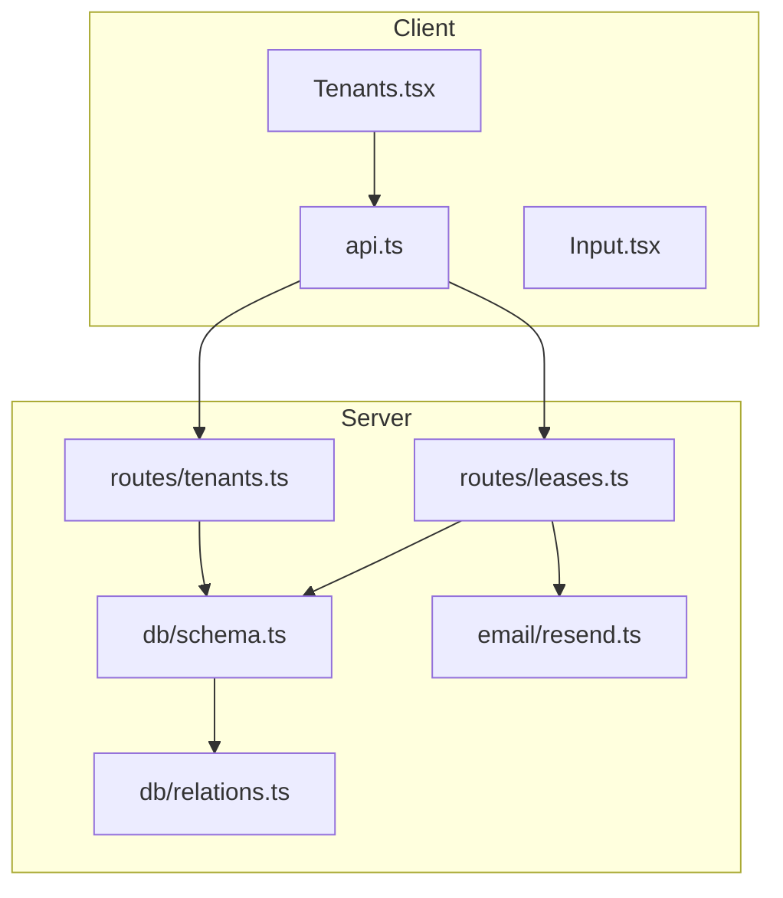
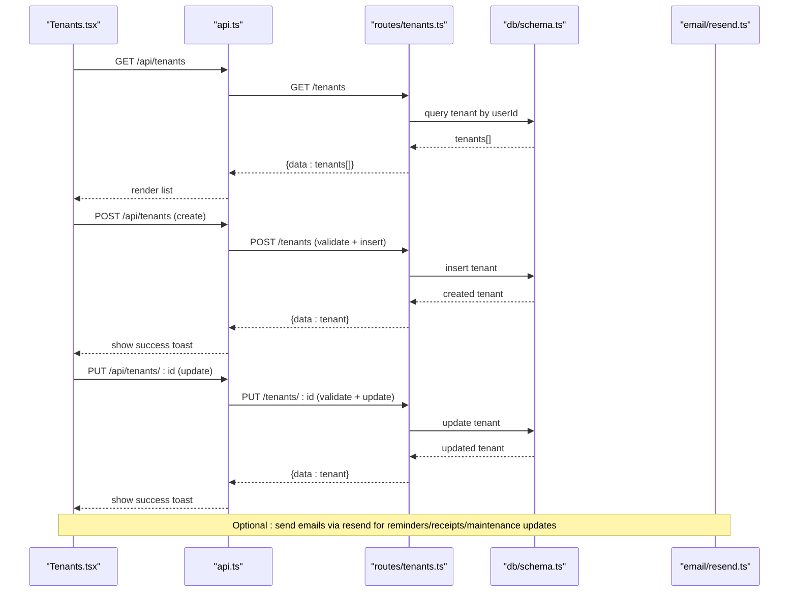
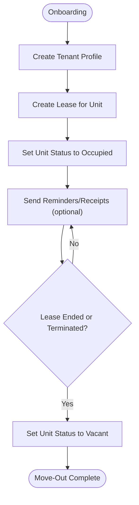
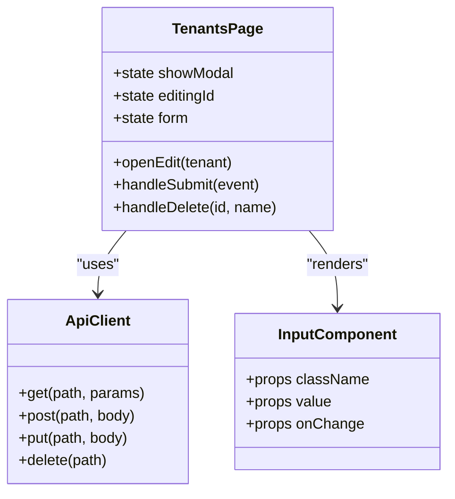
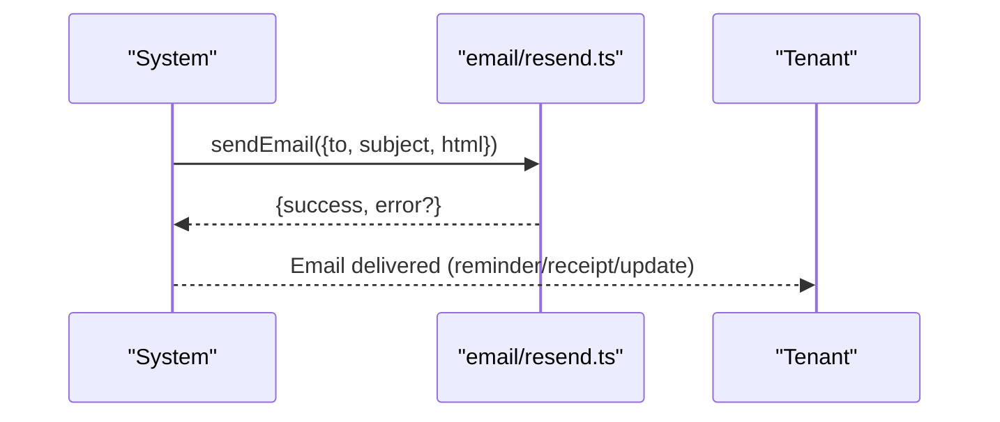
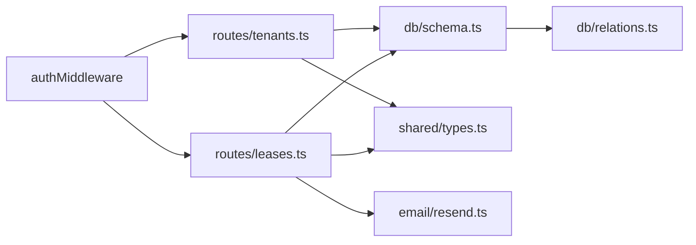

# Tenant Administration

<cite>
**Referenced Files in This Document**
- [tenants.ts](file://server/src/routes/tenants.ts)
- [leases.ts](file://server/src/routes/leases.ts)
- [schema.ts](file://server/src/db/schema.ts)
- [relations.ts](file://server/src/db/relations.ts)
- [types.ts](file://shared/src/types.ts)
- [Tenants.tsx](file://client/src/pages/Tenants.tsx)
- [api.ts](file://client/src/lib/api.ts)
- [Input.tsx](file://client/src/components/ui/Input.tsx)
- [resend.ts](file://server/src/email/resend.ts)
- [RentLite-Product-Spec-Sheet.md](file://RentLite-Product-Spec-Sheet.md)
</cite>

## Table of Contents
1. Introduction
2. Project Structure
3. Core Components
4. Architecture Overview
5. Detailed Component Analysis
6. Dependency Analysis
7. Performance Considerations
8. Troubleshooting Guide
9. Conclusion
10. Appendices

## Introduction
This document explains tenant administration in RentLite, focusing on how landlords manage tenant profiles, associate tenants with properties and leases, and operate the tenant lifecycle from onboarding to move-out. It covers API endpoints for tenant CRUD and lease relationships, UI components for data entry and viewing, validation rules, privacy considerations, retention policies, communication features, and common administrative workflows.

## Project Structure
Tenant administration spans server routes, database schema, shared types, and client pages:
- Server routes expose REST endpoints for tenants and leases.
- Database schema defines tenant, lease, unit, property, and notification entities.
- Shared types define TypeScript interfaces used across the app.
- Client page provides a table view and modal form for tenant management.
- Email module supports sending notifications to tenants.

**Diagram sources**
- [Tenants.tsx:1-264](file://client/src/pages/Tenants.tsx#L1-L264)
- [api.ts:1-82](file://client/src/lib/api.ts#L1-L82)
- [tenants.ts:1-83](file://server/src/routes/tenants.ts#L1-L83)
- [leases.ts:1-147](file://server/src/routes/leases.ts#L1-L147)
- [schema.ts:228-266](file://server/src/db/schema.ts#L228-L266)
- [relations.ts:54-66](file://server/src/db/relations.ts#L54-L66)
- [resend.ts:1-113](file://server/src/email/resend.ts#L1-L113)

**Section sources**
- [tenants.ts:1-83](file://server/src/routes/tenants.ts#L1-L83)
- [leases.ts:1-147](file://server/src/routes/leases.ts#L1-L147)
- [schema.ts:228-266](file://server/src/db/schema.ts#L228-L266)
- [relations.ts:54-66](file://server/src/db/relations.ts#L54-L66)
- [Tenants.tsx:1-264](file://client/src/pages/Tenants.tsx#L1-L264)
- [api.ts:1-82](file://client/src/lib/api.ts#L1-L82)
- [resend.ts:1-113](file://server/src/email/resend.ts#L1-L113)

## Core Components
- Tenant profile model stores personal information, contact details, emergency contacts, employer, and notes.
- Lease model associates tenants with units and tracks lease terms, dates, status, and documents.
- Unit and Property models provide context for where tenants live and their rent amounts.
- Notification model captures scheduled or sent communications (e.g., reminders).
- Client Tenants page enables listing, creating, editing, and deleting tenant records.
- Email module provides templates and delivery for tenant-facing messages.

Key responsibilities:
- Tenants route: validate input, enforce ownership by userId, perform CRUD operations.
- Leases route: create/update/delete leases, update unit occupancy status, filter by user’s properties.
- Schema: define tables, enums, timestamps, and foreign keys.
- Relations: express entity relationships for queries.
- Types: shared TypeScript definitions for frontend and backend contracts.

**Section sources**
- [schema.ts:228-266](file://server/src/db/schema.ts#L228-L266)
- [relations.ts:54-66](file://server/src/db/relations.ts#L54-L66)
- [types.ts:40-68](file://shared/src/types.ts#L40-L68)
- [tenants.ts:11-80](file://server/src/routes/tenants.ts#L11-L80)
- [leases.ts:11-147](file://server/src/routes/leases.ts#L11-L147)
- [Tenants.tsx:21-264](file://client/src/pages/Tenants.tsx#L21-L264)
- [resend.ts:7-113](file://server/src/email/resend.ts#L7-L113)

## Architecture Overview
The tenant administration flow integrates client UI, API routes, database schema, and optional email notifications.

**Diagram sources**
- [Tenants.tsx:37-98](file://client/src/pages/Tenants.tsx#L37-L98)
- [api.ts:26-78](file://client/src/lib/api.ts#L26-L78)
- [tenants.ts:22-80](file://server/src/routes/tenants.ts#L22-L80)
- [schema.ts:228-245](file://server/src/db/schema.ts#L228-L245)
- [resend.ts:7-113](file://server/src/email/resend.ts#L7-L113)

## Detailed Component Analysis

### Tenant Profile Management
- Personal information: first name, last name.
- Contact details: email, phone.
- Emergency contacts: name, phone.
- Employment: employer.
- Notes: free-form text.

Validation rules are enforced server-side using a schema that requires names and validates email format; other fields are optional. The client form mirrors these fields and uses accessible labels and inputs.

Data storage is defined in the tenant table with timestamps and ownership via userId. Relationships connect tenants to leases, payments, and maintenance requests.

**Section sources**
- [tenants.ts:11-20](file://server/src/routes/tenants.ts#L11-L20)
- [schema.ts:228-245](file://server/src/db/schema.ts#L228-L245)
- [relations.ts:54-60](file://server/src/db/relations.ts#L54-L60)
- [types.ts:40-53](file://shared/src/types.ts#L40-L53)
- [Tenants.tsx:21-29](file://client/src/pages/Tenants.tsx#L21-L29)
- [Input.tsx:4-18](file://client/src/components/ui/Input.tsx#L4-L18)

### Tenant-to-Property and Lease Associations
- A lease links a tenant to a unit within a property.
- Creating a lease sets the unit status to occupied.
- Updating a lease to terminated or expired reverts the unit status to vacant.
- Listing leases filters results to the authenticated user’s properties.

These behaviors ensure accurate occupancy tracking and maintain consistency between leases and unit statuses.

**Section sources**
- [schema.ts:249-266](file://server/src/db/schema.ts#L249-L266)
- [relations.ts:62-66](file://server/src/db/relations.ts#L62-L66)
- [leases.ts:23-46](file://server/src/routes/leases.ts#L23-L46)
- [leases.ts:88-114](file://server/src/routes/leases.ts#L88-L114)
- [leases.ts:116-136](file://server/src/routes/leases.ts#L116-L136)

### Tenant Lifecycle: Onboarding to Move-Out
Typical workflow:
1. Create tenant profile (personal, contact, emergency, employer, notes).
2. Create a lease for the tenant and unit, setting start/end dates and rent amount.
3. System marks unit as occupied upon lease creation.
4. Send reminders or receipts via email if needed.
5. When lease ends or terminates, system marks unit as vacant.

[No sources needed since this diagram shows conceptual workflow, not actual code structure]

### API Endpoints for Tenant CRUD and Relationship Management
- GET /api/tenants: List tenants owned by the authenticated user.
- GET /api/tenants/:id: Retrieve a specific tenant record.
- POST /api/tenants: Create a new tenant with validated fields.
- PUT /api/tenants/:id: Update an existing tenant’s fields.
- DELETE /api/tenants/:id: Remove a tenant record.

Lease-related endpoints:
- GET /api/leases: List leases filtered to user’s properties.
- GET /api/leases/expiring: Get active leases expiring within N days.
- GET /api/leases/:id: Get a specific lease with related unit and tenant.
- POST /api/leases: Create a lease and set unit to occupied.
- PUT /api/leases/:id: Update lease; if terminated/expired, set unit to vacant.
- DELETE /api/leases/:id: Delete a lease.

All tenant and lease endpoints require authentication via middleware.

**Section sources**
- [tenants.ts:22-80](file://server/src/routes/tenants.ts#L22-L80)
- [leases.ts:23-147](file://server/src/routes/leases.ts#L23-L147)

### User Interface Components for Tenant Data Entry and Viewing
- Tenants page displays a responsive table with name, email, phone, employer, and actions (edit, delete).
- Modal form includes labeled inputs for all tenant fields, with required validation on names.
- Toast notifications confirm successful operations and errors.
- Reusable Input component standardizes styling and accessibility.

**Diagram sources**
- [Tenants.tsx:31-98](file://client/src/pages/Tenants.tsx#L31-L98)
- [api.ts:7-78](file://client/src/lib/api.ts#L7-L78)
- [Input.tsx:4-18](file://client/src/components/ui/Input.tsx#L4-L18)

**Section sources**
- [Tenants.tsx:125-264](file://client/src/pages/Tenants.tsx#L125-L264)
- [Input.tsx:4-86](file://client/src/components/ui/Input.tsx#L4-L86)

### Validation Rules for Tenant Data
- Names are required and must be non-empty strings.
- Email is validated as a valid email format when provided.
- Phone, emergency contact fields, employer, and notes are optional.
- Updates allow partial field changes while still validating provided fields.

Errors return a structured response with message, code, and details for client handling.

**Section sources**
- [tenants.ts:11-20](file://server/src/routes/tenants.ts#L11-L20)
- [tenants.ts:42-69](file://server/src/routes/tenants.ts#L42-L69)

### Privacy Considerations
- Tenant data is PII and should be handled securely.
- Access control ensures users can only access their own tenants and properties.
- Encryption at rest and in transit are recommended per product spec.
- Compliance with state privacy laws and fair housing guidance is outlined in the product specification.

**Section sources**
- [tenants.ts:23-39](file://server/src/routes/tenants.ts#L23-L39)
- [RentLite-Product-Spec-Sheet.md:333-346](file://RentLite-Product-Spec-Sheet.md#L333-L346)

### Data Retention Policies
- Automated daily backups with 30-day retention are specified in the product documentation.
- Data portability and deletion capabilities are planned for international expansion.

**Section sources**
- [RentLite-Product-Spec-Sheet.md:333-346](file://RentLite-Product-Spec-Sheet.md#L333-L346)

### Tenant Communication Features and Notification Systems
- Email templates exist for rent reminders, receipts, and maintenance updates.
- Delivery is handled via Resend integration.
- Notifications can be scheduled or triggered by events such as payment receipt or maintenance status changes.

**Diagram sources**
- [resend.ts:7-30](file://server/src/email/resend.ts#L7-L30)
- [resend.ts:34-113](file://server/src/email/resend.ts#L34-L113)

**Section sources**
- [resend.ts:7-113](file://server/src/email/resend.ts#L7-L113)

## Dependency Analysis
Tenant administration depends on:
- Authentication middleware to restrict access by userId.
- Drizzle ORM queries against tenant, lease, unit, and property tables.
- Shared types ensuring consistent contracts between client and server.
- Email service for outbound communications.

**Diagram sources**
- [tenants.ts:1-10](file://server/src/routes/tenants.ts#L1-L10)
- [leases.ts:1-10](file://server/src/routes/leases.ts#L1-L10)
- [schema.ts:228-266](file://server/src/db/schema.ts#L228-L266)
- [relations.ts:54-66](file://server/src/db/relations.ts#L54-L66)
- [types.ts:40-68](file://shared/src/types.ts#L40-L68)
- [resend.ts:1-30](file://server/src/email/resend.ts#L1-L30)

**Section sources**
- [tenants.ts:1-10](file://server/src/routes/tenants.ts#L1-L10)
- [leases.ts:1-10](file://server/src/routes/leases.ts#L1-L10)
- [schema.ts:228-266](file://server/src/db/schema.ts#L228-L266)
- [relations.ts:54-66](file://server/src/db/relations.ts#L54-L66)
- [types.ts:40-68](file://shared/src/types.ts#L40-L68)
- [resend.ts:1-30](file://server/src/email/resend.ts#L1-L30)

## Performance Considerations
- Queries filter by userId to limit result sets and avoid cross-user data exposure.
- Lease listing filters by user-owned properties to reduce payload size.
- Using Drizzle relations allows efficient joins when including unit and tenant data.
- Client-side caching via React Query invalidates only necessary queries after mutations.

Recommendations:
- Add pagination for large tenant lists.
- Index frequently queried columns (userId, unitId, tenantId, status).
- Cache read-heavy endpoints where appropriate.

[No sources needed since this section provides general guidance]

## Troubleshooting Guide
Common issues and resolutions:
- Validation errors: Check request payload against schema requirements; review error details returned by the server.
- Not found errors: Ensure tenant or lease IDs exist and belong to the authenticated user.
- Unauthorized responses: Confirm session/auth token validity; client redirects to login on 401.
- Email delivery failures: Inspect Resend error logs and retry failed sends.

Operational tips:
- Use toast notifications to surface errors to administrators.
- Log server-side errors for debugging.
- Validate unit ownership before creating leases to prevent misassignment.

**Section sources**
- [tenants.ts:42-80](file://server/src/routes/tenants.ts#L42-L80)
- [leases.ts:88-147](file://server/src/routes/leases.ts#L88-L147)
- [api.ts:39-51](file://client/src/lib/api.ts#L39-L51)
- [resend.ts:12-30](file://server/src/email/resend.ts#L12-L30)

## Conclusion
RentLite’s tenant administration provides a clear, secure, and efficient way for landlords to manage tenant profiles, associate them with properties through leases, and communicate effectively. The implementation enforces validation, ownership checks, and consistent unit status management. With robust UI components and optional email notifications, it supports the full tenant lifecycle from onboarding to move-out. Future enhancements may include advanced reporting, tenant portal features, and expanded compliance tools.

[No sources needed since this section summarizes without analyzing specific files]

## Appendices

### API Reference Summary
- Tenants
  - GET /api/tenants
  - GET /api/tenants/:id
  - POST /api/tenants
  - PUT /api/tenants/:id
  - DELETE /api/tenants/:id
- Leases
  - GET /api/leases
  - GET /api/leases/expiring?days=N
  - GET /api/leases/:id
  - POST /api/leases
  - PUT /api/leases/:id
  - DELETE /api/leases/:id

Authentication: All endpoints protected by auth middleware.

**Section sources**
- [tenants.ts:22-80](file://server/src/routes/tenants.ts#L22-L80)
- [leases.ts:23-147](file://server/src/routes/leases.ts#L23-L147)

### Data Model Summary
- Tenant: id, userId, firstName, lastName, email, phone, emergencyContactName, emergencyContactPhone, employer, notes, createdAt, updatedAt.
- Lease: id, unitId, tenantId, startDate, endDate, rentAmount, deposit, terms, documentUrl, status, createdAt, updatedAt.
- Unit: id, propertyId, unitNumber, rentAmount, status, bedrooms, bathrooms, photos, notes, createdAt, updatedAt.
- Property: id, userId, name, address, city, state, zip, type, unitCount, status, photos, notes, createdAt, updatedAt.
- Notification: id, userId, type, channel, recipient, subject, body, status, scheduledAt, sentAt, createdAt.

**Section sources**
- [schema.ts:191-266](file://server/src/db/schema.ts#L191-L266)
- [schema.ts:369-383](file://server/src/db/schema.ts#L369-L383)