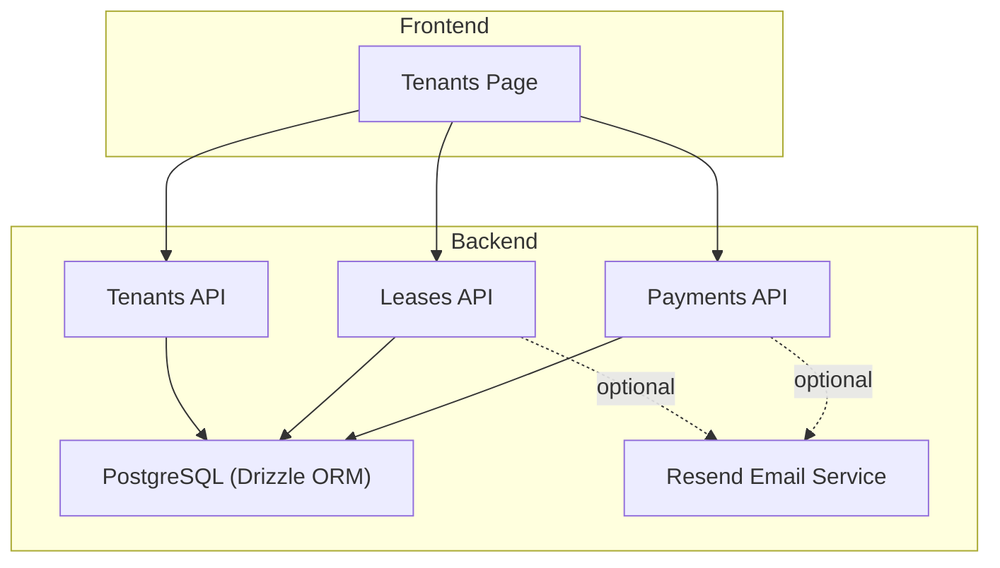
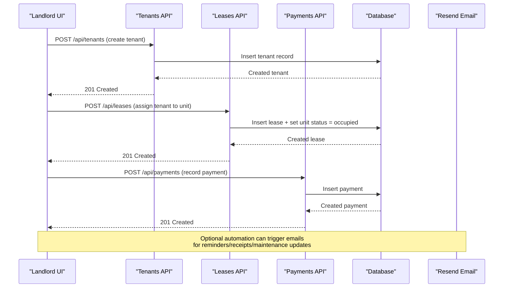
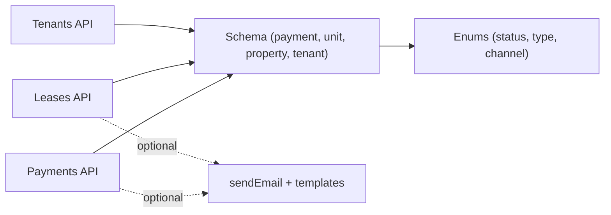

# Tenant Lifecycle Workflows

<cite>
**Referenced Files in This Document**
- [server/src/routes/tenants.ts](file://server/src/routes/tenants.ts)
- [client/src/pages/Tenants.tsx](file://client/src/pages/Tenants.tsx)
- [server/src/routes/leases.ts](file://server/src/routes/leases.ts)
- [server/src/routes/payments.ts](file://server/src/routes/payments.ts)
- [server/src/email/resend.ts](file://server/src/email/resend.ts)
- [server/src/db/schema.ts](file://server/src/db/schema.ts)
- [RentLite-Product-Spec-Sheet.md](file://RentLite-Product-Spec-Sheet.md)
</cite>

## Table of Contents
1. Introduction
2. Project Structure
3. Core Components
4. Architecture Overview
5. Detailed Component Analysis
6. Dependency Analysis
7. Performance Considerations
8. Troubleshooting Guide
9. Conclusion
10. Appendices

## Introduction
This document explains tenant lifecycle management in RentLite, covering the full journey from onboarding to move-out. It details how tenants are created and managed, how lease status transitions drive unit occupancy, and how automated email notifications support rent reminders, receipts, and maintenance updates. It also provides step-by-step workflows for landlords to add tenants, process renewals, handle departures, and manage communications. Where applicable, it references data models and API endpoints that implement these flows.

## Project Structure
RentLite is a full-stack application with:
- A React frontend (client) providing landlord-facing UIs for managing tenants, leases, payments, and reports.
- An Express backend (server) exposing REST APIs for CRUD operations on tenants, leases, payments, and more.
- A shared schema layer defining database tables and enums used across services.
- Email integration via Resend for sending templated emails such as rent reminders and receipts.

**Diagram sources**
- [client/src/pages/Tenants.tsx:1-264](file://client/src/pages/Tenants.tsx#L1-L264)
- [server/src/routes/tenants.ts:1-83](file://server/src/routes/tenants.ts#L1-L83)
- [server/src/routes/leases.ts:1-147](file://server/src/routes/leases.ts#L1-L147)
- [server/src/routes/payments.ts:1-137](file://server/src/routes/payments.ts#L1-L137)
- [server/src/email/resend.ts:1-113](file://server/src/email/resend.ts#L1-L113)
- [server/src/db/schema.ts:1-403](file://server/src/db/schema.ts#L1-L403)

**Section sources**
- [client/src/pages/Tenants.tsx:1-264](file://client/src/pages/Tenants.tsx#L1-L264)
- [server/src/routes/tenants.ts:1-83](file://server/src/routes/tenants.ts#L1-L83)
- [server/src/routes/leases.ts:1-147](file://server/src/routes/leases.ts#L1-L147)
- [server/src/routes/payments.ts:1-137](file://server/src/routes/payments.ts#L1-L137)
- [server/src/email/resend.ts:1-113](file://server/src/email/resend.ts#L1-L113)
- [server/src/db/schema.ts:1-403](file://server/src/db/schema.ts#L1-L403)

## Core Components
- Tenant Management API: Create, read, update, delete tenant records scoped by landlord user.
- Lease Management API: Create/update leases, enforce ownership checks, and automatically update unit status based on lease state.
- Payment Management API: Record and filter payments, compute monthly summaries, and track statuses.
- Email Integration: Send templated emails for rent reminders, receipts, and maintenance updates.
- Data Model: Defines tenants, leases, units, payments, and notifications with appropriate enums and relationships.

Key responsibilities:
- Tenants: Store contact and emergency info; no explicit active/inactive/archived fields exist in the current schema.
- Leases: Track start/end dates, rent amount, deposit, terms, and status; unit status changes when leases become occupied or vacant.
- Payments: Capture amounts, due/paid dates, methods, and statuses; provide monthly collection summaries.
- Notifications: Enumerated types define notification categories and channels; scheduling and delivery are modeled but not yet wired into routes in this snapshot.

**Section sources**
- [server/src/routes/tenants.ts:1-83](file://server/src/routes/tenants.ts#L1-L83)
- [server/src/routes/leases.ts:1-147](file://server/src/routes/leases.ts#L1-L147)
- [server/src/routes/payments.ts:1-137](file://server/src/routes/payments.ts#L1-L137)
- [server/src/email/resend.ts:1-113](file://server/src/email/resend.ts#L1-L113)
- [server/src/db/schema.ts:1-403](file://server/src/db/schema.ts#L1-L403)

## Architecture Overview
The tenant lifecycle spans UI actions, API calls, database updates, and optional email notifications.

**Diagram sources**
- [server/src/routes/tenants.ts:42-50](file://server/src/routes/tenants.ts#L42-L50)
- [server/src/routes/leases.ts:88-114](file://server/src/routes/leases.ts#L88-L114)
- [server/src/routes/payments.ts:103-110](file://server/src/routes/payments.ts#L103-L110)
- [server/src/email/resend.ts:7-30](file://server/src/email/resend.ts#L7-L30)

## Detailed Component Analysis

### Tenant Onboarding and Management
- Add a tenant: The Tenants page allows landlords to create tenant profiles with name, email, phone, employer, and emergency contacts. The API validates input and persists the tenant scoped to the authenticated landlord.
- Edit/Delete: Landlords can edit tenant details or remove them. Deletion is immediate and irreversible.

User interface workflow:
- Open Tenants page, click Add Tenant, fill required fields, submit. Success triggers a toast and refreshes the list.
- To edit, click the edit icon on a tenant row, modify fields, and save.
- To delete, confirm removal via a prompt.

Data model notes:
- Tenant entity includes identity, contact, and optional fields like employer and notes. There is no explicit status field for tenant lifecycle states in the current schema.

Automations:
- No automatic welcome email is implemented in the provided code. However, the email module supports sending templated messages which could be extended to send a welcome email upon tenant creation.

**Section sources**
- [client/src/pages/Tenants.tsx:21-104](file://client/src/pages/Tenants.tsx#L21-L104)
- [client/src/pages/Tenants.tsx:125-264](file://client/src/pages/Tenants.tsx#L125-L264)
- [server/src/routes/tenants.ts:11-50](file://server/src/routes/tenants.ts#L11-L50)
- [server/src/db/schema.ts:230-245](file://server/src/db/schema.ts#L230-L245)

### Lease Creation and Unit Occupancy
- Create a lease: Assign a tenant to a unit with start/end dates, rent amount, deposit, terms, and optional document URL. Ownership checks ensure the unit belongs to the landlord and the tenant exists under their account.
- Unit status synchronization: Creating a lease sets the unit status to occupied. Terminating or expiring a lease reverts the unit to vacant.

Workflow:
- Landlord selects a unit and tenant, enters lease details, and submits. The system creates the lease and updates unit status accordingly.

Expiring leases:
- An endpoint returns leases expiring within N days, enabling landlords to review upcoming renewals.

**Section sources**
- [server/src/routes/leases.ts:11-21](file://server/src/routes/leases.ts#L11-L21)
- [server/src/routes/leases.ts:88-114](file://server/src/routes/leases.ts#L88-L114)
- [server/src/routes/leases.ts:116-136](file://server/src/routes/leases.ts#L116-L136)
- [server/src/routes/leases.ts:23-76](file://server/src/routes/leases.ts#L23-L76)
- [server/src/db/schema.ts:249-266](file://server/src/db/schema.ts#L249-L266)

### Payments and Rent Reminders
- Record payments: Landlords can log payments with amount, due date, paid date, method, and status. Monthly summaries calculate expected vs. collected amounts and outstanding balances.
- Status tracking: Payments have statuses including pending, received, late, and partial.

Automation opportunities:
- While not wired in the current routes, the email module provides templates for rent reminders and receipts. These can be invoked by background jobs or triggered by payment events to notify tenants.

**Section sources**
- [server/src/routes/payments.ts:11-22](file://server/src/routes/payments.ts#L11-L22)
- [server/src/routes/payments.ts:103-126](file://server/src/routes/payments.ts#L103-L126)
- [server/src/routes/payments.ts:24-101](file://server/src/routes/payments.ts#L24-L101)
- [server/src/email/resend.ts:34-86](file://server/src/email/resend.ts#L34-L86)

### Automated Emails and Notifications
- Email service: Provides a generic send function and prebuilt HTML templates for rent reminders, receipts, and maintenance updates.
- Notification model: Defines notification types, channels, and statuses, along with scheduling and delivery timestamps.

Current state:
- Templates and send function are available; however, there is no route in this snapshot that directly invokes them during tenant or payment events. Extending the system to call sendEmail at key lifecycle points would enable automated communications.

**Section sources**
- [server/src/email/resend.ts:1-113](file://server/src/email/resend.ts#L1-L113)
- [server/src/db/schema.ts:90-110](file://server/src/db/schema.ts#L90-L110)
- [server/src/db/schema.ts:369-383](file://server/src/db/schema.ts#L369-L383)

### Move-Out and Departure Handling
- Terminate or expire a lease: Updating a lease’s status to terminated or expired automatically sets the associated unit back to vacant.
- Post-departure steps: Landlords should finalize any outstanding payments, close maintenance requests, and archive relevant documents.

Operational guidance:
- Use the lease update endpoint to mark the lease as terminated/expired.
- Review payments for any outstanding balances and adjust statuses accordingly.
- Optionally, send a move-out confirmation email using the email template infrastructure.

**Section sources**
- [server/src/routes/leases.ts:116-136](file://server/src/routes/leases.ts#L116-L136)
- [server/src/routes/payments.ts:112-126](file://server/src/routes/payments.ts#L112-L126)
- [server/src/email/resend.ts:7-30](file://server/src/email/resend.ts#L7-L30)

### User Interface Workflows for Landlords
- Tenants page:
  - Add tenant: Opens a modal form, validates inputs, and posts to the API.
  - Edit tenant: Pre-fills the form with existing data and updates via PUT.
  - Delete tenant: Confirms deletion before removing the record.
- Leases and payments:
  - While specific UI components for leases and payments are not shown here, the APIs support creating and updating records, and querying summaries and filters.

**Section sources**
- [client/src/pages/Tenants.tsx:31-104](file://client/src/pages/Tenants.tsx#L31-L104)
- [client/src/pages/Tenants.tsx:125-264](file://client/src/pages/Tenants.tsx#L125-L264)

## Dependency Analysis
The following diagram shows core dependencies among routes, schema, and email integration.

**Diagram sources**
- [server/src/routes/tenants.ts:1-83](file://server/src/routes/tenants.ts#L1-L83)
- [server/src/routes/leases.ts:1-147](file://server/src/routes/leases.ts#L1-L147)
- [server/src/routes/payments.ts:1-137](file://server/src/routes/payments.ts#L1-L137)
- [server/src/email/resend.ts:1-113](file://server/src/email/resend.ts#L1-L113)
- [server/src/db/schema.ts:1-403](file://server/src/db/schema.ts#L1-L403)

**Section sources**
- [server/src/routes/tenants.ts:1-83](file://server/src/routes/tenants.ts#L1-L83)
- [server/src/routes/leases.ts:1-147](file://server/src/routes/leases.ts#L1-L147)
- [server/src/routes/payments.ts:1-137](file://server/src/routes/payments.ts#L1-L137)
- [server/src/email/resend.ts:1-113](file://server/src/email/resend.ts#L1-L113)
- [server/src/db/schema.ts:1-403](file://server/src/db/schema.ts#L1-L403)

## Performance Considerations
- Query scoping: All tenant, lease, and payment queries are filtered by landlord ownership to avoid cross-user data exposure and reduce result sets.
- Filtering and pagination: Payment listing supports month/year/status/unitId filters to optimize dashboard performance.
- Database indexes: Ensure indexes on frequently queried columns (e.g., userId, unitId, tenantId, dueDate) to improve query speed as data grows.
- Email throttling: When implementing automated emails, consider rate limits and retries to avoid provider throttling and maintain reliability.

[No sources needed since this section provides general guidance]

## Troubleshooting Guide
Common issues and resolutions:
- Validation errors: API responses include structured validation errors with details. Check request payloads against schema constraints.
- Not found errors: Ensure tenant, unit, and lease IDs belong to the authenticated landlord. Cross-check ownership logic in routes.
- Unauthorized redirects: Frontend redirects to login on 401 responses; verify session/auth headers if encountering unexpected redirects.
- Email failures: Inspect error logs from the email service wrapper and validate recipient addresses and template parameters.

Operational tips:
- Use expiring leases endpoint to proactively identify upcoming renewals and prevent gaps in coverage.
- Monitor payment summaries to detect anomalies in collection rates and follow up on late or partial payments.

**Section sources**
- [server/src/routes/tenants.ts:42-80](file://server/src/routes/tenants.ts#L42-L80)
- [server/src/routes/leases.ts:88-143](file://server/src/routes/leases.ts#L88-L143)
- [server/src/routes/payments.ts:103-134](file://server/src/routes/payments.ts#L103-L134)
- [client/src/lib/api.ts:26-54](file://client/src/lib/api.ts#L26-L54)
- [server/src/email/resend.ts:7-30](file://server/src/email/resend.ts#L7-L30)

## Conclusion
RentLite provides a solid foundation for tenant lifecycle management:
- Tenants can be created, edited, and removed through a straightforward UI backed by validated APIs.
- Lease creation drives unit occupancy automatically, and lease termination/expiry restores vacancy.
- Payments are recorded and summarized for monthly reporting.
- Email templates and notification models are in place to support automated communications, though wiring into event-driven workflows is an extension opportunity.

For advanced lifecycle features such as explicit tenant status transitions (active/inactive/archived), automated welcome emails, and robust archival procedures, extend the schema and routes to incorporate status fields, scheduled jobs, and retention policies aligned with compliance requirements.

[No sources needed since this section summarizes without analyzing specific files]

## Appendices

### Step-by-Step Guides

- Adding a new tenant:
  - Navigate to Tenants, click Add Tenant, fill required fields, and submit.
  - Verify success message and updated tenant list.

- Processing a lease renewal:
  - Identify expiring leases using the expiring endpoint or UI.
  - Update lease end dates or create a new lease for the renewed term.
  - Confirm unit remains occupied after renewal.

- Handling tenant departure:
  - Mark the lease as terminated or expired.
  - Ensure unit status reverts to vacant.
  - Finalize any outstanding payments and close maintenance requests.

- Sending automated emails:
  - Use the email send function with appropriate templates for reminders, receipts, or maintenance updates.
  - Integrate calls into background jobs or event handlers tied to payment and lease events.

**Section sources**
- [client/src/pages/Tenants.tsx:125-264](file://client/src/pages/Tenants.tsx#L125-L264)
- [server/src/routes/leases.ts:23-76](file://server/src/routes/leases.ts#L23-L76)
- [server/src/routes/leases.ts:116-136](file://server/src/routes/leases.ts#L116-L136)
- [server/src/email/resend.ts:34-113](file://server/src/email/resend.ts#L34-L113)

### Data Retention and Archival Policies
- Current implementation:
  - No explicit archival or soft-delete mechanisms for tenants or leases are present in the provided code.
  - Hard deletes are supported for tenants and other entities.

- Recommended approach:
  - Introduce soft deletes or an archived flag for tenants and leases to preserve historical records while hiding them from default views.
  - Implement retention policies aligned with legal and compliance requirements (e.g., retain financial records for specified periods).
  - Provide export capabilities for audit and compliance purposes.

[No sources needed since this section provides general guidance]

### Product Specification Notes
- Automated notifications are planned for lease renewal reminders, rent reminders, and maintenance updates, with configurable schedules and templates.
- The product spec outlines notification types, channels, and triggers that align with the current schema enums and email templates.

**Section sources**
- [RentLite-Product-Spec-Sheet.md:217-227](file://RentLite-Product-Spec-Sheet.md#L217-L227)
- [RentLite-Product-Spec-Sheet.md:291-321](file://RentLite-Product-Spec-Sheet.md#L291-L321)