# Tenant Profile Management

<cite>
**Referenced Files in This Document**
- [tenants.ts](file://server/src/routes/tenants.ts)
- [schema.ts](file://server/src/db/schema.ts)
- [middleware.ts](file://server/src/auth/middleware.ts)
- [index.ts](file://server/src/auth/index.ts)
- [types.ts](file://shared/src/types.ts)
- [Tenants.tsx](file://client/src/pages/Tenants.tsx)
- [api.ts](file://client/src/lib/api.ts)
- [db/index.ts](file://server/src/db/index.ts)
</cite>

## Table of Contents
1. [Introduction](#introduction)
2. [Project Structure](#project-structure)
3. [Core Components](#core-components)
4. [Architecture Overview](#architecture-overview)
5. [Detailed Component Analysis](#detailed-component-analysis)
6. [Dependency Analysis](#dependency-analysis)
7. [Performance Considerations](#performance-considerations)
8. [Troubleshooting Guide](#troubleshooting-guide)
9. [Conclusion](#conclusion)
10. [Appendices](#appendices)

## Introduction
This document explains the tenant profile management functionality, covering the data model, validation rules, CRUD operations, authentication and authorization, client integration, error handling, and privacy/security considerations for sensitive tenant information. It is designed to be accessible to both technical and non-technical readers while providing code-level references for implementation details.

## Project Structure
Tenant profile management spans server routes, database schema, authentication middleware, shared types, and a React client page that drives user interactions.

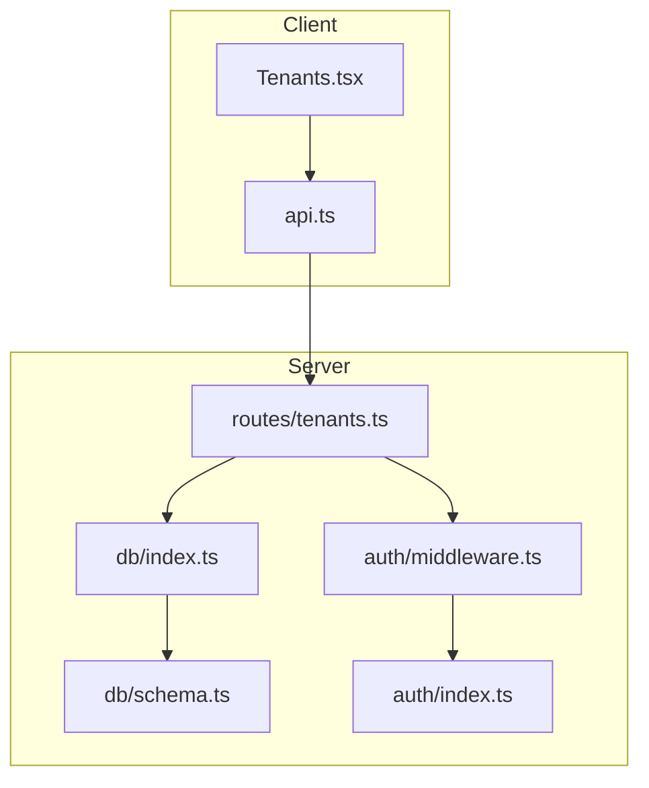

**Diagram sources**
- [Tenants.tsx:1-264](file://client/src/pages/Tenants.tsx#L1-L264)
- [api.ts:1-82](file://client/src/lib/api.ts#L1-L82)
- [tenants.ts:1-83](file://server/src/routes/tenants.ts#L1-L83)
- [db/index.ts:1-26](file://server/src/db/index.ts#L1-L26)
- [schema.ts:228-245](file://server/src/db/schema.ts#L228-L245)
- [middleware.ts:1-45](file://server/src/auth/middleware.ts#L1-L45)
- [index.ts:1-23](file://server/src/auth/index.ts#L1-L23)

**Section sources**
- [tenants.ts:1-83](file://server/src/routes/tenants.ts#L1-L83)
- [schema.ts:228-245](file://server/src/db/schema.ts#L228-L245)
- [middleware.ts:1-45](file://server/src/auth/middleware.ts#L1-L45)
- [index.ts:1-23](file://server/src/auth/index.ts#L1-L23)
- [types.ts:40-53](file://shared/src/types.ts#L40-L53)
- [Tenants.tsx:1-264](file://client/src/pages/Tenants.tsx#L1-L264)
- [api.ts:1-82](file://client/src/lib/api.ts#L1-L82)
- [db/index.ts:1-26](file://server/src/db/index.ts#L1-L26)

## Core Components
- Data model: The tenant entity includes personal information (firstName, lastName), contact details (email, phone), emergency contact information (emergencyContactName, emergencyContactPhone), employment data (employer), and administrative notes (notes). Timestamps are managed by the database layer.
- Validation: A Zod schema enforces required fields and optional constraints for all tenant fields.
- API endpoints: Full CRUD via Express router with authorization enforced by middleware.
- Client UI: A React page provides forms and actions to create, edit, list, and delete tenants.

**Section sources**
- [schema.ts:228-245](file://server/src/db/schema.ts#L228-L245)
- [types.ts:40-53](file://shared/src/types.ts#L40-L53)
- [tenants.ts:11-20](file://server/src/routes/tenants.ts#L11-L20)
- [tenants.ts:22-80](file://server/src/routes/tenants.ts#L22-L80)
- [Tenants.tsx:21-98](file://client/src/pages/Tenants.tsx#L21-L98)

## Architecture Overview
The system uses session-based authentication via Better-Auth. Requests to tenant endpoints pass through authMiddleware, which validates sessions and attaches the current userId to the request. All tenant queries filter by userId to ensure users can only access their own data.

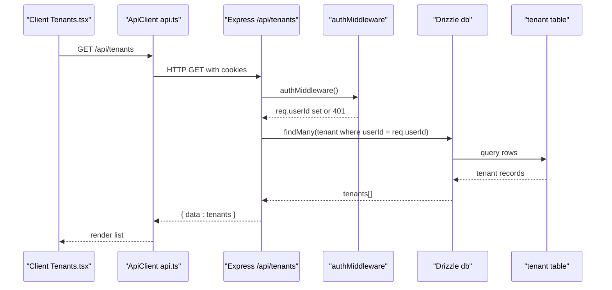

**Diagram sources**
- [Tenants.tsx:37-40](file://client/src/pages/Tenants.tsx#L37-L40)
- [api.ts:26-54](file://client/src/lib/api.ts#L26-L54)
- [tenants.ts:22-30](file://server/src/routes/tenants.ts#L22-L30)
- [middleware.ts:9-27](file://server/src/auth/middleware.ts#L9-L27)
- [schema.ts:228-245](file://server/src/db/schema.ts#L228-L245)

## Detailed Component Analysis

### Tenant Data Model
- Fields:
  - Personal: firstName, lastName (required)
  - Contact: email, phone (optional)
  - Emergency: emergencyContactName, emergencyContactPhone (optional)
  - Employment: employer (optional)
  - Notes: notes (optional)
  - System: id, userId, createdAt, updatedAt
- Relationships:
  - Each tenant belongs to a user via userId (multi-tenant isolation at the application level).
  - Leases and payments reference tenantId for business context.

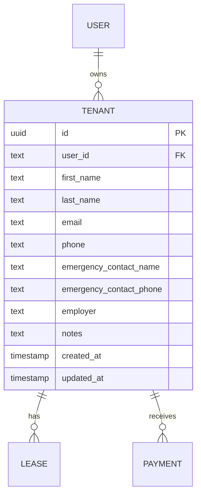

**Diagram sources**
- [schema.ts:139-147](file://server/src/db/schema.ts#L139-L147)
- [schema.ts:228-245](file://server/src/db/schema.ts#L228-L245)
- [schema.ts:249-266](file://server/src/db/schema.ts#L249-L266)
- [schema.ts:270-289](file://server/src/db/schema.ts#L270-L289)

**Section sources**
- [schema.ts:228-245](file://server/src/db/schema.ts#L228-L245)
- [types.ts:40-53](file://shared/src/types.ts#L40-L53)

### Zod Validation Schema
- Required fields: firstName, lastName (non-empty strings).
- Optional fields: email, phone, emergencyContactName, emergencyContactPhone, employer, notes (nullable and optional).
- Email format validated when provided.
- Update endpoint uses a partial schema to allow selective field updates.

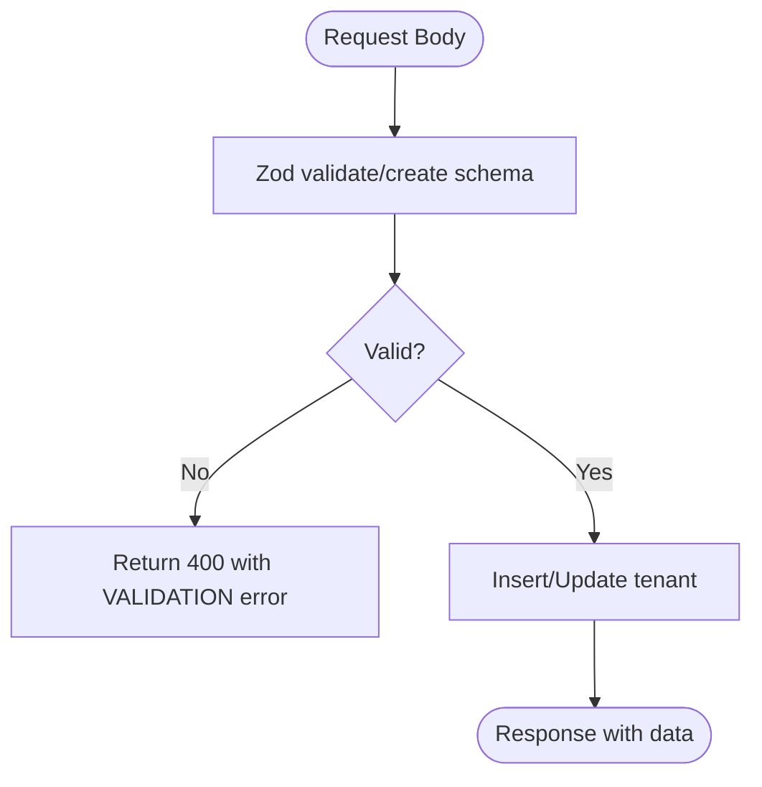

**Diagram sources**
- [tenants.ts:11-20](file://server/src/routes/tenants.ts#L11-L20)
- [tenants.ts:42-69](file://server/src/routes/tenants.ts#L42-L69)

**Section sources**
- [tenants.ts:11-20](file://server/src/routes/tenants.ts#L11-L20)
- [tenants.ts:42-69](file://server/src/routes/tenants.ts#L42-L69)

### Authentication Middleware
- Uses Better-Auth to retrieve the session from incoming headers/cookies.
- If no session exists, returns 401 Unauthorized.
- Attaches session and userId to the request for downstream handlers.
- Provides an optionalAuth variant for endpoints that allow unauthenticated access.

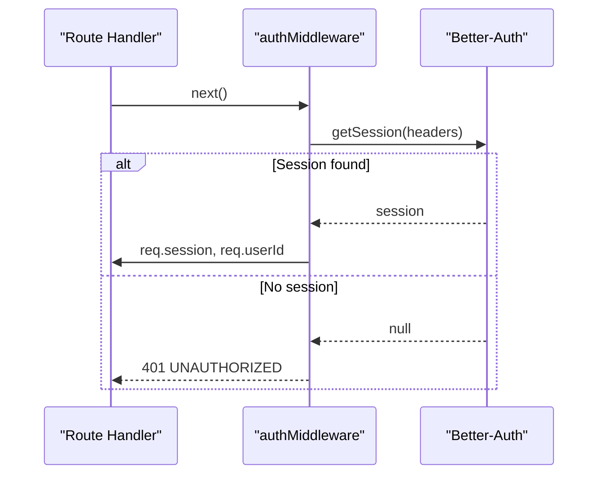

**Diagram sources**
- [middleware.ts:9-27](file://server/src/auth/middleware.ts#L9-L27)
- [index.ts:5-20](file://server/src/auth/index.ts#L5-L20)

**Section sources**
- [middleware.ts:1-45](file://server/src/auth/middleware.ts#L1-L45)
- [index.ts:1-23](file://server/src/auth/index.ts#L1-L23)

### CRUD Operations

#### Create Tenant
- Endpoint: POST /api/tenants
- Validates body with full schema.
- Inserts tenant with current userId and returns created record.

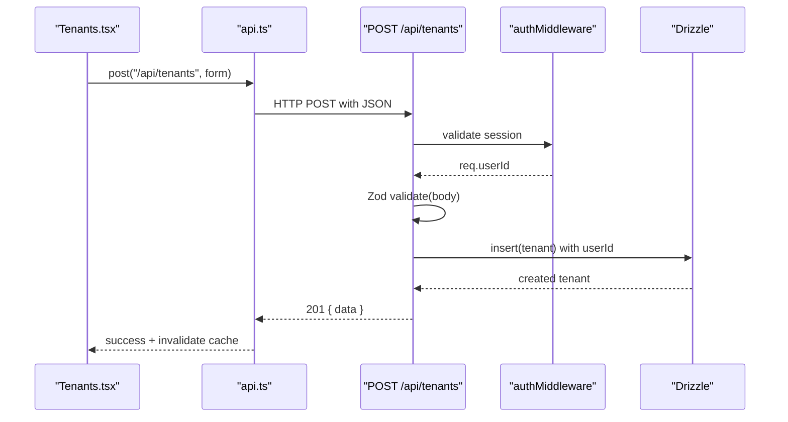

**Diagram sources**
- [Tenants.tsx:42-50](file://client/src/pages/Tenants.tsx#L42-L50)
- [api.ts:62-67](file://client/src/lib/api.ts#L62-L67)
- [tenants.ts:42-50](file://server/src/routes/tenants.ts#L42-L50)
- [middleware.ts:9-27](file://server/src/auth/middleware.ts#L9-L27)

**Section sources**
- [tenants.ts:42-50](file://server/src/routes/tenants.ts#L42-L50)

#### Read Tenants
- List: GET /api/tenants returns all tenants for the authenticated user, ordered by creation date descending.
- Detail: GET /api/tenants/:id returns a single tenant if it belongs to the authenticated user; otherwise 404.

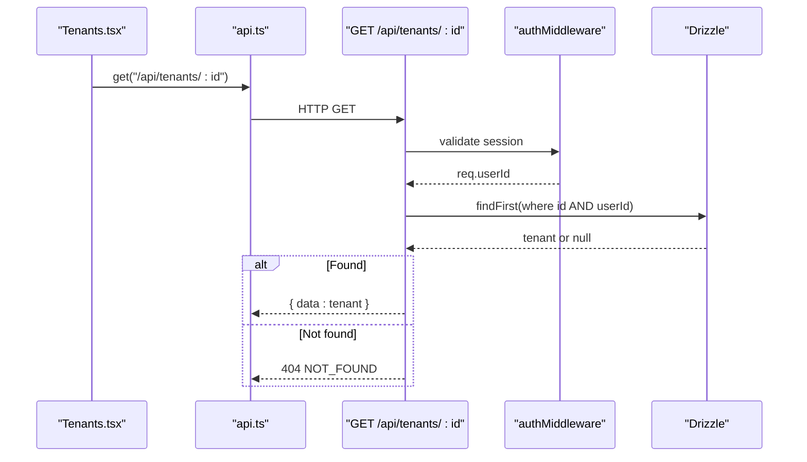

**Diagram sources**
- [Tenants.tsx:37-40](file://client/src/pages/Tenants.tsx#L37-L40)
- [api.ts:58-60](file://client/src/lib/api.ts#L58-L60)
- [tenants.ts:22-39](file://server/src/routes/tenants.ts#L22-L39)
- [middleware.ts:9-27](file://server/src/auth/middleware.ts#L9-L27)

**Section sources**
- [tenants.ts:22-39](file://server/src/routes/tenants.ts#L22-L39)

#### Update Tenant
- Endpoint: PUT /api/tenants/:id
- Validates body with partial schema (allows updating specific fields).
- Ensures tenant exists and belongs to the authenticated user before updating.

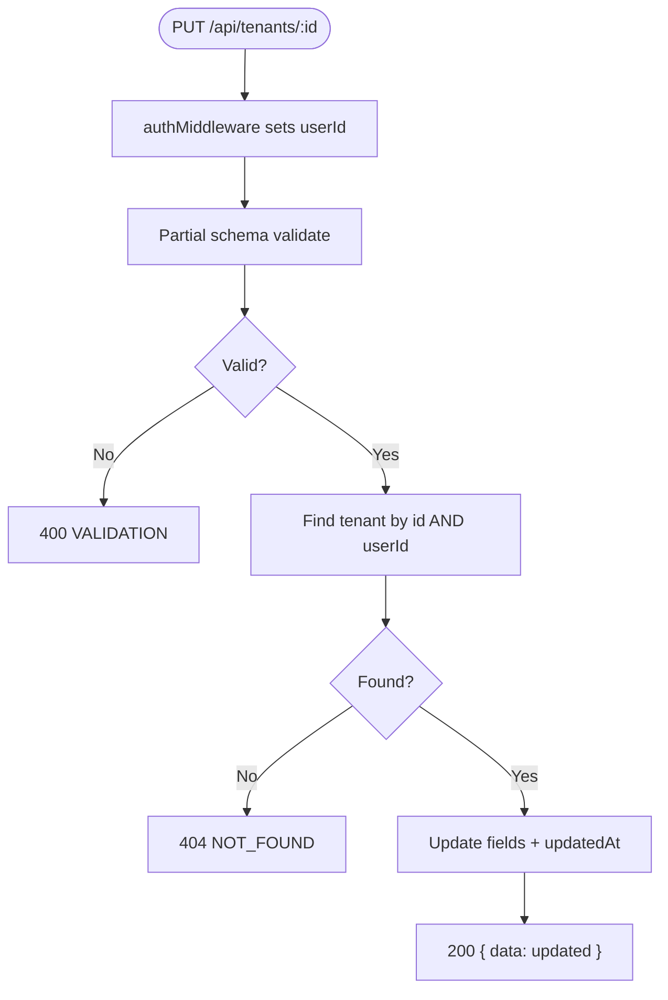

**Diagram sources**
- [tenants.ts:52-69](file://server/src/routes/tenants.ts#L52-L69)

**Section sources**
- [tenants.ts:52-69](file://server/src/routes/tenants.ts#L52-L69)

#### Delete Tenant
- Endpoint: DELETE /api/tenants/:id
- Verifies ownership by matching id and userId.
- Deletes tenant and returns success message.

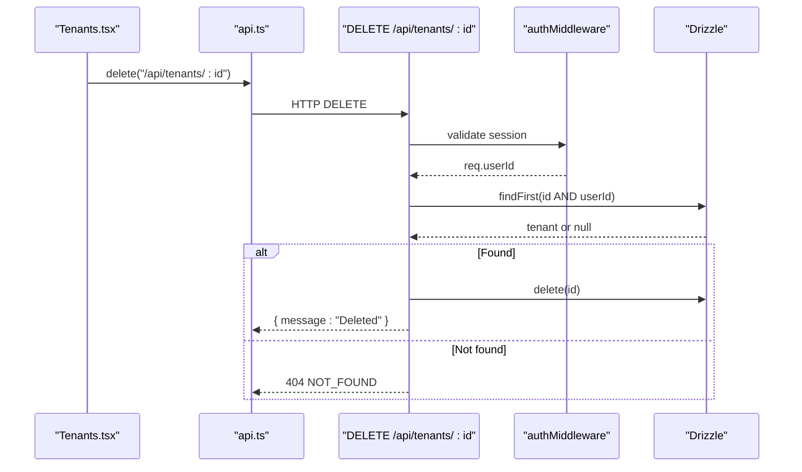

**Diagram sources**
- [Tenants.tsx:62-69](file://client/src/pages/Tenants.tsx#L62-L69)
- [api.ts:76-78](file://client/src/lib/api.ts#L76-L78)
- [tenants.ts:71-80](file://server/src/routes/tenants.ts#L71-L80)
- [middleware.ts:9-27](file://server/src/auth/middleware.ts#L9-L27)

**Section sources**
- [tenants.ts:71-80](file://server/src/routes/tenants.ts#L71-L80)

### Client Integration and Workflows
- The Tenants page lists tenants, opens a modal to add/edit, and triggers mutations for create/update/delete.
- On success, it invalidates the tenants query to refresh the list and shows toast notifications.
- Error handling displays user-friendly messages and redirects on unauthorized responses.

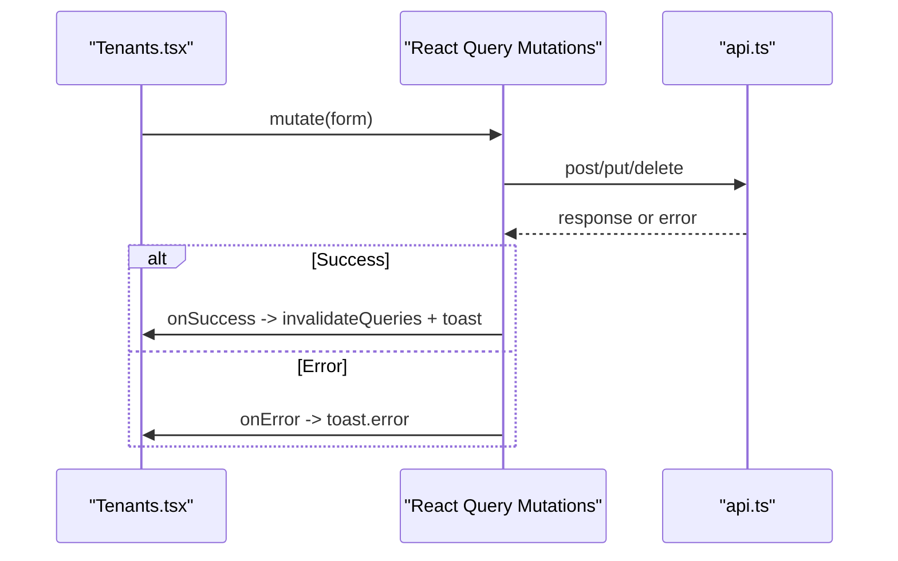

**Diagram sources**
- [Tenants.tsx:42-69](file://client/src/pages/Tenants.tsx#L42-L69)
- [api.ts:26-54](file://client/src/lib/api.ts#L26-L54)

**Section sources**
- [Tenants.tsx:42-98](file://client/src/pages/Tenants.tsx#L42-L98)
- [api.ts:26-54](file://client/src/lib/api.ts#L26-L54)

## Dependency Analysis
- Route dependencies:
  - Express Router for HTTP endpoints.
  - Drizzle ORM for querying and mutating tenant data.
  - Zod for input validation.
  - Auth middleware for session verification and user scoping.
- Database configuration:
  - PostgreSQL connection via postgres-js and Drizzle.
  - Environment variable DATABASE_URL required.
- Shared types:
  - TypeScript interfaces define the shape of Tenant and related entities used across client/server boundaries.

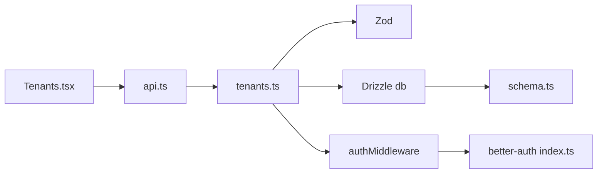

**Diagram sources**
- [tenants.ts:1-83](file://server/src/routes/tenants.ts#L1-L83)
- [db/index.ts:1-26](file://server/src/db/index.ts#L1-L26)
- [schema.ts:228-245](file://server/src/db/schema.ts#L228-L245)
- [middleware.ts:1-45](file://server/src/auth/middleware.ts#L1-L45)
- [index.ts:1-23](file://server/src/auth/index.ts#L1-L23)
- [Tenants.tsx:1-264](file://client/src/pages/Tenants.tsx#L1-L264)
- [api.ts:1-82](file://client/src/lib/api.ts#L1-L82)

**Section sources**
- [db/index.ts:1-26](file://server/src/db/index.ts#L1-L26)
- [types.ts:40-53](file://shared/src/types.ts#L40-L53)

## Performance Considerations
- Queries are scoped per user via userId, reducing result sets and improving security.
- Listing tenants orders by creation date; consider pagination for large datasets.
- Use partial updates to minimize payload size and avoid unnecessary writes.
- Ensure indexes on frequently filtered columns (e.g., userId, id) in production databases.

[No sources needed since this section provides general guidance]

## Troubleshooting Guide
Common errors and handling patterns:
- Validation errors:
  - Cause: Missing or invalid fields (e.g., empty firstName/lastName, malformed email).
  - Response: 400 with code "VALIDATION" and details describing field issues.
  - Client behavior: Show error toasts and prevent submission until corrected.
- Not found:
  - Cause: Requested tenant does not exist or does not belong to the authenticated user.
  - Response: 404 with code "NOT_FOUND".
- Unauthorized:
  - Cause: Missing or invalid session.
  - Server response: 401 with code "UNAUTHORIZED".
  - Client behavior: Redirect to login and surface an error.

Operational checks:
- Verify DATABASE_URL is configured for the server to connect to PostgreSQL.
- Confirm trustedOrigins include the client URL to allow session cookies.
- Ensure credentials are included in fetch requests so cookies are sent.

**Section sources**
- [tenants.ts:42-80](file://server/src/routes/tenants.ts#L42-L80)
- [middleware.ts:9-27](file://server/src/auth/middleware.ts#L9-L27)
- [api.ts:26-54](file://client/src/lib/api.ts#L26-L54)
- [db/index.ts:18-21](file://server/src/db/index.ts#L18-L21)
- [index.ts:17-19](file://server/src/auth/index.ts#L17-L19)

## Conclusion
Tenant profile management is implemented with clear separation of concerns: a robust data model, strict validation, secure authentication and authorization, and a responsive client interface. The design ensures multi-tenant isolation by scoping all operations to the authenticated user’s ID. For production, consider adding pagination, rate limiting, encryption at rest for sensitive fields, and audit logging for compliance.

[No sources needed since this section summarizes without analyzing specific files]

## Appendices

### API Endpoints Summary
- GET /api/tenants
  - Returns all tenants for the authenticated user.
  - Requires authentication.
- GET /api/tenants/:id
  - Returns a single tenant owned by the authenticated user.
  - Requires authentication.
- POST /api/tenants
  - Creates a new tenant for the authenticated user.
  - Requires authentication and valid body.
- PUT /api/tenants/:id
  - Updates a tenant owned by the authenticated user.
  - Requires authentication and valid partial body.
- DELETE /api/tenants/:id
  - Deletes a tenant owned by the authenticated user.
  - Requires authentication.

**Section sources**
- [tenants.ts:22-80](file://server/src/routes/tenants.ts#L22-L80)

### Privacy and Security Considerations
- Access control:
  - All tenant endpoints enforce ownership by filtering queries with userId from the authenticated session.
- Data sensitivity:
  - Tenant records contain PII (names, emails, phones) and emergency contacts; treat as sensitive.
- Recommendations:
  - Encrypt sensitive fields at rest using database-level encryption or application-level encryption.
  - Restrict logs to exclude or mask sensitive fields.
  - Enforce HTTPS and secure cookie settings in production.
  - Implement least-privilege database accounts and restrict network access to the database.
  - Add audit trails for create/update/delete operations on tenant data.
  - Consider tokenization or pseudonymization for long-term storage of highly sensitive data.

[No sources needed since this section provides general guidance]