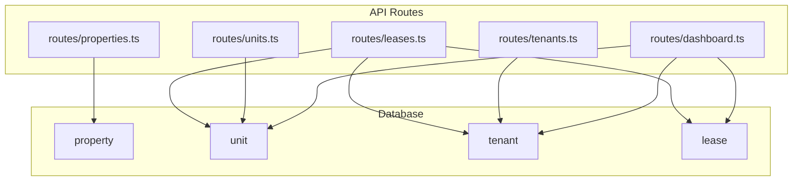
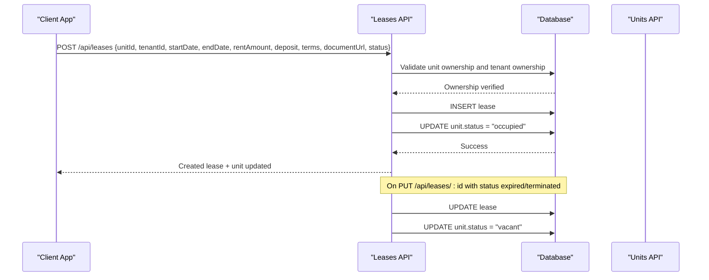
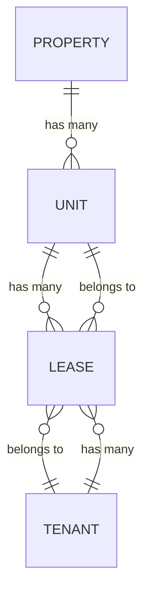
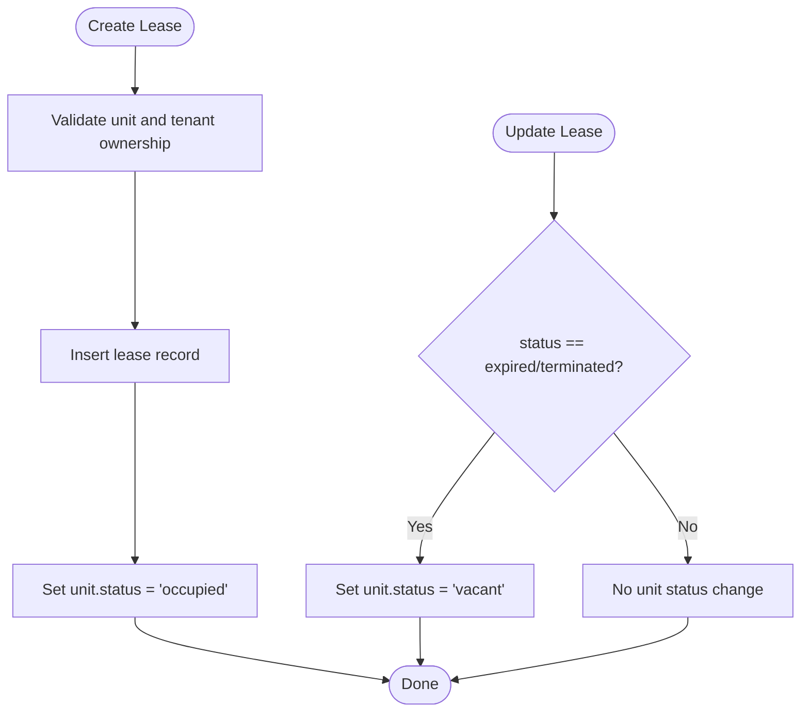
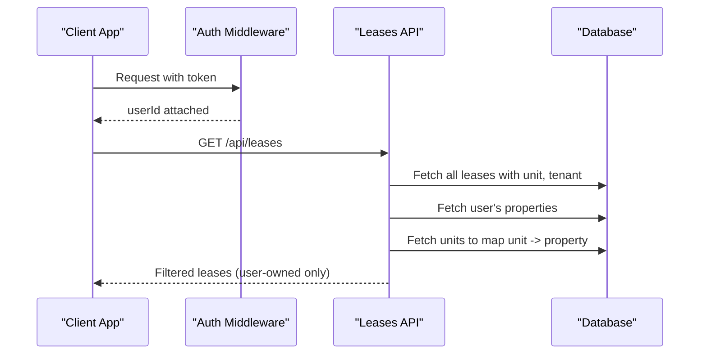
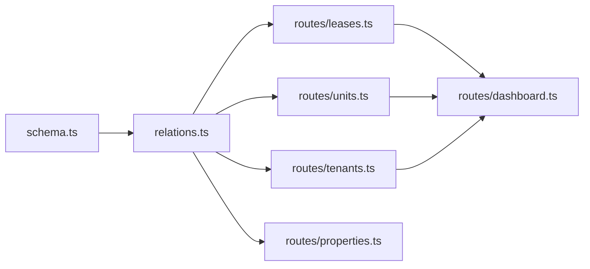

# Tenant-Lease Relationships

<cite>
**Referenced Files in This Document**
- [schema.ts](file://server/src/db/schema.ts)
- [relations.ts](file://server/src/db/relations.ts)
- [leases.ts](file://server/src/routes/leases.ts)
- [tenants.ts](file://server/src/routes/tenants.ts)
- [units.ts](file://server/src/routes/units.ts)
- [properties.ts](file://server/src/routes/properties.ts)
- [dashboard.ts](file://server/src/routes/dashboard.ts)
</cite>

## Table of Contents
1. Introduction
2. Project Structure
3. Core Components
4. Architecture Overview
5. Detailed Component Analysis
6. Dependency Analysis
7. Performance Considerations
8. Troubleshooting Guide
9. Conclusion
10. Appendices

## Introduction
This document explains how RentLite manages tenant-to-lease relationships, focusing on how tenants are associated with properties through lease agreements and how the database schema enforces referential integrity. It covers one-to-one and one-to-many relationships among tenant, lease, unit, and property entities; details foreign key constraints and status tracking; provides examples for creating leases, updating terms, and managing moveouts; documents query patterns for tenant-lease data; and outlines performance considerations and migration strategies when modifying these relationships.

## Project Structure
RentLite’s backend is organized by feature routes and a shared database layer:
- Database schema and relations are defined under server/src/db.
- Business logic for tenant-lease operations lives in server/src/routes (leases, tenants, units, properties).
- Dashboard aggregates tenant-lease metrics for landlord visibility.

**Diagram sources**
- [schema.ts:191-266](file://server/src/db/schema.ts#L191-L266)
- [relations.ts:37-66](file://server/src/db/relations.ts#L37-L66)
- [leases.ts:23-147](file://server/src/routes/leases.ts#L23-L147)
- [tenants.ts:22-83](file://server/src/routes/tenants.ts#L22-L83)
- [units.ts:23-123](file://server/src/routes/units.ts#L23-L123)
- [properties.ts:25-106](file://server/src/routes/properties.ts#L25-L106)
- [dashboard.ts:11-124](file://server/src/routes/dashboard.ts#L11-L124)

**Section sources**
- [schema.ts:191-266](file://server/src/db/schema.ts#L191-L266)
- [relations.ts:37-66](file://server/src/db/relations.ts#L37-L66)
- [leases.ts:23-147](file://server/src/routes/leases.ts#L23-L147)
- [tenants.ts:22-83](file://server/src/routes/tenants.ts#L22-L83)
- [units.ts:23-123](file://server/src/routes/units.ts#L23-L123)
- [properties.ts:25-106](file://server/src/routes/properties.ts#L25-L106)
- [dashboard.ts:11-124](file://server/src/routes/dashboard.ts#L11-L124)

## Core Components
- Property: Represents a building or site owned by a user. Units belong to a property.
- Unit: A rentable space within a property. Occupancy state is tracked via status.
- Tenant: A person renting one or more units.
- Lease: The contractual link between a tenant and a unit, including dates, rent amount, deposit, terms, and status.

Key relationship cardinalities:
- One property has many units (one-to-many).
- One unit can have many leases over time (one-to-many), but at any given time typically one active lease per unit.
- One tenant can have many leases (one-to-many).
- Lease connects exactly one tenant and one unit (many-to-many resolved via join table semantics).

**Section sources**
- [schema.ts:191-266](file://server/src/db/schema.ts#L191-L266)
- [relations.ts:37-66](file://server/src/db/relations.ts#L37-L66)

## Architecture Overview
The tenant-lease workflow spans API routes and the database layer:
- Creating a lease validates ownership of the unit and tenant, inserts the lease record, and updates unit occupancy.
- Updating a lease may change unit status based on lease termination or expiration.
- Dashboard queries aggregate tenant-lease data to show occupancy and expiring leases.

**Diagram sources**
- [leases.ts:88-136](file://server/src/routes/leases.ts#L88-L136)
- [schema.ts:212-266](file://server/src/db/schema.ts#L212-L266)

**Section sources**
- [leases.ts:88-136](file://server/src/routes/leases.ts#L88-L136)

## Detailed Component Analysis

### Database Schema and Referential Integrity
- Foreign keys:
  - lease.unit_id references unit.id with cascade delete.
  - lease.tenant_id references tenant.id with cascade delete.
  - unit.property_id references property.id with cascade delete.
- Enums:
  - lease_status: active, expired, terminated.
  - unit_status: occupied, vacant, under_renovation.
- Constraints ensure that deleting a unit cascades to its leases; deleting a tenant cascades to their leases; deleting a property cascades to its units (and transitively to leases).

**Diagram sources**
- [schema.ts:191-266](file://server/src/db/schema.ts#L191-L266)
- [relations.ts:37-66](file://server/src/db/relations.ts#L37-L66)

**Section sources**
- [schema.ts:191-266](file://server/src/db/schema.ts#L191-L266)
- [relations.ts:37-66](file://server/src/db/relations.ts#L37-L66)

### Lease Lifecycle and Status Tracking
- Lease creation sets unit status to occupied.
- Lease update to expired or terminated sets unit status back to vacant.
- Dashboard and expiring leases endpoints filter by lease status and date ranges to surface upcoming renewals.

**Diagram sources**
- [leases.ts:88-136](file://server/src/routes/leases.ts#L88-L136)

**Section sources**
- [leases.ts:88-136](file://server/src/routes/leases.ts#L88-L136)

### Tenant Visibility and Access
- Tenants are scoped to users via userId; listing and mutating tenants require authentication and ownership checks.
- Leases are filtered to the authenticated user’s properties by mapping units to properties and filtering accordingly.
- Dashboard aggregates only data belonging to the current user’s properties and tenants.

**Diagram sources**
- [leases.ts:23-46](file://server/src/routes/leases.ts#L23-L46)
- [tenants.ts:22-40](file://server/src/routes/tenants.ts#L22-L40)
- [dashboard.ts:11-38](file://server/src/routes/dashboard.ts#L11-L38)

**Section sources**
- [leases.ts:23-46](file://server/src/routes/leases.ts#L23-L46)
- [tenants.ts:22-40](file://server/src/routes/tenants.ts#L22-L40)
- [dashboard.ts:11-38](file://server/src/routes/dashboard.ts#L11-L38)

### Examples: Creating Lease Associations, Updating Terms, Managing Moveouts
- Create lease association:
  - Endpoint: POST /api/leases
  - Behavior: Validates unit and tenant ownership, inserts lease, marks unit as occupied.
  - Reference: [leases.ts:88-114](file://server/src/routes/leases.ts#L88-L114)
- Update lease terms:
  - Endpoint: PUT /api/leases/:id
  - Behavior: Updates lease fields; if status becomes expired or terminated, marks unit as vacant.
  - Reference: [leases.ts:116-136](file://server/src/routes/leases.ts#L116-L136)
- Manage tenant moveout:
  - Set lease status to expired or terminated via PUT /api/leases/:id to vacate the unit.
  - Alternatively, delete the lease (note: deletion cascades from unit/tenant deletes; explicit delete endpoint exists).
  - References: [leases.ts:116-147](file://server/src/routes/leases.ts#L116-L147)

**Section sources**
- [leases.ts:88-147](file://server/src/routes/leases.ts#L88-L147)

### Query Patterns for Tenant-Lease Data
- List leases with related unit and tenant:
  - Use findMany with include of unit and tenant, then filter by user-owned properties.
  - Reference: [leases.ts:23-46](file://server/src/routes/leases.ts#L23-L46)
- Expiring leases:
  - Filter active leases where end date falls within a configurable window (default 90 days).
  - Reference: [leases.ts:48-76](file://server/src/routes/leases.ts#L48-L76)
- Dashboard aggregation:
  - Aggregates properties, units, tenants, payments, maintenance, expenses, and leases scoped to user ownership.
  - Reference: [dashboard.ts:11-124](file://server/src/routes/dashboard.ts#L11-L124)

**Section sources**
- [leases.ts:23-76](file://server/src/routes/leases.ts#L23-L76)
- [dashboard.ts:11-124](file://server/src/routes/dashboard.ts#L11-L124)

## Dependency Analysis
Tenant-lease relationships depend on:
- Schema definitions for tables and enums.
- Relations module for Drizzle ORM relationships.
- Route handlers enforcing business rules and ownership scoping.

**Diagram sources**
- [schema.ts:191-266](file://server/src/db/schema.ts#L191-L266)
- [relations.ts:37-66](file://server/src/db/relations.ts#L37-L66)
- [leases.ts:23-147](file://server/src/routes/leases.ts#L23-L147)
- [tenants.ts:22-83](file://server/src/routes/tenants.ts#L22-L83)
- [units.ts:23-123](file://server/src/routes/units.ts#L23-L123)
- [properties.ts:25-106](file://server/src/routes/properties.ts#L25-L106)
- [dashboard.ts:11-124](file://server/src/routes/dashboard.ts#L11-L124)

**Section sources**
- [schema.ts:191-266](file://server/src/db/schema.ts#L191-L266)
- [relations.ts:37-66](file://server/src/db/relations.ts#L37-L66)
- [leases.ts:23-147](file://server/src/routes/leases.ts#L23-L147)
- [tenants.ts:22-83](file://server/src/routes/tenants.ts#L22-L83)
- [units.ts:23-123](file://server/src/routes/units.ts#L23-L123)
- [properties.ts:25-106](file://server/src/routes/properties.ts#L25-L106)
- [dashboard.ts:11-124](file://server/src/routes/dashboard.ts#L11-L124)

## Performance Considerations
- Filtering strategy:
  - Current implementation fetches all leases and filters client-side after retrieving user properties and units. For large datasets, consider server-side joins or indexed queries to reduce payload size and memory usage.
- Indexing recommendations:
  - Add indexes on lease.unit_id, lease.tenant_id, lease.status, lease.start_date, lease.end_date to optimize lookups and range queries.
  - Add indexes on unit.property_id to speed up property-scoped queries.
- Eager loading:
  - Use ORM relations to eagerly load unit and tenant where needed to avoid N+1 queries.
- Pagination:
  - Implement pagination for list endpoints to handle large numbers of leases and tenants efficiently.
- Caching:
  - Cache dashboard aggregates for short intervals to reduce repeated heavy aggregations.

[No sources needed since this section provides general guidance]

## Troubleshooting Guide
Common issues and resolutions:
- Validation errors:
  - Ensure request payloads match schema expectations (e.g., UUIDs for unitId and tenantId, valid dates, numeric rent amounts).
  - Reference: [leases.ts:11-21](file://server/src/routes/leases.ts#L11-L21), [tenants.ts:11-20](file://server/src/routes/tenants.ts#L11-L20)
- Not found errors:
  - Verify unit and tenant ownership before creating leases; check that the authenticated user owns the referenced property.
  - Reference: [leases.ts:94-106](file://server/src/routes/leases.ts#L94-L106)
- Unit status inconsistencies:
  - If unit status does not reflect lease changes, confirm that lease updates set status to expired or terminated appropriately.
  - Reference: [leases.ts:130-133](file://server/src/routes/leases.ts#L130-L133)
- Cascading deletes:
  - Deleting a unit or tenant will cascade to leases; ensure application logic accounts for this behavior.
  - Reference: [schema.ts:212-266](file://server/src/db/schema.ts#L212-L266)

**Section sources**
- [leases.ts:11-21](file://server/src/routes/leases.ts#L11-L21)
- [tenants.ts:11-20](file://server/src/routes/tenants.ts#L11-L20)
- [leases.ts:94-106](file://server/src/routes/leases.ts#L94-L106)
- [leases.ts:130-133](file://server/src/routes/leases.ts#L130-L133)
- [schema.ts:212-266](file://server/src/db/schema.ts#L212-L266)

## Conclusion
RentLite models tenant-lease relationships using clear one-to-many associations between tenant and lease, and unit and lease, with strong referential integrity enforced via foreign keys and cascade rules. Lease status drives unit occupancy state, enabling accurate reporting and alerts. The API enforces ownership scoping and provides endpoints to create, update, and manage leases, while the dashboard aggregates tenant-lease data for landlord insights. For scalability, consider server-side filtering, indexing, pagination, and caching to optimize complex relationship queries.

[No sources needed since this section summarizes without analyzing specific files]

## Appendices

### Data Migration Strategies When Modifying Tenant-Lease Relationships
- Adding new lease fields:
  - Introduce nullable columns first, populate existing rows, then enforce NOT NULL constraints in a subsequent migration.
- Changing lease status values:
  - Extend the enum to include new statuses, migrate existing rows if necessary, then remove old values in a later step.
- Re-indexing:
  - After adding indexes on frequently queried columns (e.g., lease.unit_id, lease.tenant_id, lease.status), run REINDEX or concurrent index builds to minimize downtime.
- Backfilling unit status:
  - If unit status drifts from lease state, run a reconciliation script to set unit.status based on active leases.
- Rollback planning:
  - Keep migrations reversible; test rollback procedures in staging to ensure data consistency during deployments.

[No sources needed since this section provides general guidance]