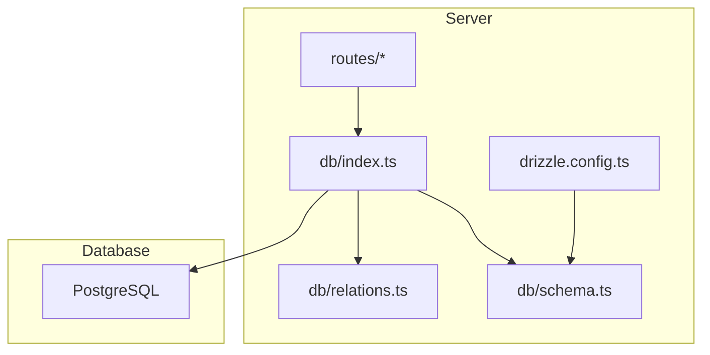
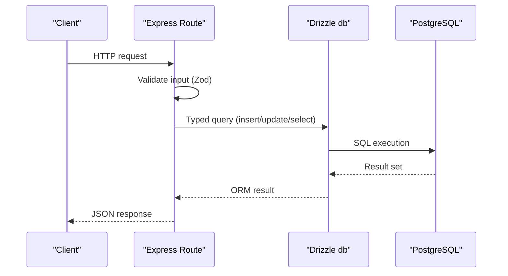
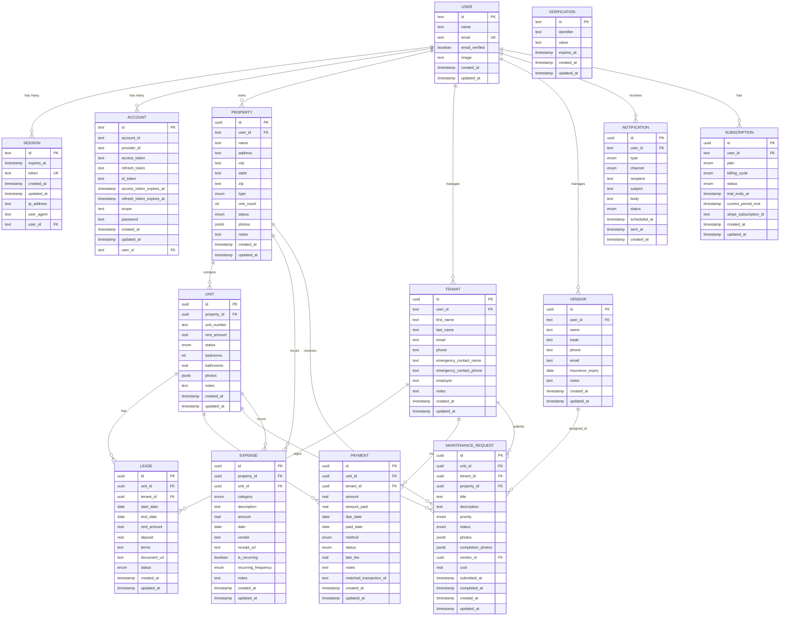
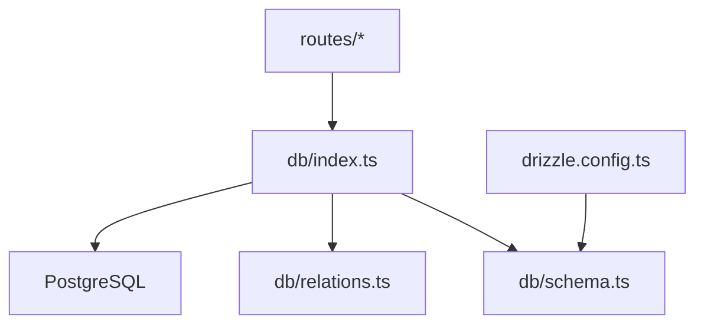

# Database Design

<cite>
**Referenced Files in This Document**
- [schema.ts](file://server/src/db/schema.ts)
- [relations.ts](file://server/src/db/relations.ts)
- [db/index.ts](file://server/src/db/index.ts)
- [drizzle.config.ts](file://server/drizzle.config.ts)
- [properties.ts](file://server/src/routes/properties.ts)
- [payments.ts](file://server/src/routes/payments.ts)
- [maintenance.ts](file://server/src/routes/maintenance.ts)
- [expenses.ts](file://server/src/routes/expenses.ts)
- [tenants.ts](file://server/src/routes/tenants.ts)
- [leases.ts](file://server/src/routes/leases.ts)
</cite>

## Table of Contents
1. Introduction
2. Project Structure
3. Core Components
4. Architecture Overview
5. Detailed Component Analysis
6. Dependency Analysis
7. Performance Considerations
8. Troubleshooting Guide
9. Conclusion
10. Appendices

## Introduction
This document provides comprehensive database design documentation for the RentLite application. It details the complete data model, including entities such as Properties, Units, Tenants, Leases, Payments, MaintenanceRequests, Expenses, and Vendors, along with their relationships, constraints, and integrity rules. It explains how Drizzle ORM schema definitions map to PostgreSQL tables, outlines indexing strategies for performance, documents migration procedures using Drizzle migrations, and provides examples of common queries and data access patterns. It also covers data validation rules, business constraints, referential integrity, backup and recovery procedures, data archiving strategies, performance monitoring approaches, and security considerations including encryption at rest and access controls.

## Project Structure
The database layer is implemented using Drizzle ORM with a PostgreSQL dialect. The core schema and relations are defined in dedicated files under server/src/db, while routes demonstrate typical data access patterns across features like properties, payments, maintenance, expenses, tenants, and leases.

**Diagram sources**
- [db/index.ts:1-11](file://server/src/db/index.ts#L1-L11)
- [schema.ts:1-403](file://server/src/db/schema.ts#L1-L403)
- [relations.ts:1-103](file://server/src/db/relations.ts#L1-L103)
- [drizzle.config.ts:1-12](file://server/drizzle.config.ts#L1-L12)

**Section sources**
- [db/index.ts:1-11](file://server/src/db/index.ts#L1-L11)
- [schema.ts:1-403](file://server/src/db/schema.ts#L1-L403)
- [relations.ts:1-103](file://server/src/db/relations.ts#L1-L103)
- [drizzle.config.ts:1-12](file://server/drizzle.config.ts#L1-L12)

## Core Components
RentLite’s data model centers around property management and tenant lifecycle operations. Key entities include:
- User, Session, Account, Verification (authentication-related)
- Property, Unit, Tenant, Lease
- Payment, MaintenanceRequest, Expense, Vendor
- Notification, Subscription

Each entity is defined with Drizzle pgTable, mapping directly to PostgreSQL tables with appropriate types, defaults, and constraints. Relations are declared separately to enable type-safe joins and queries.

**Section sources**
- [schema.ts:137-403](file://server/src/db/schema.ts#L137-L403)
- [relations.ts:18-103](file://server/src/db/relations.ts#L18-L103)

## Architecture Overview
The application uses Drizzle ORM to interact with PostgreSQL. Routes perform input validation via Zod, then execute typed queries against the database. Relationships between entities are modeled both in schema definitions and explicit relation mappings.

**Diagram sources**
- [properties.ts:25-71](file://server/src/routes/properties.ts#L25-L71)
- [payments.ts:24-109](file://server/src/routes/payments.ts#L24-L109)
- [db/index.ts:6-10](file://server/src/db/index.ts#L6-L10)

## Detailed Component Analysis

### Data Model and Entity Relationships
The following diagram maps the primary entities and their relationships as defined in the schema and relations files.

**Diagram sources**
- [schema.ts:137-403](file://server/src/db/schema.ts#L137-L403)
- [relations.ts:18-103](file://server/src/db/relations.ts#L18-L103)

#### Primary Keys, Foreign Keys, and Constraints
- Primary keys: All entities use UUID primary keys except authentication tables which use text IDs.
- Foreign keys:
  - property.user_id references user.id with cascade delete
  - unit.property_id references property.id with cascade delete
  - lease.unit_id references unit.id with cascade delete
  - lease.tenant_id references tenant.id with cascade delete
  - payment.unit_id references unit.id with cascade delete
  - payment.tenant_id references tenant.id with cascade delete
  - maintenance_request.unit_id references unit.id with cascade delete
  - maintenance_request.tenant_id references tenant.id with set null on delete
  - maintenance_request.property_id references property.id with cascade delete
  - maintenance_request.vendor_id references vendor.id with set null on delete
  - expense.property_id references property.id with cascade delete
  - expense.unit_id references unit.id with set null on delete
  - vendor.user_id references user.id with cascade delete
  - notification.user_id references user.id with cascade delete
  - subscription.user_id references user.id with cascade delete
- Unique constraints:
  - user.email unique
  - session.token unique
- Defaults:
  - Timestamps default to now
  - Status fields have sensible defaults (e.g., active, vacant, pending)
  - Numeric fields like amounts default to zero where applicable

**Section sources**
- [schema.ts:137-403](file://server/src/db/schema.ts#L137-L403)

#### Enumerations and Business Rules
- Property type/status enums constrain valid values for property attributes.
- Unit status enforces occupancy states.
- Lease status tracks lifecycle (active, expired, terminated).
- Payment method/status enums standardize payment tracking.
- Maintenance priority/status enums manage workflow states.
- Expense categories align with accounting practices.
- Notification enums define channels and statuses.
- Subscription enums control plan tiers and billing cycles.

These enums ensure data integrity at the database level and simplify application logic by restricting inputs to known sets.

**Section sources**
- [schema.ts:14-136](file://server/src/db/schema.ts#L14-L136)

### Data Access Patterns and Common Queries
Routes demonstrate typical CRUD operations and filtering patterns:

- Properties:
  - List properties for a user with units included
  - Create property and auto-generate units based on unitCount
  - Update and delete with ownership checks
- Payments:
  - Filter payments by month/year/status/unitId
  - Compute monthly collection summaries (expected vs collected)
  - Record and update payments with validation
- Maintenance:
  - List requests filtered by property ownership and optional status/priority
  - Create requests with timestamps and optional vendor assignment
  - Update status and mark completion with timestamps
- Expenses:
  - Filter by property/category/year/month
  - Verify property ownership before creating expenses
  - Update and delete with existence checks
- Tenants:
  - List tenants owned by user
  - Create/update/delete with validation and ownership checks
- Leases:
  - List leases with unit and tenant details, filtered by user property ownership
  - Identify expiring leases within a configurable window
  - Create leases and update unit status to occupied; terminate/expired updates revert to vacant

These patterns emphasize ownership scoping, validation, and consistent error handling.

**Section sources**
- [properties.ts:25-103](file://server/src/routes/properties.ts#L25-L103)
- [payments.ts:24-137](file://server/src/routes/payments.ts#L24-L137)
- [maintenance.ts:25-103](file://server/src/routes/maintenance.ts#L25-L103)
- [expenses.ts:30-106](file://server/src/routes/expenses.ts#L30-L106)
- [tenants.ts:22-83](file://server/src/routes/tenants.ts#L22-L83)
- [leases.ts:23-147](file://server/src/routes/leases.ts#L23-L147)

### Indexing Strategies for Performance
While indexes are not explicitly defined in the schema, the following indexing strategy is recommended to optimize common queries observed in routes:

- High-frequency filters:
  - property.userId: supports listing properties per user
  - unit.propertyId: supports filtering units by property
  - lease.unitId, lease.tenantId: support lease lookups and expiring lease queries
  - payment.unitId, payment.tenantId, payment.dueDate: support payment filtering and summaries
  - maintenance_request.propertyId, maintenance_request.status, maintenance_request.priority: support request filtering
  - expense.propertyId, expense.category, expense.date: support expense filtering
  - vendor.user_id: supports vendor listing per user
  - notification.user_id: supports notifications per user
  - subscription.user_id: supports subscription lookup per user

- Composite indexes:
  - payment(unitId, dueDate): optimize monthly payment summaries
  - maintenance_request(propertyId, status): optimize request lists with filters
  - expense(propertyId, category, date): optimize expense reports

- Full-text search:
  - If searching descriptions or titles becomes frequent, consider GIN indexes on JSONB fields (photos) or tsvector on text fields.

Implementing these indexes will reduce query latency for common operations and improve dashboard/report performance.

[No sources needed since this section provides general guidance]

### Migration Procedures Using Drizzle Migrations
Drizzle configuration points to the schema file and an output directory for migrations. To manage schema changes:

- Generate migrations from schema changes:
  - Use Drizzle Kit to generate migration scripts based on schema diffs
- Apply migrations:
  - Run migrations against the target PostgreSQL instance using Drizzle CLI
- Version control:
  - Commit generated migration files alongside schema changes to track evolution
- Rollback:
  - Maintain rollback scripts or re-run migrations in reverse order if supported by your environment

Ensure DATABASE_URL is configured securely and that migrations are applied in a controlled deployment pipeline.

**Section sources**
- [drizzle.config.ts:1-12](file://server/drizzle.config.ts#L1-L12)

### Data Validation Rules and Business Constraints
Validation is enforced at the API layer using Zod schemas, complementing database-level constraints:

- Input validation:
  - Required fields validated (e.g., names, addresses, dates)
  - Enum constraints match database enums
  - Numeric ranges enforced (e.g., non-negative amounts)
- Business rules:
  - Ownership checks ensure users can only modify their own resources
  - Lease creation updates unit status to occupied; termination/expiry reverts to vacant
  - Maintenance completion sets completion timestamps
  - Expense creation verifies property ownership

These validations prevent invalid data entry and maintain consistency across the system.

**Section sources**
- [properties.ts:11-23](file://server/src/routes/properties.ts#L11-L23)
- [payments.ts:11-22](file://server/src/routes/payments.ts#L11-L22)
- [maintenance.ts:11-23](file://server/src/routes/maintenance.ts#L11-L23)
- [expenses.ts:11-28](file://server/src/routes/expenses.ts#L11-L28)
- [tenants.ts:11-20](file://server/src/routes/tenants.ts#L11-L20)
- [leases.ts:11-21](file://server/src/routes/leases.ts#L11-L21)

### Referential Integrity
Foreign key constraints enforce referential integrity:

- Cascade deletes propagate when parent records are removed (e.g., deleting a property cascades to units, expenses, and maintenance requests)
- Set null behavior preserves related records when optional references are deleted (e.g., tenant or vendor removal does not delete associated maintenance requests or expenses)

This ensures data consistency and prevents orphaned records.

**Section sources**
- [schema.ts:189-365](file://server/src/db/schema.ts#L189-L365)

### Backup and Recovery Procedures
Recommended practices for PostgreSQL backups and recovery:

- Regular backups:
  - Schedule automated logical backups using pg_dump or cloud-native tools
  - Store backups offsite with retention policies
- Point-in-time recovery:
  - Enable WAL archiving to restore to specific timestamps
- Testing recovery:
  - Periodically test restoration procedures in a staging environment
- Disaster recovery plan:
  - Document RTO/RPO targets and escalation procedures

[No sources needed since this section provides general guidance]

### Data Archiving Strategies
To manage growth and performance:

- Archive old leases and payments:
  - Move historical records to archive tables or separate databases
- Partitioning:
  - Consider partitioning large tables (e.g., payments, expenses) by date ranges
- Retention policies:
  - Define data retention periods aligned with compliance requirements

[No sources needed since this section provides general guidance]

### Performance Monitoring Approaches
Monitor database performance to identify bottlenecks:

- Query analysis:
  - Use EXPLAIN ANALYZE to review slow queries
- Metrics:
  - Track query latency, throughput, and connection usage
- Index effectiveness:
  - Monitor index usage and adjust as needed
- Alerting:
  - Set alerts for high CPU, memory, or disk I/O

[No sources needed since this section provides general guidance]

### Security Considerations
Security measures to protect sensitive data:

- Encryption at rest:
  - Enable PostgreSQL encryption at rest via storage-level encryption or TDE
- Access controls:
  - Restrict database access to application service accounts with least privilege
  - Use role-based access control (RBAC) for different environments
- Audit logging:
  - Enable audit logs for critical operations
- Secure configuration:
  - Store DATABASE_URL in secure environment variables
  - Use TLS for client connections

[No sources needed since this section provides general guidance]

## Dependency Analysis
The database layer depends on Drizzle ORM and PostgreSQL. Routes depend on schema and relations for type safety. Configuration centralizes connection settings and migration paths.

**Diagram sources**
- [db/index.ts:1-11](file://server/src/db/index.ts#L1-L11)
- [schema.ts:1-403](file://server/src/db/schema.ts#L1-L403)
- [relations.ts:1-103](file://server/src/db/relations.ts#L1-L103)
- [drizzle.config.ts:1-12](file://server/drizzle.config.ts#L1-L12)

**Section sources**
- [db/index.ts:1-11](file://server/src/db/index.ts#L1-L11)
- [schema.ts:1-403](file://server/src/db/schema.ts#L1-L403)
- [relations.ts:1-103](file://server/src/db/relations.ts#L1-L103)
- [drizzle.config.ts:1-12](file://server/drizzle.config.ts#L1-L12)

## Performance Considerations
- Optimize queries by leveraging indexes on frequently filtered columns
- Avoid N+1 queries by using eager loading with relations where appropriate
- Batch operations for bulk inserts/updates
- Monitor slow queries and refactor as needed
- Use connection pooling effectively

[No sources needed since this section provides general guidance]

## Troubleshooting Guide
Common issues and resolutions:

- Validation errors:
  - Check Zod schema constraints and ensure input matches expected formats
- Not found errors:
  - Verify resource ownership and existence before operations
- Constraint violations:
  - Ensure foreign key references exist and enums match allowed values
- Performance issues:
  - Add or adjust indexes based on query patterns
  - Review query plans for inefficient scans

Use route-specific error responses to diagnose issues quickly.

**Section sources**
- [properties.ts:48-103](file://server/src/routes/properties.ts#L48-L103)
- [payments.ts:103-137](file://server/src/routes/payments.ts#L103-L137)
- [maintenance.ts:57-103](file://server/src/routes/maintenance.ts#L57-L103)
- [expenses.ts:65-106](file://server/src/routes/expenses.ts#L65-L106)
- [tenants.ts:42-83](file://server/src/routes/tenants.ts#L42-L83)
- [leases.ts:88-147](file://server/src/routes/leases.ts#L88-L147)

## Conclusion
RentLite’s database design leverages Drizzle ORM to provide a robust, type-safe interface to PostgreSQL. The schema defines clear entities and relationships with strong constraints and enumerations. Routes implement consistent validation, ownership checks, and error handling. Recommended indexing, migration practices, and security measures will enhance performance, maintainability, and safety. Adhering to these guidelines ensures scalable and reliable data management for property and tenant operations.

## Appendices

### Example Queries and Data Access Patterns
Below are conceptual examples illustrating common queries based on route implementations:

- List properties for a user with units:
  - Select properties where userId equals current user, include related units
- Create property and auto-generate units:
  - Insert property, then insert multiple units linked to the new property
- Filter payments by month/year:
  - Select payments where dueDate falls within specified month/year and unit belongs to user’s properties
- Mark maintenance request as completed:
  - Update status to completed and set completion timestamp
- Retrieve expiring leases:
  - Select active leases where endDate is within next N days and unit belongs to user’s properties

These patterns reflect the application’s data access strategies and can be adapted for reporting or automation tasks.

[No sources needed since this section provides general guidance]