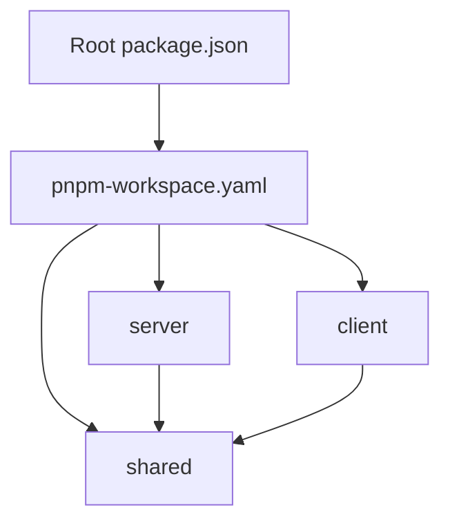
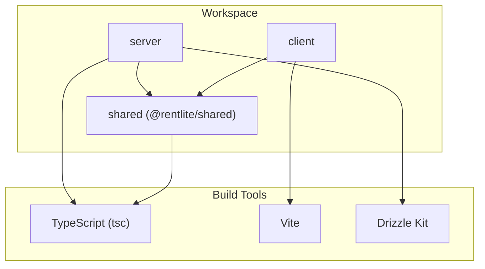
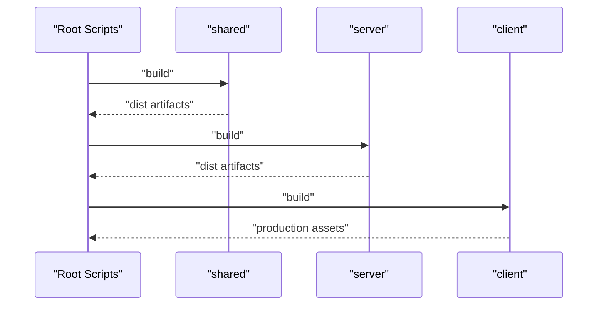

# Build Process & Workspaces

<cite>
**Referenced Files in This Document**
- [package.json](file://package.json)
- [pnpm-workspace.yaml](file://pnpm-workspace.yaml)
- [client/package.json](file://client/package.json)
- [server/package.json](file://server/package.json)
- [shared/package.json](file://shared/package.json)
- [tsconfig.json](file://tsconfig.json)
- [client/tsconfig.json](file://client/tsconfig.json)
- [server/tsconfig.json](file://server/tsconfig.json)
- [shared/tsconfig.json](file://shared/tsconfig.json)
- [client/vite.config.ts](file://client/vite.config.ts)
- [shared/src/index.ts](file://shared/src/index.ts)
- [shared/src/types.ts](file://shared/src/types.ts)
- [server/drizzle.config.ts](file://server/drizzle.config.ts)
- [docker-compose.yml](file://docker-compose.yml)
- [client/Dockerfile](file://client/Dockerfile)
- [server/Dockerfile](file://server/Dockerfile)
</cite>

## Table of Contents
1. [Introduction](#introduction)
2. [Project Structure](#project-structure)
3. [Core Components](#core-components)
4. [Architecture Overview](#architecture-overview)
5. [Detailed Component Analysis](#detailed-component-analysis)
6. [Dependency Analysis](#dependency-analysis)
7. [Performance Considerations](#performance-considerations)
8. [Troubleshooting Guide](#troubleshooting-guide)
9. [Conclusion](#conclusion)
10. [Appendices](#appendices)

## Introduction
This document explains the build process for the RentLite monorepo using pnpm workspaces. It covers workspace configuration, shared dependencies, cross-package references, TypeScript compilation across client, server, and shared packages, build scripts, dependency resolution, incremental compilation strategies, code generation, optimization techniques, and development workflow integration.

## Project Structure
RentLite is a three-package monorepo:
- shared: Shared TypeScript types and utilities compiled to dist with declarations.
- server: Node.js API built with TypeScript (tsc), Drizzle ORM migrations, and Express routes.
- client: Vite-based React application with Tailwind CSS and proxy to the local server.

**Diagram sources**
- [package.json:6-14](file://package.json#L6-L14)
- [pnpm-workspace.yaml:1-5](file://pnpm-workspace.yaml#L1-L5)

**Section sources**
- [package.json:1-21](file://package.json#L1-L21)
- [pnpm-workspace.yaml:1-5](file://pnpm-workspace.yaml#L1-L5)

## Core Components
- Workspace orchestration: Root scripts run builds and checks across packages using pnpm filters.
- Shared package: Exposes types via index and exports both JS and .d.ts through package exports.
- Server build: TypeScript compilation with project references to shared; Drizzle config for schema/migrations.
- Client build: Vite build pipeline with React and Tailwind plugins and dev proxy to server.

Key responsibilities:
- shared: Centralized domain types used by both client and server.
- server: API endpoints, DB access, auth middleware, email, and Drizzle tooling.
- client: UI pages, components, API client, and Vite dev/build tooling.

**Section sources**
- [shared/package.json:1-22](file://shared/package.json#L1-L22)
- [shared/src/index.ts:1-2](file://shared/src/index.ts#L1-L2)
- [shared/src/types.ts:1-251](file://shared/src/types.ts#L1-L251)
- [server/package.json:1-37](file://server/package.json#L1-L37)
- [server/drizzle.config.ts:1-16](file://server/drizzle.config.ts#L1-L16)
- [client/package.json:1-44](file://client/package.json#L1-L44)
- [client/vite.config.ts:1-24](file://client/vite.config.ts#L1-L24)

## Architecture Overview
The build architecture leverages pnpm workspaces to share dependencies and enable cross-package imports. TypeScript uses project references for incremental builds between server and shared. Vite handles client bundling and serves a dev server that proxies API calls to the local server.

**Diagram sources**
- [pnpm-workspace.yaml:1-5](file://pnpm-workspace.yaml#L1-L5)
- [server/tsconfig.json:1-14](file://server/tsconfig.json#L1-L14)
- [shared/tsconfig.json:1-10](file://shared/tsconfig.json#L1-L10)
- [client/vite.config.ts:1-24](file://client/vite.config.ts#L1-L24)
- [server/drizzle.config.ts:1-16](file://server/drizzle.config.ts#L1-L16)

## Detailed Component Analysis

### Workspace Configuration and Dependency Resolution
- Workspace definition lists shared, server, and client packages.
- Root scripts use pnpm --filter to run commands per package in correct order.
- Cross-package dependency is declared as @rentlite/shared with workspace:* in both client and server.

Implications:
- pnpm hoists and links shared package locally without publishing.
- Changes to shared types are immediately visible to dependents during development.
- Build ordering is enforced by root scripts.

**Section sources**
- [pnpm-workspace.yaml:1-5](file://pnpm-workspace.yaml#L1-L5)
- [package.json:6-14](file://package.json#L6-L14)
- [client/package.json:12-13](file://client/package.json#L12-L13)
- [server/package.json:15-16](file://server/package.json#L15-L16)

### TypeScript Compilation Pipeline
- Root tsconfig sets target, module, strict mode, isolatedModules, declaration, source maps, and moduleResolution.
- shared enables composite for project references and emits declarations.
- server extends root config, sets outDir/rootDir/lib/types, disables its own declarations, and references shared.
- client extends root config, sets outDir/rootDir/lib/jsx/paths/types, and includes src.

Incremental compilation:
- shared is marked composite so tsc can cache and reuse outputs.
- server references shared to benefit from incremental builds and type checking against shared’s declarations.

Outputs:
- shared: dist/index.js and dist/index.d.ts (and map files).
- server: dist/* (JS output for Node runtime).
- client: Vite produces optimized static assets; TS check runs separately.

**Section sources**
- [tsconfig.json:1-17](file://tsconfig.json#L1-L17)
- [shared/tsconfig.json:1-10](file://shared/tsconfig.json#L1-L10)
- [server/tsconfig.json:1-14](file://server/tsconfig.json#L1-L14)
- [client/tsconfig.json:1-16](file://client/tsconfig.json#L1-L16)
- [shared/package.json:6-16](file://shared/package.json#L6-L16)

### Build Scripts and Commands
- Root build: compiles shared first, then server, then client to ensure type availability.
- Root check: runs tsc --noEmit across packages for fast type validation.
- Dev: docker compose up starts all services; individual dev commands available via filter.
- Database: push/studio/seed commands delegated to server package.

Recommended usage:
- Local development: pnpm dev or pnpm dev:client + pnpm dev:server.
- CI/CD: pnpm build && pnpm check before deployment.

**Section sources**
- [package.json:6-14](file://package.json#L6-L14)
- [client/package.json:6-10](file://client/package.json#L6-L10)
- [server/package.json:6-13](file://server/package.json#L6-L13)
- [shared/package.json:14-16](file://shared/package.json#L14-L16)

### Client Build Pipeline (Vite)
- Plugins: React and Tailwind integrated via Vite plugins.
- Alias: @ resolves to src for cleaner imports.
- Dev server: Hosts on 0.0.0.0:5173 and proxies /api to http://localhost:3000.
- Build: Produces optimized production assets.

Integration notes:
- Ensure server is running locally when using Vite dev proxy.
- For containerized builds, Dockerfile installs dependencies and builds shared then client.

**Section sources**
- [client/vite.config.ts:1-24](file://client/vite.config.ts#L1-L24)
- [client/package.json:6-10](file://client/package.json#L6-L10)
- [client/Dockerfile:1-20](file://client/Dockerfile#L1-L20)

### Server Build Pipeline (Node + TypeScript + Drizzle)
- Development: tsx watch runs server with live reload.
- Build: tsc compiles to dist; start command runs node dist/index.js.
- Database: drizzle-kit push/studio/seed configured via server scripts and drizzle.config.ts.
- Environment: Drizzle reads DATABASE_URL from root .env.

Production note:
- Dockerfile builds shared and server, then exposes port 3000 and runs compiled entry.

**Section sources**
- [server/package.json:6-13](file://server/package.json#L6-L13)
- [server/drizzle.config.ts:1-16](file://server/drizzle.config.ts#L1-L16)
- [server/Dockerfile:1-21](file://server/Dockerfile#L1-L21)

### Shared Package and Types Management
- Exports: index re-exports types; package.json defines main and types entries and explicit exports for modern bundlers.
- Types: Comprehensive domain models for properties, tenants, leases, payments, maintenance, expenses, vendors, notifications, subscriptions, reports, and API responses.

Best practices:
- Keep shared types minimal and stable; version changes propagate via workspace link.
- Use strict typing in consumers to catch mismatches early.

**Section sources**
- [shared/src/index.ts:1-2](file://shared/src/index.ts#L1-L2)
- [shared/src/types.ts:1-251](file://shared/src/types.ts#L1-L251)
- [shared/package.json:1-22](file://shared/package.json#L1-L22)

### Containerized Builds
- Both Dockerfiles install dependencies with pnpm, copy only necessary package manifests first for caching, then source, then build shared and respective package.
- docker-compose orchestrates Postgres, server, and client services with environment variables and volumes.

Operational tips:
- Use pnpm dev to spin up all services via docker-compose.
- Persist database data and uploads via named volumes.

**Section sources**
- [client/Dockerfile:1-20](file://client/Dockerfile#L1-L20)
- [server/Dockerfile:1-21](file://server/Dockerfile#L1-L21)
- [docker-compose.yml:1-64](file://docker-compose.yml#L1-L64)

## Dependency Analysis
Cross-package relationships and build order:

**Diagram sources**
- [package.json:10-11](file://package.json#L10-L11)
- [shared/package.json:14-16](file://shared/package.json#L14-L16)
- [server/package.json:7-9](file://server/package.json#L7-L9)
- [client/package.json:7-9](file://client/package.json#L7-L9)

Coupling:
- server depends on @rentlite/shared for types.
- client depends on @rentlite/shared for types.
- No circular dependencies observed; shared is a leaf package.

External integrations:
- Drizzle Kit for schema management.
- Vite for client bundling and dev server.
- Docker Compose for service orchestration.

**Section sources**
- [pnpm-workspace.yaml:1-5](file://pnpm-workspace.yaml#L1-L5)
- [client/package.json:12-13](file://client/package.json#L12-L13)
- [server/package.json:15-16](file://server/package.json#L15-L16)
- [server/drizzle.config.ts:1-16](file://server/drizzle.config.ts#L1-L16)
- [client/vite.config.ts:1-24](file://client/vite.config.ts#L1-L24)

## Performance Considerations
- Incremental builds:
  - Use shared composite to leverage tsc cache and avoid recompiling unchanged code.
  - Prefer pnpm check for fast type validation during development.
- Dependency installation:
  - Leverage pnpm lockfile and workspace linking to minimize reinstall overhead.
- Vite optimizations:
  - Use HMR for rapid feedback; keep aliases consistent to reduce resolve time.
- Docker layer caching:
  - Copy package manifests before source to maximize cache hits during image builds.
- Large-scale tuning:
  - Consider enabling parallel tasks where safe (e.g., separate CI jobs for each package).
  - Monitor disk I/O and consider SSD-backed caches for faster TS builds.

[No sources needed since this section provides general guidance]

## Troubleshooting Guide
Common issues and resolutions:
- Missing shared types:
  - Ensure shared is built before server/client. Run root build or build shared explicitly.
- Module resolution errors:
  - Verify workspace:* reference and that pnpm installed correctly; clean and reinstall if needed.
- Vite dev proxy not reaching server:
  - Confirm server is running on localhost:3000; adjust proxy target if ports differ.
- Drizzle migration failures:
  - Check DATABASE_URL in root .env; ensure Postgres is reachable and credentials match.
- Docker build cache misses:
  - Ensure pnpm-lock.yaml is present; avoid unnecessary context changes to preserve layers.

Validation steps:
- Run pnpm check to validate types across packages.
- Run pnpm build to produce outputs and verify no compile-time errors.
- Use docker-compose logs to inspect service startup issues.

**Section sources**
- [package.json:6-14](file://package.json#L6-L14)
- [client/vite.config.ts:13-21](file://client/vite.config.ts#L13-L21)
- [server/drizzle.config.ts:5-15](file://server/drizzle.config.ts#L5-L15)
- [docker-compose.yml:20-46](file://docker-compose.yml#L20-L46)

## Conclusion
RentLite’s monorepo uses pnpm workspaces to centralize shared types and streamline builds across client, server, and shared packages. TypeScript project references and composite builds enable efficient incremental compilation. Vite provides a fast developer experience with hot reloading and a proxy to the local server. Drizzle simplifies database schema management. Following the recommended scripts and configurations ensures reliable builds, predictable dependency resolution, and scalable performance for large teams.

[No sources needed since this section summarizes without analyzing specific files]

## Appendices

### Build Command Reference
- pnpm build: Builds shared, server, then client.
- pnpm check: Type-checks all packages without emitting outputs.
- pnpm dev: Starts all services via docker-compose.
- pnpm dev:client and pnpm dev:server: Start individual services.
- pnpm db:push, db:studio, db:seed: Manage database schema and seed data.

**Section sources**
- [package.json:6-14](file://package.json#L6-L14)

### Custom Build Tasks Examples
- Add a lint step: Extend root scripts to run ESLint across packages before build.
- Generate API clients: Integrate an OpenAPI generator in server or client scripts to generate typed fetchers based on server routes.
- Pre-commit hooks: Run pnpm check and package-specific tests before commits.

[No sources needed since this section provides general guidance]