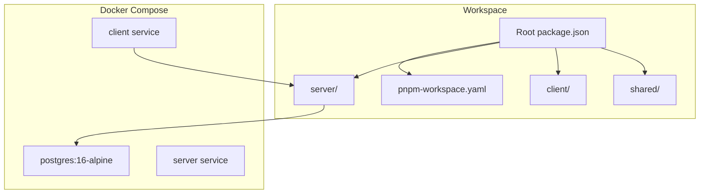
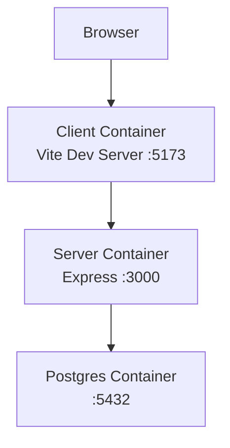
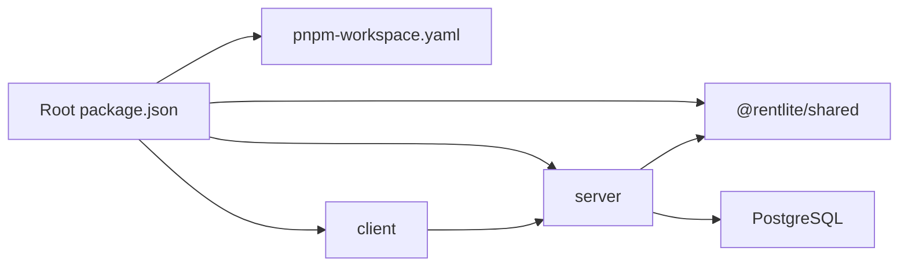

# Deployment & DevOps

<cite>
**Referenced Files in This Document**
- [docker-compose.yml](file://docker-compose.yml)
- [server/Dockerfile](file://server/Dockerfile)
- [client/Dockerfile](file://client/Dockerfile)
- [package.json](file://package.json)
- [pnpm-workspace.yaml](file://pnpm-workspace.yaml)
- [server/package.json](file://server/package.json)
- [client/package.json](file://client/package.json)
- [shared/package.json](file://shared/package.json)
- [server/src/index.ts](file://server/src/index.ts)
- [server/src/db/index.ts](file://server/src/db/index.ts)
- [server/drizzle.config.ts](file://server/drizzle.config.ts)
- [server/tsconfig.json](file://server/tsconfig.json)
- [client/tsconfig.json](file://client/tsconfig.json)
- [shared/tsconfig.json](file://shared/tsconfig.json)
</cite>

## Table of Contents
1. Introduction
2. Project Structure
3. Core Components
4. Architecture Overview
5. Detailed Component Analysis
6. Dependency Analysis
7. Performance Considerations
8. Troubleshooting Guide
9. Conclusion
10. Appendices

## Introduction
This document provides comprehensive deployment and DevOps guidance for the RentLite application. It covers containerization with Docker, multi-stage build strategies, docker-compose orchestration for local development and staging, pnpm workspaces and TypeScript compilation, environment configuration across stages, CI/CD pipeline setup, monitoring and logging, scaling and load balancing, database backup procedures, security hardening, troubleshooting, and performance optimization.

## Project Structure
RentLite is a monorepo using pnpm workspaces with three packages: shared (types), server (Express API), and client (Vite React app). The root orchestrates builds and dev scripts, while each package defines its own build and type-checking commands. Dockerfiles are provided for both server and client to enable containerized builds and runs. A docker-compose file defines Postgres, server, and client services for local development.

**Diagram sources**
- [docker-compose.yml:1-64](file://docker-compose.yml#L1-L64)
- [package.json:1-21](file://package.json#L1-L21)
- [pnpm-workspace.yaml:1-5](file://pnpm-workspace.yaml#L1-L5)

**Section sources**
- [package.json:1-21](file://package.json#L1-L21)
- [pnpm-workspace.yaml:1-5](file://pnpm-workspace.yaml#L1-L5)
- [docker-compose.yml:1-64](file://docker-compose.yml#L1-L64)

## Core Components
- Server: Express-based API with authentication routes and resource routers; uses Drizzle ORM with PostgreSQL; exposes a health endpoint.
- Client: Vite-based React SPA served during development; built assets can be served by a static server in production.
- Shared: TypeScript types and utilities consumed by both server and client.
- Infrastructure: Postgres managed via docker-compose; volumes persist data and uploads.

Key responsibilities:
- Build pipeline: pnpm workspaces compile shared first, then server and client.
- Runtime: Server reads environment variables for DB, auth, CORS, and integrations; client points to API URL at runtime.

**Section sources**
- [server/src/index.ts:1-59](file://server/src/index.ts#L1-L59)
- [server/src/db/index.ts:1-11](file://server/src/db/index.ts#L1-L11)
- [server/drizzle.config.ts:1-12](file://server/drizzle.config.ts#L1-L12)
- [server/package.json:1-37](file://server/package.json#L1-L37)
- [client/package.json:1-44](file://client/package.json#L1-L44)
- [shared/package.json:1-22](file://shared/package.json#L1-L22)

## Architecture Overview
The application runs as three containers orchestrated by docker-compose:
- Postgres: persistent relational store with health checks.
- Server: Node.js Express API bound to port 3000, depending on healthy Postgres.
- Client: Vite dev server bound to port 5173 in development; depends on server availability.

**Diagram sources**
- [docker-compose.yml:1-64](file://docker-compose.yml#L1-L64)
- [server/src/index.ts:1-59](file://server/src/index.ts#L1-L59)

## Detailed Component Analysis

### Docker Containerization Strategy
- Base image: node:22-alpine with corepack enabling pnpm.
- Workspace-aware installs: Copy workspace files and package manifests first, install dependencies, then copy source code to leverage layer caching.
- Build order: Compile shared package before building server or client to ensure types and exports are available.
- Entrypoints:
  - Server: Runs compiled output node server/dist/index.js.
  - Client: Runs pnpm dev for development workflow.

Production optimization recommendations:
- Use multi-stage builds: one stage for building artifacts and a minimal runtime stage for serving.
- For the client, serve built assets with a lightweight static server (e.g., nginx or node static server) instead of running Vite dev server in production.
- For the server, run only the compiled dist directory and exclude dev tooling from the final image.

**Section sources**
- [server/Dockerfile:1-21](file://server/Dockerfile#L1-L21)
- [client/Dockerfile:1-20](file://client/Dockerfile#L1-L20)
- [server/package.json:1-37](file://server/package.json#L1-L37)
- [client/package.json:1-44](file://client/package.json#L1-L44)

### docker-compose Configuration
- Services:
  - postgres: Postgres 16 Alpine with health check and persistent volume.
  - server: Builds from server/Dockerfile, depends on healthy Postgres, maps port 3000, mounts uploads volume.
  - client: Builds from client/Dockerfile, depends on server, maps port 5173.
- Environment variables:
  - DATABASE_URL, BETTER_AUTH_* secrets, CLIENT_URL, RESEND_API_KEY, TWILIO_*, PLAID_*, UPLOAD_DIR, PORT.
- Volumes: pgdata for Postgres persistence, uploads for server uploads.

Local vs staging:
- Local: Uses default values and localhost URLs.
- Staging/Production: Override environment variables via compose overrides or external secret management; adjust CLIENT_URL and CORS accordingly.

**Section sources**
- [docker-compose.yml:1-64](file://docker-compose.yml#L1-L64)

### Build Process with pnpm Workspaces and TypeScript
- Root scripts:
  - build: Compiles shared, then server, then client.
  - check: Type-checks all packages.
  - db:*: Drizzle operations for schema push, studio, and seed.
- Package scripts:
  - shared: tsc build.
  - server: tsc build; tsx watch for dev; drizzle-kit commands.
  - client: vite build; vite dev with host binding.
- TypeScript references:
  - server references shared for types.
  - Each package has its own tsconfig extending a common base.

Build flow:
1. Install dependencies with pnpm (workspace-aware).
2. Build shared to produce types and JS.
3. Build server and client independently, leveraging cached layers.

**Section sources**
- [package.json:1-21](file://package.json#L1-L21)
- [server/package.json:1-37](file://server/package.json#L1-L37)
- [client/package.json:1-44](file://client/package.json#L1-L44)
- [shared/package.json:1-22](file://shared/package.json#L1-L22)
- [server/tsconfig.json:1-14](file://server/tsconfig.json#L1-L14)
- [client/tsconfig.json:1-16](file://client/tsconfig.json#L1-L16)
- [shared/tsconfig.json:1-10](file://shared/tsconfig.json#L1-L10)

### Environment Configuration Management
- Server runtime reads:
  - DATABASE_URL for Postgres connection.
  - BETTER_AUTH_SECRET and BETTER_AUTH_URL for authentication.
  - CLIENT_URL for CORS origin.
  - RESEND_API_KEY for email.
  - TWILIO_SID, TWILIO_AUTH_TOKEN, TWILIO_PHONE for SMS.
  - PLAID_CLIENT_ID, PLAID_SECRET, PLAID_ENV for banking integration.
  - UPLOAD_DIR for file storage path.
  - PORT for listening port.
- Client runtime reads:
  - VITE_API_URL to point to backend API.

Best practices:
- Use environment files per stage (.env.development, .env.staging, .env.production) and inject them into compose via env_file or override files.
- Store secrets in a secure vault or platform secret manager; avoid committing secrets to version control.
- Validate required variables at startup and fail fast if missing.

**Section sources**
- [docker-compose.yml:20-46](file://docker-compose.yml#L20-L46)
- [server/src/index.ts:16-27](file://server/src/index.ts#L16-L27)
- [server/src/db/index.ts:1-11](file://server/src/db/index.ts#L1-L11)
- [server/drizzle.config.ts:1-12](file://server/drizzle.config.ts#L1-L12)

### CI/CD Pipeline Setup
Recommended pipeline stages:
- Lint and type-check:
  - Run pnpm check across all packages.
- Test:
  - Execute unit and integration tests for server and client (add test scripts as needed).
- Build:
  - Run pnpm build to compile shared, server, and client.
- Containerize:
  - Build images using Dockerfiles; consider multi-stage builds for smaller images.
- Push images:
  - Tag with branch and commit SHA; push to container registry.
- Deploy:
  - Update staging with latest image tag; promote to production after validation.
- Notify:
  - Send notifications on success/failure.

Integration points:
- Use environment-specific compose overrides or platform-native deployments (Kubernetes, ECS, etc.).
- Ensure DATABASE_URL and secrets are injected securely at deploy time.

[No sources needed since this section provides general guidance]

### Monitoring and Logging Strategies
- Health checks:
  - Expose /api/health for readiness/liveness probes.
- Structured logs:
  - Add structured logging middleware in the server to emit JSON logs with request IDs and timestamps.
- Metrics:
  - Introduce metrics collection (e.g., Prometheus) for request rates, latency, and error rates.
- Centralized logging:
  - Ship logs to a log aggregation service (e.g., CloudWatch, Datadog, ELK).
- Alerting:
  - Set alerts for high error rates, slow endpoints, and unhealthy services.

**Section sources**
- [server/src/index.ts:46-50](file://server/src/index.ts#L46-L50)

### Scaling, Load Balancing, and Database Backup
- Horizontal scaling:
  - Run multiple server replicas behind a load balancer (NGINX, cloud LB).
  - Stateless design: keep session state externalized if needed; rely on cookies and secure headers.
- Vertical scaling:
  - Increase CPU/memory for server and database instances based on load.
- Load balancing:
  - Configure health checks and routing rules to distribute traffic evenly.
- Database backups:
  - Schedule automated backups of Postgres volume or use managed database snapshots.
  - Retain multiple generations and test restore procedures regularly.

[No sources needed since this section provides general guidance]

### Security Hardening Practices
- Secrets management:
  - Never hardcode secrets; use environment variables or secret managers.
- CORS:
  - Restrict CLIENT_URL to trusted origins; disable wildcard origins in production.
- Input validation:
  - Validate payloads with Zod where applicable.
- Headers:
  - Enforce HTTPS, HSTS, and other security headers via reverse proxy.
- Least privilege:
  - Run containers as non-root users; restrict filesystem permissions.
- Dependencies:
  - Regularly update dependencies and scan for vulnerabilities.

**Section sources**
- [server/src/index.ts:19-27](file://server/src/index.ts#L19-L27)
- [docker-compose.yml:20-46](file://docker-compose.yml#L20-L46)

### Troubleshooting Guide
Common issues and resolutions:
- Database connection failures:
  - Verify DATABASE_URL format and network reachability; ensure Postgres is healthy before server starts.
- CORS errors:
  - Confirm CLIENT_URL matches the actual frontend origin; ensure credentials are allowed when using cookies.
- Port conflicts:
  - Adjust mapped ports in docker-compose if host ports are already in use.
- Missing environment variables:
  - Ensure all required variables are set; validate at startup and surface clear errors.
- Uploads not persisted:
  - Check that the uploads volume is mounted and writable by the server process.

**Section sources**
- [docker-compose.yml:1-64](file://docker-compose.yml#L1-L64)
- [server/src/index.ts:16-27](file://server/src/index.ts#L16-L27)
- [server/src/db/index.ts:1-11](file://server/src/db/index.ts#L1-L11)

## Dependency Analysis
The build and runtime dependencies form a clear hierarchy:
- Root orchestrates workspace builds and scripts.
- Server depends on shared types and Postgres via Drizzle.
- Client depends on shared types and communicates with server over HTTP.

**Diagram sources**
- [package.json:1-21](file://package.json#L1-L21)
- [pnpm-workspace.yaml:1-5](file://pnpm-workspace.yaml#L1-L5)
- [server/package.json:1-37](file://server/package.json#L1-L37)
- [client/package.json:1-44](file://client/package.json#L1-L44)
- [shared/package.json:1-22](file://shared/package.json#L1-L22)

**Section sources**
- [package.json:1-21](file://package.json#L1-L21)
- [pnpm-workspace.yaml:1-5](file://pnpm-workspace.yaml#L1-L5)
- [server/package.json:1-37](file://server/package.json#L1-L37)
- [client/package.json:1-44](file://client/package.json#L1-L44)
- [shared/package.json:1-22](file://shared/package.json#L1-L22)

## Performance Considerations
- Build optimizations:
  - Leverage pnpm workspace caching and Docker layer caching by copying manifests first.
  - Use multi-stage builds to minimize final image size.
- Runtime optimizations:
  - Tune Express payload limits and timeouts appropriately.
  - Enable compression via reverse proxy.
  - Cache static assets with appropriate cache headers.
- Database:
  - Index frequently queried columns; monitor query performance.
  - Use connection pooling settings suitable for workload.
- Frontend:
  - Minimize bundle size; lazy-load routes and heavy components.
  - Use efficient data fetching with TanStack Query options configured in the client.

**Section sources**
- [server/Dockerfile:1-21](file://server/Dockerfile#L1-L21)
- [client/Dockerfile:1-20](file://client/Dockerfile#L1-L20)
- [server/src/index.ts:21-27](file://server/src/index.ts#L21-L27)
- [client/src/main.tsx:9-17](file://client/src/main.tsx#L9-L17)

## Troubleshooting Guide
- Service startup order:
  - Ensure Postgres is healthy before starting the server; docker-compose depends_on with condition service_healthy enforces this.
- Environment misconfiguration:
  - Validate required variables; add startup checks to fail fast with descriptive messages.
- Network issues:
  - Confirm container networking and port mappings; verify firewall rules and DNS resolution within the compose network.
- Logs and debugging:
  - Inspect container logs for stack traces; enable verbose logging during investigations.
- Data integrity:
  - Verify migrations and seeds; use Drizzle Studio to inspect schema and data.

**Section sources**
- [docker-compose.yml:14-28](file://docker-compose.yml#L14-L28)
- [server/drizzle.config.ts:1-12](file://server/drizzle.config.ts#L1-L12)

## Conclusion
RentLite’s monorepo structure, pnpm workspaces, and Dockerized services provide a solid foundation for scalable and maintainable deployments. By adopting multi-stage builds, robust environment management, CI/CD automation, and strong security practices, you can confidently operate RentLite in production environments. Continuous monitoring, logging, and regular backups will ensure reliability and resilience.

## Appendices

### Environment Variables Reference
- DATABASE_URL: PostgreSQL connection string used by Drizzle ORM.
- BETTER_AUTH_SECRET: Secret key for authentication.
- BETTER_AUTH_URL: Base URL for authentication flows.
- CLIENT_URL: Allowed CORS origin for the frontend.
- RESEND_API_KEY: Email provider API key.
- TWILIO_SID, TWILIO_AUTH_TOKEN, TWILIO_PHONE: SMS integration credentials.
- PLAID_CLIENT_ID, PLAID_SECRET, PLAID_ENV: Banking integration settings.
- UPLOAD_DIR: Path for uploaded files inside the server container.
- PORT: Server listening port.
- VITE_API_URL: Client-side API base URL.

**Section sources**
- [docker-compose.yml:20-46](file://docker-compose.yml#L20-L46)
- [server/src/index.ts:16-27](file://server/src/index.ts#L16-L27)
- [server/src/db/index.ts:1-11](file://server/src/db/index.ts#L1-L11)

### Build and Run Commands
- Local development:
  - docker compose up to start Postgres, server, and client.
- Building artifacts:
  - pnpm build to compile shared, server, and client.
- Type checking:
  - pnpm check to validate TypeScript across packages.
- Database operations:
  - pnpm db:push to apply schema changes.
  - pnpm db:studio to open Drizzle Studio.
  - pnpm db:seed to populate initial data.

**Section sources**
- [package.json:1-21](file://package.json#L1-L21)
- [server/package.json:1-37](file://server/package.json#L1-L37)
- [client/package.json:1-44](file://client/package.json#L1-L44)