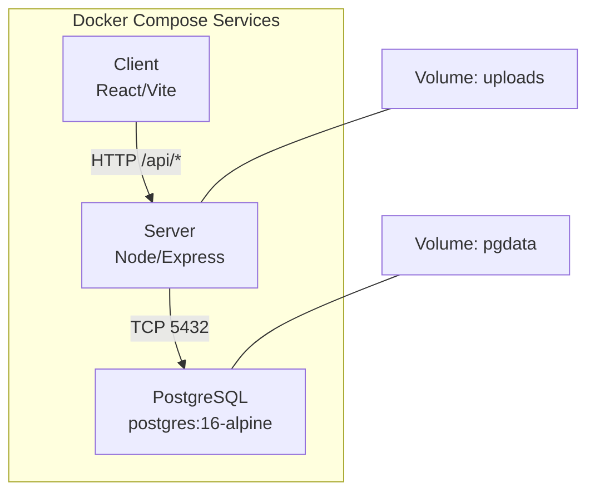
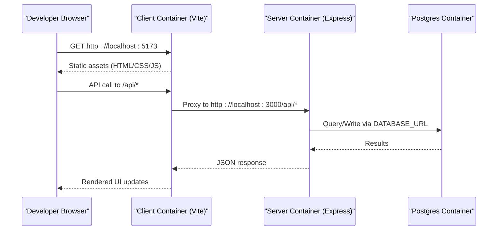
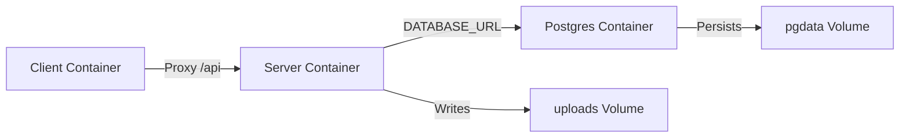

# Docker Containerization

<cite>
**Referenced Files in This Document**
- [docker-compose.yml](file://docker-compose.yml)
- [server/Dockerfile](file://server/Dockerfile)
- [client/Dockerfile](file://client/Dockerfile)
- [server/src/index.ts](file://server/src/index.ts)
- [server/drizzle.config.ts](file://server/drizzle.config.ts)
- [client/vite.config.ts](file://client/vite.config.ts)
- [package.json](file://package.json)
- [server/package.json](file://server/package.json)
- [client/package.json](file://client/package.json)
</cite>

## Table of Contents
1. Introduction
2. Project Structure
3. Core Components
4. Architecture Overview
5. Detailed Component Analysis
6. Dependency Analysis
7. Performance Considerations
8. Troubleshooting Guide
9. Conclusion
10. Appendices

## Introduction
This document explains how the RentLite application is containerized using Docker and docker-compose. It covers the multi-service architecture (PostgreSQL, Express server, React client), Dockerfile configurations for both server and client, networking, volumes, environment variables, health checks, restart policies, service dependencies, building custom images, optimizing image sizes, lifecycle management, and security considerations for secrets and network isolation.

## Project Structure
RentLite is a monorepo with three primary runtime services:
- PostgreSQL database
- Node/Express API server
- React client served by Vite during development

The top-level docker-compose orchestrates these services, while each service has its own Dockerfile to build optimized images. The root package.json provides scripts to run compose and manage workspace packages.

**Diagram sources**
- [docker-compose.yml:1-64](file://docker-compose.yml#L1-L64)

**Section sources**
- [docker-compose.yml:1-64](file://docker-compose.yml#L1-L64)
- [package.json:1-21](file://package.json#L1-L21)

## Core Components
- Database service: Postgres with persistent volume and health check.
- Server service: Express app built from source, exposing port 3000, with environment-driven configuration and upload directory persistence.
- Client service: Vite dev server exposed on port 5173, configured to proxy API calls to the server.

Key responsibilities:
- Service orchestration and dependency ordering via depends_on and health conditions.
- Environment variable injection for DB connection, CORS origin, third-party integrations, and ports.
- Persistent storage for database files and uploaded assets.

**Section sources**
- [docker-compose.yml:1-64](file://docker-compose.yml#L1-L64)
- [server/src/index.ts:21-63](file://server/src/index.ts#L21-L63)
- [client/vite.config.ts:13-23](file://client/vite.config.ts#L13-L23)

## Architecture Overview
The system runs three containers orchestrated by docker-compose:
- postgres: Provides relational data with a named volume for persistence.
- server: Builds and runs the Express API; depends on a healthy Postgres instance.
- client: Builds and runs the Vite dev server; proxies API requests to the server.

**Diagram sources**
- [client/vite.config.ts:13-23](file://client/vite.config.ts#L13-L23)
- [server/src/index.ts:21-63](file://server/src/index.ts#L21-L63)
- [docker-compose.yml:20-46](file://docker-compose.yml#L20-L46)

## Detailed Component Analysis

### PostgreSQL Service
- Image: postgres:16-alpine
- Container name: rentlite-db
- Restart policy: unless-stopped
- Environment: POSTGRES_USER, POSTGRES_PASSWORD, POSTGRES_DB
- Ports: 5432 mapped to host
- Volume: pgdata mounted at /var/lib/postgresql/data
- Health check: pg_isready against the configured user

Operational notes:
- Data persists across container restarts via the pgdata volume.
- Health check ensures dependent services wait until Postgres is ready.

**Section sources**
- [docker-compose.yml:2-18](file://docker-compose.yml#L2-L18)

### Server Service (Express)
- Build context: project root; Dockerfile: server/Dockerfile
- Container name: rentlite-server
- Restart policy: unless-stopped
- Dependencies: waits for postgres to be healthy
- Environment: DATABASE_URL, BETTER_AUTH_SECRET, BETTER_AUTH_URL, CLIENT_URL, RESEND_API_KEY, TWILIO_* keys, PLAID_* keys, UPLOAD_DIR, PORT
- Ports: 3000 mapped to host
- Volume: uploads mounted at /app/uploads

Runtime behavior:
- Reads .env from one level up relative to server/src when running locally; in containers, values are injected via environment variables.
- Exposes REST endpoints under /api/* and a health endpoint at /api/health.
- Uses CORS with an origin derived from CLIENT_URL.

Build process:
- Installs dependencies using pnpm with frozen lockfile fallback.
- Builds shared library first, then server bundle.
- Runs compiled output node server/dist/index.js.

**Section sources**
- [docker-compose.yml:20-46](file://docker-compose.yml#L20-L46)
- [server/Dockerfile:1-21](file://server/Dockerfile#L1-L21)
- [server/src/index.ts:1-63](file://server/src/index.ts#L1-L63)
- [server/drizzle.config.ts:1-16](file://server/drizzle.config.ts#L1-L16)
- [server/package.json:1-37](file://server/package.json#L1-L37)

### Client Service (React + Vite)
- Build context: project root; Dockerfile: client/Dockerfile
- Container name: rentlite-client
- Restart policy: unless-stopped
- Dependencies: server
- Environment: VITE_API_URL
- Ports: 5173 mapped to host

Runtime behavior:
- Runs Vite dev server bound to 0.0.0.0:5173.
- Proxies /api requests to http://localhost:3000 (the server container).

Build process:
- Installs dependencies using pnpm with frozen lockfile fallback.
- Builds shared library first, then client bundle.
- Starts the dev server via pnpm filter.

**Section sources**
- [docker-compose.yml:48-59](file://docker-compose.yml#L48-L59)
- [client/Dockerfile:1-20](file://client/Dockerfile#L1-L20)
- [client/vite.config.ts:13-23](file://client/vite.config.ts#L13-L23)
- [client/package.json:1-44](file://client/package.json#L1-L44)

### Multi-stage Builds and Production Optimization
Current state:
- Both server and client Dockerfiles perform install and build steps within a single stage that also serves the app. This is suitable for development but not optimal for production.

Recommendations:
- Use a two-stage build:
  - Stage 1: Install dependencies and build artifacts.
  - Stage 2: Run only the compiled output with a minimal runtime image.
- For the server, run node dist/index.js in a slim base image without dev tools.
- For the client, serve the static build output with a lightweight HTTP server (e.g., nginx or a small Node server) instead of running the Vite dev server in production.

Benefits:
- Smaller final images.
- Reduced attack surface by excluding dev dependencies and tooling.
- Faster startup times.

[No sources needed since this section provides general guidance]

### Container Networking
- Services communicate over the default Docker network created by docker-compose.
- The client proxies /api to http://localhost:3000 inside the client container, which resolves to the server container’s published port mapping. In production, prefer internal DNS names (e.g., http://server:3000) to avoid relying on host loopback.

Configuration highlights:
- Client proxy target points to localhost:3000 for local development.
- Server exposes port 3000; client exposes 5173.

**Section sources**
- [client/vite.config.ts:13-23](file://client/vite.config.ts#L13-L23)
- [docker-compose.yml:43-59](file://docker-compose.yml#L43-L59)

### Volume Management
- pgdata: Persists Postgres data across container lifecycles.
- uploads: Persists uploaded files written by the server to /app/uploads.

Best practices:
- Back up pgdata regularly.
- Ensure proper file permissions for the uploads volume if running as non-root users.
- Consider externalizing sensitive data to secret stores rather than mounting files into containers.

**Section sources**
- [docker-compose.yml:12-13](file://docker-compose.yml#L12-L13)
- [docker-compose.yml:45-46](file://docker-compose.yml#L45-L46)

### Environment Variables and Configuration
Key variables:
- Postgres: POSTGRES_USER, POSTGRES_PASSWORD, POSTGRES_DB
- Server: DATABASE_URL, BETTER_AUTH_SECRET, BETTER_AUTH_URL, CLIENT_URL, RESEND_API_KEY, TWILIO_SID, TWILIO_AUTH_TOKEN, TWILIO_PHONE, PLAID_CLIENT_ID, PLAID_SECRET, PLAID_ENV, UPLOAD_DIR, PORT
- Client: VITE_API_URL

Notes:
- DATABASE_URL uses the service name postgres for internal resolution.
- CLIENT_URL controls CORS allowed origins on the server.
- Third-party keys (Resend, Twilio, Plaid) should be provided via secure secret management in production.

**Section sources**
- [docker-compose.yml:6-42](file://docker-compose.yml#L6-L42)
- [server/src/index.ts:21-31](file://server/src/index.ts#L21-L31)
- [server/drizzle.config.ts:8-15](file://server/drizzle.config.ts#L8-L15)

### Health Checks and Startup Dependencies
- Postgres health check uses pg_isready to confirm readiness.
- Server depends_on postgres with condition service_healthy to ensure DB availability before starting.
- Client depends_on server to start after the API is available.

Operational impact:
- Prevents race conditions where the server attempts DB connections before Postgres is ready.
- Enables orchestration tools to detect service health.

**Section sources**
- [docker-compose.yml:14-18](file://docker-compose.yml#L14-L18)
- [docker-compose.yml:26-28](file://docker-compose.yml#L26-L28)
- [docker-compose.yml:54-55](file://docker-compose.yml#L54-L55)

### Restart Policies
- All services use restart: unless-stopped to automatically recover from crashes while respecting manual stops.

**Section sources**
- [docker-compose.yml:5](file://docker-compose.yml#L5)
- [docker-compose.yml:25](file://docker-compose.yml#L25)
- [docker-compose.yml:53](file://docker-compose.yml#L53)

### Building Custom Images
- Compose builds images automatically based on the specified Dockerfiles.
- You can prebuild images for faster subsequent starts:
  - docker compose build
- To build specific services:
  - docker compose build server
  - docker compose build client

Workspace usage:
- Root package.json scripts provide convenient commands for building and checking all packages.

**Section sources**
- [docker-compose.yml:21-23](file://docker-compose.yml#L21-L23)
- [docker-compose.yml:49-51](file://docker-compose.yml#L49-L51)
- [package.json:6-14](file://package.json#L6-L14)

### Lifecycle Management
Common operations:
- Start all services: docker compose up
- Start in detached mode: docker compose up -d
- Stop services: docker compose down
- Rebuild and start: docker compose up --build
- View logs: docker compose logs -f <service>
- Exec into a running container: docker compose exec <service> sh

Data persistence:
- Volumes persist across down/up cycles unless explicitly removed with docker compose down -v.

**Section sources**
- [docker-compose.yml:61-63](file://docker-compose.yml#L61-L63)

### Security Considerations
Secrets:
- Avoid hardcoding secrets in docker-compose.yml or Dockerfiles.
- Use environment files (.env) loaded by compose or platform-native secret managers (e.g., Docker secrets, Kubernetes Secrets, cloud provider secret stores).
- Rotate secrets regularly and restrict access to secret stores.

Network isolation:
- Restrict exposure of Postgres to internal networks only in production; do not publish 5432 to the host.
- Use separate networks for frontend and backend tiers if multiple applications share the same host.

Least privilege:
- Run containers as non-root users where possible.
- Minimize image surface area by using slim/base images and multi-stage builds.

CORS and origins:
- Set CLIENT_URL appropriately per environment to limit CORS to trusted origins.

**Section sources**
- [docker-compose.yml:6-42](file://docker-compose.yml#L6-L42)
- [server/src/index.ts:26-31](file://server/src/index.ts#L26-L31)

## Dependency Analysis
Service dependencies and data flow:
- Client proxies API calls to the server.
- Server connects to Postgres using DATABASE_URL.
- Uploads are persisted to a dedicated volume.

**Diagram sources**
- [client/vite.config.ts:13-23](file://client/vite.config.ts#L13-L23)
- [server/drizzle.config.ts:8-15](file://server/drizzle.config.ts#L8-L15)
- [docker-compose.yml:12-13](file://docker-compose.yml#L12-L13)
- [docker-compose.yml:45-46](file://docker-compose.yml#L45-L46)

**Section sources**
- [docker-compose.yml:20-59](file://docker-compose.yml#L20-L59)

## Performance Considerations
- Use multi-stage builds to reduce image size and startup time.
- Pin base images and lockfiles to ensure reproducible builds.
- Prefer internal service names over localhost for inter-container communication in production.
- Cache layers by copying package manifests first and installing dependencies before copying source code.
- Limit request payload sizes appropriately; the server configures a JSON body size limit.

[No sources needed since this section provides general guidance]

## Troubleshooting Guide
Common issues and resolutions:
- Postgres not ready:
  - Verify health check passes and server depends_on condition is met.
  - Check credentials and DATABASE_URL format.
- CORS errors:
  - Ensure CLIENT_URL matches the client’s origin and is set correctly in the server environment.
- API proxy not working:
  - Confirm client proxy target points to the correct server address and port.
- Uploads missing after restart:
  - Ensure uploads volume is attached and not removed.
- Port conflicts:
  - Change host port mappings if 3000 or 5173 are already in use.

Useful commands:
- docker compose logs -f
- docker compose ps
- docker compose exec <service> sh
- docker compose down -v (to reset persistent volumes)

**Section sources**
- [docker-compose.yml:14-18](file://docker-compose.yml#L14-L18)
- [docker-compose.yml:26-28](file://docker-compose.yml#L26-L28)
- [client/vite.config.ts:13-23](file://client/vite.config.ts#L13-L23)
- [server/src/index.ts:26-31](file://server/src/index.ts#L26-L31)

## Conclusion
RentLite’s containerization leverages docker-compose to orchestrate Postgres, an Express API server, and a React client. The current Dockerfiles support development workflows; adopting multi-stage builds will optimize production images. Proper use of environment variables, volumes, health checks, and restart policies ensures reliability and data persistence. For production, tighten security by managing secrets securely, isolating networks, and minimizing image footprints.

## Appendices

### Quick Reference: Environment Variables
- Postgres:
  - POSTGRES_USER
  - POSTGRES_PASSWORD
  - POSTGRES_DB
- Server:
  - DATABASE_URL
  - BETTER_AUTH_SECRET
  - BETTER_AUTH_URL
  - CLIENT_URL
  - RESEND_API_KEY
  - TWILIO_SID
  - TWILIO_AUTH_TOKEN
  - TWILIO_PHONE
  - PLAID_CLIENT_ID
  - PLAID_SECRET
  - PLAID_ENV
  - UPLOAD_DIR
  - PORT
- Client:
  - VITE_API_URL

**Section sources**
- [docker-compose.yml:6-42](file://docker-compose.yml#L6-L42)