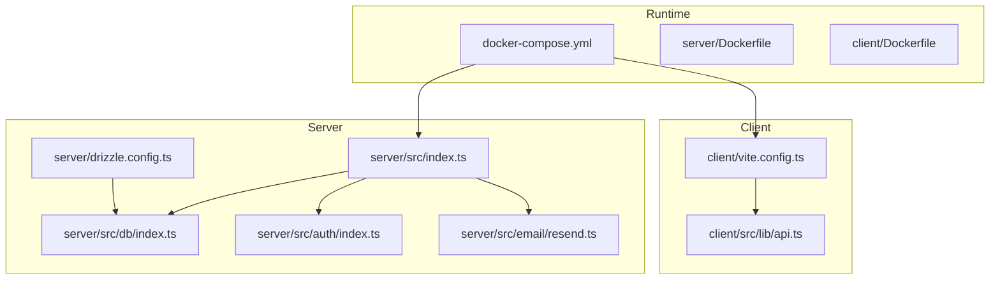
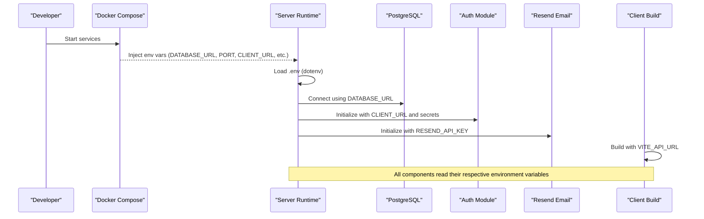
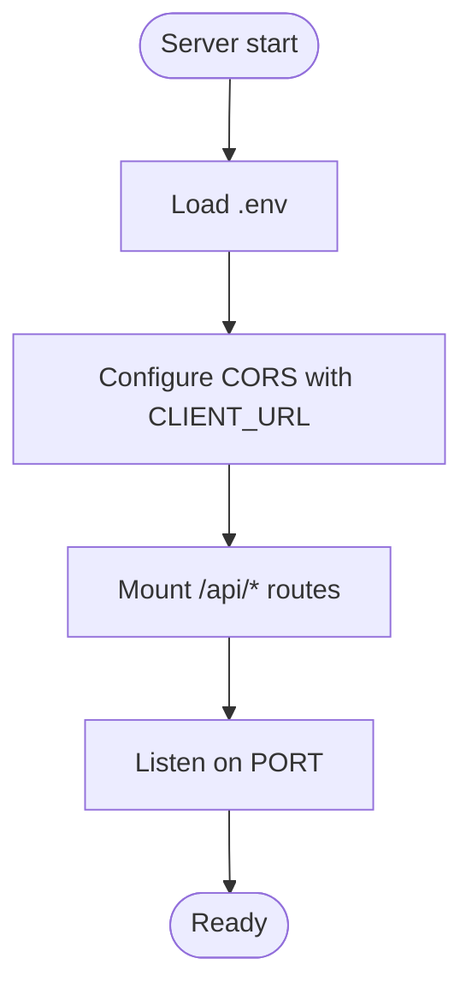
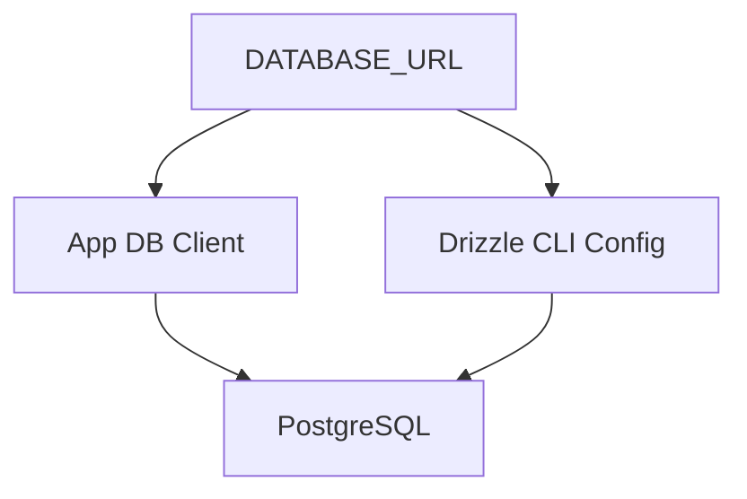
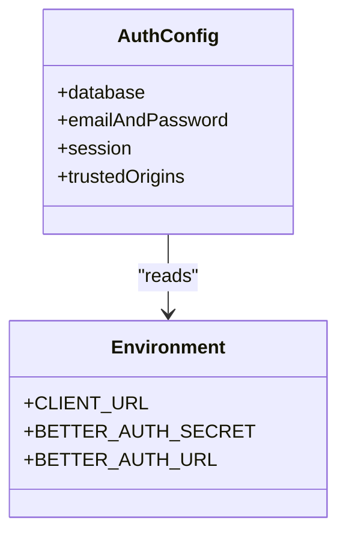
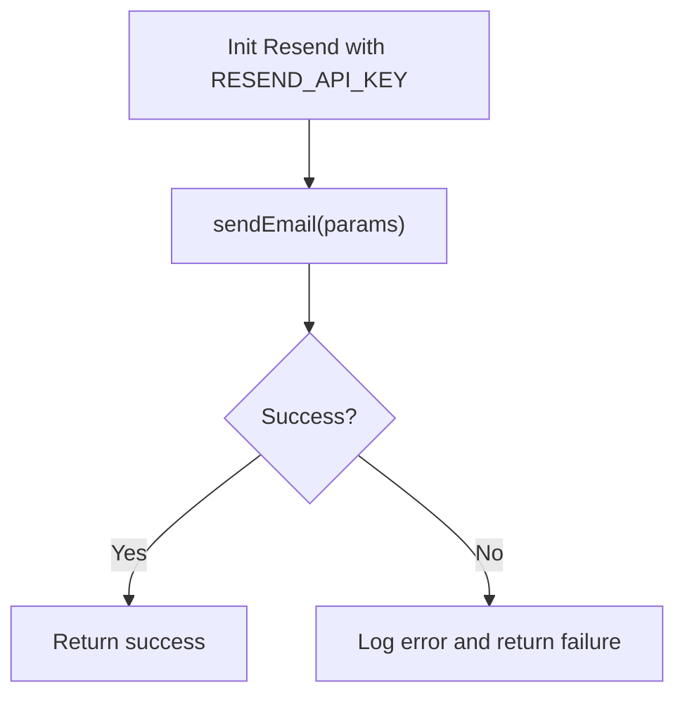
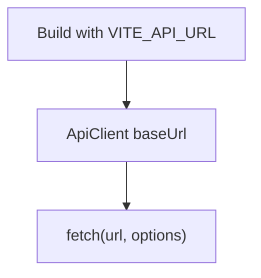
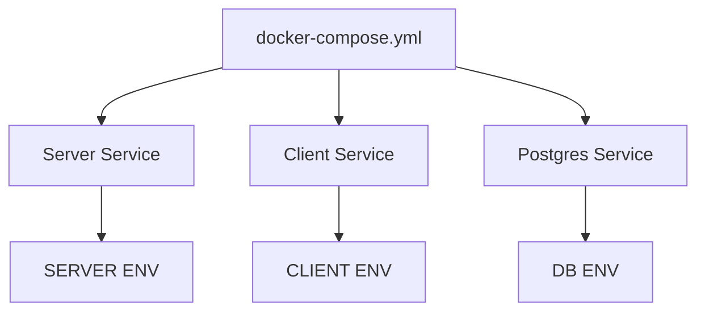
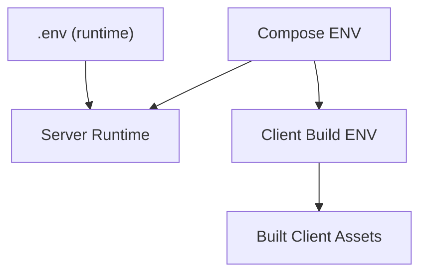
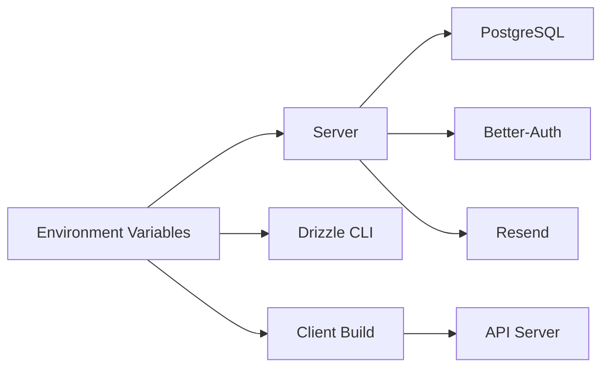

# Environment Configuration

<cite>
**Referenced Files in This Document**
- [server/src/index.ts](file://server/src/index.ts)
- [server/drizzle.config.ts](file://server/drizzle.config.ts)
- [server/src/db/index.ts](file://server/src/db/index.ts)
- [server/src/auth/index.ts](file://server/src/auth/index.ts)
- [server/src/email/resend.ts](file://server/src/email/resend.ts)
- [client/vite.config.ts](file://client/vite.config.ts)
- [client/src/lib/api.ts](file://client/src/lib/api.ts)
- [docker-compose.yml](file://docker-compose.yml)
- [server/Dockerfile](file://server/Dockerfile)
- [client/Dockerfile](file://client/Dockerfile)
</cite>

## Table of Contents
1. Introduction
2. Project Structure
3. Core Components
4. Architecture Overview
5. Detailed Component Analysis
6. Dependency Analysis
7. Performance Considerations
8. Troubleshooting Guide
9. Conclusion

## Introduction
This document explains how RentLite manages environment configuration across development, staging, and production. It covers where and how environment variables are loaded, the structure for database connections, authentication secrets, external service integrations (Resend, Twilio, Stripe/Plaid), and API endpoints. It also provides guidance on environment-specific settings, validation, secure secret handling, deployment targets, file organization, variable precedence, and troubleshooting common issues.

## Project Structure
RentLite uses a monorepo with separate client and server packages. Environment configuration is primarily handled via:
- A root .env file consumed by the server at startup
- Docker Compose environment definitions for local containerized runs
- Vite build-time variables for the client
- Drizzle CLI configuration for migrations and schema tooling

**Diagram sources**
- [server/src/index.ts:1-64](file://server/src/index.ts#L1-L64)
- [server/src/db/index.ts:1-11](file://server/src/db/index.ts#L1-L11)
- [server/src/auth/index.ts:1-23](file://server/src/auth/index.ts#L1-L23)
- [server/src/email/resend.ts:1-113](file://server/src/email/resend.ts#L1-L113)
- [server/drizzle.config.ts:1-16](file://server/drizzle.config.ts#L1-L16)
- [client/vite.config.ts:1-24](file://client/vite.config.ts#L1-L24)
- [client/src/lib/api.ts:1-82](file://client/src/lib/api.ts#L1-L82)
- [docker-compose.yml:1-64](file://docker-compose.yml#L1-L64)
- [server/Dockerfile:1-21](file://server/Dockerfile#L1-L21)
- [client/Dockerfile:1-20](file://client/Dockerfile#L1-L20)

**Section sources**
- [server/src/index.ts:1-64](file://server/src/index.ts#L1-L64)
- [server/drizzle.config.ts:1-16](file://server/drizzle.config.ts#L1-L16)
- [client/vite.config.ts:1-24](file://client/vite.config.ts#L1-L24)
- [docker-compose.yml:1-64](file://docker-compose.yml#L1-L64)

## Core Components
- Server runtime loads environment variables from a root .env file and exposes CORS origins and ports based on environment variables.
- Database connection is configured via an environment variable and used by both the application and Drizzle CLI.
- Authentication relies on environment-based trusted origins and secrets.
- Email delivery uses an environment-provided API key for Resend.
- Client builds use Vite environment variables to target the correct API base URL.

Key environment variables observed in this codebase:
- DATABASE_URL: PostgreSQL connection string used by the server and Drizzle CLI
- PORT: Server listening port
- CLIENT_URL: Trusted origin for CORS and auth; also used by Drizzle defaults when not overridden
- BETTER_AUTH_SECRET: Secret for session signing and tokens
- BETTER_AUTH_URL: Base URL for auth flows
- RESEND_API_KEY: API key for email delivery via Resend
- TWILIO_SID, TWILIO_AUTH_TOKEN, TWILIO_PHONE: Optional SMS integration credentials
- PLAID_CLIENT_ID, PLAID_SECRET, PLAID_ENV: Banking integration credentials and environment
- UPLOAD_DIR: File upload directory path
- VITE_API_URL: Client-side API base URL injected at build time

**Section sources**
- [server/src/index.ts:21-31](file://server/src/index.ts#L21-L31)
- [server/src/db/index.ts:6-9](file://server/src/db/index.ts#L6-L9)
- [server/drizzle.config.ts:8-14](file://server/drizzle.config.ts#L8-L14)
- [server/src/auth/index.ts:5-20](file://server/src/auth/index.ts#L5-L20)
- [server/src/email/resend.ts:1-4](file://server/src/email/resend.ts#L1-L4)
- [client/src/lib/api.ts:1-2](file://client/src/lib/api.ts#L1-L2)
- [docker-compose.yml:29-42](file://docker-compose.yml#L29-L42)

## Architecture Overview
The following diagram shows how environment variables flow into each component during runtime and build time.

**Diagram sources**
- [server/src/index.ts:1-31](file://server/src/index.ts#L1-L31)
- [server/src/db/index.ts:6-9](file://server/src/db/index.ts#L6-L9)
- [server/src/auth/index.ts:5-20](file://server/src/auth/index.ts#L5-L20)
- [server/src/email/resend.ts:1-4](file://server/src/email/resend.ts#L1-L4)
- [client/src/lib/api.ts:1-2](file://client/src/lib/api.ts#L1-L2)
- [docker-compose.yml:29-42](file://docker-compose.yml#L29-L42)

## Detailed Component Analysis

### Server Environment Loading and Routing
- The server loads environment variables from a root .env file at startup and sets up Express middleware including CORS with a configurable origin.
- The server listens on a configurable port and mounts API routes under /api/* paths.

**Diagram sources**
- [server/src/index.ts:1-31](file://server/src/index.ts#L1-L31)
- [server/src/index.ts:38-61](file://server/src/index.ts#L38-L61)

**Section sources**
- [server/src/index.ts:1-64](file://server/src/index.ts#L1-L64)

### Database Connection and Drizzle CLI
- The application connects to PostgreSQL using DATABASE_URL.
- Drizzle CLI reads the same variable to run migrations and schema tooling.

**Diagram sources**
- [server/src/db/index.ts:6-9](file://server/src/db/index.ts#L6-L9)
- [server/drizzle.config.ts:8-14](file://server/drizzle.config.ts#L8-L14)

**Section sources**
- [server/src/db/index.ts:1-11](file://server/src/db/index.ts#L1-L11)
- [server/drizzle.config.ts:1-16](file://server/drizzle.config.ts#L1-L16)

### Authentication Secrets and Origins
- Better-Auth is initialized with a database adapter and trusted origins derived from CLIENT_URL.
- Session behavior and verification flags are set in code; ensure production enforces stricter policies.

**Diagram sources**
- [server/src/auth/index.ts:5-20](file://server/src/auth/index.ts#L5-L20)

**Section sources**
- [server/src/auth/index.ts:1-23](file://server/src/auth/index.ts#L1-L23)

### Email Integration (Resend)
- The email module initializes with RESEND_API_KEY and provides helper functions to send templated emails.

**Diagram sources**
- [server/src/email/resend.ts:1-30](file://server/src/email/resend.ts#L1-L30)

**Section sources**
- [server/src/email/resend.ts:1-113](file://server/src/email/resend.ts#L1-L113)

### Client API Base URL
- The client resolves its API base URL from a build-time environment variable and uses it for all fetch requests.

**Diagram sources**
- [client/src/lib/api.ts:1-2](file://client/src/lib/api.ts#L1-L2)
- [client/src/lib/api.ts:26-54](file://client/src/lib/api.ts#L26-L54)

**Section sources**
- [client/src/lib/api.ts:1-82](file://client/src/lib/api.ts#L1-L82)

### Docker Compose Environment Injection
- Docker Compose defines environment variables for the server and client services, including database credentials, auth secrets, third-party keys, and ports.

**Diagram sources**
- [docker-compose.yml:1-64](file://docker-compose.yml#L1-L64)

**Section sources**
- [docker-compose.yml:1-64](file://docker-compose.yml#L1-L64)

### Build-Time vs Runtime Variables
- Server and Drizzle CLI load runtime variables from .env or container environment.
- Client uses Vite’s build-time variables to embed the API base URL into the built assets.

**Diagram sources**
- [server/src/index.ts:1-7](file://server/src/index.ts#L1-L7)
- [server/drizzle.config.ts:1-7](file://server/drizzle.config.ts#L1-L7)
- [client/src/lib/api.ts:1-2](file://client/src/lib/api.ts#L1-L2)
- [docker-compose.yml:29-57](file://docker-compose.yml#L29-L57)

**Section sources**
- [server/src/index.ts:1-7](file://server/src/index.ts#L1-L7)
- [server/drizzle.config.ts:1-7](file://server/drizzle.config.ts#L1-L7)
- [client/src/lib/api.ts:1-2](file://client/src/lib/api.ts#L1-L2)
- [docker-compose.yml:29-57](file://docker-compose.yml#L29-L57)

## Dependency Analysis
Environment variables create explicit dependencies between services and configuration:
- Server depends on DATABASE_URL, PORT, CLIENT_URL, and optional third-party keys.
- Drizzle CLI depends on DATABASE_URL.
- Client depends on VITE_API_URL at build time.
- Docker Compose orchestrates environment injection for all services.

**Diagram sources**
- [server/src/index.ts:21-31](file://server/src/index.ts#L21-L31)
- [server/drizzle.config.ts:8-14](file://server/drizzle.config.ts#L8-L14)
- [client/src/lib/api.ts:1-2](file://client/src/lib/api.ts#L1-L2)
- [docker-compose.yml:29-42](file://docker-compose.yml#L29-L42)

**Section sources**
- [server/src/index.ts:21-31](file://server/src/index.ts#L21-L31)
- [server/drizzle.config.ts:8-14](file://server/drizzle.config.ts#L8-L14)
- [client/src/lib/api.ts:1-2](file://client/src/lib/api.ts#L1-L2)
- [docker-compose.yml:29-42](file://docker-compose.yml#L29-L42)

## Performance Considerations
- Keep DATABASE_URL minimal and avoid embedding secrets in logs.
- Use appropriate CORS origins to reduce unnecessary preflight requests.
- Ensure uploads directory exists and has sufficient permissions to avoid I/O errors.
- For high traffic, consider connection pooling parameters in your database client if added later.

[No sources needed since this section provides general guidance]

## Troubleshooting Guide
Common configuration issues and resolutions:

- Cannot connect to database
  - Verify DATABASE_URL is set correctly in the server environment and Drizzle CLI context.
  - Confirm Postgres service is healthy and reachable from the server container.

- CORS errors from client
  - Ensure CLIENT_URL matches the actual client origin and is included in trusted origins.
  - Check that the server’s CORS origin matches the client’s request origin.

- Authentication failures or session issues
  - Set a strong BETTER_AUTH_SECRET per environment.
  - Ensure BETTER_AUTH_URL points to the correct server base URL.

- Emails not sending
  - Provide a valid RESEND_API_KEY for the environment.
  - Inspect logs for error messages from the email module.

- Client cannot reach API
  - Confirm VITE_API_URL is set during build and points to the correct server endpoint.
  - If using Docker Compose, ensure the client proxy or base URL matches the server host/port.

- Port conflicts
  - Adjust PORT on the server and client dev server to avoid collisions.

- Uploads directory missing
  - Ensure UPLOAD_DIR is created and writable by the server process.

**Section sources**
- [server/src/db/index.ts:6-9](file://server/src/db/index.ts#L6-L9)
- [server/drizzle.config.ts:8-14](file://server/drizzle.config.ts#L8-L14)
- [server/src/index.ts:21-31](file://server/src/index.ts#L21-L31)
- [server/src/auth/index.ts:5-20](file://server/src/auth/index.ts#L5-L20)
- [server/src/email/resend.ts:1-30](file://server/src/email/resend.ts#L1-L30)
- [client/src/lib/api.ts:1-2](file://client/src/lib/api.ts#L1-L2)
- [docker-compose.yml:29-42](file://docker-compose.yml#L29-L42)

## Conclusion
RentLite centralizes environment configuration through a root .env file for server runtime, Docker Compose for containerized environments, and Vite build-time variables for the client. By consistently using environment variables for database connections, authentication secrets, and third-party integrations, the application supports safe and predictable deployments across development, staging, and production. Follow the security practices outlined here to protect sensitive data and ensure reliable operation.

[No sources needed since this section summarizes without analyzing specific files]