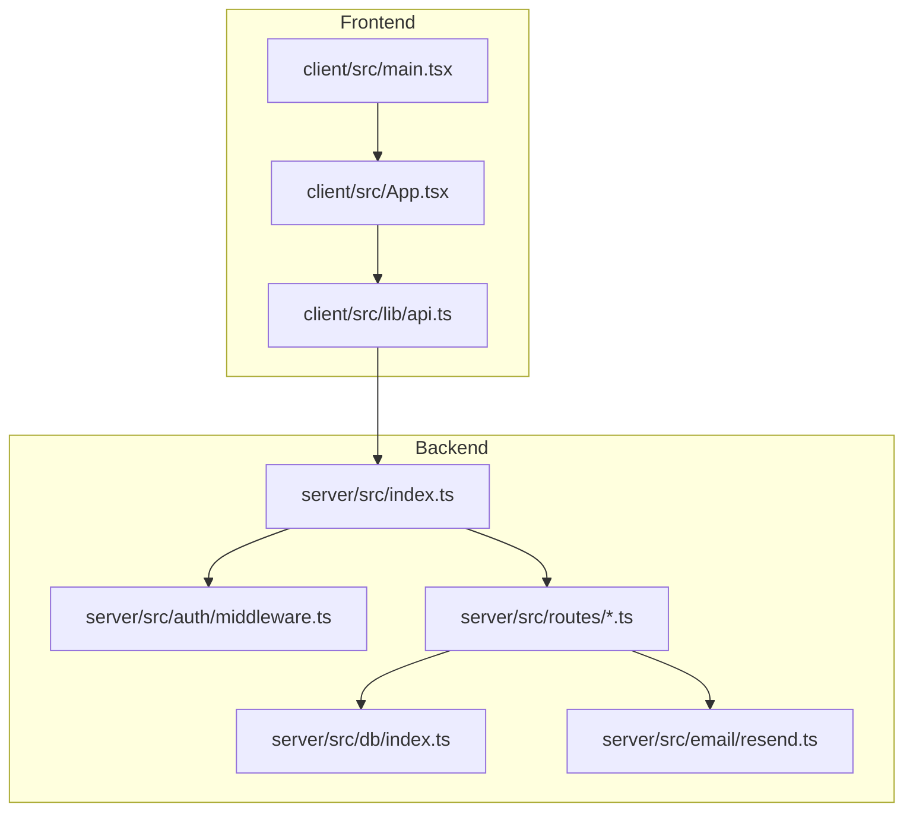
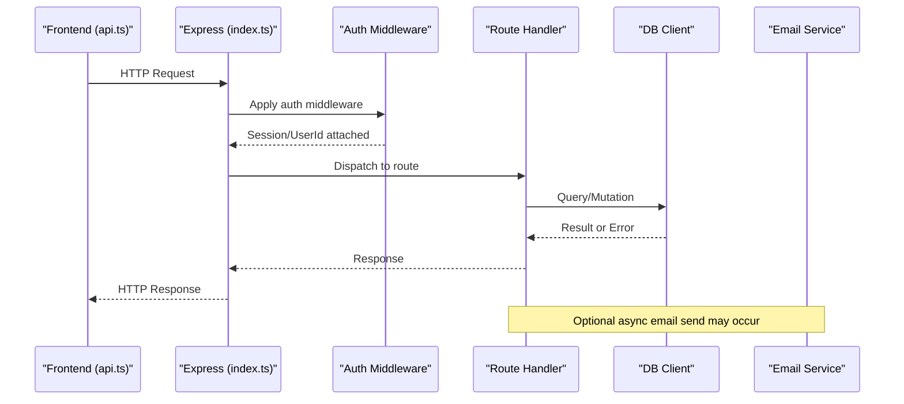
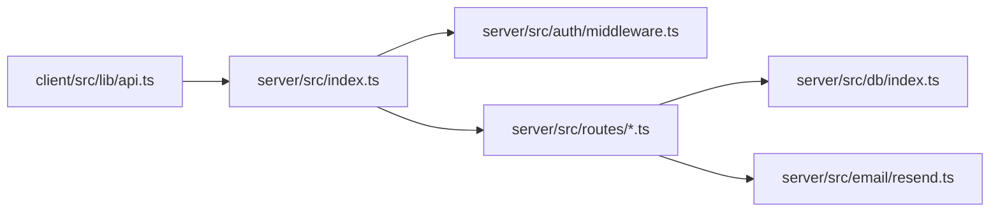

# Monitoring & Logging

<cite>
**Referenced Files in This Document**
- [server/src/index.ts](file://server/src/index.ts)
- [server/src/auth/middleware.ts](file://server/src/auth/middleware.ts)
- [server/src/routes/properties.ts](file://server/src/routes/properties.ts)
- [server/src/routes/dashboard.ts](file://server/src/routes/dashboard.ts)
- [server/src/db/index.ts](file://server/src/db/index.ts)
- [server/src/email/resend.ts](file://server/src/email/resend.ts)
- [client/src/lib/api.ts](file://client/src/lib/api.ts)
- [client/src/main.tsx](file://client/src/main.tsx)
- [client/src/App.tsx](file://client/src/App.tsx)
</cite>

## Table of Contents
1. Introduction
2. Project Structure
3. Core Components
4. Architecture Overview
5. Detailed Component Analysis
6. Dependency Analysis
7. Performance Considerations
8. Troubleshooting Guide
9. Conclusion
10. Appendices

## Introduction
This document defines the monitoring and logging strategy for RentLite, covering both frontend and backend. It outlines structured logging formats, log levels, aggregation approaches, error tracking, performance monitoring, health metrics, middleware-based request/response logging, database query monitoring, centralized logging setup, rotation and retention policies, debugging techniques, profiling, alerting strategies, and examples of custom log formats with integrations to common monitoring tools.

## Project Structure
RentLite is a monorepo with:
- Backend (Express + TypeScript): API routes, authentication middleware, database client, email service
- Frontend (React + Vite): UI, routing, auth context, HTTP client wrapper
- Shared types used across layers

**Diagram sources**
- [client/src/main.tsx:1-29](file://client/src/main.tsx#L1-L29)
- [client/src/App.tsx:1-78](file://client/src/App.tsx#L1-L78)
- [client/src/lib/api.ts:1-82](file://client/src/lib/api.ts#L1-L82)
- [server/src/index.ts:1-77](file://server/src/index.ts#L1-L77)
- [server/src/auth/middleware.ts:1-45](file://server/src/auth/middleware.ts#L1-L45)
- [server/src/routes/properties.ts:1-106](file://server/src/routes/properties.ts#L1-L106)
- [server/src/routes/dashboard.ts:1-124](file://server/src/routes/dashboard.ts#L1-L124)
- [server/src/db/index.ts:1-11](file://server/src/db/index.ts#L1-L11)
- [server/src/email/resend.ts:1-113](file://server/src/email/resend.ts#L1-L113)

**Section sources**
- [server/src/index.ts:1-77](file://server/src/index.ts#L1-L77)
- [client/src/main.tsx:1-29](file://client/src/main.tsx#L1-L29)
- [client/src/App.tsx:1-78](file://client/src/App.tsx#L1-L78)

## Core Components
- Express application bootstrap and global middleware (CORS, JSON parsing)
- Authentication middleware that attaches session and userId to requests
- Route handlers for domain features (properties, dashboard, etc.)
- Database client using Drizzle ORM over Postgres
- Email service wrapper with error handling
- Frontend HTTP client wrapper with unified error handling and redirect on 401

Key responsibilities for monitoring/logging:
- Centralize request lifecycle logging at the Express layer
- Standardize structured logs with consistent fields (timestamp, level, method, path, status, duration, userId, traceId)
- Capture errors with stack traces and contextual metadata
- Expose health endpoint for liveness/readiness probes
- Track DB query durations and failures
- Emit frontend errors and network issues to a central collector

**Section sources**
- [server/src/index.ts:34-77](file://server/src/index.ts#L34-L77)
- [server/src/auth/middleware.ts:8-45](file://server/src/auth/middleware.ts#L8-L45)
- [server/src/routes/properties.ts:25-103](file://server/src/routes/properties.ts#L25-L103)
- [server/src/routes/dashboard.ts:10-121](file://server/src/routes/dashboard.ts#L10-L121)
- [server/src/db/index.ts:1-11](file://server/src/db/index.ts#L1-L11)
- [server/src/email/resend.ts:7-30](file://server/src/email/resend.ts#L7-L30)
- [client/src/lib/api.ts:26-54](file://client/src/lib/api.ts#L26-L54)

## Architecture Overview
The request flow includes frontend fetch calls, Express middleware, route handlers, database operations, and optional external services (email). Monitoring should instrument each stage.

**Diagram sources**
- [client/src/lib/api.ts:26-54](file://client/src/lib/api.ts#L26-L54)
- [server/src/index.ts:34-77](file://server/src/index.ts#L34-L77)
- [server/src/auth/middleware.ts:8-45](file://server/src/auth/middleware.ts#L8-L45)
- [server/src/routes/properties.ts:25-103](file://server/src/routes/properties.ts#L25-L103)
- [server/src/db/index.ts:1-11](file://server/src/db/index.ts#L1-L11)
- [server/src/email/resend.ts:7-30](file://server/src/email/resend.ts#L7-L30)

## Detailed Component Analysis

### Backend Logging Strategy
- Structured log format: Include timestamp, level, service name, requestId, method, url, statusCode, durationMs, userId, userAgent, ip, and message.
- Log levels:
  - info: normal requests, successful operations
  - warn: validation errors, slow queries, degraded services
  - error: unhandled exceptions, downstream failures
  - debug: verbose tracing during development
- Request/Response logging:
  - Use an Express middleware to log incoming requests and outgoing responses with timing and correlation IDs
  - Mask sensitive headers and payloads
- Error tracking:
  - Global error handler to capture uncaught exceptions and route-level errors
  - Attach stack traces and contextual metadata (userId, route, payload hash)
- Health metrics:
  - Expose /api/health returning status and timestamp
  - Optionally add readiness checks (DB connectivity, external service reachability)

Implementation anchors:
- Application bootstrap and health endpoint
- Auth middleware attaching user context
- Route handlers performing DB operations and returning standardized responses

**Section sources**
- [server/src/index.ts:34-77](file://server/src/index.ts#L34-L77)
- [server/src/auth/middleware.ts:8-45](file://server/src/auth/middleware.ts#L8-L45)
- [server/src/routes/properties.ts:25-103](file://server/src/routes/properties.ts#L25-L103)

### Database Query Monitoring
- Instrument DB client initialization and wrap queries to capture:
  - Query text (sanitized), parameters (hashed), execution time, rows affected, error details
- Log slow queries above a configurable threshold
- Aggregate failure rates per query pattern

Implementation anchor:
- DB client setup

**Section sources**
- [server/src/db/index.ts:1-11](file://server/src/db/index.ts#L1-L11)

### Email Service Monitoring
- Wrap outbound emails with try/catch and log errors with context (recipient, subject, template type)
- Return structured success/failure results to callers

Implementation anchor:
- Email send function and error handling

**Section sources**
- [server/src/email/resend.ts:7-30](file://server/src/email/resend.ts#L7-L30)

### Frontend Logging Strategy
- Network requests:
  - Log request start/end, URL, method, status code, duration
  - Capture and report failed requests with error messages and stack traces
- User interactions:
  - Log navigation events and feature usage for analytics
- Errors:
  - Global error boundary to capture React errors
  - Unhandled promise rejections logged centrally
- Performance:
  - Measure page load times and critical rendering paths
  - Report long tasks and memory spikes if needed

Implementation anchors:
- App entrypoint and providers
- Routing and protected routes
- HTTP client wrapper

**Section sources**
- [client/src/main.tsx:1-29](file://client/src/main.tsx#L1-L29)
- [client/src/App.tsx:1-78](file://client/src/App.tsx#L1-L78)
- [client/src/lib/api.ts:26-54](file://client/src/lib/api.ts#L26-L54)

### Dashboard Metrics and Business KPIs
- The dashboard aggregates occupancy, rent collection, financials, maintenance alerts, and expiring leases
- These metrics can be exposed via a dedicated metrics endpoint for dashboards and alerting systems

Implementation anchor:
- Dashboard route computing business metrics

**Section sources**
- [server/src/routes/dashboard.ts:10-121](file://server/src/routes/dashboard.ts#L10-L121)

## Dependency Analysis
Monitoring/logging touches multiple modules; ensure low coupling by centralizing instrumentation:
- Express app depends on CORS, JSON parser, routes, and health endpoint
- Routes depend on auth middleware and DB client
- Email service is independent but should emit logs/errors consistently

**Diagram sources**
- [server/src/index.ts:34-77](file://server/src/index.ts#L34-L77)
- [server/src/auth/middleware.ts:8-45](file://server/src/auth/middleware.ts#L8-L45)
- [server/src/routes/properties.ts:1-106](file://server/src/routes/properties.ts#L1-L106)
- [server/src/db/index.ts:1-11](file://server/src/db/index.ts#L1-L11)
- [server/src/email/resend.ts:1-113](file://server/src/email/resend.ts#L1-L113)
- [client/src/lib/api.ts:1-82](file://client/src/lib/api.ts#L1-L82)

**Section sources**
- [server/src/index.ts:34-77](file://server/src/index.ts#L34-L77)
- [client/src/lib/api.ts:1-82](file://client/src/lib/api.ts#L1-L82)

## Performance Considerations
- Backend:
  - Add request timing middleware to compute latency per endpoint
  - Implement slow query detection and alerting
  - Avoid logging large payloads; use sampling for high-volume endpoints
- Frontend:
  - Debounce frequent logs (e.g., scroll, resize)
  - Batch telemetry submissions to reduce overhead
  - Monitor first contentful paint and time to interactive
- Database:
  - Use indexes and query optimization; log slow queries
  - Limit N+1 queries in dashboard aggregations where possible

[No sources needed since this section provides general guidance]

## Troubleshooting Guide
- Backend:
  - Inspect structured logs for request correlation IDs to trace full flows
  - Check health endpoint for service status
  - Validate environment variables (DATABASE_URL, CLIENT_URL, PORT)
- Frontend:
  - Verify API base URL configuration and credentials
  - Review network tab for failed requests and response codes
  - Use browser console for unhandled errors and warnings
- Database:
  - Confirm connection string and connectivity
  - Review slow query logs and schema constraints
- Email:
  - Check API key configuration and provider error responses

**Section sources**
- [server/src/index.ts:34-77](file://server/src/index.ts#L34-L77)
- [server/src/db/index.ts:1-11](file://server/src/db/index.ts#L1-L11)
- [server/src/email/resend.ts:7-30](file://server/src/email/resend.ts#L7-L30)
- [client/src/lib/api.ts:26-54](file://client/src/lib/api.ts#L26-L54)

## Conclusion
RentLite’s current codebase provides clear extension points for comprehensive monitoring and logging. By adding structured request/response logging, error tracking, database query monitoring, and frontend telemetry, you can achieve production-grade observability. Centralized logging, log rotation, retention policies, and alerting will further enhance reliability and operational insight.

[No sources needed since this section summarizes without analyzing specific files]

## Appendices

### A. Structured Log Schema
- Fields:
  - timestamp: ISO 8601
  - level: info|warn|error|debug
  - service: server|client
  - requestId: unique correlation ID
  - method: HTTP method
  - path: request path
  - statusCode: HTTP status code
  - durationMs: request duration
  - userId: authenticated user id (if available)
  - userAgent: client user agent
  - ip: client IP
  - message: human-readable message
  - error: error object with code, message, stack (when applicable)
  - meta: additional context (route params, payload hashes)

[No sources needed since this section defines a schema]

### B. Middleware Implementation Guidance
- Request/Response Logger:
  - Generate requestId per request
  - Log before and after each request with timing
  - Mask sensitive data
- Error Handler:
  - Catch unhandled exceptions
  - Normalize error shapes
  - Emit structured error logs

[No sources needed since this section provides implementation guidance]

### C. Health and Readiness
- Liveness: /api/health returns status and timestamp
- Readiness: check DB connectivity and external dependencies; return detailed status

**Section sources**
- [server/src/index.ts:64-77](file://server/src/index.ts#L64-L77)

### D. Database Query Monitoring
- Wrap DB client to log:
  - Sanitized query text
  - Execution time
  - Row counts
  - Errors with stack traces
- Alert on slow queries beyond thresholds

**Section sources**
- [server/src/db/index.ts:1-11](file://server/src/db/index.ts#L1-L11)

### E. Frontend Telemetry
- Network:
  - Log request start/end, URL, method, status, duration
  - Capture errors with stack traces
- Performance:
  - Measure page load and interaction latencies
- Errors:
  - Global error boundary and unhandled promise rejections

**Section sources**
- [client/src/lib/api.ts:26-54](file://client/src/lib/api.ts#L26-L54)
- [client/src/main.tsx:1-29](file://client/src/main.tsx#L1-L29)
- [client/src/App.tsx:1-78](file://client/src/App.tsx#L1-L78)

### F. Centralized Logging Setup
- Options:
  - Cloud logging (AWS CloudWatch, GCP Logging, Azure Monitor)
  - Aggregators (Fluent Bit, Vector) shipping to Elasticsearch/OpenSearch, Loki, or Splunk
- Configuration:
  - Ship stdout/stderr from containers
  - Enforce structured JSON logs
  - Tag logs with service, version, environment, and requestId

[No sources needed since this section provides general guidance]

### G. Log Rotation and Retention
- Rotation:
  - Use log drivers that rotate by size/time
  - Compress archived logs
- Retention:
  - Define policies per log type (e.g., access logs 30 days, error logs 90 days)
  - Archive critical logs longer for compliance

[No sources needed since this section provides general guidance]

### H. Alerting Strategies
- Error rate spikes
- Slow endpoint latency
- High DB query latency or failure rates
- Email delivery failures
- Health endpoint failures
- Business metric thresholds (occupancy rate, collection rate)

[No sources needed since this section provides general guidance]

### I. Debugging Techniques
- Enable debug logs in development only
- Use requestId to correlate logs across services
- Reproduce issues with captured payloads (sanitized)
- Profile hot paths with CPU/memory profilers

[No sources needed since this section provides general guidance]

### J. Integration Examples
- Backend:
  - Winston/Pino for structured logging
  - Sentry for error tracking
  - Prometheus client for metrics
- Frontend:
  - Sentry Browser for error tracking
  - Analytics SDK for usage metrics
  - Web Vitals for performance metrics

[No sources needed since this section provides general guidance]