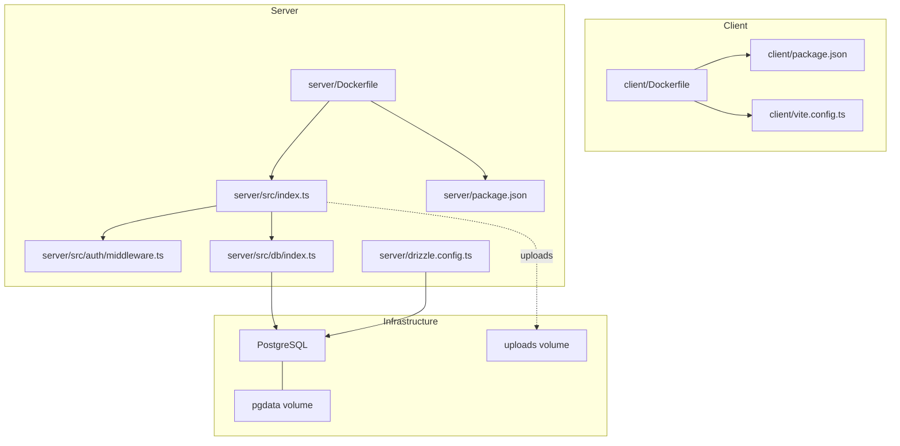
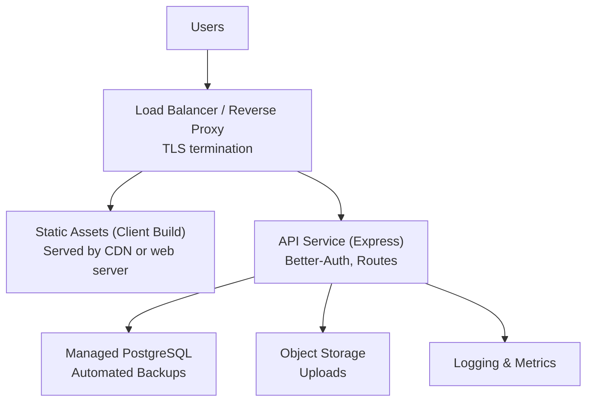
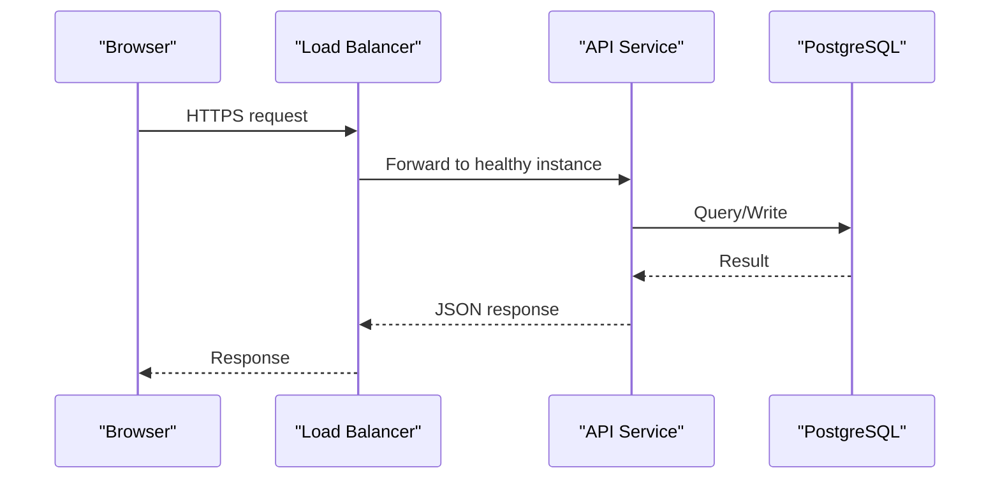
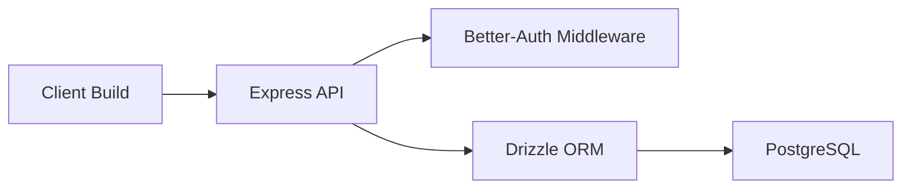

# Production Deployment

<cite>
**Referenced Files in This Document**
- [docker-compose.yml](file://docker-compose.yml)
- [server/Dockerfile](file://server/Dockerfile)
- [client/Dockerfile](file://client/Dockerfile)
- [server/src/index.ts](file://server/src/index.ts)
- [server/src/auth/middleware.ts](file://server/src/auth/middleware.ts)
- [server/src/db/index.ts](file://server/src/db/index.ts)
- [server/drizzle.config.ts](file://server/drizzle.config.ts)
- [server/package.json](file://server/package.json)
- [client/package.json](file://client/package.json)
- [client/vite.config.ts](file://client/vite.config.ts)
- [RentLite-Product-Spec-Sheet.md](file://RentLite-Product-Spec-Sheet.md)
</cite>

## Table of Contents
1. [Introduction](#introduction)
2. [Project Structure](#project-structure)
3. [Core Components](#core-components)
4. [Architecture Overview](#architecture-overview)
5. [Detailed Component Analysis](#detailed-component-analysis)
6. [Dependency Analysis](#dependency-analysis)
7. [Performance Considerations](#performance-considerations)
8. [Troubleshooting Guide](#troubleshooting-guide)
9. [Conclusion](#conclusion)
10. [Appendices](#appendices)

## Introduction
This document provides production deployment guidance for the RentLite application, covering container orchestration, load balancing, scaling, database backup and disaster recovery, data migration, security hardening (SSL/TLS, firewall, access control), CI/CD pipeline setup, performance optimization, capacity planning, troubleshooting, and rollback procedures. It is grounded in the repository’s current configuration and code to ensure accuracy and actionability.

## Project Structure
RentLite is a monorepo with three main parts:
- Client: Vite-based React frontend, built into static assets and served by a lightweight server or CDN.
- Server: Express API with Better-Auth authentication, Drizzle ORM, and PostgreSQL.
- Shared: TypeScript types shared between client and server.

The project includes Dockerfiles for both client and server, and a docker-compose file that defines Postgres, the API server, and the client dev server. The server exposes REST endpoints under /api/* and a health check endpoint at /api/health.

**Diagram sources**
- [docker-compose.yml:1-64](file://docker-compose.yml#L1-L64)
- [server/Dockerfile:1-21](file://server/Dockerfile#L1-L21)
- [client/Dockerfile:1-20](file://client/Dockerfile#L1-L20)
- [server/src/index.ts:1-77](file://server/src/index.ts#L1-L77)
- [server/src/auth/middleware.ts:1-45](file://server/src/auth/middleware.ts#L1-L45)
- [server/src/db/index.ts:1-26](file://server/src/db/index.ts#L1-L26)
- [server/drizzle.config.ts:1-16](file://server/drizzle.config.ts#L1-L16)

**Section sources**
- [docker-compose.yml:1-64](file://docker-compose.yml#L1-L64)
- [server/Dockerfile:1-21](file://server/Dockerfile#L1-L21)
- [client/Dockerfile:1-20](file://client/Dockerfile#L1-L20)
- [server/src/index.ts:1-77](file://server/src/index.ts#L1-L77)

## Core Components
- API server (Express): Loads environment variables, sets up CORS, mounts auth routes and feature routers, and exposes a health check endpoint.
- Authentication: Better-Auth integration via an Express handler and middleware that validates sessions and attaches user context to requests.
- Database: Drizzle ORM with PostgreSQL; connection string required from environment; schema-driven migrations via drizzle-kit.
- Client: Vite build pipeline with proxy configured for local development; production builds are static assets.

Key operational notes:
- Environment variables include DATABASE_URL, BETTER_AUTH_* secrets, CLIENT_URL, RESEND_API_KEY, TWILIO_* keys, PLAID_* keys, UPLOAD_DIR, and PORT.
- Health endpoint: GET /api/health returns status and timestamp.
- Auth routes: All /api/auth/* are handled by Better-Auth.

**Section sources**
- [server/src/index.ts:1-77](file://server/src/index.ts#L1-L77)
- [server/src/auth/middleware.ts:1-45](file://server/src/auth/middleware.ts#L1-L45)
- [server/src/db/index.ts:1-26](file://server/src/db/index.ts#L1-L26)
- [server/drizzle.config.ts:1-16](file://server/drizzle.config.ts#L1-L16)
- [docker-compose.yml:20-46](file://docker-compose.yml#L20-L46)

## Architecture Overview
Production architecture should separate concerns across services:
- Reverse proxy/load balancer (e.g., Nginx, cloud LB) terminates TLS and routes traffic to the API and static client assets.
- API service scales horizontally behind the load balancer.
- Managed PostgreSQL with automated backups and read replicas if needed.
- Object storage for uploads instead of container volumes for durability and scalability.
- Centralized logging and metrics collection.

[No sources needed since this diagram shows conceptual workflow, not actual code structure]

## Detailed Component Analysis

### Container Orchestration and Scaling
- Current compose defines three services: postgres, server, client. In production, replace the client dev server with a static asset build served by a web server or CDN.
- Use a managed PostgreSQL service with encryption at rest and in transit.
- Scale the API horizontally by running multiple instances behind a load balancer. Ensure stateless design:
  - Store uploads in object storage rather than container volumes.
  - Use external session storage if needed (Better-Auth supports various stores).
  - Configure horizontal pod autoscaling or service-level scaling policies based on CPU/memory or request rate.

**Diagram sources**
- [server/src/index.ts:64-68](file://server/src/index.ts#L64-L68)
- [server/src/db/index.ts:18-24](file://server/src/db/index.ts#L18-L24)

**Section sources**
- [docker-compose.yml:1-64](file://docker-compose.yml#L1-L64)
- [server/Dockerfile:1-21](file://server/Dockerfile#L1-L21)
- [client/Dockerfile:1-20](file://client/Dockerfile#L1-L20)

### Load Balancing and High Availability
- Terminate SSL at the edge (cloud provider LB or reverse proxy).
- Route /api/* to the API service and serve static client assets from a CDN or web server.
- Enable health checks using /api/health to remove unhealthy instances automatically.
- Configure sticky sessions only if necessary; prefer stateless design.

**Section sources**
- [server/src/index.ts:64-68](file://server/src/index.ts#L64-L68)

### Database Backup Procedures
- Use managed PostgreSQL backups with point-in-time recovery enabled.
- Schedule logical backups (e.g., pg_dump) to object storage with retention aligned to policy.
- Validate restore procedures regularly with test restores.
- Encrypt backups at rest and in transit.

[No sources needed since this section provides general guidance]

### Disaster Recovery Planning
- Define RPO and RTO targets and align backup frequency and replication strategy accordingly.
- Maintain runbooks for failover scenarios including region or zone outages.
- Test DR drills periodically and document lessons learned.

[No sources needed since this section provides general guidance]

### Data Migration Strategies
- Use Drizzle Kit for schema migrations; keep migrations versioned and applied in CI/CD.
- Perform zero-downtime migrations where possible:
  - Add columns before removing old ones.
  - Backfill data in batches.
  - Roll back by applying previous migration if supported.
- Run migrations before deploying new API versions to avoid incompatibilities.

**Section sources**
- [server/drizzle.config.ts:1-16](file://server/drizzle.config.ts#L1-L16)
- [server/package.json:6-13](file://server/package.json#L6-L13)

### Security Hardening Practices
- TLS/SSL: Terminate at the load balancer or reverse proxy; enforce HTTPS and redirect HTTP to HTTPS.
- Firewall rules: Restrict inbound ports to 80/443 at the edge; allow internal communication between services only.
- Access control:
  - Enforce authentication on all protected routes via Better-Auth middleware.
  - Use least privilege for database credentials and service accounts.
  - Rotate secrets regularly and store them in a secure secret manager.
- CORS: Configure allowed origins explicitly for the client domain.
- Secrets management: Never commit secrets; use environment variables or secret managers.

**Section sources**
- [server/src/auth/middleware.ts:1-45](file://server/src/auth/middleware.ts#L1-L45)
- [server/src/index.ts:39-44](file://server/src/index.ts#L39-L44)
- [docker-compose.yml:29-42](file://docker-compose.yml#L29-L42)
- [RentLite-Product-Spec-Sheet.md:333-347](file://RentLite-Product-Spec-Sheet.md#L333-L347)

### CI/CD Pipeline Setup
- Automated testing:
  - Unit and integration tests for server routes and utilities.
  - Type checking with TypeScript.
- Build steps:
  - Build shared package, then server and client.
  - Lint and validate configurations.
- Deploy steps:
  - Push images to a registry.
  - Apply database migrations before rolling updates.
  - Use blue/green or rolling deployments for zero downtime.
- Security scanning:
  - Scan dependencies and container images.
  - Enforce branch protection and required reviews.

[No sources needed since this section provides general guidance]

### Performance Optimization and Capacity Planning
- API:
  - Tune connection pool size for PostgreSQL based on workload.
  - Cache frequently accessed data where appropriate.
  - Limit request payload sizes and enable compression.
- Client:
  - Serve optimized static assets via CDN.
  - Minimize bundle size and leverage caching headers.
- Observability:
  - Collect logs and metrics; set alerts for error rates and latency.
- Capacity planning:
  - Monitor CPU, memory, disk I/O, and network usage.
  - Right-size containers and scale out based on demand patterns.

[No sources needed since this section provides general guidance]

## Dependency Analysis
The runtime dependency chain centers around the Express server, which depends on Better-Auth for authentication, Drizzle ORM for database access, and PostgreSQL for persistence. The client builds static assets and communicates with the API over HTTPS.

**Diagram sources**
- [server/src/index.ts:20-32](file://server/src/index.ts#L20-L32)
- [server/src/auth/middleware.ts:1-6](file://server/src/auth/middleware.ts#L1-L6)
- [server/src/db/index.ts:5-8](file://server/src/db/index.ts#L5-L8)

**Section sources**
- [server/package.json:15-25](file://server/package.json#L15-L25)
- [client/package.json:12-33](file://client/package.json#L12-L33)

## Performance Considerations
- Use a reverse proxy to handle TLS termination and request buffering.
- Enable gzip/brotli compression for responses.
- Set appropriate timeouts and limits for body parsing and connections.
- Use connection pooling for database interactions.
- Offload static assets to a CDN and configure cache-control headers.
- Implement rate limiting at the edge to protect against abuse.

[No sources needed since this section provides general guidance]

## Troubleshooting Guide
Common issues and resolutions:
- Missing DATABASE_URL:
  - Ensure the environment variable is set and points to a reachable PostgreSQL instance.
  - Verify connectivity and credentials.
- Unauthorized errors:
  - Confirm session cookies or tokens are present and valid.
  - Check CORS settings and cookie attributes for cross-origin requests.
- Health check failures:
  - Inspect application logs for startup errors.
  - Validate database connectivity and schema migrations.
- Uploads not persisting:
  - Replace container volumes with durable object storage.
  - Ensure proper permissions and paths.

Operational checks:
- Use GET /api/health to verify service readiness.
- Review logs for authentication and database errors.
- Validate environment variables and secrets.

**Section sources**
- [server/src/db/index.ts:18-21](file://server/src/db/index.ts#L18-L21)
- [server/src/auth/middleware.ts:14-26](file://server/src/auth/middleware.ts#L14-L26)
- [server/src/index.ts:64-68](file://server/src/index.ts#L64-L68)

## Conclusion
RentLite’s production deployment should center on a stateless API behind a managed load balancer, a managed PostgreSQL with robust backups, and a static client served via CDN. Enforce strong security practices, automate CI/CD with migrations and rollouts, and implement observability and scaling policies aligned with business SLAs. Regularly test backups, DR procedures, and rollbacks to ensure reliability and resilience.

[No sources needed since this section summarizes without analyzing specific files]

## Appendices

### A. Environment Variables Reference
- DATABASE_URL: PostgreSQL connection string.
- BETTER_AUTH_SECRET: Secret for signing sessions/tokens.
- BETTER_AUTH_URL: Base URL for auth callbacks.
- CLIENT_URL: Allowed CORS origin for the client.
- RESEND_API_KEY: Email service key.
- TWILIO_SID, TWILIO_AUTH_TOKEN, TWILIO_PHONE: SMS configuration.
- PLAID_CLIENT_ID, PLAID_SECRET, PLAID_ENV: Banking integration config.
- UPLOAD_DIR: Path for uploads (replace with object storage in production).
- PORT: API listening port.

**Section sources**
- [docker-compose.yml:29-42](file://docker-compose.yml#L29-L42)

### B. Health and Endpoints
- Health check: GET /api/health returns status and timestamp.
- Auth routes: All /api/auth/* handled by Better-Auth.
- Feature routes: Mounted under /api/* for properties, tenants, leases, payments, maintenance, expenses, vendors, reports, dashboard.

**Section sources**
- [server/src/index.ts:47-68](file://server/src/index.ts#L47-L68)

### C. Security Notes
- Enforce HTTPS and restrict CORS to known domains.
- Rotate secrets and limit access to sensitive configuration.
- Follow compliance guidelines for encryption and data handling.

**Section sources**
- [RentLite-Product-Spec-Sheet.md:333-347](file://RentLite-Product-Spec-Sheet.md#L333-L347)