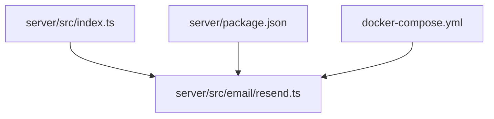
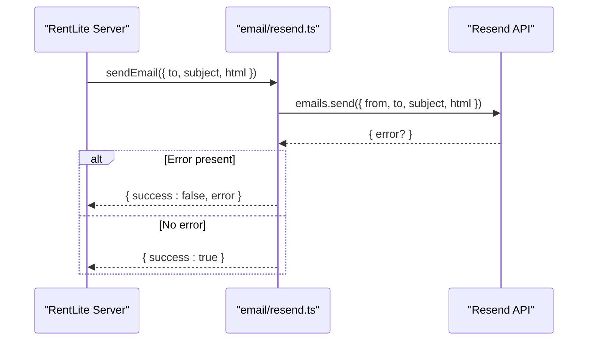
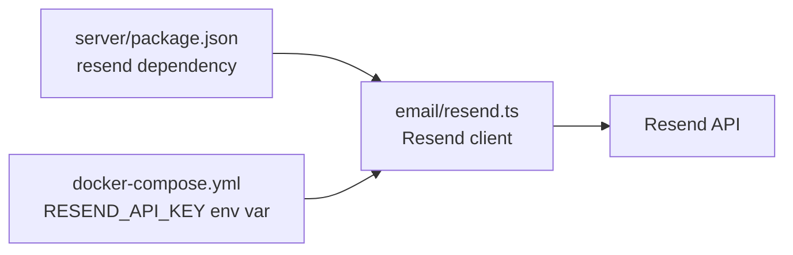

# Email Service Integration

<cite>
**Referenced Files in This Document**
- [resend.ts](file://server/src/email/resend.ts)
- [index.ts](file://server/src/index.ts)
- [package.json](file://server/package.json)
- [docker-compose.yml](file://docker-compose.yml)
</cite>

## Table of Contents
1. Introduction
2. Project Structure
3. Core Components
4. Architecture Overview
5. Detailed Component Analysis
6. Dependency Analysis
7. Performance Considerations
8. Troubleshooting Guide
9. Conclusion
10. Appendices

## Introduction
This document explains the email service integration for RentLite using Resend. It covers how to configure the environment, send emails via the provided sendEmail function, use built-in templates (rent reminders, payment receipts, maintenance updates), and extend the system with custom templates. It also includes error handling, logging, and troubleshooting guidance for common delivery issues.

## Project Structure
The email functionality is implemented as a dedicated module under the server package:
- Email module: server/src/email/resend.ts
- Server bootstrap: server/src/index.ts
- Dependencies: server/package.json
- Environment configuration (including RESEND_API_KEY): docker-compose.yml

**Diagram sources**
- [index.ts:1-64](file://server/src/index.ts#L1-L64)
- [resend.ts:1-113](file://server/src/email/resend.ts#L1-L113)
- [package.json:15-25](file://server/package.json#L15-L25)
- [docker-compose.yml:20-46](file://docker-compose.yml#L20-L46)

**Section sources**
- [index.ts:1-64](file://server/src/index.ts#L1-L64)
- [resend.ts:1-113](file://server/src/email/resend.ts#L1-L113)
- [package.json:15-25](file://server/package.json#L15-L25)
- [docker-compose.yml:20-46](file://docker-compose.yml#L20-L46)

## Core Components
- Resend client initialization and sender identity:
  - The module creates a Resend client using an API key from the environment and defines a default sender address.
- sendEmail function:
  - Accepts recipient, subject, and HTML body; returns a result indicating success or failure with optional error details.
- Built-in email templates:
  - rentReminderEmail: parameters include tenant name, property name, unit number, amount, due date.
  - rentReceiptEmail: parameters include tenant name, property name, unit number, amount, paid date, method.
  - maintenanceUpdateEmail: parameters include tenant name, property name, request title, status; maps internal statuses to friendly labels.

Usage pattern:
- Generate HTML via a template function.
- Call sendEmail with recipient, subject, and generated HTML.
- Handle the returned success/error object in your route or background job.

**Section sources**
- [resend.ts:1-30](file://server/src/email/resend.ts#L1-L30)
- [resend.ts:32-113](file://server/src/email/resend.ts#L32-L113)

## Architecture Overview
The email flow is straightforward: business logic constructs an HTML message using a template, then delegates sending to Resend through sendEmail. Errors are captured and logged consistently.

**Diagram sources**
- [resend.ts:7-30](file://server/src/email/resend.ts#L7-L30)

## Detailed Component Analysis

### Email Client and Sender Configuration
- API key source: read from environment variable; a placeholder is used when not set.
- Sender identity: a fixed display name and domain are used for all outbound emails.

Configuration notes:
- Ensure the environment variable is available at runtime so that the Resend client can authenticate successfully.
- In containerized environments, pass the variable via the service’s environment block.

**Section sources**
- [resend.ts:1-5](file://server/src/email/resend.ts#L1-L5)
- [docker-compose.yml:20-46](file://docker-compose.yml#L20-L46)

### sendEmail Function
- Inputs: recipient email, subject line, HTML content.
- Behavior:
  - Attempts to send via Resend.
  - If the provider returns an error, logs it and returns a failure result with a message.
  - On exceptions, logs the exception and returns a failure result with a stringified error.
  - On success, returns a simple success indicator.

Error handling strategy:
- Centralized try/catch around the send call ensures consistent error reporting.
- Provider-level errors are surfaced via the response object rather than throwing, allowing callers to handle them gracefully.

Logging:
- Uses console.error for both provider errors and exceptions, prefixed for easy filtering.

**Section sources**
- [resend.ts:7-30](file://server/src/email/resend.ts#L7-L30)

### Built-in Templates

#### Rent Reminder Template
- Parameters: tenantName, propertyName, unitNumber, amount, dueDate.
- Purpose: Friendly reminder about upcoming rent due date and amount.
- HTML structure: concise card-style layout with greeting, reminder text, and footer.

**Section sources**
- [resend.ts:34-58](file://server/src/email/resend.ts#L34-L58)

#### Payment Receipt Template
- Parameters: tenantName, propertyName, unitNumber, amount, paidDate, method.
- Purpose: Confirm receipt of rent payment with a summary table.
- HTML structure: greeting, short confirmation sentence, table with key fields, and footer.

**Section sources**
- [resend.ts:60-86](file://server/src/email/resend.ts#L60-L86)

#### Maintenance Update Template
- Parameters: tenantName, propertyName, requestTitle, status.
- Purpose: Notify tenants of maintenance request status changes.
- Status mapping: internal codes map to human-friendly phrases; unknown values fall back to the raw status.
- HTML structure: greeting, update sentence referencing request title and property, and footer.

**Section sources**
- [resend.ts:88-112](file://server/src/email/resend.ts#L88-L112)

### Example Usage Scenarios
Below are conceptual examples showing how to integrate email sending into workflows. Replace placeholders with actual data from your application context.

- Payment confirmation:
  - Build HTML using the payment receipt template.
  - Call sendEmail with tenant email, a descriptive subject, and the generated HTML.
  - Handle the returned success/error to confirm delivery or log failures.

- Tenant notification (e.g., lease renewal notice):
  - Compose a custom HTML message or create a new template function.
  - Send via sendEmail to the tenant’s email.
  - Record outcomes for auditability if needed.

- Automated reminder:
  - Schedule a job to scan for upcoming due dates.
  - For each due, generate a reminder email using the rent reminder template.
  - Send via sendEmail and capture results.

Note: These scenarios describe the intended usage pattern based on the exported functions and their parameters.

[No sources needed since this section provides usage patterns without quoting code]

## Dependency Analysis
- Runtime dependency:
  - The server depends on the Resend SDK for email delivery.
- Environment dependency:
  - The email module reads the API key from the environment at startup.
- Containerization:
  - The Docker Compose file exposes the required environment variables to the server process.

**Diagram sources**
- [package.json:15-25](file://server/package.json#L15-L25)
- [resend.ts:1-5](file://server/src/email/resend.ts#L1-L5)
- [docker-compose.yml:20-46](file://docker-compose.yml#L20-L46)

**Section sources**
- [package.json:15-25](file://server/package.json#L15-L25)
- [resend.ts:1-5](file://server/src/email/resend.ts#L1-L5)
- [docker-compose.yml:20-46](file://docker-compose.yml#L20-L46)

## Performance Considerations
- Asynchronous sending:
  - The send operation is asynchronous; ensure non-blocking calls in request handlers to avoid blocking the event loop.
- Minimal payload:
  - Keep HTML templates concise to reduce network overhead.
- Retries and idempotency:
  - Implement retry logic at the caller level for transient failures if necessary.
- Rate limits:
  - Respect Resend rate limits; consider batching notifications where appropriate.

[No sources needed since this section provides general guidance]

## Troubleshooting Guide
Common issues and resolutions:

- Missing or invalid API key:
  - Symptom: Sending fails with authentication or configuration errors.
  - Action: Verify that the environment variable is set and contains a valid key. In containers, ensure the variable is passed to the server process.

- Invalid sender domain:
  - Symptom: Delivery failures or bounces related to sender identity.
  - Action: Confirm that the configured sender domain is verified in your Resend account and DNS records are correct.

- Template rendering errors:
  - Symptom: Malformed HTML or missing variables causing unexpected output.
  - Action: Validate template parameters before rendering; add defensive checks for null/undefined values.

- Network or provider errors:
  - Symptom: Exceptions or provider error responses during send.
  - Action: Inspect logs prefixed with the module’s error markers; implement retries for transient errors and alerting for persistent failures.

- Logging and observability:
  - Use structured logging in production to capture recipient, subject, and outcome for auditing and debugging.

**Section sources**
- [resend.ts:7-30](file://server/src/email/resend.ts#L7-L30)
- [docker-compose.yml:20-46](file://docker-compose.yml#L20-L46)

## Conclusion
RentLite’s email integration centers on a small, focused module that initializes the Resend client, exposes a robust sendEmail function, and provides three built-in templates for common landlord workflows. With proper environment configuration and consistent error handling, you can reliably send rent reminders, payment receipts, and maintenance updates. Extending the system with new templates follows the same pattern: define a template function, then call sendEmail with the generated HTML.

[No sources needed since this section summarizes without analyzing specific files]

## Appendices

### Environment Setup Checklist
- Set the API key environment variable for the server process.
- Ensure the sender domain is verified in your Resend account.
- Confirm that the server loads environment variables at startup.

**Section sources**
- [resend.ts:1-5](file://server/src/email/resend.ts#L1-L5)
- [docker-compose.yml:20-46](file://docker-compose.yml#L20-L46)
- [index.ts:1-64](file://server/src/index.ts#L1-L64)

### Creating Custom Email Templates
- Add a new template function that accepts relevant parameters and returns HTML.
- Follow the existing style: responsive, inline styles, clear sections, and a consistent footer.
- Integrate by calling sendEmail with the generated HTML and an appropriate subject.

[No sources needed since this section provides general guidance]