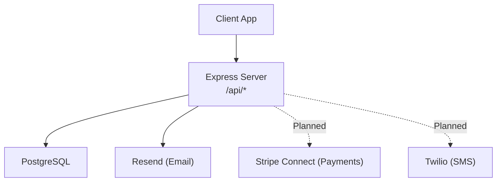
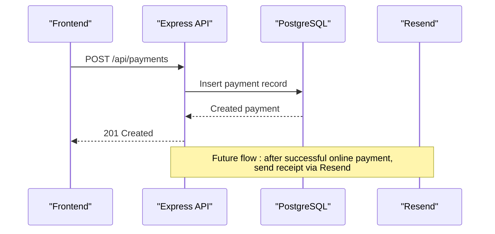
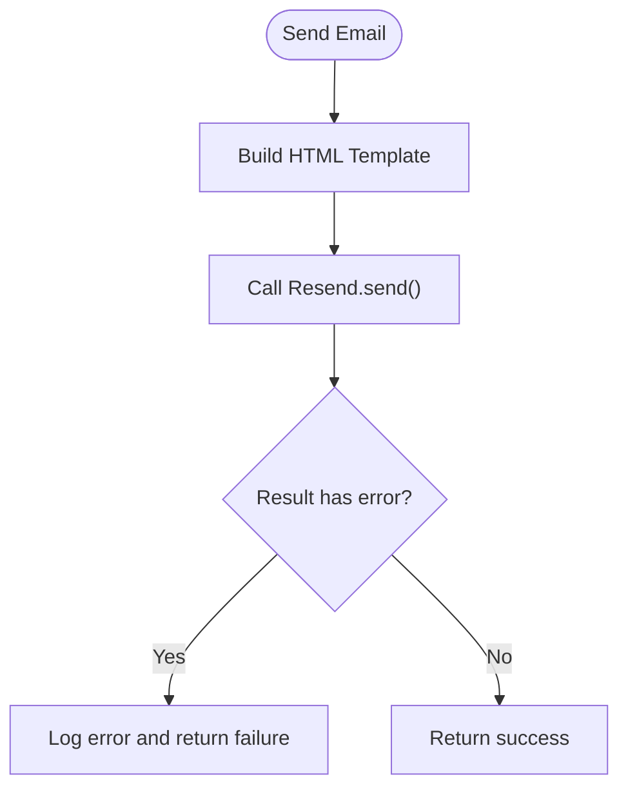
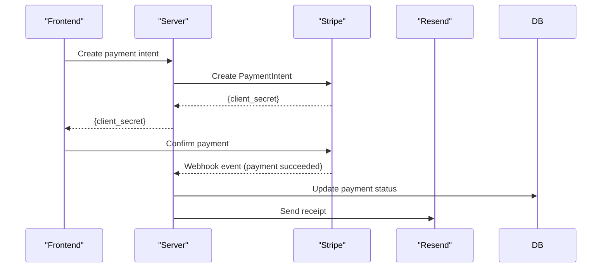
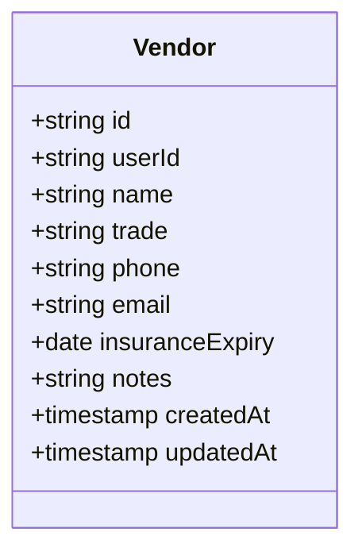
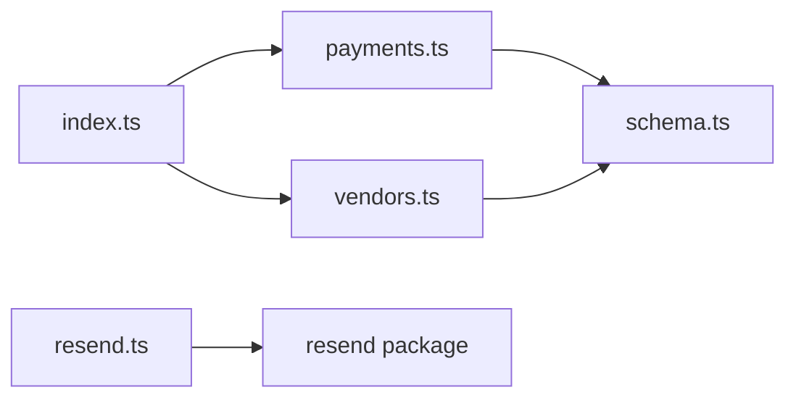

# External Integrations

<cite>
**Referenced Files in This Document**
- [resend.ts](file://server/src/email/resend.ts)
- [payments.ts](file://server/src/routes/payments.ts)
- [vendors.ts](file://server/src/routes/vendors.ts)
- [schema.ts](file://server/src/db/schema.ts)
- [index.ts](file://server/src/index.ts)
- [docker-compose.yml](file://docker-compose.yml)
- [package.json (server)](file://server/package.json)
- [RentLite-Product-Spec-Sheet.md](file://RentLite-Product-Spec-Sheet.md)
</cite>

## Table of Contents
1. Introduction
2. Project Structure
3. Core Components
4. Architecture Overview
5. Detailed Component Analysis
6. Dependency Analysis
7. Performance Considerations
8. Troubleshooting Guide
9. Conclusion
10. Appendices

## Introduction
This document explains the external service integrations for RentLite with a focus on email, payments, vendor management, and SMS. It covers what is implemented today, what is planned, configuration via environment variables, example API calls, webhook handling patterns, error handling strategies, retry/fallback approaches, and monitoring/logging guidance. The goal is to help developers and operators integrate and operate these services reliably.

## Project Structure
RentLite’s server exposes REST endpoints under /api/* and integrates with external services where applicable:
- Email integration is implemented using Resend.
- Payment processing routes exist but currently record payments locally; Stripe Connect is planned for Phase 2.
- Vendor management is fully implemented as local CRUD operations.
- SMS via Twilio is configured via environment variables but not yet wired into route handlers.

**Diagram sources**
- [index.ts:16-44](file://server/src/index.ts#L16-L44)
- [docker-compose.yml:20-46](file://docker-compose.yml#L20-L46)

**Section sources**
- [index.ts:16-44](file://server/src/index.ts#L16-L44)
- [docker-compose.yml:20-46](file://docker-compose.yml#L20-L46)

## Core Components
- Email: A dedicated module provides a send function and reusable HTML templates for rent reminders, receipts, and maintenance updates. It uses Resend and logs errors consistently.
- Payments: Routes support listing, summarizing, creating, updating, and deleting payment records. Methods include cash, check, Zelle, Venmo, ACH, card, bank transfer, and other. Online payment capture via Stripe is planned.
- Vendors: Full CRUD for vendors with fields for name, trade, contact info, insurance expiry, and notes.
- Notifications schema: A notification table supports multiple channels (email, sms, in_app), types, recipients, scheduling, and status tracking—providing a foundation for future automated notifications.

**Section sources**
- [resend.ts:1-30](file://server/src/email/resend.ts#L1-L30)
- [payments.ts:11-22](file://server/src/routes/payments.ts#L11-L22)
- [payments.ts:24-136](file://server/src/routes/payments.ts#L24-L136)
- [vendors.ts:11-68](file://server/src/routes/vendors.ts#L11-L68)
- [schema.ts:350-381](file://server/src/db/schema.ts#L350-L381)

## Architecture Overview
The system follows a simple layered architecture:
- Express server mounts feature routers under /api.
- Data layer uses Drizzle ORM against PostgreSQL.
- External integrations are invoked from business logic or routes when needed.
- Environment variables configure third-party services.

**Diagram sources**
- [payments.ts:103-110](file://server/src/routes/payments.ts#L103-L110)
- [resend.ts:7-30](file://server/src/email/resend.ts#L7-L30)

## Detailed Component Analysis

### Email Integration (Resend)
- Purpose: Send transactional emails such as rent reminders, receipts, and maintenance updates.
- Implementation highlights:
  - Uses Resend SDK initialized with an API key from environment.
  - Provides a send function that returns a success flag and optional error message.
  - Includes HTML templates for common messages.
- Configuration:
  - RESEND_API_KEY must be set in the environment.
- Example usage pattern:
  - Build template content with provided helpers.
  - Call send with recipient, subject, and HTML body.
  - Handle success or log error based on response.

**Diagram sources**
- [resend.ts:7-30](file://server/src/email/resend.ts#L7-L30)
- [resend.ts:34-112](file://server/src/email/resend.ts#L34-L112)

**Section sources**
- [resend.ts:1-30](file://server/src/email/resend.ts#L1-L30)
- [resend.ts:34-112](file://server/src/email/resend.ts#L34-L112)
- [docker-compose.yml:34](file://docker-compose.yml#L34)

### Payment Processing (Stripe — Planned)
- Current state:
  - Payment routes create/update/delete payment records locally.
  - Supports multiple methods including ACH and card, but no live payment capture yet.
- Planned state:
  - Use Stripe Connect to accept ACH and card payments.
  - Implement webhooks to reconcile payments and update statuses.
  - Issue receipts via email.
- Configuration (planned):
  - STRIPE_SECRET_KEY, STRIPE_WEBHOOK_SECRET, and related keys should be stored securely in environment variables.
- Example API call (conceptual):
  - Create a payment intent on the server, return client secret to frontend.
  - Confirm payment on the client using the returned secret.
  - On webhook event, mark payment as received and trigger email receipt.

[No diagram sources since this illustrates planned Stripe flow]

**Section sources**
- [payments.ts:11-22](file://server/src/routes/payments.ts#L11-L22)
- [payments.ts:103-136](file://server/src/routes/payments.ts#L103-L136)
- [RentLite-Product-Spec-Sheet.md:184-194](file://RentLite-Product-Spec-Sheet.md#L184-L194)
- [RentLite-Product-Spec-Sheet.md:283-299](file://RentLite-Product-Spec-Sheet.md#L283-L299)

### Vendor Management
- Capabilities:
  - List, create, update, and delete vendors scoped by user.
  - Store trade, phone, email, insurance expiry, and notes.
- Data model:
  - Vendor entity includes timestamps and user association.
- Typical workflow:
  - Landlord adds preferred contractors per property or globally.
  - Maintenance requests can reference vendors for follow-up.

**Diagram sources**
- [schema.ts:350-365](file://server/src/db/schema.ts#L350-L365)

**Section sources**
- [vendors.ts:11-68](file://server/src/routes/vendors.ts#L11-L68)
- [schema.ts:350-365](file://server/src/db/schema.ts#L350-L365)

### SMS Notifications (Twilio — Planned)
- Current state:
  - Environment variables for Twilio SID, Auth Token, and Phone are present in Docker Compose.
  - No SMS sending code is implemented in routes yet.
- Planned implementation:
  - Add a notification channel “sms” and use Twilio Messaging API to send reminders and alerts.
  - Integrate with the notification queue/table to schedule and track delivery.
- Configuration:
  - TWILIO_SID, TWILIO_AUTH_TOKEN, TWILIO_PHONE should be set in production environments.

**Section sources**
- [docker-compose.yml:35-37](file://docker-compose.yml#L35-L37)
- [schema.ts:369-381](file://server/src/db/schema.ts#L369-L381)

## Dependency Analysis
- External dependencies:
  - Resend is installed and used for email.
  - Stripe and Twilio are referenced in product specs and environment config but not yet integrated in code.
- Internal dependencies:
  - Routes depend on database models and auth middleware.
  - Email module is independent and can be called from any route or background job.

**Diagram sources**
- [payments.ts:1-6](file://server/src/routes/payments.ts#L1-L6)
- [vendors.ts:1-6](file://server/src/routes/vendors.ts#L1-L6)
- [resend.ts:1-3](file://server/src/email/resend.ts#L1-L3)
- [index.ts:35-44](file://server/src/index.ts#L35-L44)

**Section sources**
- [package.json (server):15-25](file://server/package.json#L15-L25)
- [RentLite-Product-Spec-Sheet.md:283-299](file://RentLite-Product-Spec-Sheet.md#L283-L299)

## Performance Considerations
- Email:
  - Keep HTML templates lightweight to reduce payload size.
  - Batch non-critical emails if volume increases.
- Payments:
  - Use idempotency keys when creating payment intents to avoid duplicates.
  - Process webhooks asynchronously to keep API latency low.
- SMS:
  - Queue SMS messages to handle bursts and provider rate limits.
- Database:
  - Ensure indexes on frequently filtered columns (e.g., unitId, dueDate).
  - Use pagination for large lists like payments and vendors.

[No sources needed since this section provides general guidance]

## Troubleshooting Guide
- Email failures:
  - Check RESEND_API_KEY validity and domain verification.
  - Inspect console logs for error messages returned by Resend.
  - Validate recipient addresses and HTML content.
- Payment reconciliation:
  - Verify webhook signatures and payloads before updating records.
  - Maintain a ledger of events to reprocess failed deliveries.
- SMS issues:
  - Confirm Twilio credentials and phone number ownership.
  - Monitor delivery reports and retry on transient failures.
- General:
  - Use the health endpoint to verify server availability.
  - Centralize logging for all external calls with correlation IDs.

**Section sources**
- [resend.ts:20-29](file://server/src/email/resend.ts#L20-L29)
- [index.ts:48-50](file://server/src/index.ts#L48-L50)

## Conclusion
RentLite currently implements robust email via Resend and comprehensive vendor management. Payment processing and SMS are planned for future phases, with clear integration points defined in the product specification and environment configuration. By following the recommended patterns for configuration, error handling, retries, and monitoring, teams can extend the system to support secure, reliable online payments and SMS notifications.

[No sources needed since this section summarizes without analyzing specific files]

## Appendices

### Configuration Checklist
- Email (Resend)
  - Set RESEND_API_KEY in environment.
  - Verify sender domain in Resend dashboard.
- Payments (Stripe — Planned)
  - Prepare STRIPE_SECRET_KEY and STRIPE_WEBHOOK_SECRET.
  - Configure webhook endpoints for payment events.
- SMS (Twilio — Planned)
  - Set TWILIO_SID, TWILIO_AUTH_TOKEN, TWILIO_PHONE.
  - Purchase or verify a Twilio phone number.

**Section sources**
- [docker-compose.yml:34-37](file://docker-compose.yml#L34-L37)
- [RentLite-Product-Spec-Sheet.md:283-299](file://RentLite-Product-Spec-Sheet.md#L283-L299)

### Example API Calls and Webhooks
- Email
  - Call sendEmail with recipient, subject, and HTML built from templates.
  - Handle success or log error details.
- Payments
  - Create payment records via POST /api/payments.
  - Update status via PUT /api/payments/:id.
  - When Stripe is integrated, add a webhook handler to reconcile events and update payment status.
- Vendors
  - CRUD via /api/vendors endpoints.

**Section sources**
- [resend.ts:7-30](file://server/src/email/resend.ts#L7-L30)
- [payments.ts:24-136](file://server/src/routes/payments.ts#L24-L136)
- [vendors.ts:20-68](file://server/src/routes/vendors.ts#L20-L68)