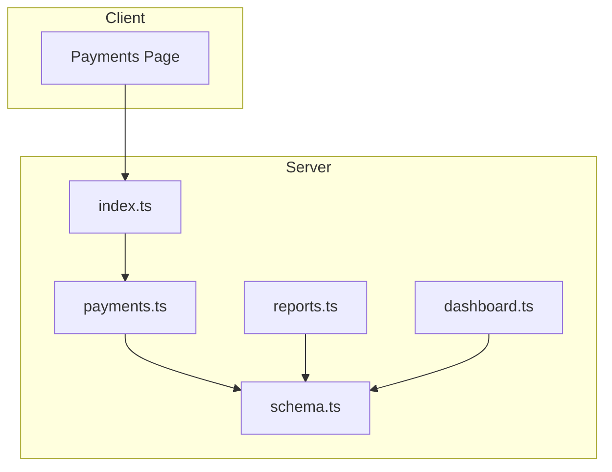
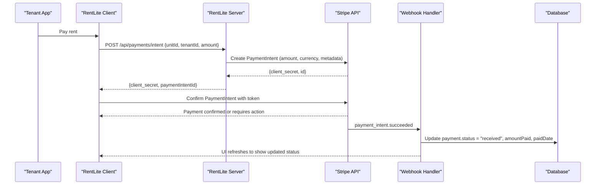
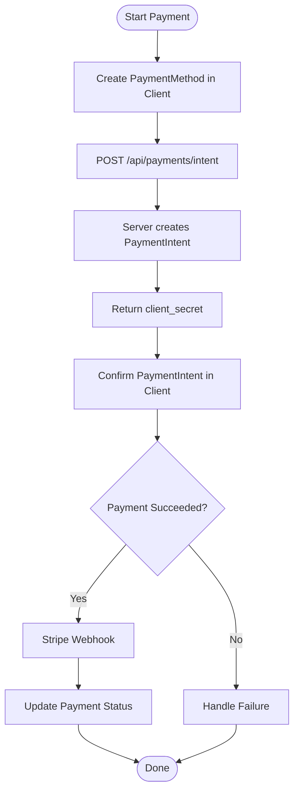
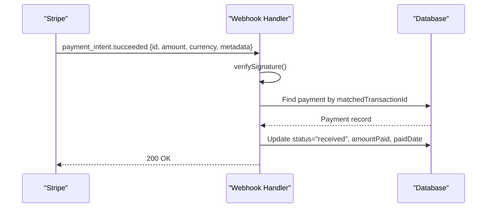
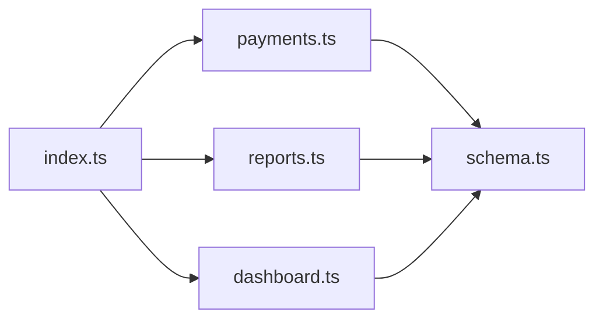

# Payment Processing Integration

<cite>
**Referenced Files in This Document**
- [server/src/routes/payments.ts](file://server/src/routes/payments.ts)
- [client/src/pages/Payments.tsx](file://client/src/pages/Payments.tsx)
- [server/src/db/schema.ts](file://server/src/db/schema.ts)
- [shared/src/types.ts](file://shared/src/types.ts)
- [server/src/index.ts](file://server/src/index.ts)
- [server/src/routes/reports.ts](file://server/src/routes/reports.ts)
- [server/src/routes/dashboard.ts](file://server/src/routes/dashboard.ts)
</cite>

## Table of Contents
1. [Introduction](#introduction)
2. [Project Structure](#project-structure)
3. [Core Components](#core-components)
4. [Architecture Overview](#architecture-overview)
5. [Detailed Component Analysis](#detailed-component-analysis)
6. [Dependency Analysis](#dependency-analysis)
7. [Performance Considerations](#performance-considerations)
8. [Troubleshooting Guide](#troubleshooting-guide)
9. [Conclusion](#conclusion)
10. [Appendices](#appendices)

## Introduction
This document describes the payment processing integration for RentLite with a focus on Stripe-based online rent payments, ACH bank transfers, and credit/debit card transactions. It explains how to extend the existing payment tracking system to support secure payment initiation, processing, confirmation via webhooks, recurring billing, and reconciliation. It also covers security considerations (PCI compliance, encryption, tokenization), refund handling, financial reporting integration, and troubleshooting techniques.

The current codebase provides:
- A payments API for recording and updating payments
- Database schema for payments and subscriptions
- Reporting endpoints that aggregate income and expenses
- A client UI for recording payments and viewing summaries

The guidance below shows where and how to integrate Stripe securely without exposing sensitive data to the browser.

## Project Structure
RentLite is a full-stack application with:
- Client (React + Vite) under client/
- Server (Express + Drizzle ORM) under server/
- Shared types under shared/

Key files relevant to payments:
- Payments routes define CRUD operations and summary endpoints
- Database schema defines payment and subscription tables
- Reports and dashboard endpoints compute financial metrics from payments and expenses
- Client Payments page records payments and displays summaries

**Diagram sources**
- [server/src/index.ts:38-49](file://server/src/index.ts#L38-L49)
- [server/src/routes/payments.ts:1-136](file://server/src/routes/payments.ts#L1-L136)
- [server/src/routes/reports.ts:1-186](file://server/src/routes/reports.ts#L1-L186)
- [server/src/routes/dashboard.ts:1-124](file://server/src/routes/dashboard.ts#L1-L124)
- [server/src/db/schema.ts:268-289](file://server/src/db/schema.ts#L268-L289)

**Section sources**
- [server/src/index.ts:38-49](file://server/src/index.ts#L38-L49)
- [server/src/routes/payments.ts:1-136](file://server/src/routes/payments.ts#L1-L136)
- [server/src/db/schema.ts:268-289](file://server/src/db/schema.ts#L268-L289)

## Core Components
- Payments API:
  - Create, update, list, filter, and delete payments
  - Summary endpoint computes expected vs collected amounts and collection rate
- Database Schema:
  - Payment entity with fields for amount, amountPaid, dueDate, method, status, lateFee, notes, and matchedTransactionId
  - Subscription entity with stripeSubscriptionId for recurring billing
- Reporting:
  - Cash flow, Schedule E mapping, and P&L reports use payments and expenses to derive financial insights
- Client UI:
  - Records payments and shows monthly summaries and collections metrics

These components form the foundation for integrating Stripe to automate payment capture, confirmations, and reconciliations.

**Section sources**
- [server/src/routes/payments.ts:24-136](file://server/src/routes/payments.ts#L24-L136)
- [server/src/db/schema.ts:268-289](file://server/src/db/schema.ts#L268-L289)
- [server/src/db/schema.ts:385-402](file://server/src/db/schema.ts#L385-L402)
- [server/src/routes/reports.ts:28-186](file://server/src/routes/reports.ts#L28-L186)
- [client/src/pages/Payments.tsx:58-156](file://client/src/pages/Payments.tsx#L58-L156)

## Architecture Overview
The recommended Stripe integration follows a secure, server-side flow:
- Initiation: Client requests a payment intent or checkout session from the server using a payment method token created in the browser via Stripe.js Elements or Checkout.
- Processing: Server creates a PaymentIntent or charges via Stripe API using the token.
- Confirmation: Stripe sends webhook events to the server; the server updates payment status and metadata accordingly.
- Recurring Billing: Subscriptions are managed via Stripe Customer and Subscription objects; server stores stripeSubscriptionId and handles lifecycle events.
- Reconciliation: Reports and dashboards consume payment data to reflect income and collection rates.

**Diagram sources**
- [server/src/routes/payments.ts:103-110](file://server/src/routes/payments.ts#L103-L110)
- [server/src/routes/payments.ts:112-126](file://server/src/routes/payments.ts#L112-L126)
- [server/src/db/schema.ts:268-289](file://server/src/db/schema.ts#L268-L289)

## Detailed Component Analysis

### Payments API Endpoints
- GET /api/payments: Lists payments with optional filters by month, year, status, unitId. Filters results to units owned by the authenticated user.
- GET /api/payments/summary: Computes totalExpected, totalCollected, totalOutstanding, collectionRate, and counts by status for a given month/year.
- POST /api/payments: Creates a new payment record after validation.
- PUT /api/payments/:id: Updates an existing payment (e.g., mark as received, adjust amountPaid).
- DELETE /api/payments/:id: Deletes a payment if it exists.

These endpoints provide the backbone for manual entry and future automation via Stripe webhooks.

**Section sources**
- [server/src/routes/payments.ts:24-136](file://server/src/routes/payments.ts#L24-L136)

### Database Schema for Payments and Subscriptions
- Payment table includes:
  - unitId, tenantId, amount, amountPaid, dueDate, paidDate
  - method (cash, check, zelle, venmo, ach, card, bank_transfer, other)
  - status (pending, received, late, partial)
  - lateFee, notes, matchedTransactionId
- Subscription table includes:
  - userId, plan, billingCycle, status, trialEndsAt, currentPeriodEnd, stripeSubscriptionId

These structures support both one-time payments and recurring billing. The matchedTransactionId field can store Stripe IDs for reconciliation.

**Section sources**
- [server/src/db/schema.ts:268-289](file://server/src/db/schema.ts#L268-L289)
- [server/src/db/schema.ts:385-402](file://server/src/db/schema.ts#L385-L402)
- [shared/src/types.ts:70-90](file://shared/src/types.ts#L70-L90)
- [shared/src/types.ts:192-208](file://shared/src/types.ts#L192-L208)

### Reporting and Dashboard Integration
- Reports:
  - Cash flow per property aggregates monthly income (from payments.amountPaid) and expenses
  - Schedule E helper maps expense categories to tax lines and sums rentReceived based on paidDate or dueDate
  - P&L report calculates totalIncome, totalExpenses, netIncome per property for year or quarter
- Dashboard:
  - Provides occupancy, rent collection metrics, monthly income/expenses, and alerts for late payments

These endpoints rely on payment records to produce accurate financial views. Integrating Stripe will feed these endpoints automatically via webhooks.

**Section sources**
- [server/src/routes/reports.ts:28-186](file://server/src/routes/reports.ts#L28-L186)
- [server/src/routes/dashboard.ts:10-124](file://server/src/routes/dashboard.ts#L10-L124)

### Client Payments Page
- Displays summary stats (total expected, collected, outstanding, collection rate)
- Lists payments with unit, tenant, due date, paid amount, status, and method
- Allows recording new payments via a modal form
- Uses React Query to fetch and invalidate data on mutations

This UI supports manual entry and can be extended to trigger Stripe Checkout flows.

**Section sources**
- [client/src/pages/Payments.tsx:58-156](file://client/src/pages/Payments.tsx#L58-L156)
- [client/src/pages/Payments.tsx:171-209](file://client/src/pages/Payments.tsx#L171-L209)
- [client/src/pages/Payments.tsx:211-296](file://client/src/pages/Payments.tsx#L211-L296)

### Stripe Integration Design

#### Payment Initiation and Processing
- Browser uses Stripe.js to create a PaymentMethod or Checkout Session securely
- Server creates a PaymentIntent with amount, currency, and metadata linking to unitId and tenantId
- Server returns client_secret to the client to confirm the payment
- On success, Stripe sends a webhook event to update payment status

[No sources needed since this diagram shows conceptual workflow, not actual code structure]

#### Webhook Handling for Payment Status Updates
- Implement a webhook endpoint to receive Stripe events
- Verify webhook signatures using Stripe’s secret
- Handle key events:
  - payment_intent.succeeded: set payment.status = "received", amountPaid = charged amount, paidDate = now, matchedTransactionId = paymentIntent.id
  - payment_intent.payment_failed: set payment.status = "late" or "pending" depending on policy
  - charge.refunded: handle refunds by adjusting amounts and setting status appropriately
- Idempotency: Use matchedTransactionId to avoid duplicate updates

[No sources needed since this diagram shows conceptual workflow, not actual code structure]

#### Payment Method Management
- Store preferred payment methods via Stripe Customer objects
- Link tenants to Customers and save references in tenant or payment records
- Support multiple methods:
  - Credit/Debit Cards: stored PaymentMethods
  - ACH Bank Transfers: setup ACH mandates via Stripe
  - Zelle/Venmo/Cash/Check: recorded manually in method field

#### Recurring Payment Setup and Automatic Scheduling
- Create Stripe Subscriptions linked to tenants or properties
- Store stripeSubscriptionId in subscription table
- Handle subscription lifecycle events:
  - customer.subscription.created
  - customer.subscription.updated
  - customer.subscription.deleted
  - invoice.payment_succeeded
  - invoice.payment_failed
- Schedule automatic rent charges using Stripe’s subscription billing cycles

#### Examples of Payment API Calls
- Create PaymentIntent:
  - Endpoint: POST /api/payments/intent
  - Request body: unitId, tenantId, amount, currency
  - Response: { client_secret, paymentIntentId }
- Confirm PaymentIntent:
  - Client calls Stripe.confirmPayment with client_secret
- Webhook payload:
  - Event type: payment_intent.succeeded
  - Payload includes id, amount, currency, metadata.unitId, metadata.tenantId

[No sources needed since this section provides general guidance]

#### Error Handling for Failed Transactions
- Handle Stripe errors:
  - Insufficient funds, card declined, expired card
  - Network timeouts, invalid parameters
- Update payment status to "late" or "partial" as appropriate
- Notify tenant and landlord via notifications
- Retry logic for transient failures

[No sources needed since this section provides general guidance]

### Security Considerations
- PCI Compliance:
  - Never handle raw card numbers in your server or database
  - Use Stripe.js Elements or Checkout to tokenize card details in the browser
- Data Encryption:
  - Enforce HTTPS across all endpoints
  - Store secrets (Stripe keys, webhook signing secret) in environment variables
- Secure Tokenization:
  - Use client_secret for PaymentIntent confirmation
  - Validate webhook signatures server-side
  - Avoid logging sensitive payloads

[No sources needed since this section provides general guidance]

### Reconciliation, Refunds, and Financial Reporting
- Reconciliation:
  - Match Stripe transactions to payments via matchedTransactionId
  - Periodically reconcile Stripe payouts with internal records
- Refund Processing:
  - Create refunds via Stripe API
  - Update payment records to reflect refunded amounts and status changes
- Financial Reporting:
  - Reports and dashboards already aggregate payments and expenses
  - Ensure webhook-driven updates keep reports accurate

[No sources needed since this section provides general guidance]

## Dependency Analysis
The payment system depends on:
- Express routing and middleware for authentication and CORS
- Drizzle ORM for database access
- Shared types for consistent contracts between client and server
- Reporting endpoints that consume payment data

**Diagram sources**
- [server/src/index.ts:38-49](file://server/src/index.ts#L38-L49)
- [server/src/routes/payments.ts:1-136](file://server/src/routes/payments.ts#L1-L136)
- [server/src/routes/reports.ts:1-186](file://server/src/routes/reports.ts#L1-L186)
- [server/src/routes/dashboard.ts:1-124](file://server/src/routes/dashboard.ts#L1-L124)
- [server/src/db/schema.ts:268-289](file://server/src/db/schema.ts#L268-L289)

**Section sources**
- [server/src/index.ts:38-49](file://server/src/index.ts#L38-L49)
- [server/src/routes/payments.ts:1-136](file://server/src/routes/payments.ts#L1-L136)
- [server/src/routes/reports.ts:1-186](file://server/src/routes/reports.ts#L1-L186)
- [server/src/routes/dashboard.ts:1-124](file://server/src/routes/dashboard.ts#L1-L124)
- [server/src/db/schema.ts:268-289](file://server/src/db/schema.ts#L268-L289)

## Performance Considerations
- Indexing:
  - Add indexes on payment.unitId, payment.tenantId, payment.dueDate, payment.paidDate for faster filtering
- Query Optimization:
  - Filter payments by user-owned units to reduce dataset size
  - Use pagination for large payment lists
- Webhook Processing:
  - Process webhooks asynchronously to avoid blocking requests
  - Implement retry and dead-letter queues for failed webhook deliveries
- Reporting:
  - Cache aggregated metrics for short periods to reduce DB load

[No sources needed since this section provides general guidance]

## Troubleshooting Guide
Common issues and debugging steps:
- Validation Errors:
  - Check request body against paymentSchema
  - Inspect Zod error details returned by the server
- Not Found Errors:
  - Ensure payment IDs exist before updates or deletions
- Webhook Failures:
  - Verify webhook signature using Stripe’s signing secret
  - Log event payloads and inspect matchedTransactionId
- Payment Status Mismatches:
  - Compare Stripe event timestamps with payment.paidDate
  - Ensure idempotent updates to prevent duplicates
- Reporting Discrepancies:
  - Validate that paidDate and dueDate are correctly set
  - Re-run cash flow and P&L reports after fixing data

**Section sources**
- [server/src/routes/payments.ts:103-136](file://server/src/routes/payments.ts#L103-L136)
- [server/src/routes/reports.ts:28-186](file://server/src/routes/reports.ts#L28-L186)
- [server/src/routes/dashboard.ts:10-124](file://server/src/routes/dashboard.ts#L10-L124)

## Conclusion
RentLite’s payment system is well-positioned to integrate Stripe for secure, automated rent collection. By extending the existing payments API with Stripe-backed initiation and confirmation flows, implementing robust webhook handling, and leveraging reporting endpoints, the application can support credit/debit cards, ACH transfers, and recurring billing while maintaining PCI compliance and data security. Proper indexing, caching, and idempotent processing will ensure performance and reliability.

## Appendices

### API Reference Summary
- Payments:
  - GET /api/payments: List and filter payments
  - GET /api/payments/summary: Monthly collection summary
  - POST /api/payments: Create payment
  - PUT /api/payments/:id: Update payment
  - DELETE /api/payments/:id: Delete payment
- Reports:
  - GET /api/reports/cashflow: Monthly cash flow per property
  - GET /api/reports/schedule-e: Schedule E line items
  - GET /api/reports/pnl: Profit & loss per property
- Dashboard:
  - GET /api/dashboard: Landlord overview including rent metrics

**Section sources**
- [server/src/routes/payments.ts:24-136](file://server/src/routes/payments.ts#L24-L136)
- [server/src/routes/reports.ts:28-186](file://server/src/routes/reports.ts#L28-L186)
- [server/src/routes/dashboard.ts:10-124](file://server/src/routes/dashboard.ts#L10-L124)