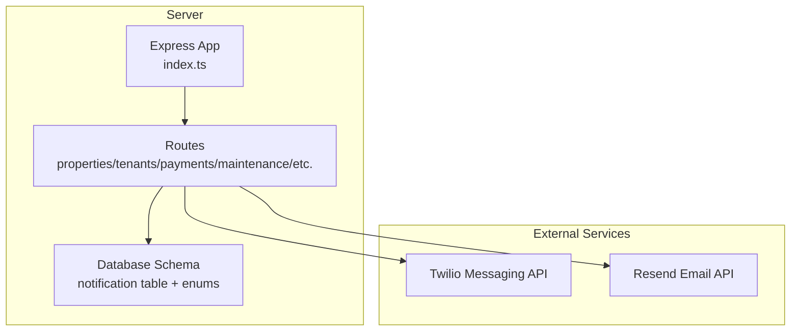
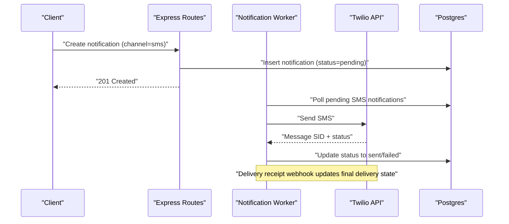
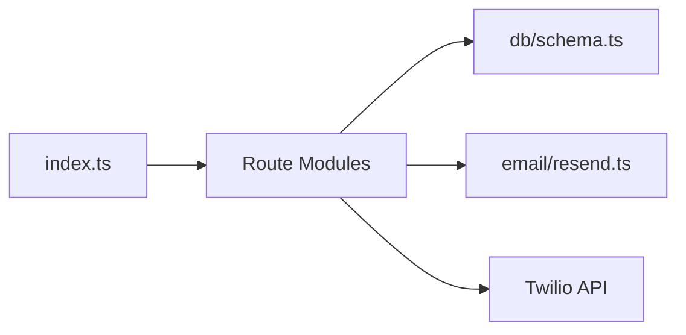

# SMS Notification Integration

<cite>
**Referenced Files in This Document**
- [schema.ts](file://server/src/db/schema.ts)
- [docker-compose.yml](file://docker-compose.yml)
- [index.ts](file://server/src/index.ts)
- [resend.ts](file://server/src/email/resend.ts)
- [RentLite-Product-Spec-Sheet.md](file://RentLite-Product-Spec-Sheet.md)
</cite>

## Table of Contents
1. [Introduction](#introduction)
2. [Project Structure](#project-structure)
3. [Core Components](#core-components)
4. [Architecture Overview](#architecture-overview)
5. [Detailed Component Analysis](#detailed-component-analysis)
6. [Dependency Analysis](#dependency-analysis)
7. [Performance Considerations](#performance-considerations)
8. [Troubleshooting Guide](#troubleshooting-guide)
9. [Conclusion](#conclusion)
10. [Appendices](#appendices)

## Introduction
This document provides comprehensive guidance for integrating SMS notifications using Twilio into the RentLite application. It covers configuration, message sending, template management, delivery tracking, error handling, compliance, and operational best practices. The project includes environment variables for Twilio and a notification schema that supports SMS as a channel, enabling future implementation of SMS workflows alongside existing email capabilities.

## Project Structure
The server exposes REST routes and uses a Postgres database with Drizzle ORM. Environment variables include placeholders for Twilio credentials and phone number. Email functionality is implemented; SMS integration is prepared via configuration and data model but not yet implemented in code.

**Diagram sources**
- [index.ts:21-49](file://server/src/index.ts#L21-L49)
- [schema.ts:90-110](file://server/src/db/schema.ts#L90-L110)
- [schema.ts:369-383](file://server/src/db/schema.ts#L369-L383)
- [resend.ts:1-30](file://server/src/email/resend.ts#L1-L30)

**Section sources**
- [index.ts:21-49](file://server/src/index.ts#L21-L49)
- [schema.ts:90-110](file://server/src/db/schema.ts#L90-L110)
- [schema.ts:369-383](file://server/src/db/schema.ts#L369-L383)
- [resend.ts:1-30](file://server/src/email/resend.ts#L1-L30)

## Core Components
- Notification Data Model: Defines channels (email, sms, in_app), types (rent reminder, maintenance update, etc.), status (pending, sent, failed), scheduling, and timestamps.
- Environment Configuration: Docker Compose exposes TWILIO_SID, TWILIO_AUTH_TOKEN, and TWILIO_PHONE for runtime configuration.
- Product Scope: The product spec lists Twilio as an MVP integration for SMS reminders and maintenance notifications.

These components provide the foundation to implement SMS sending, templating, queuing, and delivery tracking.

**Section sources**
- [schema.ts:90-110](file://server/src/db/schema.ts#L90-L110)
- [schema.ts:369-383](file://server/src/db/schema.ts#L369-L383)
- [docker-compose.yml:35-37](file://docker-compose.yml#L35-L37)
- [RentLite-Product-Spec-Sheet.md:291-303](file://RentLite-Product-Spec-Sheet.md#L291-L303)

## Architecture Overview
The intended SMS flow integrates with the existing route layer and notification model:
- Business logic triggers a notification creation (type, channel=sms, recipient, body).
- A background worker or queue consumer picks up pending SMS messages.
- The worker calls Twilio to send the message and updates status to sent or failed.
- Delivery receipts from Twilio can be used to update final delivery state.

[No diagram sources since this is a conceptual integration flow]

## Detailed Component Analysis

### Configuration Setup
- Environment Variables:
  - TWILIO_SID: Twilio Account SID
  - TWILIO_AUTH_TOKEN: Twilio Auth Token
  - TWILIO_PHONE: Twilio phone number to send from
- These are defined in Docker Compose and loaded by the server process at runtime.

Operational steps:
- Provision a Twilio account and obtain SID and Auth Token.
- Purchase or configure a Twilio phone number.
- Set environment variables in your deployment environment.
- Ensure outbound network access to Twilio APIs.

**Section sources**
- [docker-compose.yml:35-37](file://docker-compose.yml#L35-L37)

### Message Sending Functionality
Implementation approach:
- Create a service module that encapsulates Twilio client initialization and send operations.
- Use environment variables to configure the client securely.
- Expose a function to send SMS given recipient, body, and optional metadata.

Recommended patterns:
- Validate recipient phone numbers before sending.
- Sanitize and truncate message bodies to comply with SMS length limits.
- Return structured results including message ID and status for tracking.

Error handling:
- Catch network errors and provider errors.
- Persist failures with retry information.
- Avoid exposing internal error details to clients.

**Section sources**
- [docker-compose.yml:35-37](file://docker-compose.yml#L35-L37)

### Template Management
Templates should be centralized and parameterized:
- Define templates per notification type (e.g., rent reminder, maintenance update).
- Support dynamic fields such as tenant name, property, amount, due date.
- Keep templates in code or a config store for versioning and localization.

Template examples (described):
- Payment Reminder: Friendly reminder with amount, due date, and property/unit context.
- Maintenance Alert: Status update on a maintenance request with priority and next steps.
- Vendor Communication: Assignment or update notice with contact details and instructions.

Best practices:
- Keep messages concise and scannable.
- Include clear call-to-action when appropriate.
- Avoid sensitive data in SMS; link to secure portal if needed.

**Section sources**
- [schema.ts:90-98](file://server/src/db/schema.ts#L90-L98)

### Delivery Tracking and Queues
Tracking:
- Use the notification table to record each attempt, status, and timestamps.
- Update status to sent upon successful dispatch and to failed on errors.
- Record external IDs (e.g., Twilio Message SID) for traceability.

Queues:
- Implement a simple job queue or use a task runner to process pending notifications.
- Prioritize urgent messages (e.g., emergency maintenance).
- Enforce rate limiting and backoff strategies.

Receipts:
- Configure a webhook endpoint to receive delivery receipts from Twilio.
- Map receipt statuses to final delivery outcomes and update records accordingly.

**Section sources**
- [schema.ts:369-383](file://server/src/db/schema.ts#L369-L383)

### Error Handling, Rate Limiting, and International Messaging
Error handling:
- Classify errors into transient (network timeouts, throttling) and permanent (invalid numbers).
- Retry transient errors with exponential backoff and jitter.
- Log detailed diagnostics without leaking secrets.

Rate limiting:
- Respect Twilio rate limits and apply per-recipient pacing.
- Batch non-urgent messages during off-peak hours.

International messaging:
- Validate international formats and ensure consent.
- Be aware of character encoding and potential costs.
- Provide opt-out mechanisms and comply with local regulations.

**Section sources**
- [schema.ts:106-110](file://server/src/db/schema.ts#L106-L110)

### Compliance and Opt-Out Management
Compliance:
- Obtain explicit consent before sending marketing or frequent notifications.
- Honor STOP/UNSUBSCRIBE requests immediately.
- Maintain audit logs for consent and opt-outs.

Opt-out management:
- Store opt-out preferences per recipient.
- Suppress further messages until re-consented.
- Provide easy ways to manage preferences in-app or via reply keywords.

Formatting best practices:
- Keep messages under 160 characters for single-part SMS.
- Use plain text; avoid special formatting.
- Include sender identification where required.

[No sources needed since this section provides general guidance]

### Programmatic Examples (Conceptual)
- Send SMS:
  - Build a service method that takes recipient, body, and metadata.
  - Call Twilio to send and persist result.
- Handle Delivery Receipts:
  - Expose a webhook endpoint to receive Twilio callbacks.
  - Update notification status based on receipt payload.
- Manage Queues:
  - Poll pending notifications and dispatch with retries.
  - Track progress and failures in the database.

[No sources needed since this section describes conceptual usage]

## Dependency Analysis
- Server entrypoint mounts routes and middleware.
- Database schema defines notification entities and enums.
- Email module demonstrates a similar pattern for external service integration.
- Product spec confirms Twilio as an intended integration.

**Diagram sources**
- [index.ts:21-49](file://server/src/index.ts#L21-L49)
- [schema.ts:90-110](file://server/src/db/schema.ts#L90-L110)
- [resend.ts:1-30](file://server/src/email/resend.ts#L1-L30)

**Section sources**
- [index.ts:21-49](file://server/src/index.ts#L21-L49)
- [schema.ts:90-110](file://server/src/db/schema.ts#L90-L110)
- [resend.ts:1-30](file://server/src/email/resend.ts#L1-L30)

## Performance Considerations
- Use asynchronous processing for SMS dispatch to keep API responses fast.
- Implement batching for non-urgent notifications.
- Cache or deduplicate repeated messages to reduce cost and load.
- Monitor latency and error rates; set alerts for spikes.

[No sources needed since this section provides general guidance]

## Troubleshooting Guide
Common issues and resolutions:
- Missing or invalid Twilio credentials:
  - Verify environment variables are set and correct.
  - Confirm account permissions and billing status.
- Invalid recipient numbers:
  - Validate phone numbers before sending.
  - Normalize formats and handle country codes.
- Rate limiting or throttling:
  - Reduce send frequency and implement backoff.
  - Distribute sends across time windows.
- Delivery failures:
  - Check Twilio console for error codes and messages.
  - Inspect webhook endpoints for receipt handling.
- Network or DNS issues:
  - Ensure outbound connectivity to Twilio endpoints.
  - Review proxy/firewall settings.

Monitoring:
- Track metrics: sent, failed, pending, delivery receipts.
- Log key events with correlation IDs.
- Set dashboards and alerts for anomalies.

**Section sources**
- [schema.ts:106-110](file://server/src/db/schema.ts#L106-L110)

## Conclusion
RentLite is configured and modeled to support SMS notifications via Twilio. While the SMS sending implementation is not present in the current codebase, the environment variables and notification schema provide a solid foundation. Following the recommended architecture, templates, queues, and compliance practices will enable robust, scalable SMS communication for payments, maintenance, and vendor interactions.

[No sources needed since this section summarizes without analyzing specific files]

## Appendices

### Data Model Reference
- Notification table fields include id, user_id, type, channel, recipient, subject, body, status, scheduled_at, sent_at, created_at.
- Enums define allowed values for type, channel, and status.

**Section sources**
- [schema.ts:90-110](file://server/src/db/schema.ts#L90-L110)
- [schema.ts:369-383](file://server/src/db/schema.ts#L369-L383)

### Environment Variables Reference
- TWILIO_SID: Twilio Account SID
- TWILIO_AUTH_TOKEN: Twilio Auth Token
- TWILIO_PHONE: Twilio phone number

**Section sources**
- [docker-compose.yml:35-37](file://docker-compose.yml#L35-L37)

### Integration Scope
- Twilio is listed as an MVP integration for SMS reminders and maintenance notifications.

**Section sources**
- [RentLite-Product-Spec-Sheet.md:291-303](file://RentLite-Product-Spec-Sheet.md#L291-L303)