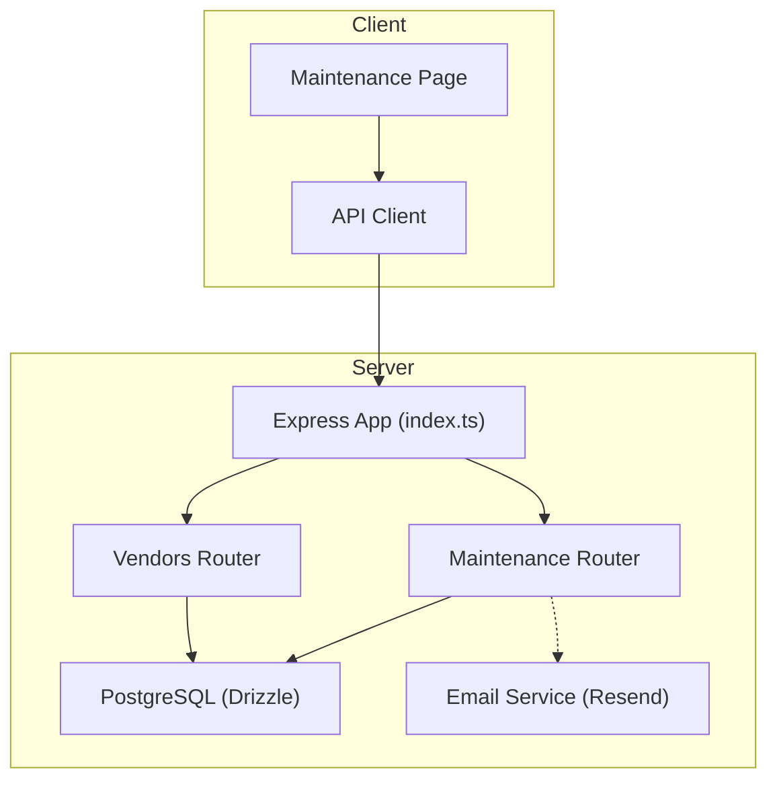
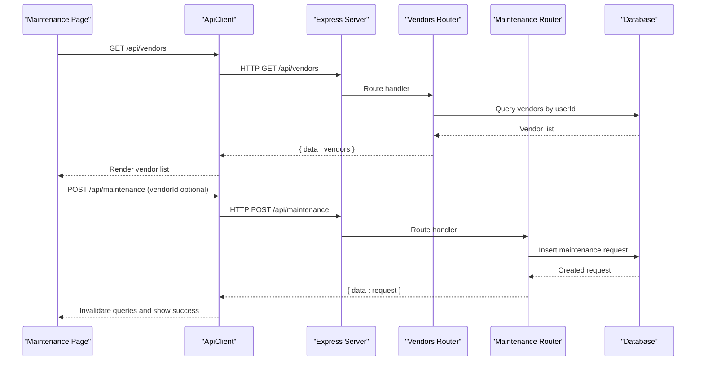
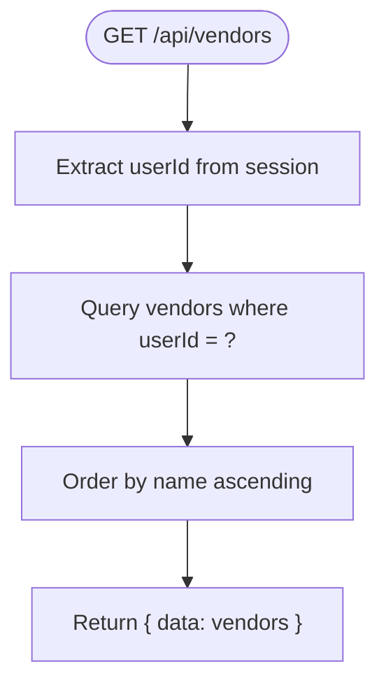
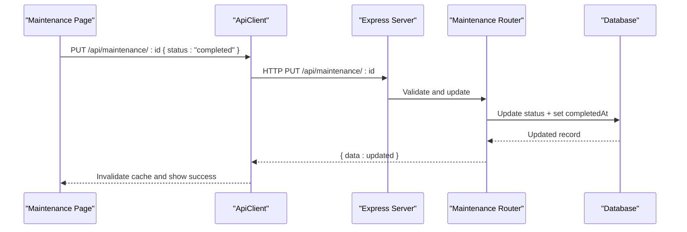
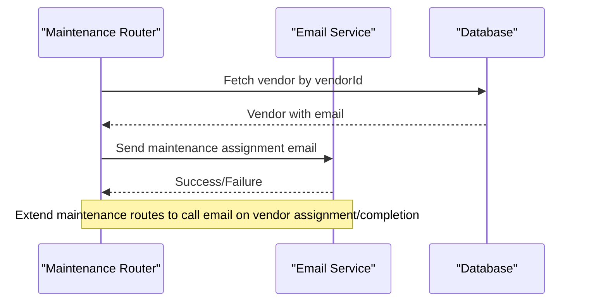
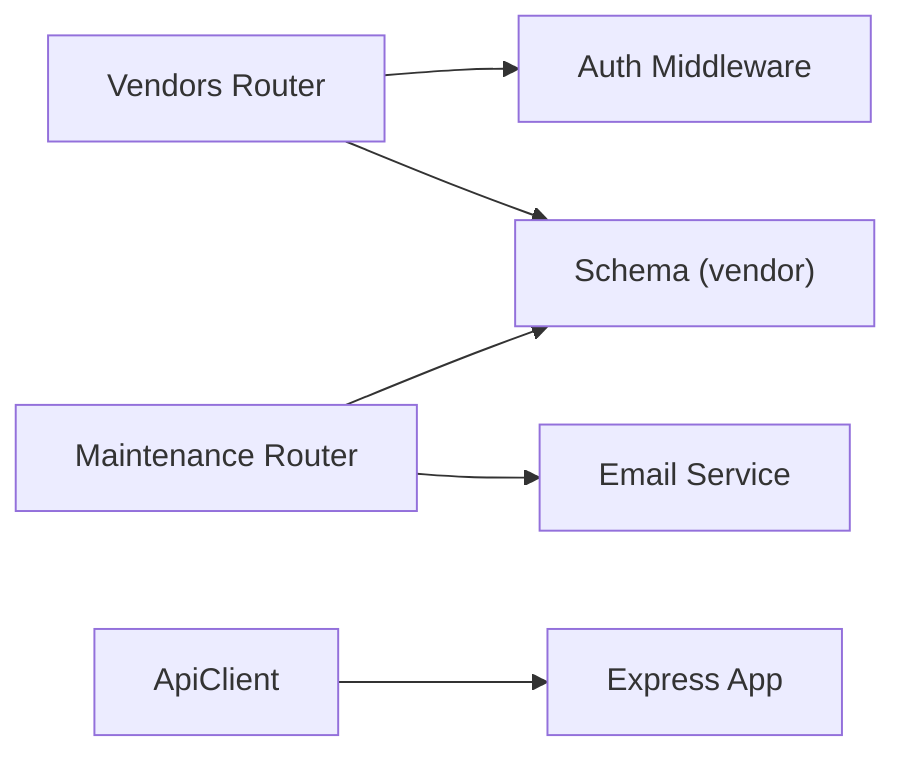

# Vendor Management Integration

<cite>
**Referenced Files in This Document**
- [vendors.ts](file://server/src/routes/vendors.ts)
- [schema.ts](file://server/src/db/schema.ts)
- [maintenance.ts](file://server/src/routes/maintenance.ts)
- [Maintenance.tsx](file://client/src/pages/Maintenance.tsx)
- [api.ts](file://client/src/lib/api.ts)
- [resend.ts](file://server/src/email/resend.ts)
- [index.ts](file://server/src/index.ts)
- [types.ts](file://shared/src/types.ts)
</cite>

## Table of Contents
1. Introduction
2. Project Structure
3. Core Components
4. Architecture Overview
5. Detailed Component Analysis
6. Dependency Analysis
7. Performance Considerations
8. Troubleshooting Guide
9. Conclusion

## Introduction
This document explains how RentLite manages vendors and integrates with third-party services to support vendor directory management, service categorization, performance tracking, communication workflows, and reporting. It covers the current implementation for vendor CRUD operations, maintenance request assignment to vendors, notification capabilities via email, and outlines recommended integration patterns for background checks, screening APIs, and vendor verification systems.

## Project Structure
RentLite is a full-stack application with:
- A Node/Express server exposing REST endpoints for properties, units, tenants, leases, payments, maintenance, expenses, vendors, reports, and dashboard.
- A React client that consumes these endpoints and provides UI for managing maintenance requests and other features.
- Shared TypeScript types used across client and server.
- Database schema defined using Drizzle ORM with PostgreSQL.

**Diagram sources**
- [index.ts:20-62](file://server/src/index.ts#L20-L62)
- [vendors.ts:1-70](file://server/src/routes/vendors.ts#L1-L70)
- [maintenance.ts:1-103](file://server/src/routes/maintenance.ts#L1-L103)
- [resend.ts:1-113](file://server/src/email/resend.ts#L1-L113)

**Section sources**
- [index.ts:20-62](file://server/src/index.ts#L20-L62)
- [schema.ts:350-365](file://server/src/db/schema.ts#L350-L365)

## Core Components
- Vendor Directory: Stores vendor contact information, trade category, insurance expiry, and notes. Accessible via authenticated endpoints scoped per user.
- Maintenance Requests: Linked to vendors through a foreign key; supports status progression and completion tracking.
- Notifications: Email templates exist for maintenance updates; can be extended to notify vendors or landlords about assignments and completions.
- Types: Shared TypeScript interfaces define Vendor, MaintenanceRequest, and related entities.

Key responsibilities:
- Vendors route: CRUD for vendor records with validation and user scoping.
- Maintenance route: Create, read, update, delete maintenance requests; filter by status/priority; associate with vendors.
- Email module: Send templated emails for tenant notifications; extensible for vendor communications.

**Section sources**
- [vendors.ts:11-68](file://server/src/routes/vendors.ts#L11-L68)
- [maintenance.ts:11-100](file://server/src/routes/maintenance.ts#L11-L100)
- [resend.ts:7-113](file://server/src/email/resend.ts#L7-L113)
- [types.ts:151-164](file://shared/src/types.ts#L151-L164)
- [types.ts:92-114](file://shared/src/types.ts#L92-L114)

## Architecture Overview
The system follows a standard REST architecture:
- The Express app mounts routers under /api/* paths.
- Each router validates input, enforces authorization via middleware, and persists data using Drizzle ORM against PostgreSQL.
- The client uses a typed API client to call endpoints and manage UI state.

**Diagram sources**
- [index.ts:51-62](file://server/src/index.ts#L51-L62)
- [vendors.ts:20-38](file://server/src/routes/vendors.ts#L20-L38)
- [maintenance.ts:25-67](file://server/src/routes/maintenance.ts#L25-L67)

## Detailed Component Analysis

### Vendor Directory Management
- Data model: Vendor includes name, trade (category), phone, email, insuranceExpiry, notes, timestamps, and user scoping.
- Endpoints:
  - List vendors for the authenticated user, ordered by name.
  - Create a vendor with validation.
  - Update fields partially with validation.
  - Delete a vendor if it belongs to the user.
- Search and filtering:
  - Current listing returns all vendors for the user sorted by name.
  - To add search/filtering (e.g., by trade or insurance expiry), extend the GET endpoint to accept query parameters and apply filters before returning results.
- Contact storage and categorization:
  - Trade field serves as service categorization.
  - Insurance expiry enables proactive renewal reminders.
- Performance tracking:
  - Track vendor performance via maintenance request metrics (costs, completion times) linked by vendorId.

**Diagram sources**
- [vendors.ts:20-28](file://server/src/routes/vendors.ts#L20-L28)

**Section sources**
- [schema.ts:350-365](file://server/src/db/schema.ts#L350-L365)
- [vendors.ts:11-68](file://server/src/routes/vendors.ts#L11-L68)
- [types.ts:151-164](file://shared/src/types.ts#L151-L164)

### Maintenance Requests and Vendor Assignment
- Data model: MaintenanceRequest links to unit, property, tenant (optional), and vendor (optional). Includes priority, status, photos, cost, and timestamps.
- Endpoints:
  - List requests filtered by user’s properties and optional status/priority.
  - Get single request including associated vendor.
  - Create a new request with optional vendorId and cost.
  - Update status and completion details; auto-set completedAt when status becomes completed.
  - Delete a request.
- Workflow:
  - Landlord or tenant creates a request.
  - Assign a vendor during creation or later update.
  - Advance status through submitted → acknowledged → in_progress → completed.
  - On completion, capture completion photos and timestamp.

**Diagram sources**
- [maintenance.ts:69-90](file://server/src/routes/maintenance.ts#L69-L90)

**Section sources**
- [schema.ts:291-325](file://server/src/db/schema.ts#L291-L325)
- [maintenance.ts:11-100](file://server/src/routes/maintenance.ts#L11-L100)
- [types.ts:92-114](file://shared/src/types.ts#L92-L114)

### Vendor Communication Workflows
- Automated notifications:
  - Email templates exist for maintenance updates to tenants. These can be extended to notify vendors about job assignments and completions.
  - Use the Resend integration to send HTML emails reliably.
- Job assignments:
  - When a maintenance request is assigned to a vendor (vendorId set), trigger an email to the vendor’s email address with job details.
- Completion tracking:
  - When a request is marked completed, send a confirmation email to the landlord and optionally to the vendor.

**Diagram sources**
- [maintenance.ts:47-55](file://server/src/routes/maintenance.ts#L47-L55)
- [resend.ts:7-30](file://server/src/email/resend.ts#L7-L30)

**Section sources**
- [resend.ts:32-113](file://server/src/email/resend.ts#L32-L113)
- [maintenance.ts:47-55](file://server/src/routes/maintenance.ts#L47-L55)

### Vendor Rating Systems, Reviews, and Quality Assurance
- Current state: No explicit rating or review tables are present in the schema.
- Recommended approach:
  - Add a VendorRating table with fields such as vendorId, score (e.g., 1–5), comment, reviewerId (landlord), createdAt, updatedAt.
  - Expose endpoints to create/update ratings and compute average scores for vendor profiles.
  - Integrate quality assurance checks: flag vendors with low average scores or recent negative reviews for review.
- Benefits:
  - Enables performance tracking beyond maintenance costs and completion times.
  - Supports informed vendor selection and accountability.

[No sources needed since this section proposes future enhancements not yet implemented]

### Examples of Vendor Operations, Search/Filtering, and Reports
- Vendor CRUD examples:
  - Create: POST /api/vendors with validated body (name, trade, optional phone/email/insuranceExpiry/notes).
  - Read: GET /api/vendors returns all vendors for the authenticated user.
  - Update: PUT /api/vendors/:id with partial fields.
  - Delete: DELETE /api/vendors/:id removes the vendor if owned by the user.
- Search and filtering:
  - Extend GET /api/vendors to accept query parameters like trade, contains(name), insuranceExpiryBefore(date).
  - Apply filters in the route handler before querying the database.
- Report generation:
  - Use existing maintenance and expense data to generate vendor performance reports: total jobs, average cost, completion time, failure rate, and average rating (once implemented).
  - Aggregate by vendorId and export as CSV or JSON via a dedicated report endpoint.

**Section sources**
- [vendors.ts:20-68](file://server/src/routes/vendors.ts#L20-L68)
- [maintenance.ts:25-45](file://server/src/routes/maintenance.ts#L25-L45)

### Integration Patterns for External Vendor APIs, Data Sync, and Real-Time Updates
- Background check and screening APIs:
  - Plan to integrate with a provider (e.g., TransUnion SmartMove) for credit reports, background checks, eviction history, and income verification.
  - Implement a service layer to call external APIs securely, handle retries, and store results in a screening_results table linked to applicants or tenants.
- Vendor verification systems:
  - Periodically verify vendor licenses and insurance status via external APIs or manual uploads; store verification status and expiry dates.
- Data synchronization:
  - Use scheduled jobs to sync vendor directories from external platforms, reconcile duplicates, and update local records.
- Real-time updates:
  - For real-time vendor availability or status changes, consider WebSockets or server-sent events to push updates to the client when vendor records change.

[No sources needed since this section outlines recommended integrations not yet implemented]

## Dependency Analysis
Vendor-related dependencies and relationships:
- Vendors route depends on authentication middleware and database schema.
- Maintenance route depends on vendor association and can trigger email notifications.
- Email module depends on environment configuration for the email provider.
- Client API client handles error responses and redirects on unauthorized access.

**Diagram sources**
- [vendors.ts:1-9](file://server/src/routes/vendors.ts#L1-L9)
- [maintenance.ts:1-9](file://server/src/routes/maintenance.ts#L1-L9)
- [resend.ts:1-30](file://server/src/email/resend.ts#L1-L30)
- [api.ts:26-54](file://client/src/lib/api.ts#L26-L54)

**Section sources**
- [index.ts:20-62](file://server/src/index.ts#L20-L62)
- [api.ts:26-54](file://client/src/lib/api.ts#L26-L54)

## Performance Considerations
- Indexing: Ensure indexes on frequently queried columns such as vendor.userId, maintenanceRequest.vendorId, and maintenanceRequest.status to optimize filtering and joins.
- Pagination: For large vendor lists or maintenance histories, implement pagination to reduce payload size and improve response times.
- Caching: Cache vendor lists and maintenance summaries at the client level using React Query; consider server-side caching for expensive aggregations.
- Validation: Keep Zod schemas minimal and focused to avoid unnecessary processing overhead.

[No sources needed since this section provides general guidance]

## Troubleshooting Guide
Common issues and resolutions:
- Vendor data sync issues:
  - Verify user scoping: ensure queries filter by userId to prevent cross-user data leaks.
  - Check database constraints: confirm vendor.userId references a valid user and that cascading deletes behave as expected.
  - Validate inputs: use Zod schemas to catch malformed payloads early and return structured errors.
- API connectivity problems:
  - Confirm CORS settings and credentials handling in the Express app and client fetch options.
  - Inspect client error handling: unauthorized responses redirect to login; network errors should surface user-friendly messages.
- Email delivery failures:
  - Validate environment variables for the email provider.
  - Log and handle errors returned by the email service; retry failed sends with backoff.

**Section sources**
- [vendors.ts:20-68](file://server/src/routes/vendors.ts#L20-L68)
- [maintenance.ts:25-100](file://server/src/routes/maintenance.ts#L25-L100)
- [api.ts:26-54](file://client/src/lib/api.ts#L26-L54)
- [resend.ts:7-30](file://server/src/email/resend.ts#L7-L30)

## Conclusion
RentLite currently provides robust vendor directory management and maintenance request workflows with strong data modeling and clear separation of concerns. While advanced integrations like background checks and vendor verification are not yet implemented, the codebase is well-positioned to extend these capabilities through additional routes, services, and scheduled jobs. Enhancing search/filtering, adding vendor ratings, and implementing automated vendor notifications will further streamline vendor management and improve operational efficiency.