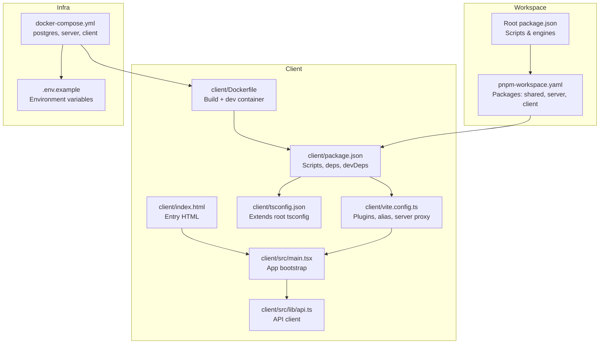
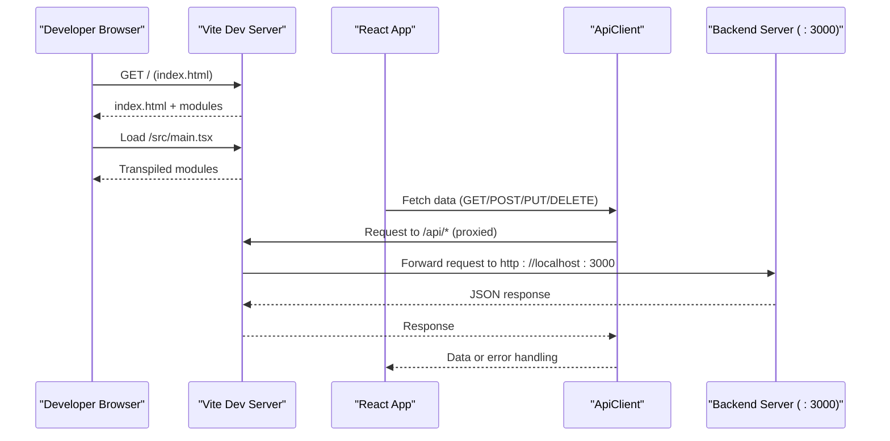
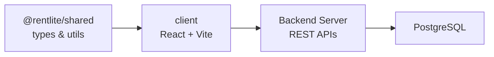

# Build & Development

<cite>
**Referenced Files in This Document**
- [package.json](file://package.json)
- [pnpm-workspace.yaml](file://pnpm-workspace.yaml)
- [tsconfig.json](file://tsconfig.json)
- [client/package.json](file://client/package.json)
- [client/vite.config.ts](file://client/vite.config.ts)
- [client/tsconfig.json](file://client/tsconfig.json)
- [client/src/main.tsx](file://client/src/main.tsx)
- [client/index.html](file://client/index.html)
- [client/Dockerfile](file://client/Dockerfile)
- [docker-compose.yml](file://docker-compose.yml)
- [.env.example](file://.env.example)
- [shared/package.json](file://shared/package.json)
- [client/src/lib/api.ts](file://client/src/lib/api.ts)
</cite>

## Table of Contents
1. Introduction
2. Project Structure
3. Core Components
4. Architecture Overview
5. Detailed Component Analysis
6. Dependency Analysis
7. Performance Considerations
8. Troubleshooting Guide
9. Conclusion
10. Appendices

## Introduction
This document explains the build and development setup for the RentLite frontend (the client package). It covers Vite configuration, TypeScript settings, dependencies, scripts, environment variables, Docker-based workflows, asset handling, deployment, debugging, and performance optimization strategies. The goal is to help you set up a local development environment, run the application, and optimize builds for production.

## Project Structure
The project uses a pnpm workspace with three packages: shared, server, and client. The frontend lives under client/ and is built with Vite and React. A root-level docker-compose orchestrates Postgres, the backend server, and the client dev server. Environment variables are defined via .env files and exposed to services through compose.

**Diagram sources**
- [package.json:1-21](file://package.json#L1-L21)
- [pnpm-workspace.yaml:1-5](file://pnpm-workspace.yaml#L1-L5)
- [client/package.json:1-44](file://client/package.json#L1-L44)
- [client/vite.config.ts:1-24](file://client/vite.config.ts#L1-L24)
- [client/tsconfig.json:1-16](file://client/tsconfig.json#L1-L16)
- [client/src/main.tsx:1-29](file://client/src/main.tsx#L1-L29)
- [client/index.html:1-16](file://client/index.html#L1-L16)
- [client/Dockerfile:1-20](file://client/Dockerfile#L1-L20)
- [docker-compose.yml:1-64](file://docker-compose.yml#L1-L64)
- [.env.example:1-23](file://.env.example#L1-L23)

**Section sources**
- [package.json:1-21](file://package.json#L1-L21)
- [pnpm-workspace.yaml:1-5](file://pnpm-workspace.yaml#L1-L5)
- [client/package.json:1-44](file://client/package.json#L1-L44)
- [client/vite.config.ts:1-24](file://client/vite.config.ts#L1-L24)
- [client/tsconfig.json:1-16](file://client/tsconfig.json#L1-L16)
- [client/src/main.tsx:1-29](file://client/src/main.tsx#L1-L29)
- [client/index.html:1-16](file://client/index.html#L1-L16)
- [client/Dockerfile:1-20](file://client/Dockerfile#L1-L20)
- [docker-compose.yml:1-64](file://docker-compose.yml#L1-L64)
- [.env.example:1-23](file://.env.example#L1-L23)

## Core Components
- Vite configuration: React plugin, Tailwind CSS integration, path aliases, dev server host/port/proxy to backend.
- TypeScript: Root strict settings extended by client-specific options including JSX mode, lib targets, and module resolution.
- Scripts: Workspace-level scripts orchestrate building shared, server, and client; per-package scripts provide dev/build/check/preview.
- Environment: Client reads API base URL from an environment variable; compose injects runtime values into containers.
- Docker: Client image installs dependencies, builds shared package, builds client assets, and runs the dev server.

Key responsibilities:
- client/vite.config.ts: Defines plugins, resolve aliases, and dev server proxying to the backend at localhost:3000.
- client/tsconfig.json: Extends root tsconfig, sets outDir/rootDir, JSX transform, baseUrl/paths, and types.
- client/package.json: Declares runtime and dev dependencies, and exposes npm scripts for dev/build/check/preview.
- client/src/main.tsx: Bootstraps React app with providers and global query client configuration.
- client/src/lib/api.ts: Centralized fetch wrapper using Vite env for API base URL and credentials handling.

**Section sources**
- [client/vite.config.ts:1-24](file://client/vite.config.ts#L1-L24)
- [client/tsconfig.json:1-16](file://client/tsconfig.json#L1-L16)
- [client/package.json:1-44](file://client/package.json#L1-L44)
- [client/src/main.tsx:1-29](file://client/src/main.tsx#L1-L29)
- [client/src/lib/api.ts:1-81](file://client/src/lib/api.ts#L1-L81)
- [tsconfig.json:1-17](file://tsconfig.json#L1-L17)
- [package.json:1-21](file://package.json#L1-L21)

## Architecture Overview
The frontend runs as a Vite dev server during development and serves static assets in production. It proxies API calls to the backend when running locally. The application bootstraps React with TanStack Query and authentication context, and communicates with the backend via a typed API client.

**Diagram sources**
- [client/vite.config.ts:13-22](file://client/vite.config.ts#L13-L22)
- [client/src/lib/api.ts:1-81](file://client/src/lib/api.ts#L1-L81)
- [client/index.html:1-16](file://client/index.html#L1-L16)
- [client/src/main.tsx:1-29](file://client/src/main.tsx#L1-L29)

## Detailed Component Analysis

### Vite Configuration
- Plugins: React refresh and Tailwind CSS integration for fast UI development.
- Resolve alias: @ maps to src for cleaner imports.
- Dev server: Hosts on all interfaces, listens on port 5173, and proxies /api requests to the backend at http://localhost:3000 with origin change enabled.

Optimization notes:
- Use HMR-enabled development for instant feedback.
- Proxy avoids CORS issues during local development.

**Section sources**
- [client/vite.config.ts:1-24](file://client/vite.config.ts#L1-L24)

### TypeScript Configuration
- Root tsconfig enforces strict type checking, ES2022 target, ESNext modules, bundler resolution, isolated modules, source maps, and declaration generation.
- Client tsconfig extends root, sets output/input directories, DOM libs, JSX transform, baseUrl/paths for @ alias, and includes Vite client types.

Type safety tips:
- Keep strict enabled to catch errors early.
- Use the @ alias consistently to avoid relative path drift.
- Run tsc --noEmit via scripts to validate without emitting files.

**Section sources**
- [tsconfig.json:1-17](file://tsconfig.json#L1-L17)
- [client/tsconfig.json:1-16](file://client/tsconfig.json#L1-L16)

### Dependencies and Scripts
- Runtime dependencies include React 19, Radix UI primitives, TanStack Query, Recharts, Sonner, Wouter routing, and utility libraries.
- Dev dependencies include Vite 6, React plugin, Tailwind v4, TypeScript 5, and Tailwind Vite integration.
- Scripts:
  - Workspace: dev (compose), dev:server, dev:client, build (shared -> server -> client), check (type checks across packages).
  - Client: dev (Vite with host), build (production bundle), check (tsc no emit), preview (serve production build).

Workflow guidance:
- Use workspace scripts to coordinate multi-package builds.
- Use client scripts for focused frontend tasks.

**Section sources**
- [client/package.json:1-44](file://client/package.json#L1-L44)
- [package.json:1-21](file://package.json#L1-L21)
- [shared/package.json:1-22](file://shared/package.json#L1-L22)

### Application Bootstrap and API Client
- main.tsx initializes React with StrictMode, TanStack Query provider configured with default caching/retry behavior, AuthProvider, and toast notifications.
- api.ts defines a centralized fetch wrapper that:
  - Reads API base URL from Vite environment variables.
  - Builds URLs with optional query params.
  - Includes credentials for cookies/sessions.
  - Handles 401 by redirecting to login.
  - Throws structured errors for non-ok responses.

Debugging tips:
- Inspect network tab for proxied /api calls.
- Verify VITE_API_URL if not using proxy.

**Section sources**
- [client/src/main.tsx:1-29](file://client/src/main.tsx#L1-L29)
- [client/src/lib/api.ts:1-81](file://client/src/lib/api.ts#L1-L81)

### Environment Variables and Compose
- .env.example documents required keys for database, auth, email, SMS, and integrations.
- docker-compose.yml:
  - Runs Postgres, server, and client services.
  - Injects environment variables into services.
  - Exposes ports for DB (5432), server (3000), and client (5173).
  - Mounts volumes for DB data and uploads.

Local setup:
- Copy .env.example to .env and fill secrets.
- Start services with workspace script or compose directly.

**Section sources**
- [.env.example:1-23](file://.env.example#L1-L23)
- [docker-compose.yml:1-64](file://docker-compose.yml#L1-L64)

### Docker Build and Dev
- client/Dockerfile:
  - Uses Node 22 Alpine with pnpm.
  - Installs workspace dependencies.
  - Builds shared package then client.
  - Exposes port 5173 and runs client dev server.

Use cases:
- Containerized development for consistent environments.
- CI-friendly builds that produce optimized assets.

**Section sources**
- [client/Dockerfile:1-20](file://client/Dockerfile#L1-L20)

## Dependency Analysis
The client depends on the shared package for types and utilities. The workspace ensures consistent versions and enables cross-package references.

**Diagram sources**
- [pnpm-workspace.yaml:1-5](file://pnpm-workspace.yaml#L1-L5)
- [shared/package.json:1-22](file://shared/package.json#L1-L22)
- [client/package.json:1-44](file://client/package.json#L1-L44)
- [docker-compose.yml:1-64](file://docker-compose.yml#L1-L64)

**Section sources**
- [pnpm-workspace.yaml:1-5](file://pnpm-workspace.yaml#L1-L5)
- [shared/package.json:1-22](file://shared/package.json#L1-L22)
- [client/package.json:1-44](file://client/package.json#L1-L44)

## Performance Considerations
- Development:
  - Rely on Vite HMR for fast edits.
  - Keep proxy active to avoid CORS overhead.
- Production builds:
  - Use vite build to generate optimized assets.
  - Ensure unused code is tree-shaken by keeping dependencies minimal.
  - Prefer lazy loading routes and components where applicable.
- Network:
  - Configure TanStack Query defaults for staleTime and refetch behavior to reduce unnecessary requests.
  - Use credentials only when necessary; prefer token-based auth if possible.
- Assets:
  - Preconnect to external fonts and CDNs used in index.html.
  - Optimize images and use modern formats when adding media assets.

[No sources needed since this section provides general guidance]

## Troubleshooting Guide
Common issues and resolutions:
- Port conflicts:
  - If port 5173 or 3000 is in use, adjust vite.config server port or stop conflicting processes.
- Proxy not working:
  - Ensure /api paths are requested and the backend is running on localhost:3000.
  - Check changeOrigin setting and firewall rules.
- Type errors:
  - Run workspace check to validate all packages.
  - Confirm client tsconfig extends root and includes correct libs/types.
- Environment variables:
  - Verify VITE_API_URL is set when not using proxy.
  - Ensure .env is present and compose injects variables correctly.
- Docker issues:
  - Rebuild images after dependency changes.
  - Check logs for service startup failures and health checks.

**Section sources**
- [client/vite.config.ts:13-22](file://client/vite.config.ts#L13-L22)
- [client/src/lib/api.ts:1-81](file://client/src/lib/api.ts#L1-L81)
- [client/tsconfig.json:1-16](file://client/tsconfig.json#L1-L16)
- [docker-compose.yml:1-64](file://docker-compose.yml#L1-L64)

## Conclusion
The RentLite frontend leverages Vite for rapid development, TypeScript for strong typing, and a pnpm workspace for cohesive multi-package management. With clear scripts, environment configuration, and Docker support, you can develop locally, build optimized assets, and deploy confidently. Follow the guidelines here to maintain consistency, improve performance, and troubleshoot effectively.

[No sources needed since this section summarizes without analyzing specific files]

## Appendices

### Local Development Workflow
- Install dependencies using the workspace tooling.
- Start services via compose or individual scripts.
- Access the app at the client port and verify API proxying.

**Section sources**
- [package.json:1-21](file://package.json#L1-L21)
- [docker-compose.yml:1-64](file://docker-compose.yml#L1-L64)

### Build and Preview
- Build the client to generate production assets.
- Preview the build locally to validate output before deployment.

**Section sources**
- [client/package.json:1-44](file://client/package.json#L1-L44)

### Deployment Notes
- The client Dockerfile demonstrates building shared and client packages and serving the dev server. For production, serve the built static assets via a web server or CDN.
- Ensure environment variables are configured for the target environment.

**Section sources**
- [client/Dockerfile:1-20](file://client/Dockerfile#L1-L20)
- [docker-compose.yml:1-64](file://docker-compose.yml#L1-L64)