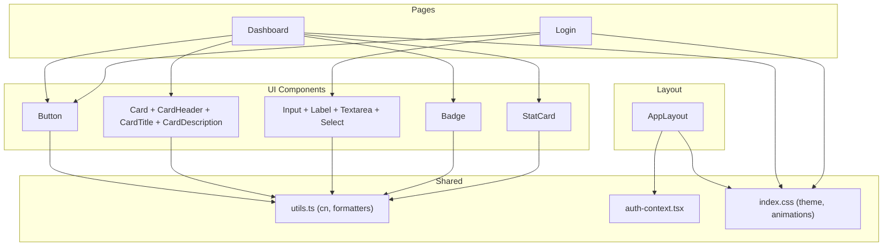
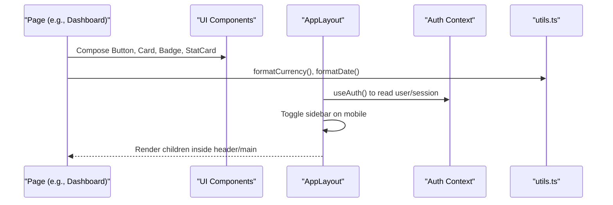
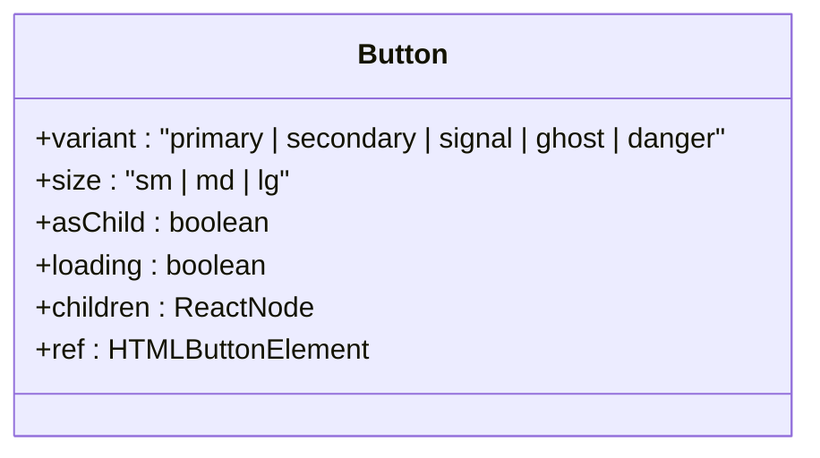
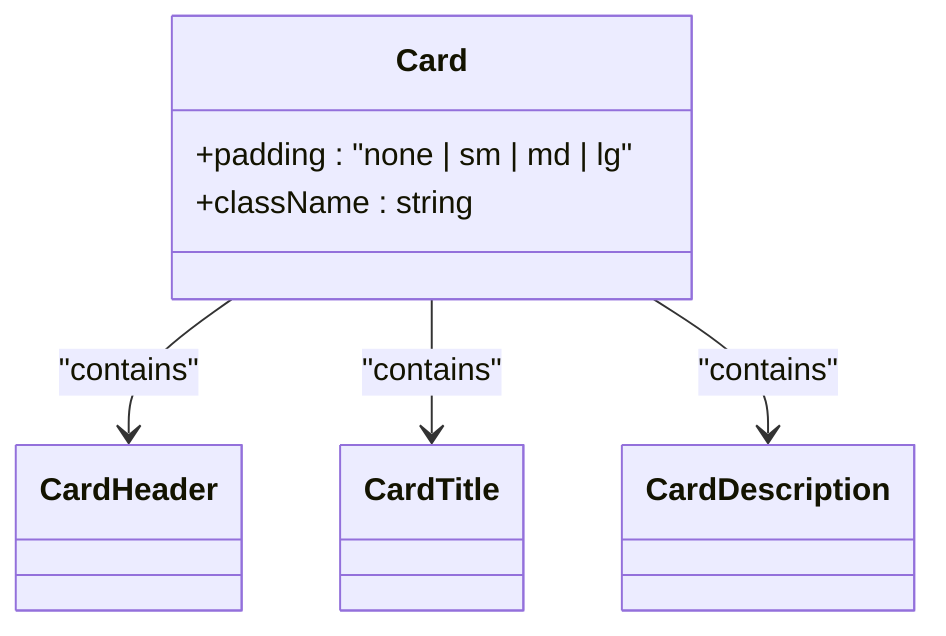
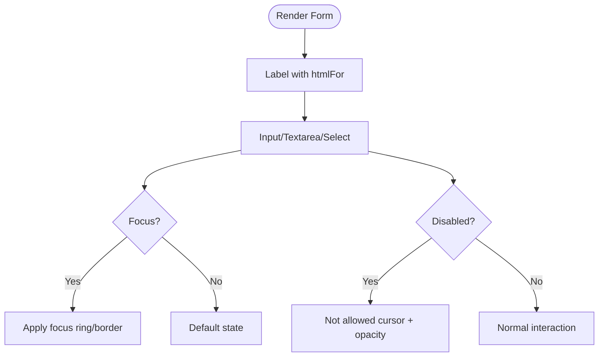
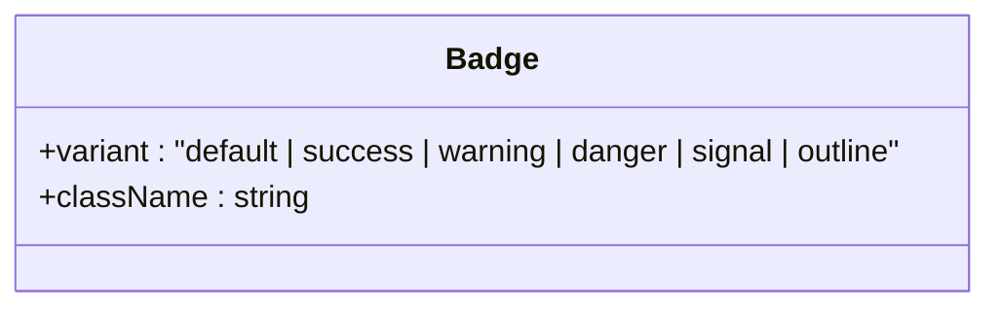
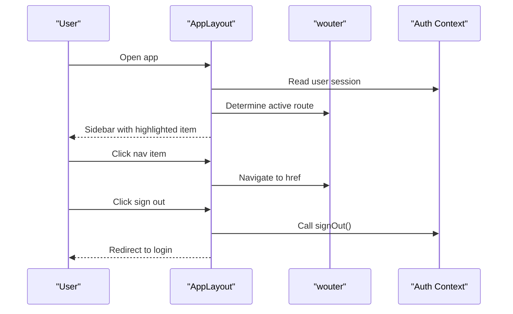
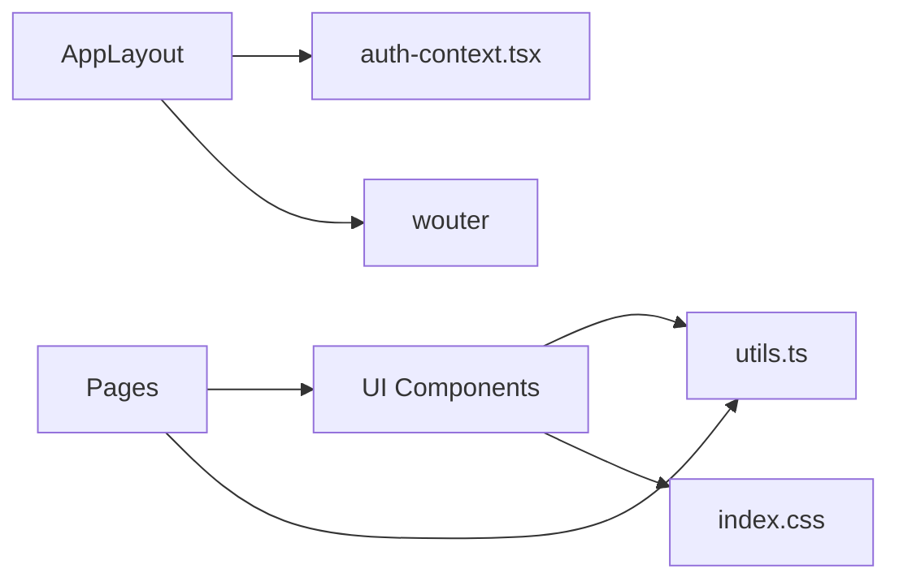

# Component System

<cite>
**Referenced Files in This Document**
- [Button.tsx](file://client/src/components/ui/Button.tsx)
- [Card.tsx](file://client/src/components/ui/Card.tsx)
- [Input.tsx](file://client/src/components/ui/Input.tsx)
- [Badge.tsx](file://client/src/components/ui/Badge.tsx)
- [StatCard.tsx](file://client/src/components/ui/StatCard.tsx)
- [AppLayout.tsx](file://client/src/components/layout/AppLayout.tsx)
- [utils.ts](file://client/src/lib/utils.ts)
- [auth-context.tsx](file://client/src/contexts/auth-context.tsx)
- [index.css](file://client/src/index.css)
- [Dashboard.tsx](file://client/src/pages/Dashboard.tsx)
- [Login.tsx](file://client/src/pages/Login.tsx)
</cite>

## Table of Contents
1. Introduction
2. Project Structure
3. Core Components
4. Architecture Overview
5. Detailed Component Analysis
6. Dependency Analysis
7. Performance Considerations
8. Troubleshooting Guide
9. Conclusion
10. Appendices

## Introduction
This document explains the RentLite React component system with a focus on the reusable UI components and layout structure. It covers:
- The UI components in the ui folder: Button, Card, Input (including Label, Textarea, Select), Badge, and StatCard
- Component architecture patterns, prop interfaces, and styling approach using Tailwind CSS
- The AppLayout implementation for consistent page structure
- Guidelines for creating new components, composition patterns, and best practices
- Component states, event handling, and accessibility considerations
- Usage examples via existing pages and guidance for building custom components following established patterns

## Project Structure
The client-side code is organized into feature-oriented folders:
- components/ui: Reusable UI primitives and composite components
- components/layout: Application-level layout wrapper
- contexts: Global state providers (e.g., authentication)
- lib: Utilities and API clients
- pages: Feature screens that compose UI components



**Diagram sources**
- [Button.tsx:1-50](file://client/src/components/ui/Button.tsx#L1-L50)
- [Card.tsx:1-42](file://client/src/components/ui/Card.tsx#L1-L42)
- [Input.tsx:1-86](file://client/src/components/ui/Input.tsx#L1-L86)
- [Badge.tsx:1-28](file://client/src/components/ui/Badge.tsx#L1-L28)
- [StatCard.tsx:1-54](file://client/src/components/ui/StatCard.tsx#L1-L54)
- [AppLayout.tsx:1-158](file://client/src/components/layout/AppLayout.tsx#L1-L158)
- [utils.ts:1-35](file://client/src/lib/utils.ts#L1-L35)
- [auth-context.tsx:1-38](file://client/src/contexts/auth-context.tsx#L1-L38)
- [index.css:1-102](file://client/src/index.css#L1-L102)
- [Dashboard.tsx:1-233](file://client/src/pages/Dashboard.tsx#L1-L233)
- [Login.tsx:1-148](file://client/src/pages/Login.tsx#L1-L148)

**Section sources**
- [Button.tsx:1-50](file://client/src/components/ui/Button.tsx#L1-L50)
- [Card.tsx:1-42](file://client/src/components/ui/Card.tsx#L1-L42)
- [Input.tsx:1-86](file://client/src/components/ui/Input.tsx#L1-L86)
- [Badge.tsx:1-28](file://client/src/components/ui/Badge.tsx#L1-L28)
- [StatCard.tsx:1-54](file://client/src/components/ui/StatCard.tsx#L1-L54)
- [AppLayout.tsx:1-158](file://client/src/components/layout/AppLayout.tsx#L1-L158)
- [utils.ts:1-35](file://client/src/lib/utils.ts#L1-L35)
- [auth-context.tsx:1-38](file://client/src/contexts/auth-context.tsx#L1-L38)
- [index.css:1-102](file://client/src/index.css#L1-L102)
- [Dashboard.tsx:1-233](file://client/src/pages/Dashboard.tsx#L1-L233)
- [Login.tsx:1-148](file://client/src/pages/Login.tsx#L1-L148)

## Core Components
This section summarizes each UI component’s purpose, props, states, events, and styling approach.

- Button
  - Purpose: Primary interactive element with variants, sizes, loading state, and optional composition as another element.
  - Props: variant (primary, secondary, signal, ghost, danger), size (sm, md, lg), asChild (boolean), loading (boolean), plus standard button attributes.
  - States: disabled (derived from props or loading), loading (shows spinner).
  - Events: forwards all native button events; supports asChild to render as any element via Slot.
  - Styling: Tailwind classes via cn utility; consistent focus ring and transitions.

- Card
  - Purpose: Container with configurable padding and semantic subcomponents.
  - Props: padding (none, sm, md, lg), plus standard div attributes.
  - Subcomponents: CardHeader, CardTitle, CardDescription with consistent typography and spacing.
  - Styling: Rounded borders, surface background, shadow, and padding scale.

- Input family (Input, Label, Textarea, Select)
  - Purpose: Accessible form controls with consistent appearance and focus states.
  - Props: Standard HTML attributes; Select adds options array and optional placeholder.
  - States: disabled support across controls; focus ring and border color changes.
  - Accessibility: Labels can be associated via htmlFor; inputs expose ref forwarding.

- Badge
  - Purpose: Small status or category indicators.
  - Props: variant (default, success, warning, danger, signal, outline).
  - Styling: Color-coded backgrounds and text per variant.

- StatCard
  - Purpose: Metric display with label, value, icon, optional trend, and color accent.
  - Props: label, value, icon, trend (value and label), color (signal, success, blue, violet, deep).
  - Behavior: Shows positive/negative trend indicator based on trend.value.

Styling approach:
- All components use the cn utility to merge class names safely and consistently.
- Theme tokens are defined in index.css under @theme (colors, fonts).
- Animations and base styles (e.g., rise-in animation, button transitions) are centralized in index.css.

**Section sources**
- [Button.tsx:1-50](file://client/src/components/ui/Button.tsx#L1-L50)
- [Card.tsx:1-42](file://client/src/components/ui/Card.tsx#L1-L42)
- [Input.tsx:1-86](file://client/src/components/ui/Input.tsx#L1-L86)
- [Badge.tsx:1-28](file://client/src/components/ui/Badge.tsx#L1-L28)
- [StatCard.tsx:1-54](file://client/src/components/ui/StatCard.tsx#L1-L54)
- [utils.ts:1-35](file://client/src/lib/utils.ts#L1-L35)
- [index.css:1-102](file://client/src/index.css#L1-L102)

## Architecture Overview
The application uses a layered architecture:
- Pages compose UI components to build feature screens.
- Layout wraps protected routes to provide navigation, user info, and responsive behavior.
- Context provides authentication state consumed by layout and other components.
- Utilities centralize class merging and formatting helpers.



**Diagram sources**
- [Dashboard.tsx:1-233](file://client/src/pages/Dashboard.tsx#L1-L233)
- [AppLayout.tsx:1-158](file://client/src/components/layout/AppLayout.tsx#L1-L158)
- [auth-context.tsx:1-38](file://client/src/contexts/auth-context.tsx#L1-L38)
- [utils.ts:1-35](file://client/src/lib/utils.ts#L1-L35)

## Detailed Component Analysis

### Button
- Pattern: ForwardRef component with asChild composition for flexible rendering.
- Prop interface: Extends native button attributes; adds variant, size, asChild, loading.
- State management: Disabled when loading or disabled prop set; shows spinner while loading.
- Event handling: Forwards all native events; ensure handlers are passed through props.
- Accessibility: Focus-visible ring for keyboard navigation; aria attributes can be added via props.
- Styling: Uses Tailwind classes merged via cn; consistent sizing and variants.



**Diagram sources**
- [Button.tsx:6-11](file://client/src/components/ui/Button.tsx#L6-L11)
- [Button.tsx:27-47](file://client/src/components/ui/Button.tsx#L27-L47)

**Section sources**
- [Button.tsx:1-50](file://client/src/components/ui/Button.tsx#L1-L50)

### Card and Semantic Parts
- Pattern: Container with padding variants and semantic subcomponents for headers and titles.
- Prop interface: Card accepts padding and standard div attributes; subcomponents accept standard attributes.
- Composition: Use CardHeader, CardTitle, CardDescription to structure content semantically.
- Styling: Consistent rounded corners, borders, shadows, and padding scale.



**Diagram sources**
- [Card.tsx:4-6](file://client/src/components/ui/Card.tsx#L4-L6)
- [Card.tsx:15-26](file://client/src/components/ui/Card.tsx#L15-L26)
- [Card.tsx:31-41](file://client/src/components/ui/Card.tsx#L31-L41)

**Section sources**
- [Card.tsx:1-42](file://client/src/components/ui/Card.tsx#L1-L42)

### Input Family (Input, Label, Textarea, Select)
- Pattern: ForwardRef inputs with consistent focus and disabled states; Label associates with inputs via htmlFor.
- Prop interface:
  - Input/Textarea: Standard input attributes.
  - Select: options array and optional placeholder.
- Accessibility: Ensure labels are linked to inputs; keyboard navigable; focus rings visible.
- Styling: Uniform border, background, focus ring, and disabled opacity.



**Diagram sources**
- [Input.tsx:4-18](file://client/src/components/ui/Input.tsx#L4-L18)
- [Input.tsx:24-31](file://client/src/components/ui/Input.tsx#L24-L31)
- [Input.tsx:35-49](file://client/src/components/ui/Input.tsx#L35-L49)
- [Input.tsx:58-83](file://client/src/components/ui/Input.tsx#L58-L83)

**Section sources**
- [Input.tsx:1-86](file://client/src/components/ui/Input.tsx#L1-L86)

### Badge
- Pattern: Simple span with variant-driven styling.
- Prop interface: variant selection among default, success, warning, danger, signal, outline.
- Accessibility: Semantic span; add role or aria if used for dynamic status updates.



**Diagram sources**
- [Badge.tsx:3-5](file://client/src/components/ui/Badge.tsx#L3-L5)
- [Badge.tsx:16-26](file://client/src/components/ui/Badge.tsx#L16-L26)

**Section sources**
- [Badge.tsx:1-28](file://client/src/components/ui/Badge.tsx#L1-L28)

### StatCard
- Pattern: Composite metric card with optional trend and color accent.
- Prop interface: label, value, icon, trend (value, label), color.
- Behavior: Trend displays positive/negative percentage with appropriate color.

```mermaid
classDiagram
class StatCard {
+label : string
+value : string | number
+icon : ReactNode
+trend : { value : number; label : string }
+color : "signal | success | blue | violet | deep"
}
```

**Diagram sources**
- [StatCard.tsx:3-9](file://client/src/components/ui/StatCard.tsx#L3-L9)
- [StatCard.tsx:19-52](file://client/src/components/ui/StatCard.tsx#L19-L52)

**Section sources**
- [StatCard.tsx:1-54](file://client/src/components/ui/StatCard.tsx#L1-L54)

### AppLayout
- Purpose: Provides persistent sidebar navigation, user section, top bar, and main content area.
- Features:
  - Responsive sidebar with mobile overlay toggle
  - Active route highlighting
  - Sign-out action integrated with auth client
  - Date display in header
- Integration: Consumes auth context for user data and routing library for navigation.



**Diagram sources**
- [AppLayout.tsx:21-29](file://client/src/components/layout/AppLayout.tsx#L21-L29)
- [AppLayout.tsx:31-39](file://client/src/components/layout/AppLayout.tsx#L31-L39)
- [AppLayout.tsx:41-157](file://client/src/components/layout/AppLayout.tsx#L41-L157)
- [auth-context.tsx:1-38](file://client/src/contexts/auth-context.tsx#L1-L38)

**Section sources**
- [AppLayout.tsx:1-158](file://client/src/components/layout/AppLayout.tsx#L1-L158)
- [auth-context.tsx:1-38](file://client/src/contexts/auth-context.tsx#L1-L38)

## Dependency Analysis
- UI components depend on:
  - utils.ts for className merging and formatting utilities
  - Tailwind theme variables defined in index.css
  - lucide-react icons where applicable
- AppLayout depends on:
  - wouter for routing
  - auth-context for user session
  - auth-client for sign-out
- Pages depend on UI components and utilities for presentation and data formatting.



**Diagram sources**
- [Button.tsx:1-50](file://client/src/components/ui/Button.tsx#L1-L50)
- [Card.tsx:1-42](file://client/src/components/ui/Card.tsx#L1-L42)
- [Input.tsx:1-86](file://client/src/components/ui/Input.tsx#L1-L86)
- [Badge.tsx:1-28](file://client/src/components/ui/Badge.tsx#L1-L28)
- [StatCard.tsx:1-54](file://client/src/components/ui/StatCard.tsx#L1-L54)
- [AppLayout.tsx:1-158](file://client/src/components/layout/AppLayout.tsx#L1-L158)
- [utils.ts:1-35](file://client/src/lib/utils.ts#L1-L35)
- [index.css:1-102](file://client/src/index.css#L1-L102)

**Section sources**
- [utils.ts:1-35](file://client/src/lib/utils.ts#L1-L35)
- [index.css:1-102](file://client/src/index.css#L1-L102)
- [auth-context.tsx:1-38](file://client/src/contexts/auth-context.tsx#L1-L38)
- [AppLayout.tsx:1-158](file://client/src/components/layout/AppLayout.tsx#L1-L158)

## Performance Considerations
- Prefer memoization for expensive computations in pages; UI components are lightweight.
- Avoid unnecessary re-renders by passing stable references for icons and callbacks.
- Use asChild pattern judiciously to reduce wrapper elements when composing buttons with links.
- Keep Tailwind class strings concise; rely on cn utility to prevent redundant classes.
- Respect reduced motion preferences via global styles already present.

[No sources needed since this section provides general guidance]

## Troubleshooting Guide
- Button not clickable
  - Ensure loading is false or disabled is not set unintentionally.
  - Verify asChild usage does not strip event handlers.
- Input not focusing or losing focus
  - Confirm ref forwarding and that no parent prevents default behavior.
  - Check that Label htmlFor matches input id.
- Badge colors not applying
  - Ensure variant is one of the supported values; verify theme tokens exist.
- StatCard trend not showing correct sign
  - Validate trend.value type and sign logic; ensure trend.label is provided.
- Layout sidebar not closing on mobile
  - Confirm mobileOpen state toggles correctly and overlay click handler is attached.
- Authentication state issues
  - Verify AuthProvider wraps the app and useAuth returns expected values.

**Section sources**
- [Button.tsx:27-47](file://client/src/components/ui/Button.tsx#L27-L47)
- [Input.tsx:4-18](file://client/src/components/ui/Input.tsx#L4-L18)
- [Badge.tsx:16-26](file://client/src/components/ui/Badge.tsx#L16-L26)
- [StatCard.tsx:19-52](file://client/src/components/ui/StatCard.tsx#L19-L52)
- [AppLayout.tsx:31-39](file://client/src/components/layout/AppLayout.tsx#L31-L39)
- [auth-context.tsx:16-33](file://client/src/contexts/auth-context.tsx#L16-L33)

## Conclusion
RentLite’s component system emphasizes consistency, composability, and accessibility:
- UI components are small, focused, and styled with Tailwind via a shared cn utility and theme tokens.
- AppLayout provides a robust shell with responsive navigation and user context integration.
- Pages demonstrate practical composition patterns using these components.
Following the guidelines below will help maintain consistency and scalability as the application grows.

[No sources needed since this section summarizes without analyzing specific files]

## Appendices

### Guidelines for Creating New Components
- Follow the forwardRef pattern for accessible refs and interoperability.
- Define explicit TypeScript interfaces for props; prefer enums or union types for constrained options.
- Use cn to merge className and avoid conflicts; keep class strings minimal and readable.
- Provide sensible defaults and allow overrides via props.
- Support disabled and loading states where applicable; ensure focus and keyboard behavior remain intuitive.
- Add ARIA attributes when semantics differ from native elements.
- Keep styling within the component; avoid inline styles unless necessary.

### Component Composition Patterns
- Use asChild for Button to render as Link or other elements without losing behavior.
- Compose Card with CardHeader, CardTitle, and CardDescription for semantic structure.
- Group related inputs with Label and Input/Textarea/Select for cohesive forms.
- Build complex cards like StatCard by combining smaller pieces (icons, badges, text).

### Best Practices for Consistency
- Stick to the defined variants and sizes to maintain visual harmony.
- Use theme tokens from index.css for colors and fonts; avoid ad-hoc values.
- Apply consistent spacing and typography scales across components.
- Centralize formatting helpers in utils.ts (e.g., currency, dates).
- Test components at multiple screen sizes; ensure responsive behavior in layouts.

### Accessibility Checklist
- Ensure all interactive elements are keyboard accessible and have visible focus states.
- Associate labels with inputs using htmlFor and id.
- Use semantic HTML elements (button, a, h1–h6) appropriately.
- Provide meaningful alt text for images and descriptive labels for icons when they convey meaning.
- Respect reduced motion preferences via global styles.

### Examples of Using Existing Components
- Dashboard demonstrates StatCard, Card, CardHeader, CardTitle, Badge, and Button composition for metrics and actions.
- Login demonstrates Input, Label, and Button usage in a form with loading state and validation feedback.

**Section sources**
- [Dashboard.tsx:1-233](file://client/src/pages/Dashboard.tsx#L1-L233)
- [Login.tsx:1-148](file://client/src/pages/Login.tsx#L1-L148)