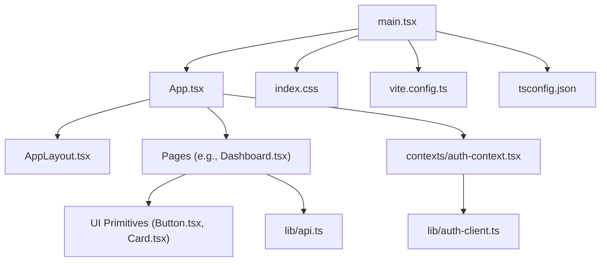
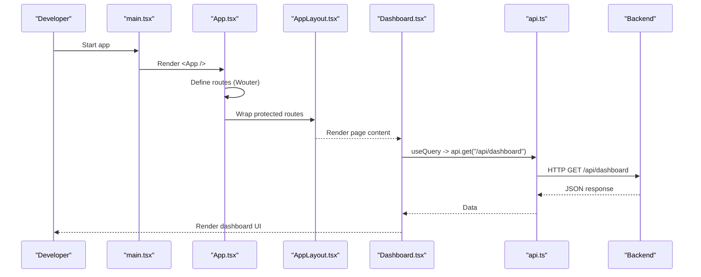
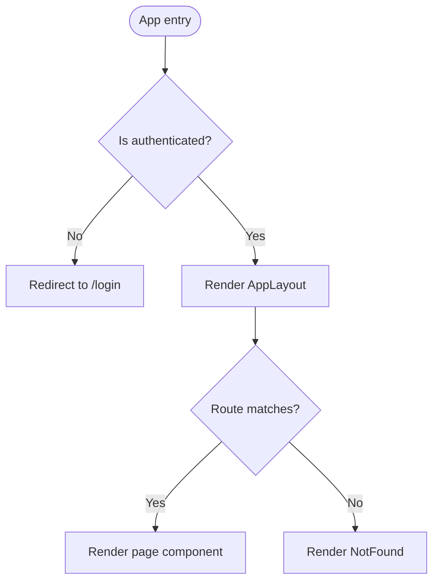
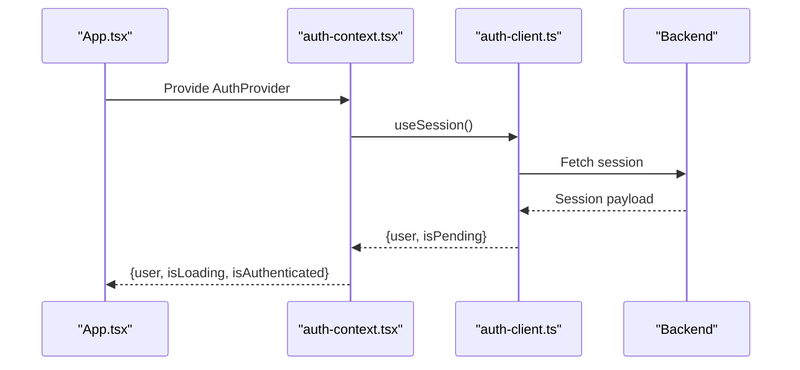
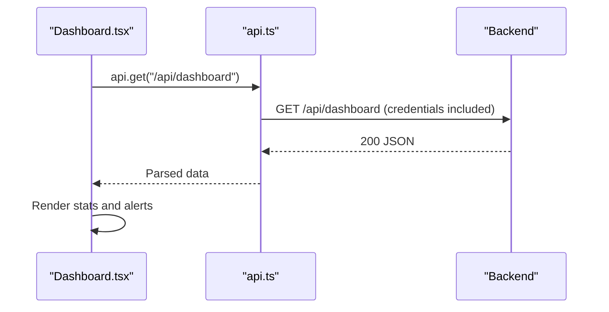
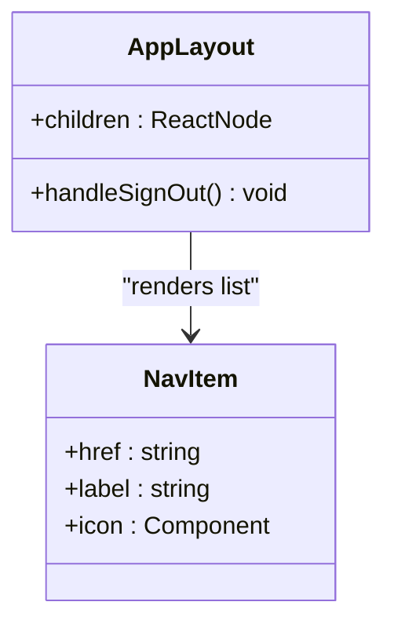
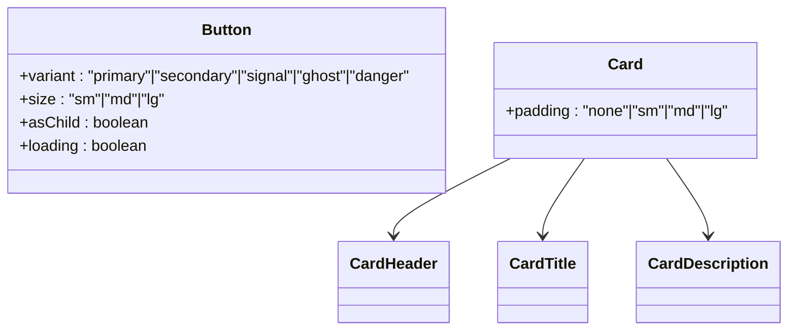
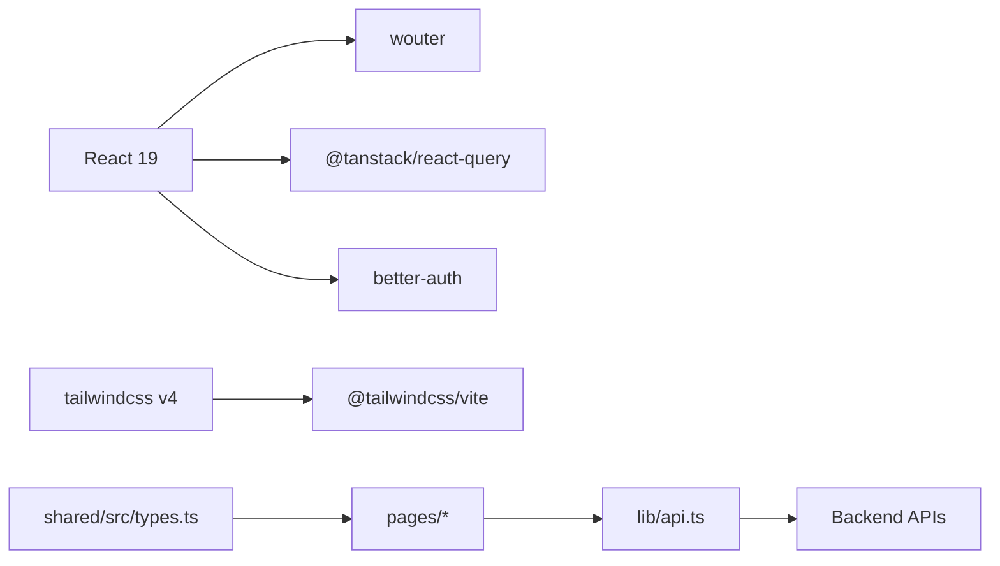

# Frontend Development

<cite>
**Referenced Files in This Document**
- [main.tsx](file://client/src/main.tsx)
- [App.tsx](file://client/src/App.tsx)
- [AuthContext.tsx](file://client/src/contexts/auth-context.tsx)
- [ApiClient.ts](file://client/src/lib/api.ts)
- [AuthClient.ts](file://client/src/lib/auth-client.ts)
- [AppLayout.tsx](file://client/src/components/layout/AppLayout.tsx)
- [Button.tsx](file://client/src/components/ui/Button.tsx)
- [Card.tsx](file://client/src/components/ui/Card.tsx)
- [Dashboard.tsx](file://client/src/pages/Dashboard.tsx)
- [utils.ts](file://client/src/lib/utils.ts)
- [index.css](file://client/src/index.css)
- [package.json](file://client/package.json)
- [vite.config.ts](file://client/vite.config.ts)
- [tsconfig.json](file://client/tsconfig.json)
- [types.ts](file://shared/src/types.ts)
</cite>

## Table of Contents
1. Introduction
2. Project Structure
3. Core Components
4. Architecture Overview
5. Detailed Component Analysis
6. Dependency Analysis
7. Performance Considerations
8. Troubleshooting Guide
9. Conclusion
10. Appendices

## Introduction
This document provides comprehensive frontend development guidance for the RentLite React application. It covers component architecture, routing with Wouter, state management via authentication context and React Query, API client usage, styling with Tailwind CSS, build configuration with Vite and TypeScript, composition patterns, and best practices for adding new features while optimizing performance.

## Project Structure
The frontend is a Vite + React project organized by feature areas:
- Entry and bootstrapping: main.tsx initializes providers and renders App
- Routing and protection: App.tsx defines routes and protected navigation
- Layout: AppLayout.tsx provides sidebar navigation and page shell
- Pages: Dashboard and other feature pages under pages/
- UI primitives: Button, Card, Badge, Input, StatCard under components/ui
- State and data: contexts/auth-context.tsx for auth; lib/api.ts for HTTP; lib/auth-client.ts for Better Auth hooks; lib/utils.ts for helpers
- Styling: index.css with Tailwind theme tokens and base styles
- Build and config: vite.config.ts, tsconfig.json, package.json

**Diagram sources**
- [main.tsx:1-29](file://client/src/main.tsx#L1-L29)
- [App.tsx:1-78](file://client/src/App.tsx#L1-L78)
- [AppLayout.tsx:1-158](file://client/src/components/layout/AppLayout.tsx#L1-L158)
- [Dashboard.tsx:1-233](file://client/src/pages/Dashboard.tsx#L1-L233)
- [Button.tsx:1-50](file://client/src/components/ui/Button.tsx#L1-L50)
- [Card.tsx:1-42](file://client/src/components/ui/Card.tsx#L1-L42)
- [api.ts:1-82](file://client/src/lib/api.ts#L1-L82)
- [auth-client.ts:1-13](file://client/src/lib/auth-client.ts#L1-L13)
- [index.css:1-102](file://client/src/index.css#L1-L102)
- [vite.config.ts:1-24](file://client/vite.config.ts#L1-L24)
- [tsconfig.json:1-16](file://client/tsconfig.json#L1-L16)

**Section sources**
- [main.tsx:1-29](file://client/src/main.tsx#L1-L29)
- [App.tsx:1-78](file://client/src/App.tsx#L1-L78)
- [AppLayout.tsx:1-158](file://client/src/components/layout/AppLayout.tsx#L1-L158)
- [package.json:1-44](file://client/package.json#L1-L44)
- [vite.config.ts:1-24](file://client/vite.config.ts#L1-L24)
- [tsconfig.json:1-16](file://client/tsconfig.json#L1-L16)
- [index.css:1-102](file://client/src/index.css#L1-L102)

## Core Components
- Authentication Context: Provides user session state and loading status to the app. Consumers use a simple hook to read auth state and protect routes or render UI accordingly.
- API Client: Centralized fetch wrapper that handles base URL resolution, query parameters, credentials, error handling, and redirects on unauthorized responses. Exposes convenient methods for GET, POST, PUT, DELETE.
- Auth Client: Thin integration with Better Auth to expose signIn, signUp, signOut, and useSession for session management.
- Layout: AppLayout composes sidebar navigation, top bar, and page content area. It uses Wouter’s Link and useLocation for active states and mobile menu toggling.
- UI Primitives:
  - Button: Supports variants, sizes, loading state, and asChild composition via Radix Slot.
  - Card: Provides consistent padding and semantic subcomponents (Header, Title, Description).
- Utilities: Class name merging helper and formatters for currency and dates.

**Section sources**
- [AuthContext.tsx:1-38](file://client/src/contexts/auth-context.tsx#L1-L38)
- [ApiClient.ts:1-82](file://client/src/lib/api.ts#L1-L82)
- [AuthClient.ts:1-13](file://client/src/lib/auth-client.ts#L1-L13)
- [AppLayout.tsx:1-158](file://client/src/components/layout/AppLayout.tsx#L1-L158)
- [Button.tsx:1-50](file://client/src/components/ui/Button.tsx#L1-L50)
- [Card.tsx:1-42](file://client/src/components/ui/Card.tsx#L1-L42)
- [utils.ts:1-35](file://client/src/lib/utils.ts#L1-L35)

## Architecture Overview
The application bootstraps with providers for React Query and Auth, then renders routes. Protected routes wrap authenticated sections with a layout shell. Data fetching is performed in pages using React Query and the API client.

**Diagram sources**
- [main.tsx:1-29](file://client/src/main.tsx#L1-L29)
- [App.tsx:1-78](file://client/src/App.tsx#L1-L78)
- [AppLayout.tsx:1-158](file://client/src/components/layout/AppLayout.tsx#L1-L158)
- [Dashboard.tsx:1-233](file://client/src/pages/Dashboard.tsx#L1-L233)
- [api.ts:1-82](file://client/src/lib/api.ts#L1-L82)

## Detailed Component Analysis

### Routing and Protection (Wouter)
- Routes are declared centrally in App.tsx using Switch and Route from Wouter.
- Public routes: login, signup.
- Protected routes: dashboard and feature pages wrapped in a ProtectedRoute component that checks authentication and shows a loader during session initialization.
- Redirects to login when not authenticated; otherwise renders AppLayout with the page component.

**Diagram sources**
- [App.tsx:16-78](file://client/src/App.tsx#L16-L78)

**Section sources**
- [App.tsx:1-78](file://client/src/App.tsx#L1-L78)

### Authentication Context and Session Flow
- AuthProvider wraps the app and exposes user, isLoading, isAuthenticated via context.
- It consumes Better Auth’s useSession to derive values and propagate them down.
- ProtectedRoute uses this context to guard routes and show a spinner while loading.

**Diagram sources**
- [AuthContext.tsx:1-38](file://client/src/contexts/auth-context.tsx#L1-L38)
- [AuthClient.ts:1-13](file://client/src/lib/auth-client.ts#L1-L13)

**Section sources**
- [AuthContext.tsx:1-38](file://client/src/contexts/auth-context.tsx#L1-L38)
- [AuthClient.ts:1-13](file://client/src/lib/auth-client.ts#L1-L13)
- [App.tsx:16-32](file://client/src/App.tsx#L16-L32)

### API Client Usage
- ApiClient centralizes fetch calls, builds URLs with query params, sets credentials, and handles errors including 401 redirects.
- Convenience methods simplify GET/POST/PUT/DELETE usage across pages.
- Example usage: Dashboard queries /api/dashboard via api.get.

**Diagram sources**
- [Dashboard.tsx:23-27](file://client/src/pages/Dashboard.tsx#L23-L27)
- [api.ts:14-54](file://client/src/lib/api.ts#L14-L54)

**Section sources**
- [api.ts:1-82](file://client/src/lib/api.ts#L1-L82)
- [Dashboard.tsx:1-233](file://client/src/pages/Dashboard.tsx#L1-L233)

### Layout and Navigation
- AppLayout renders a responsive sidebar with navigation items, a top bar with date display, and a main content area.
- Active route detection uses Wouter’s useLocation to highlight current item.
- Mobile experience includes an overlay and toggle button.

**Diagram sources**
- [AppLayout.tsx:21-158](file://client/src/components/layout/AppLayout.tsx#L21-L158)

**Section sources**
- [AppLayout.tsx:1-158](file://client/src/components/layout/AppLayout.tsx#L1-L158)

### UI Primitives Composition
- Button supports variants, sizes, loading indicator, and asChild to compose with other elements like links or buttons.
- Card provides consistent spacing and semantic subcomponents for structured content.

**Diagram sources**
- [Button.tsx:1-50](file://client/src/components/ui/Button.tsx#L1-L50)
- [Card.tsx:1-42](file://client/src/components/ui/Card.tsx#L1-L42)

**Section sources**
- [Button.tsx:1-50](file://client/src/components/ui/Button.tsx#L1-L50)
- [Card.tsx:1-42](file://client/src/components/ui/Card.tsx#L1-L42)

### Styling Guidelines and Responsive Design
- Theme tokens are defined in index.css using Tailwind v4 @theme (colors, fonts).
- Base styles set font family, background, and color variables.
- Utility classes are used throughout components for spacing, typography, colors, and transitions.
- Responsive patterns: grid layouts adapt from single column to multi-column based on breakpoints; sidebar collapses to overlay on small screens.

**Section sources**
- [index.css:1-102](file://client/src/index.css#L1-L102)
- [AppLayout.tsx:41-158](file://client/src/components/layout/AppLayout.tsx#L41-L158)
- [Dashboard.tsx:121-233](file://client/src/pages/Dashboard.tsx#L121-L233)

### Build Process and Configuration
- Vite plugins: React and Tailwind v4 integrated via @tailwindcss/vite.
- Alias “@” maps to src for cleaner imports.
- Dev server proxies /api requests to backend at localhost:3000.
- TypeScript configured with JSX transform, path aliases, and types for Vite client.
- Scripts: dev, build, check (type checking), preview.

**Section sources**
- [vite.config.ts:1-24](file://client/vite.config.ts#L1-L24)
- [tsconfig.json:1-16](file://client/tsconfig.json#L1-L16)
- [package.json:1-44](file://client/package.json#L1-L44)

## Dependency Analysis
Key runtime dependencies include React, Wouter for routing, React Query for data fetching/caching, Better Auth for authentication, Tailwind CSS for styling, and shared types for domain models.

**Diagram sources**
- [package.json:12-41](file://client/package.json#L12-L41)
- [types.ts:1-251](file://shared/src/types.ts#L1-L251)
- [Dashboard.tsx:1-233](file://client/src/pages/Dashboard.tsx#L1-L233)
- [api.ts:1-82](file://client/src/lib/api.ts#L1-L82)

**Section sources**
- [package.json:1-44](file://client/package.json#L1-L44)
- [types.ts:1-251](file://shared/src/types.ts#L1-L251)

## Performance Considerations
- Data caching and retries: React Query configured with staleTime, retry count, and refetchOnWindowFocus settings to reduce network load.
- Conditional rendering: Loading and error states prevent unnecessary re-renders and improve perceived performance.
- Efficient lists: Use stable keys and avoid heavy computations inside render loops.
- Code splitting: Consider lazy-loading pages for large modules to reduce initial bundle size.
- Network optimization: Leverage query deduplication and cache invalidation strategies in React Query.
- Styling: Prefer utility classes and avoid excessive custom CSS; Tailwind’s JIT reduces unused styles.

[No sources needed since this section provides general guidance]

## Troubleshooting Guide
- Unauthorized redirects: The API client redirects to /login on 401 responses. Ensure cookies/sessions are enabled and CORS/proxy settings are correct.
- Network errors: Non-ok responses throw errors with message extraction; handle these in components with user-friendly messages.
- Session loading: ProtectedRoute displays a spinner until session is resolved; ensure AuthProvider is mounted before protected routes.
- Proxy issues: In development, /api is proxied to localhost:3000; verify backend is running and accessible.

**Section sources**
- [api.ts:26-54](file://client/src/lib/api.ts#L26-L54)
- [App.tsx:16-32](file://client/src/App.tsx#L16-L32)
- [vite.config.ts:13-22](file://client/vite.config.ts#L13-L22)

## Conclusion
RentLite’s frontend combines a clear component architecture, robust routing and protection, centralized API communication, and a modern build pipeline. By following the patterns outlined here—using the API client, composing UI primitives, leveraging React Query, and adhering to Tailwind-based styling—you can extend the application with new pages and features efficiently while maintaining performance and consistency.

[No sources needed since this section summarizes without analyzing specific files]

## Appendices

### Adding a New Page
- Create a new file under pages/ and export a default function component.
- Add a route in App.tsx within the Switch block.
- If the page requires authentication, wrap it with ProtectedRoute.
- Use React Query and api methods to fetch data and render results.

**Section sources**
- [App.tsx:34-78](file://client/src/App.tsx#L34-L78)
- [Dashboard.tsx:23-27](file://client/src/pages/Dashboard.tsx#L23-L27)

### Adding a New UI Component
- Place the component under components/ui/.
- Use forwardRef and define a typed props interface.
- Compose with cn for class merging and leverage existing variants/sizes where applicable.
- Export named exports for composability (e.g., CardHeader, CardTitle).

**Section sources**
- [Button.tsx:1-50](file://client/src/components/ui/Button.tsx#L1-L50)
- [Card.tsx:1-42](file://client/src/components/ui/Card.tsx#L1-L42)

### Event Handling Patterns
- Use standard React event handlers for interactions (onClick, onChange).
- For navigation, prefer Wouter’s Link for declarative routing.
- For async actions, integrate with React Query mutations or direct API calls via api methods.

**Section sources**
- [AppLayout.tsx:36-39](file://client/src/components/layout/AppLayout.tsx#L36-L39)
- [Dashboard.tsx:121-233](file://client/src/pages/Dashboard.tsx#L121-L233)

### Global State Patterns
- Use AuthContext for authentication-related state.
- Use React Query for server state caching and synchronization.
- Keep local UI state minimal and colocated within components.

**Section sources**
- [AuthContext.tsx:1-38](file://client/src/contexts/auth-context.tsx#L1-L38)
- [main.tsx:9-28](file://client/src/main.tsx#L9-L28)

### API Contracts and Types
- Domain types are shared via shared/src/types.ts and can be imported into pages and utilities for type safety.
- PaginatedResponse and ApiError provide consistent shapes for list endpoints and error payloads.

**Section sources**
- [types.ts:236-251](file://shared/src/types.ts#L236-L251)