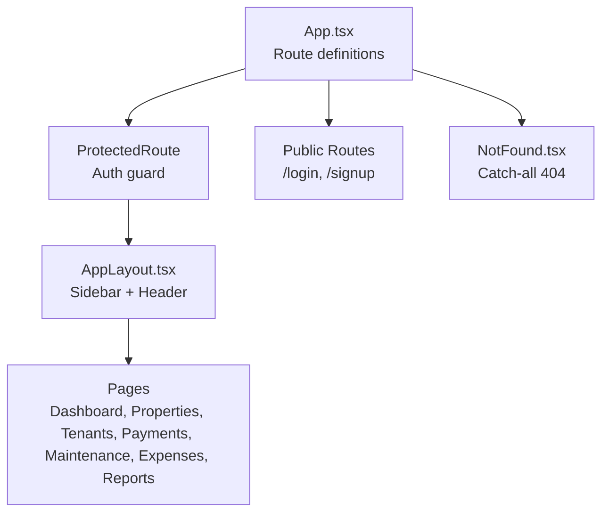
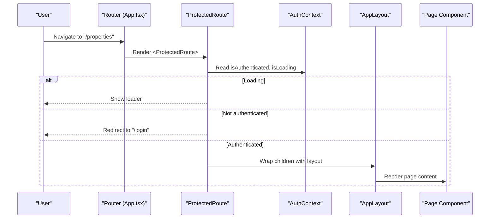
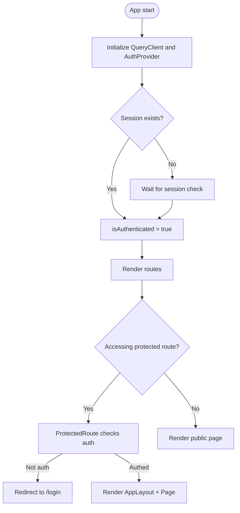
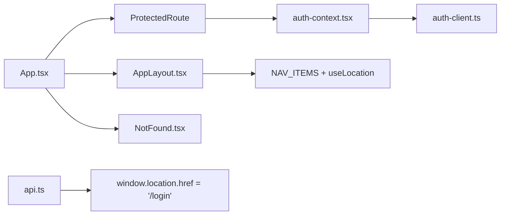

# Routing & Navigation

<cite>
**Referenced Files in This Document**
- [App.tsx](file://client/src/App.tsx)
- [main.tsx](file://client/src/main.tsx)
- [auth-context.tsx](file://client/src/contexts/auth-context.tsx)
- [auth-client.ts](file://client/src/lib/auth-client.ts)
- [api.ts](file://client/src/lib/api.ts)
- [AppLayout.tsx](file://client/src/components/layout/AppLayout.tsx)
- [NotFound.tsx](file://client/src/pages/NotFound.tsx)
- [Login.tsx](file://client/src/pages/Login.tsx)
- [Dashboard.tsx](file://client/src/pages/Dashboard.tsx)
- [Properties.tsx](file://client/src/pages/Properties.tsx)
</cite>

## Table of Contents
1. Introduction
2. Project Structure
3. Core Components
4. Architecture Overview
5. Detailed Component Analysis
6. Dependency Analysis
7. Performance Considerations
8. Troubleshooting Guide
9. Conclusion
10. Appendices

## Introduction
This document explains the routing and navigation system in RentLite, focusing on the Wouter-based router, protected routes, authentication guards, page structure, URL handling patterns, and error routing strategies. It provides practical guidance for adding new routes, implementing route protection, and maintaining clean navigation flows across the application.

## Project Structure
RentLite uses a client-side router (Wouter) to manage navigation between pages. The root application defines all routes, wraps protected routes with an authentication guard, and renders a consistent layout for authenticated sections. Public routes (login/signup) are accessible without authentication. A global 404 handler catches unmatched URLs.

**Diagram sources**
- [App.tsx:1-77](file://client/src/App.tsx#L1-L77)
- [AppLayout.tsx:1-158](file://client/src/components/layout/AppLayout.tsx#L1-L158)
- [NotFound.tsx:1-33](file://client/src/pages/NotFound.tsx#L1-L33)

**Section sources**
- [App.tsx:1-77](file://client/src/App.tsx#L1-L77)
- [AppLayout.tsx:1-158](file://client/src/components/layout/AppLayout.tsx#L1-L158)
- [NotFound.tsx:1-33](file://client/src/pages/NotFound.tsx#L1-L33)

## Core Components
- Router configuration and route registration: Centralized in the root component using Wouter’s Switch and Route components.
- Protected route guard: Ensures only authenticated users can access feature pages; redirects unauthenticated users to login.
- Layout wrapper: Provides sidebar navigation, header, and content area for authenticated pages.
- Authentication context: Supplies current session state and loading status to guards and UI.
- Auth client: Integrates with Better-Auth for sign-in/sign-up/session management.
- API client: Handles HTTP requests and redirects to login on unauthorized responses.

Key responsibilities:
- App.tsx: Declares all routes and applies protection where needed.
- auth-context.tsx: Exposes isAuthenticated and isLoading to guards and UI.
- AppLayout.tsx: Renders navigation links and active state based on current location.
- api.ts: Redirects to login when receiving 401 from the server.

**Section sources**
- [App.tsx:16-32](file://client/src/App.tsx#L16-L32)
- [App.tsx:34-77](file://client/src/App.tsx#L34-L77)
- [auth-context.tsx:16-37](file://client/src/contexts/auth-context.tsx#L16-L37)
- [AppLayout.tsx:21-29](file://client/src/components/layout/AppLayout.tsx#L21-L29)
- [api.ts:26-48](file://client/src/lib/api.ts#L26-L48)

## Architecture Overview
The routing architecture combines Wouter’s declarative routing with React Context for authentication state. Protected routes wrap feature pages with a guard that checks session status and redirects as necessary. The layout is applied only to authenticated routes, ensuring consistent navigation and user experience.

**Diagram sources**
- [App.tsx:16-32](file://client/src/App.tsx#L16-L32)
- [App.tsx:34-77](file://client/src/App.tsx#L34-L77)
- [auth-context.tsx:16-37](file://client/src/contexts/auth-context.tsx#L16-L37)
- [AppLayout.tsx:31-158](file://client/src/components/layout/AppLayout.tsx#L31-L158)

## Detailed Component Analysis

### Router Configuration and Route Map
- Public routes:
  - /login
  - /signup
- Protected routes (wrapped with ProtectedRoute):
  - /
  - /properties
  - /tenants
  - /payments
  - /maintenance
  - /expenses
  - /reports
- Catch-all:
  - Any unmatched path renders NotFound.

Notes:
- All protected routes render within AppLayout to provide consistent navigation and header.
- Unauthenticated attempts to access protected routes redirect to /login.

**Section sources**
- [App.tsx:34-77](file://client/src/App.tsx#L34-L77)

### ProtectedRoute Guard
Behavior:
- While authentication state is loading, displays a spinner.
- If not authenticated, redirects to /login.
- If authenticated, renders children inside AppLayout.

Integration points:
- Uses useAuth() from auth-context to read session state.
- Uses wouter’s Redirect for programmatic navigation.

Best practices:
- Keep guard logic centralized to avoid duplication.
- Always handle loading state to prevent flicker or premature redirects.

**Section sources**
- [App.tsx:16-32](file://client/src/App.tsx#L16-L32)
- [auth-context.tsx:16-37](file://client/src/contexts/auth-context.tsx#L16-L37)

### Authentication Flow and Session State
- AuthProvider wraps the app and exposes:
  - user object
  - isLoading flag
  - isAuthenticated boolean
- Auth client integrates with Better-Auth to fetch session and perform sign-in/sign-out.
- On successful sign-in, Login navigates to /.
- API client redirects to /login on 401 responses.

**Diagram sources**
- [main.tsx:9-28](file://client/src/main.tsx#L9-L28)
- [auth-context.tsx:16-37](file://client/src/contexts/auth-context.tsx#L16-L37)
- [auth-client.ts:1-13](file://client/src/lib/auth-client.ts#L1-L13)
- [Login.tsx:16-35](file://client/src/pages/Login.tsx#L16-L35)
- [api.ts:26-48](file://client/src/lib/api.ts#L26-L48)

**Section sources**
- [main.tsx:9-28](file://client/src/main.tsx#L9-L28)
- [auth-context.tsx:16-37](file://client/src/contexts/auth-context.tsx#L16-L37)
- [auth-client.ts:1-13](file://client/src/lib/auth-client.ts#L1-L13)
- [Login.tsx:16-35](file://client/src/pages/Login.tsx#L16-L35)
- [api.ts:26-48](file://client/src/lib/api.ts#L26-L48)

### Navigation Patterns and Active State
- Sidebar navigation is defined in AppLayout via a static list of items with hrefs.
- Active link detection uses useLocation():
  - For "/", exact match.
  - For other routes, prefix matching to support subpaths.
- Links use wouter’s Link for client-side navigation.

Guidelines:
- Add new navigation entries by updating the NAV_ITEMS array.
- Use Link for internal navigation to preserve SPA behavior.
- Avoid direct window.location changes except for sign-out fallback.

**Section sources**
- [AppLayout.tsx:21-29](file://client/src/components/layout/AppLayout.tsx#L21-L29)
- [AppLayout.tsx:60-91](file://client/src/components/layout/AppLayout.tsx#L60-L91)

### URL Parameters Handling
Current implementation:
- No dynamic route segments (e.g., /properties/:id) are defined in the router.
- Pages currently do not consume URL parameters via useLocation/useParams.

Recommendations:
- To add dynamic routes, define them in App.tsx using Wouter’s parameter syntax and read params in the corresponding page.
- Validate and sanitize parameters before use.
- Update navigation links to include required parameters.

[No sources needed since this section provides general guidance]

### Error Routing and 404 Handling
- A catch-all Route at the bottom of the switch renders NotFound for any unmatched path.
- NotFound provides a friendly message and a link back to the home page.

Best practices:
- Place the catch-all route last so it only matches unknown paths.
- Ensure protected routes still apply to 404 if you want to restrict access to unknown protected-like paths.

**Section sources**
- [App.tsx:74-75](file://client/src/App.tsx#L74-L75)
- [NotFound.tsx:1-33](file://client/src/pages/NotFound.tsx#L1-L33)

### Page Structure Overview
Available pages and their roles:
- Dashboard: High-level overview and quick actions.
- Properties: List and manage properties.
- Tenants: Manage tenant records.
- Payments: Track rent payments.
- Maintenance: Handle maintenance requests.
- Expenses: Record and view expenses.
- Reports: View analytics and reports.

Navigation entry points:
- Sidebar in AppLayout.
- Quick actions in Dashboard.
- Direct links in pages (e.g., alerts).

**Section sources**
- [AppLayout.tsx:21-29](file://client/src/components/layout/AppLayout.tsx#L21-L29)
- [Dashboard.tsx:88-119](file://client/src/pages/Dashboard.tsx#L88-L119)
- [Properties.tsx:104-170](file://client/src/pages/Properties.tsx#L104-L170)

## Dependency Analysis
High-level dependencies among routing-related modules:

**Diagram sources**
- [App.tsx:16-77](file://client/src/App.tsx#L16-L77)
- [auth-context.tsx:16-37](file://client/src/contexts/auth-context.tsx#L16-L37)
- [auth-client.ts:1-13](file://client/src/lib/auth-client.ts#L1-L13)
- [AppLayout.tsx:21-91](file://client/src/components/layout/AppLayout.tsx#L21-L91)
- [api.ts:26-48](file://client/src/lib/api.ts#L26-L48)

**Section sources**
- [App.tsx:16-77](file://client/src/App.tsx#L16-L77)
- [auth-context.tsx:16-37](file://client/src/contexts/auth-context.tsx#L16-L37)
- [auth-client.ts:1-13](file://client/src/lib/auth-client.ts#L1-L13)
- [AppLayout.tsx:21-91](file://client/src/components/layout/AppLayout.tsx#L21-L91)
- [api.ts:26-48](file://client/src/lib/api.ts#L26-L48)

## Performance Considerations
- Minimize re-renders in ProtectedRoute by keeping guard logic simple and relying on context state.
- Prefer client-side navigation (wouter’s Link) over full-page reloads to maintain SPA performance.
- Defer heavy computations in pages until after initial render to keep navigation snappy.
- Use query caching (already configured in main.tsx) to reduce redundant network calls during navigation.

[No sources needed since this section provides general guidance]

## Troubleshooting Guide
Common issues and resolutions:
- Infinite redirect loop:
  - Cause: Misconfigured protected routes or incorrect authentication state.
  - Resolution: Verify ProtectedRoute logic and ensure session initialization completes before rendering protected routes.
- Unexpected 401 redirects:
  - Cause: Server returns 401 for certain endpoints.
  - Resolution: Review api.ts redirection behavior and ensure proper credentials are sent.
- Sidebar active state not updating:
  - Cause: Incorrect location matching logic.
  - Resolution: Confirm useLocation usage and href values in NAV_ITEMS.
- 404 page not showing:
  - Cause: Missing catch-all route or order of routes.
  - Resolution: Ensure the catch-all Route is placed last in the Switch.

**Section sources**
- [App.tsx:16-32](file://client/src/App.tsx#L16-L32)
- [App.tsx:34-77](file://client/src/App.tsx#L34-L77)
- [api.ts:26-48](file://client/src/lib/api.ts#L26-L48)
- [AppLayout.tsx:60-91](file://client/src/components/layout/AppLayout.tsx#L60-L91)

## Conclusion
RentLite’s routing system leverages Wouter for declarative routing, a central ProtectedRoute guard for authentication, and a consistent AppLayout for authenticated features. The approach keeps navigation predictable, enforces access control, and provides clear error handling via a dedicated 404 page. Following the guidelines in this document will help you extend routes safely, implement robust protections, and maintain clean navigation flows.

[No sources needed since this section summarizes without analyzing specific files]

## Appendices

### Adding a New Route
Steps:
1. Create a new page component under pages/.
2. Import and register the route in App.tsx within the Switch.
3. Wrap the route with ProtectedRoute if it requires authentication.
4. Add an entry to NAV_ITEMS in AppLayout.tsx for sidebar visibility.
5. Test navigation from the sidebar and verify protection behavior.

**Section sources**
- [App.tsx:34-77](file://client/src/App.tsx#L34-L77)
- [AppLayout.tsx:21-29](file://client/src/components/layout/AppLayout.tsx#L21-L29)

### Implementing a Protected Route
Pattern:
- Wrap your page component with ProtectedRoute to enforce authentication.
- Ensure the guard handles loading states to avoid premature redirects.

**Section sources**
- [App.tsx:16-32](file://client/src/App.tsx#L16-L32)

### Managing Navigation State
- Use wouter’s Link for internal navigation to leverage client-side routing.
- Use useLocation() to compute active states and conditionally render UI.
- Avoid direct window.location changes except for sign-out fallback scenarios.

**Section sources**
- [AppLayout.tsx:60-91](file://client/src/components/layout/AppLayout.tsx#L60-L91)

### Handling URL Parameters
When needed:
- Define dynamic segments in App.tsx routes.
- Read parameters in the target page using appropriate hooks.
- Validate inputs and handle missing or invalid parameters gracefully.

[No sources needed since this section provides general guidance]

### Common Scenarios and Best Practices
- Redirect after sign-in:
  - Navigate to the intended route or default dashboard.
- Unauthorized API responses:
  - Let the API client redirect to login automatically.
- Consistent navigation:
  - Centralize menu items in one place (NAV_ITEMS) to keep routes and navigation in sync.
- Error UX:
  - Provide meaningful messages and easy recovery options (e.g., “Back to home” on 404).

**Section sources**
- [Login.tsx:16-35](file://client/src/pages/Login.tsx#L16-L35)
- [api.ts:26-48](file://client/src/lib/api.ts#L26-L48)
- [AppLayout.tsx:21-29](file://client/src/components/layout/AppLayout.tsx#L21-L29)
- [NotFound.tsx:1-33](file://client/src/pages/NotFound.tsx#L1-L33)