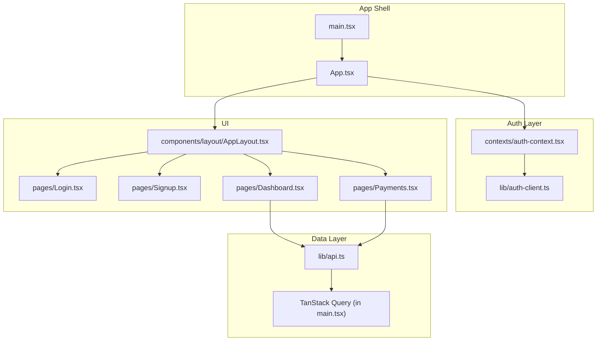
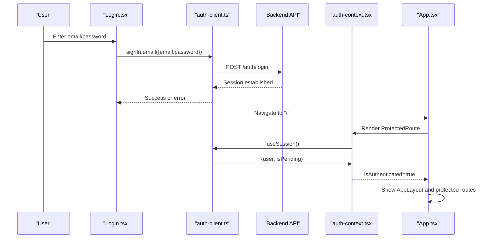
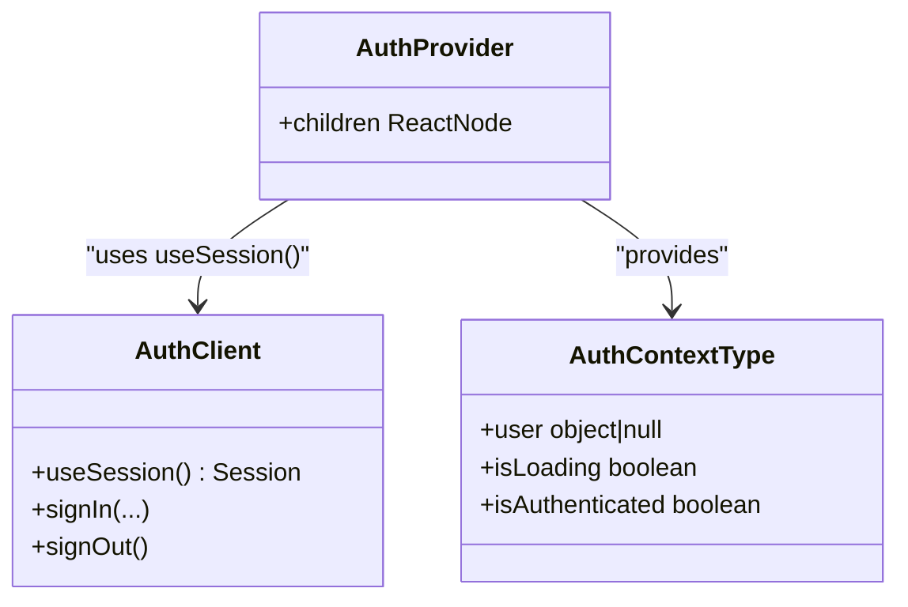
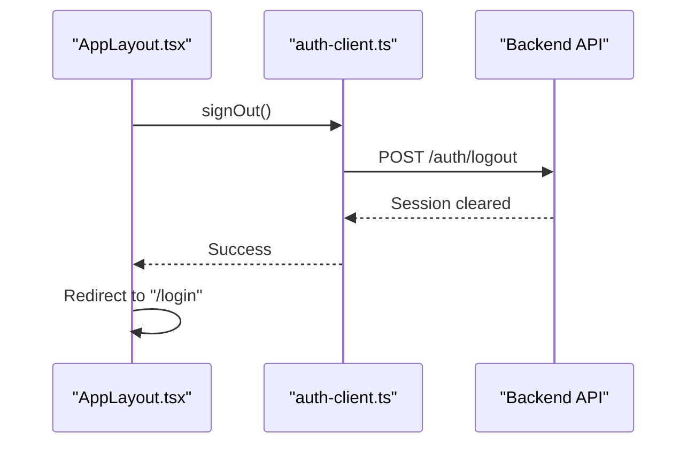
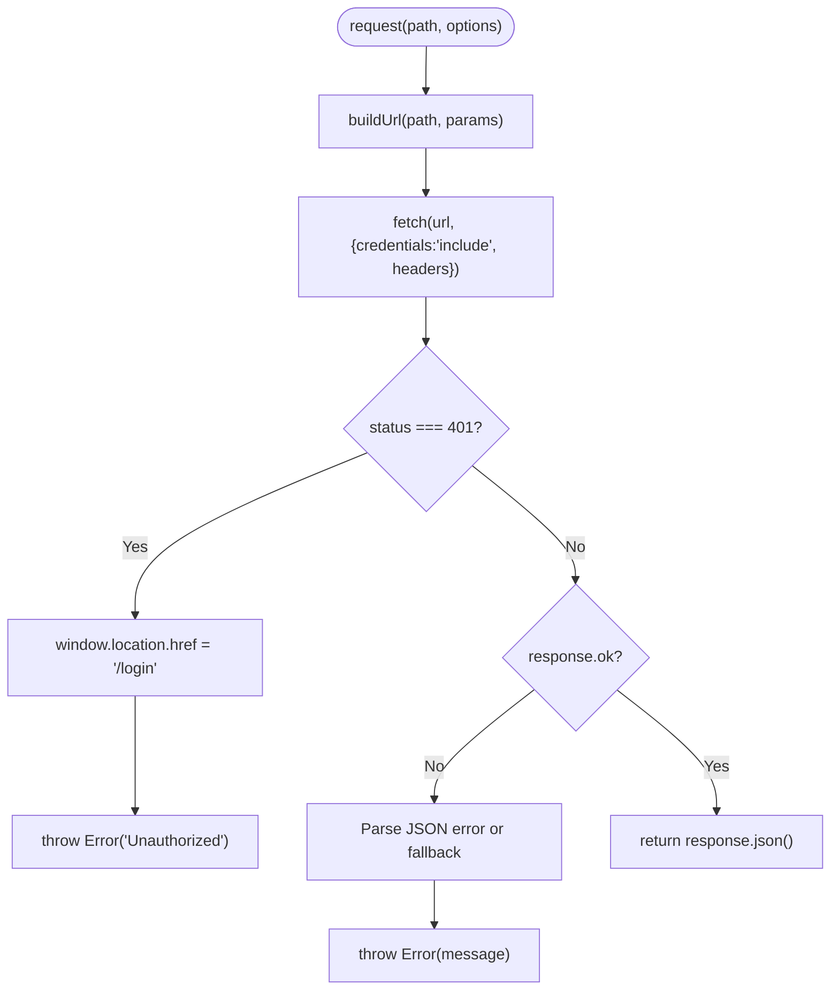
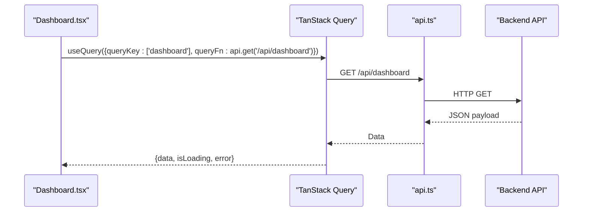
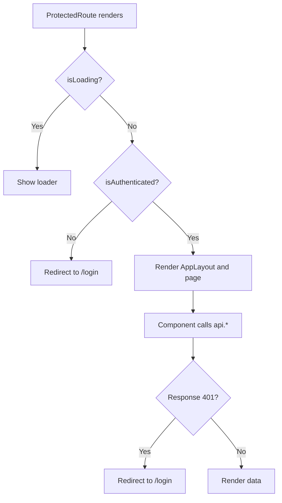
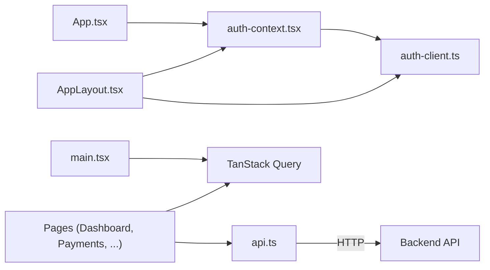

# State Management

<cite>
**Referenced Files in This Document**
- [auth-context.tsx](file://client/src/contexts/auth-context.tsx)
- [api.ts](file://client/src/lib/api.ts)
- [auth-client.ts](file://client/src/lib/auth-client.ts)
- [utils.ts](file://client/src/lib/utils.ts)
- [App.tsx](file://client/src/App.tsx)
- [main.tsx](file://client/src/main.tsx)
- [Login.tsx](file://client/src/pages/Login.tsx)
- [Signup.tsx](file://client/src/pages/Signup.tsx)
- [AppLayout.tsx](file://client/src/components/layout/AppLayout.tsx)
- [Dashboard.tsx](file://client/src/pages/Dashboard.tsx)
- [Payments.tsx](file://client/src/pages/Payments.tsx)
</cite>

## Table of Contents
1. [Introduction](#introduction)
2. [Project Structure](#project-structure)
3. [Core Components](#core-components)
4. [Architecture Overview](#architecture-overview)
5. [Detailed Component Analysis](#detailed-component-analysis)
6. [Dependency Analysis](#dependency-analysis)
7. [Performance Considerations](#performance-considerations)
8. [Troubleshooting Guide](#troubleshooting-guide)
9. [Conclusion](#conclusion)
10. [Appendices](#appendices)

## Introduction
This document explains how state is managed in the RentLite frontend, focusing on:
- Authentication context and session management
- API client architecture for backend communication
- Global state patterns using React Context and TanStack Query
- Data fetching strategies and caching
- How authentication state influences API calls
- Practical examples for extending auth context, creating new API clients, and building custom hooks

## Project Structure
The frontend organizes state-related concerns into focused modules:
- Authentication state via a React Context that wraps the app and exposes user/session state
- A centralized API client with HTTP helpers and error handling
- TanStack Query for data fetching, caching, and mutation lifecycle
- Pages and layout components consuming auth and data state

**Diagram sources**
- [main.tsx:1-29](file://client/src/main.tsx#L1-L29)
- [App.tsx:1-78](file://client/src/App.tsx#L1-L78)
- [auth-context.tsx:1-38](file://client/src/contexts/auth-context.tsx#L1-L38)
- [auth-client.ts:1-13](file://client/src/lib/auth-client.ts#L1-L13)
- [api.ts:1-82](file://client/src/lib/api.ts#L1-L82)
- [AppLayout.tsx:1-158](file://client/src/components/layout/AppLayout.tsx#L1-L158)
- [Login.tsx:1-148](file://client/src/pages/Login.tsx#L1-L148)
- [Signup.tsx:1-185](file://client/src/pages/Signup.tsx#L1-L185)
- [Dashboard.tsx:1-233](file://client/src/pages/Dashboard.tsx#L1-L233)
- [Payments.tsx:1-197](file://client/src/pages/Payments.tsx#L1-L197)

**Section sources**
- [main.tsx:1-29](file://client/src/main.tsx#L1-L29)
- [App.tsx:1-78](file://client/src/App.tsx#L1-L78)

## Core Components
- Authentication Context: Provides user, loading, and authenticated state to the app by wrapping components with a provider and exposing a hook. It consumes a session hook from an auth client library.
- API Client: A class-based HTTP client that centralizes base URL configuration, query parameter building, request/response handling, and unauthorized redirects.
- Data Fetching with TanStack Query: The root provider configures global query defaults such as stale time and retry behavior; pages use queries and mutations to fetch and mutate data.
- Utilities: Shared helpers for class name merging and formatting currency and dates.

Key responsibilities:
- AuthContext: Derives user info and flags from session state and exposes them via a React context.
- ApiClient: Encapsulates fetch logic, credentials handling, error normalization, and convenience methods for REST verbs.
- QueryClient: Configured once at app bootstrap to manage caching and retries globally.

**Section sources**
- [auth-context.tsx:1-38](file://client/src/contexts/auth-context.tsx#L1-L38)
- [api.ts:1-82](file://client/src/lib/api.ts#L1-L82)
- [main.tsx:1-29](file://client/src/main.tsx#L1-L29)
- [utils.ts:1-35](file://client/src/lib/utils.ts#L1-L35)

## Architecture Overview
The application uses a layered approach:
- UI layer (pages and layout) consumes authentication and data through hooks and providers.
- Authentication layer manages session state and provides user context.
- Data layer handles API requests and caches results via TanStack Query.

**Diagram sources**
- [Login.tsx:16-35](file://client/src/pages/Login.tsx#L16-L35)
- [auth-client.ts:1-13](file://client/src/lib/auth-client.ts#L1-L13)
- [auth-context.tsx:16-33](file://client/src/contexts/auth-context.tsx#L16-L33)
- [App.tsx:16-32](file://client/src/App.tsx#L16-L32)

## Detailed Component Analysis

### Authentication Context and Session Management
- Provider wraps the app and exposes:
  - user: normalized user object derived from session
  - isLoading: pending state while session resolves
  - isAuthenticated: boolean indicating presence of a valid session
- Uses a session hook from the auth client to keep state in sync with server sessions.
- Protected routes rely on this context to guard access and show a loading spinner during initial load.

**Diagram sources**
- [auth-context.tsx:1-38](file://client/src/contexts/auth-context.tsx#L1-L38)
- [auth-client.ts:1-13](file://client/src/lib/auth-client.ts#L1-L13)

**Section sources**
- [auth-context.tsx:1-38](file://client/src/contexts/auth-context.tsx#L1-L38)
- [App.tsx:16-32](file://client/src/App.tsx#L1-L32)

### Login and Logout Flows
- Login:
  - Collects email and password
  - Calls sign-in via the auth client
  - On success, shows a success toast and navigates to the home route
  - On failure, displays an error toast
- Logout:
  - Triggered from the layout’s user section
  - Signs out via the auth client and redirects to login

**Diagram sources**
- [AppLayout.tsx:31-39](file://client/src/components/layout/AppLayout.tsx#L31-L39)
- [auth-client.ts:1-13](file://client/src/lib/auth-client.ts#L1-L13)

**Section sources**
- [Login.tsx:16-35](file://client/src/pages/Login.tsx#L16-L35)
- [AppLayout.tsx:31-39](file://client/src/components/layout/AppLayout.tsx#L31-L39)

### API Client Architecture
- Centralized base URL from environment variables
- URL builder supports query parameters
- Unified request method:
  - Sets JSON content type
  - Includes credentials for cookies/sessions
  - Handles 401 by redirecting to login
  - Normalizes non-ok responses into errors
- Convenience methods for GET, POST, PUT, DELETE

**Diagram sources**
- [api.ts:14-54](file://client/src/lib/api.ts#L14-L54)

**Section sources**
- [api.ts:1-82](file://client/src/lib/api.ts#L1-L82)

### Data Fetching Strategies and Caching
- Global QueryClient configured with:
  - Stale time to reduce refetches
  - Retry count for resilience
  - Disabled automatic refetch on window focus
- Pages use queries with stable keys to cache data per feature area
- Mutations invalidate relevant queries to refresh cached data after changes

**Diagram sources**
- [Dashboard.tsx:23-27](file://client/src/pages/Dashboard.tsx#L23-L27)
- [api.ts:26-54](file://client/src/lib/api.ts#L26-L54)
- [main.tsx:9-17](file://client/src/main.tsx#L9-L17)

**Section sources**
- [main.tsx:9-17](file://client/src/main.tsx#L9-L17)
- [Dashboard.tsx:23-27](file://client/src/pages/Dashboard.tsx#L23-L27)
- [Payments.tsx:63-94](file://client/src/pages/Payments.tsx#L63-L94)

### Relationship Between Authentication State and API Calls
- Protected routes prevent unauthenticated users from accessing features
- API client automatically redirects on 401 responses, ensuring consistent auth enforcement
- After successful login, session becomes available and subsequent API calls proceed normally

**Diagram sources**
- [App.tsx:16-32](file://client/src/App.tsx#L16-L32)
- [api.ts:39-43](file://client/src/lib/api.ts#L39-L43)

**Section sources**
- [App.tsx:16-32](file://client/src/App.tsx#L16-L32)
- [api.ts:39-43](file://client/src/lib/api.ts#L39-L43)

### Utility Functions and Helpers
- Class name merging utility for flexible styling
- Currency formatter for consistent monetary display
- Date formatters for human-readable output
- Capitalization helper for readable labels

These are used across pages and components to ensure consistent presentation.

**Section sources**
- [utils.ts:1-35](file://client/src/lib/utils.ts#L1-L35)
- [Dashboard.tsx:69-76](file://client/src/pages/Dashboard.tsx#L69-L76)

## Dependency Analysis
High-level dependencies between core modules:

**Diagram sources**
- [auth-context.tsx:1-38](file://client/src/contexts/auth-context.tsx#L1-L38)
- [auth-client.ts:1-13](file://client/src/lib/auth-client.ts#L1-L13)
- [App.tsx:1-78](file://client/src/App.tsx#L1-L78)
- [AppLayout.tsx:1-158](file://client/src/components/layout/AppLayout.tsx#L1-L158)
- [api.ts:1-82](file://client/src/lib/api.ts#L1-L82)
- [Dashboard.tsx:1-233](file://client/src/pages/Dashboard.tsx#L1-L233)
- [Payments.tsx:1-197](file://client/src/pages/Payments.tsx#L1-L197)
- [main.tsx:1-29](file://client/src/main.tsx#L1-L29)

**Section sources**
- [App.tsx:1-78](file://client/src/App.tsx#L1-L78)
- [api.ts:1-82](file://client/src/lib/api.ts#L1-L82)

## Performance Considerations
- Use stable query keys to leverage caching effectively
- Configure staleTime and retry in QueryClient to balance freshness and network usage
- Avoid unnecessary refetches by disabling refetchOnWindowFocus when not needed
- Keep API client lightweight; avoid redundant transformations inside the client
- Prefer local component state for transient UI concerns (e.g., modals, form inputs) and global state only for cross-cutting concerns like auth

[No sources needed since this section provides general guidance]

## Troubleshooting Guide
Common issues and where to look:
- Unauthorized redirects: If you see unexpected redirects to login, check 401 handling in the API client and ensure credentials are included.
- Session not updating: Verify the auth context is using the session hook and that the provider wraps the app.
- Data not refreshing after mutations: Ensure you invalidate the correct query keys after successful mutations.
- Form validation errors: Check page-level validation before submitting to the API.

**Section sources**
- [api.ts:39-51](file://client/src/lib/api.ts#L39-L51)
- [auth-context.tsx:16-33](file://client/src/contexts/auth-context.tsx#L16-L33)
- [Payments.tsx:84-94](file://client/src/pages/Payments.tsx#L84-L94)

## Conclusion
RentLite’s frontend state management combines:
- A simple React Context for authentication state
- A robust API client for consistent HTTP interactions and error handling
- TanStack Query for declarative data fetching, caching, and mutations
This pattern keeps concerns separated, improves reliability, and scales well as the application grows.

[No sources needed since this section summarizes without analyzing specific files]

## Appendices

### Extending the Auth Context
To add more fields to the context:
- Extend the context type to include new properties
- Update the provider to derive those values from the session
- Re-export the updated hook for consumers

Reference paths:
- [auth-context.tsx:4-37](file://client/src/contexts/auth-context.tsx#L4-L37)

### Creating a New API Client
To create a specialized client:
- Instantiate a new ApiClient with a different base URL if needed
- Add domain-specific methods that wrap the generic request
- Use it in place of the shared instance for scoped functionality

Reference paths:
- [api.ts:7-82](file://client/src/lib/api.ts#L7-L82)

### Implementing Custom Hooks for State Management
Patterns observed:
- Use React Query hooks for remote state (queries and mutations)
- Combine with local state for UI-only concerns
- Invalidate queries on mutations to keep cache consistent

Reference paths:
- [Dashboard.tsx:23-27](file://client/src/pages/Dashboard.tsx#L23-L27)
- [Payments.tsx:63-94](file://client/src/pages/Payments.tsx#L63-L94)
- [main.tsx:9-17](file://client/src/main.tsx#L9-L17)