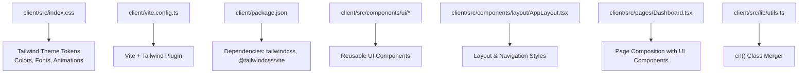
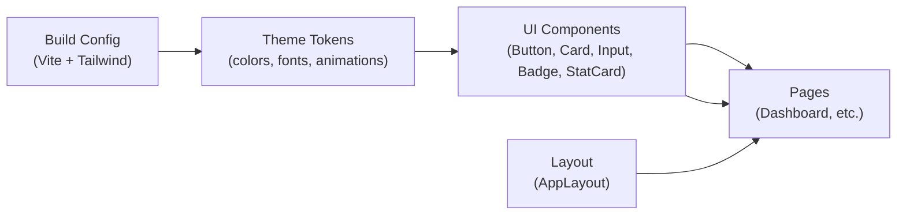
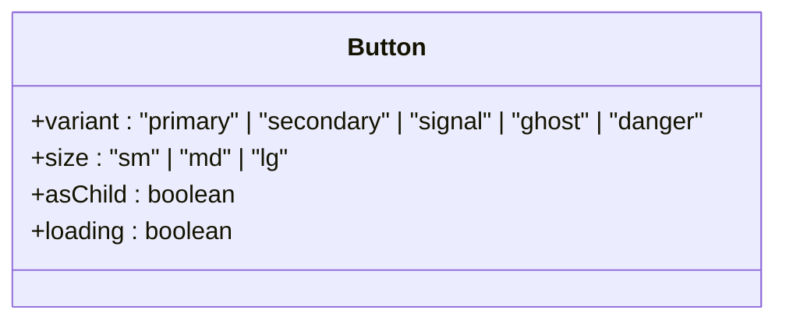
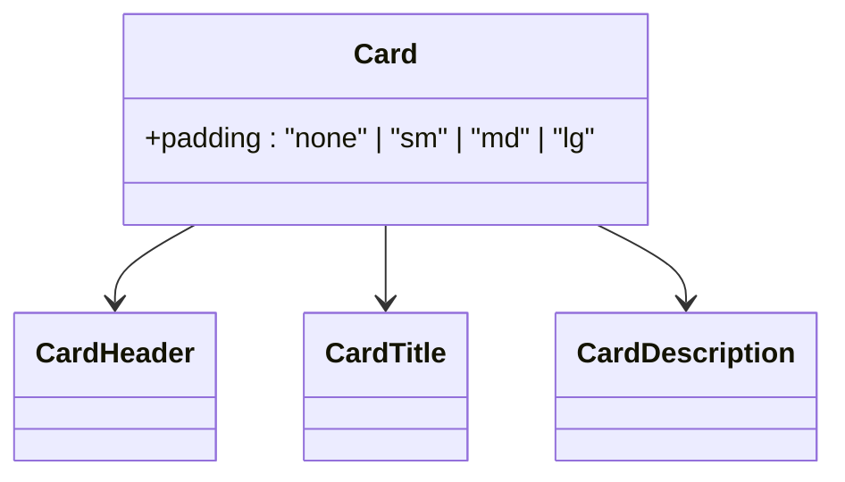
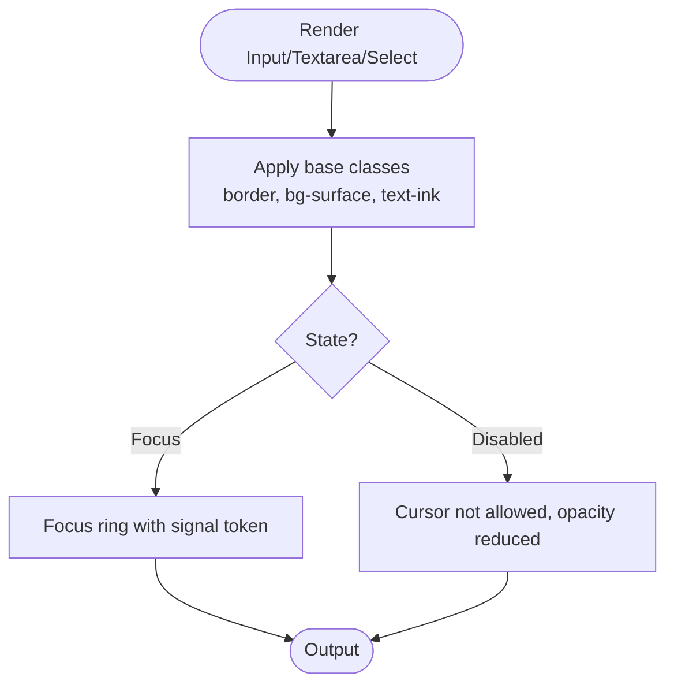
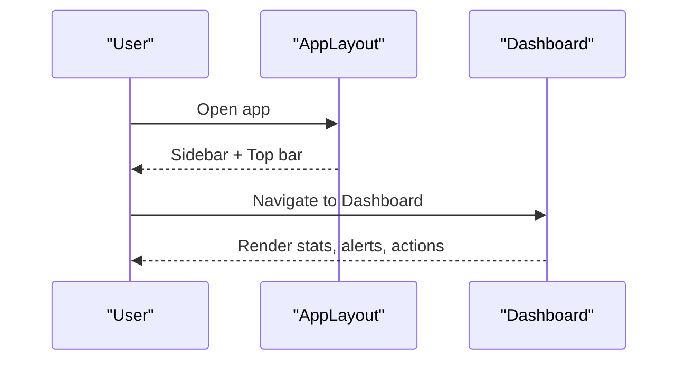
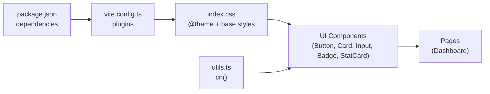

# Styling & Theming

<cite>
**Referenced Files in This Document**
- [index.css](file://client/src/index.css)
- [vite.config.ts](file://client/vite.config.ts)
- [package.json](file://client/package.json)
- [Button.tsx](file://client/src/components/ui/Button.tsx)
- [Card.tsx](file://client/src/components/ui/Card.tsx)
- [Input.tsx](file://client/src/components/ui/Input.tsx)
- [Badge.tsx](file://client/src/components/ui/Badge.tsx)
- [StatCard.tsx](file://client/src/components/ui/StatCard.tsx)
- [AppLayout.tsx](file://client/src/components/layout/AppLayout.tsx)
- [Dashboard.tsx](file://client/src/pages/Dashboard.tsx)
- [utils.ts](file://client/src/lib/utils.ts)
</cite>

## Table of Contents
1. [Introduction](#introduction)
2. [Project Structure](#project-structure)
3. [Core Components](#core-components)
4. [Architecture Overview](#architecture-overview)
5. [Detailed Component Analysis](#detailed-component-analysis)
6. [Dependency Analysis](#dependency-analysis)
7. [Performance Considerations](#performance-considerations)
8. [Troubleshooting Guide](#troubleshooting-guide)
9. [Conclusion](#conclusion)
10. [Appendices](#appendices)

## Introduction
This document explains the styling and theming system used in RentLite’s client application. It covers Tailwind CSS configuration, custom design tokens, component styling patterns, responsive design approaches, color scheme, typography, spacing conventions, and guidelines for extending themes and maintaining consistency. It also includes practical examples and best practices for building maintainable UIs with a cohesive design system.

## Project Structure
RentLite uses Tailwind CSS v4 with a single global stylesheet that defines theme tokens and base styles. The build pipeline integrates Tailwind via Vite. UI components are implemented as small, composable React components that apply consistent classes using a utility function to merge class names safely.

**Diagram sources**
- [index.css:1-19](file://client/src/index.css#L1-L19)
- [vite.config.ts:1-24](file://client/vite.config.ts#L1-L24)
- [package.json:12-41](file://client/package.json#L12-L41)
- [Button.tsx:1-50](file://client/src/components/ui/Button.tsx#L1-L50)
- [Card.tsx:1-42](file://client/src/components/ui/Card.tsx#L1-L42)
- [Input.tsx:1-86](file://client/src/components/ui/Input.tsx#L1-L86)
- [Badge.tsx:1-28](file://client/src/components/ui/Badge.tsx#L1-L28)
- [StatCard.tsx:1-54](file://client/src/components/ui/StatCard.tsx#L1-L54)
- [AppLayout.tsx:1-158](file://client/src/components/layout/AppLayout.tsx#L1-L158)
- [Dashboard.tsx:1-233](file://client/src/pages/Dashboard.tsx#L1-L233)
- [utils.ts:1-35](file://client/src/lib/utils.ts#L1-L35)

**Section sources**
- [index.css:1-102](file://client/src/index.css#L1-L102)
- [vite.config.ts:1-24](file://client/vite.config.ts#L1-L24)
- [package.json:12-41](file://client/package.json#L12-L41)

## Core Components
The UI library provides a set of reusable components that encapsulate consistent styling:

- Button: Variants (primary, secondary, signal, ghost, danger), sizes (sm, md, lg), loading state, and accessible focus rings.
- Card: Consistent rounded corners, borders, background, shadow, and configurable padding; includes header/title/description subcomponents.
- Input/Textarea/Select: Unified input styling with focus states, disabled states, and transitions.
- Badge: Semantic status indicators with variants (default, success, warning, danger, signal, outline).
- StatCard: Dashboard metric cards with icon backgrounds, trend labels, and subtle hover effects.

These components rely on shared design tokens defined in the global stylesheet and use a class merging utility to compose styles predictably.

**Section sources**
- [Button.tsx:1-50](file://client/src/components/ui/Button.tsx#L1-L50)
- [Card.tsx:1-42](file://client/src/components/ui/Card.tsx#L1-L42)
- [Input.tsx:1-86](file://client/src/components/ui/Input.tsx#L1-L86)
- [Badge.tsx:1-28](file://client/src/components/ui/Badge.tsx#L1-L28)
- [StatCard.tsx:1-54](file://client/src/components/ui/StatCard.tsx#L1-L54)

## Architecture Overview
The styling architecture is centered around Tailwind CSS with a theme layer that exposes semantic tokens. Components compose these tokens into consistent UI elements. Layout and pages assemble components to build screens.

**Diagram sources**
- [index.css:1-19](file://client/src/index.css#L1-L19)
- [Button.tsx:1-50](file://client/src/components/ui/Button.tsx#L1-L50)
- [Card.tsx:1-42](file://client/src/components/ui/Card.tsx#L1-L42)
- [Input.tsx:1-86](file://client/src/components/ui/Input.tsx#L1-L86)
- [Badge.tsx:1-28](file://client/src/components/ui/Badge.tsx#L1-L28)
- [StatCard.tsx:1-54](file://client/src/components/ui/StatCard.tsx#L1-L54)
- [AppLayout.tsx:1-158](file://client/src/components/layout/AppLayout.tsx#L1-L158)
- [Dashboard.tsx:1-233](file://client/src/pages/Dashboard.tsx#L1-L233)
- [vite.config.ts:1-24](file://client/vite.config.ts#L1-L24)

## Detailed Component Analysis

### Design Tokens and Global Styles
- Colors: Semantic tokens include ink, muted, canvas, surface, line, signal, signal-soft, deep, success, danger, warning, violet, blue. These provide a cohesive palette across the app.
- Typography: Sans font stack is defined and applied globally; hero-title and eyebrow utilities establish typographic hierarchy.
- Animations: Rise-in animation and button transition rules create consistent micro-interactions.
- Accessibility: Reduced motion media query disables animations when requested by the user.
- Scrollbar: Custom scrollbar styling improves visual consistency.

Use these tokens directly in components or extend them by adding new CSS variables under the theme block.

**Section sources**
- [index.css:1-102](file://client/src/index.css#L1-L102)

### Button Component
- Variants map to semantic colors and backgrounds, ensuring consistent emphasis levels.
- Sizes standardize height, padding, and text scale.
- Focus ring uses the signal token for clear accessibility.
- Loading state integrates an inline spinner and disables interaction.

**Diagram sources**
- [Button.tsx:6-25](file://client/src/components/ui/Button.tsx#L6-L25)

**Section sources**
- [Button.tsx:1-50](file://client/src/components/ui/Button.tsx#L1-L50)

### Card Component
- Provides consistent card shell with border, background, shadow, and rounded corners.
- Padding variants allow flexible content density.
- Header, Title, and Description subcomponents enforce consistent typography and spacing.

**Diagram sources**
- [Card.tsx:4-42](file://client/src/components/ui/Card.tsx#L4-L42)

**Section sources**
- [Card.tsx:1-42](file://client/src/components/ui/Card.tsx#L1-L42)

### Input, Textarea, Select
- Shared input styling ensures consistent borders, backgrounds, focus states, and disabled states.
- Textarea adds minimum height and consistent typography.
- Select supports placeholder and options mapping while keeping the same visual language.

**Diagram sources**
- [Input.tsx:4-18](file://client/src/components/ui/Input.tsx#L4-L18)
- [Input.tsx:35-49](file://client/src/components/ui/Input.tsx#L35-L49)
- [Input.tsx:58-83](file://client/src/components/ui/Input.tsx#L58-L83)

**Section sources**
- [Input.tsx:1-86](file://client/src/components/ui/Input.tsx#L1-L86)

### Badge Component
- Variants encode semantic meanings (success, warning, danger, signal, outline).
- Compact size and high contrast ensure readability in dense layouts.

**Section sources**
- [Badge.tsx:1-28](file://client/src/components/ui/Badge.tsx#L1-L28)

### StatCard Component
- Combines label, value, icon, and optional trend indicator.
- Icon background uses semantic color tokens for quick recognition.
- Hover elevation and rise animation add polish.

**Section sources**
- [StatCard.tsx:1-54](file://client/src/components/ui/StatCard.tsx#L1-L54)

### Layout and Responsive Patterns
- AppLayout implements a responsive sidebar with mobile overlay and a top bar.
- Uses semantic tokens for backgrounds, borders, and text to maintain consistency.
- Grid-based dashboards adapt from single column to multi-column layouts using responsive breakpoints.

**Diagram sources**
- [AppLayout.tsx:31-158](file://client/src/components/layout/AppLayout.tsx#L31-L158)
- [Dashboard.tsx:23-233](file://client/src/pages/Dashboard.tsx#L23-L233)

**Section sources**
- [AppLayout.tsx:1-158](file://client/src/components/layout/AppLayout.tsx#L1-L158)
- [Dashboard.tsx:1-233](file://client/src/pages/Dashboard.tsx#L1-L233)

## Dependency Analysis
Styling dependencies flow from the theme layer into components and pages. The build configuration enables Tailwind processing, and the class merger utility ensures deterministic output.

**Diagram sources**
- [package.json:12-41](file://client/package.json#L12-L41)
- [vite.config.ts:1-24](file://client/vite.config.ts#L1-L24)
- [index.css:1-19](file://client/src/index.css#L1-L19)
- [Button.tsx:1-50](file://client/src/components/ui/Button.tsx#L1-L50)
- [Card.tsx:1-42](file://client/src/components/ui/Card.tsx#L1-L42)
- [Input.tsx:1-86](file://client/src/components/ui/Input.tsx#L1-L86)
- [Badge.tsx:1-28](file://client/src/components/ui/Badge.tsx#L1-L28)
- [StatCard.tsx:1-54](file://client/src/components/ui/StatCard.tsx#L1-L54)
- [Dashboard.tsx:1-233](file://client/src/pages/Dashboard.tsx#L1-L233)
- [utils.ts:1-35](file://client/src/lib/utils.ts#L1-L35)

**Section sources**
- [package.json:12-41](file://client/package.json#L12-L41)
- [vite.config.ts:1-24](file://client/vite.config.ts#L1-L24)
- [utils.ts:1-35](file://client/src/lib/utils.ts#L1-L35)

## Performance Considerations
- Prefer semantic tokens over ad-hoc colors to keep the CSS bundle predictable and avoid duplication.
- Use component-level classes to minimize re-computation and ensure consistent rendering.
- Keep animations minimal and respect reduced motion preferences for performance and accessibility.
- Avoid excessive nested conditional classes; prefer variant props to reduce runtime branching.

[No sources needed since this section provides general guidance]

## Troubleshooting Guide
- Missing theme tokens: Ensure new colors or fonts are added under the theme block in the global stylesheet so they are available as CSS variables and Tailwind utilities.
- Class conflicts: Always pass className through the cn utility to merge Tailwind classes deterministically and avoid overrides.
- Focus visibility: Verify focus-visible styles are present for interactive components to meet accessibility requirements.
- Reduced motion: Confirm that animations respect prefers-reduced-motion to avoid motion sensitivity issues.

**Section sources**
- [index.css:1-102](file://client/src/index.css#L1-L102)
- [utils.ts:1-6](file://client/src/lib/utils.ts#L1-L6)
- [Button.tsx:27-47](file://client/src/components/ui/Button.tsx#L27-L47)

## Conclusion
RentLite’s styling system is built on a clear separation between design tokens and component composition. By centralizing colors, typography, and animations in the theme layer and enforcing consistent patterns in UI components, the codebase achieves visual coherence, scalability, and maintainability. Extending the system involves adding tokens to the theme and creating or adapting components that consume those tokens consistently.

[No sources needed since this section summarizes without analyzing specific files]

## Appendices

### Color Scheme and Usage Guidelines
- Primary brand: signal and signal-soft for highlights and accents.
- Neutral palette: ink, muted, canvas, surface, line for structure and readability.
- Status colors: success, danger, warning for feedback and alerts.
- Accent colors: violet, blue, deep for variety and emphasis.

Use these tokens in components and pages to maintain consistency. For example, badges and stat icons leverage these tokens to communicate meaning at a glance.

**Section sources**
- [index.css:3-19](file://client/src/index.css#L3-L19)
- [Badge.tsx:7-14](file://client/src/components/ui/Badge.tsx#L7-L14)
- [StatCard.tsx:11-17](file://client/src/components/ui/StatCard.tsx#L11-L17)

### Typography System
- Font family: sans stack defined in the theme and applied globally.
- Headings: Hero title utility for large, impactful headings; page titles use bold weights and tight tracking.
- Body: Standard text sizes with muted variants for secondary information.

**Section sources**
- [index.css:18-45](file://client/src/index.css#L18-L45)
- [Card.tsx:35-40](file://client/src/components/ui/Card.tsx#L35-L40)
- [Dashboard.tsx:121-127](file://client/src/pages/Dashboard.tsx#L121-L127)

### Spacing and Layout Conventions
- Consistent padding and margins via Tailwind utilities within components.
- Grid layouts for dashboards adapt across screen sizes.
- Sidebar and top bar spacing follow a unified rhythm.

**Section sources**
- [Card.tsx:8-13](file://client/src/components/ui/Card.tsx#L8-L13)
- [Dashboard.tsx:129-134](file://client/src/pages/Dashboard.tsx#L129-L134)
- [AppLayout.tsx:41-158](file://client/src/components/layout/AppLayout.tsx#L41-L158)

### Extending the Theme
- Add new colors or fonts under the theme block in the global stylesheet to make them available throughout the app.
- Reference new tokens in components via Tailwind utilities (e.g., bg-token, text-token).
- Update component variants if introducing new semantic states.

**Section sources**
- [index.css:3-19](file://client/src/index.css#L3-L19)
- [Button.tsx:13-25](file://client/src/components/ui/Button.tsx#L13-L25)

### Adding Custom Components
- Create a new component file under components/ui.
- Define props for variants/sizes and map them to class sets.
- Compose styles using the cn utility to merge default and user-provided classes.
- Reuse existing tokens and patterns for consistency.

**Section sources**
- [utils.ts:1-6](file://client/src/lib/utils.ts#L1-L6)
- [Button.tsx:27-47](file://client/src/components/ui/Button.tsx#L27-L47)
- [Card.tsx:15-26](file://client/src/components/ui/Card.tsx#L15-L26)

### Dark Mode Guidance
- No dark mode implementation is present in the current codebase.
- To add dark mode, introduce a dark theme block with alternate tokens and toggle classes at the root level.
- Update components to conditionally apply dark tokens based on a theme context or class strategy.

[No sources needed since this section provides general guidance]

### Build and Configuration Notes
- Tailwind is integrated via the Vite plugin.
- Dependencies include Tailwind CSS and related tooling.
- Aliases simplify imports within the client package.

**Section sources**
- [vite.config.ts:1-24](file://client/vite.config.ts#L1-L24)
- [package.json:12-41](file://client/package.json#L12-L41)