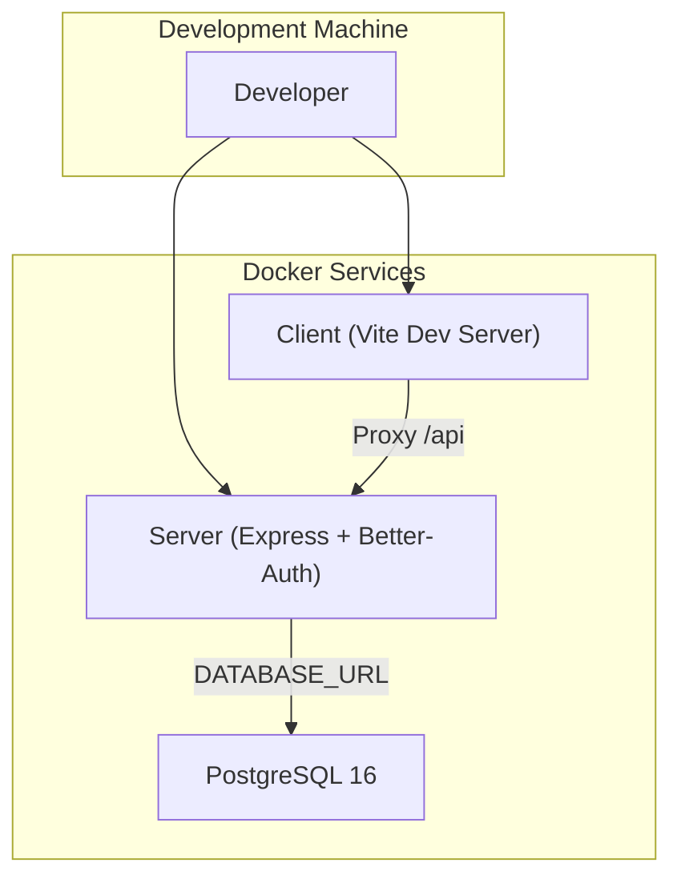
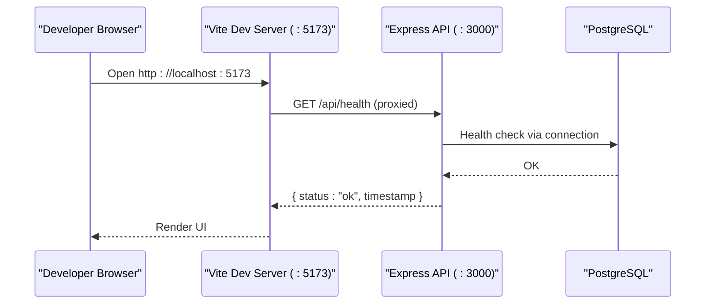
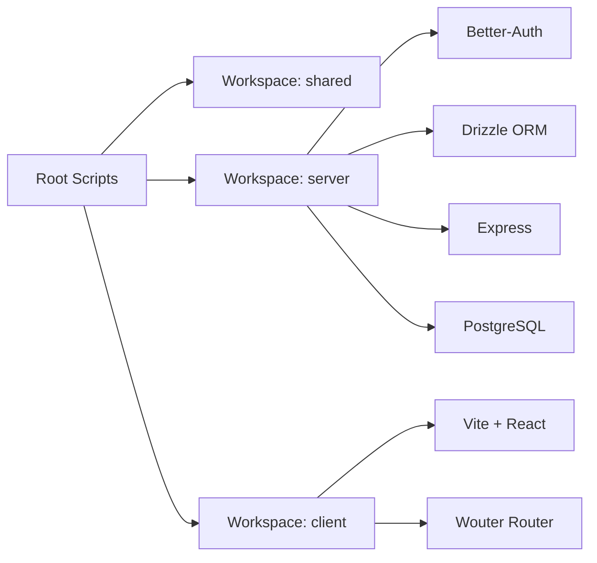

# Getting Started

<cite>
**Referenced Files in This Document**
- [package.json](file://package.json)
- [pnpm-workspace.yaml](file://pnpm-workspace.yaml)
- [docker-compose.yml](file://docker-compose.yml)
- [server/package.json](file://server/package.json)
- [client/package.json](file://client/package.json)
- [shared/package.json](file://shared/package.json)
- [server/src/index.ts](file://server/src/index.ts)
- [server/drizzle.config.ts](file://server/drizzle.config.ts)
- [client/vite.config.ts](file://client/vite.config.ts)
- [server/src/auth/middleware.ts](file://server/src/auth/middleware.ts)
- [client/src/pages/Login.tsx](file://client/src/pages/Login.tsx)
- [client/src/pages/Signup.tsx](file://client/src/pages/Signup.tsx)
</cite>

## Table of Contents
1. Introduction
2. Project Structure
3. Core Components
4. Architecture Overview
5. Detailed Component Analysis
6. Dependency Analysis
7. Performance Considerations
8. Troubleshooting Guide
9. Conclusion

## Introduction
This guide helps you set up the RentLite development environment quickly and confidently. You will install prerequisites, run the database and services with Docker Compose, initialize the database schema, create your first user account, and verify that everything works. The project uses a pnpm workspace to manage three packages: client (React + Vite), server (Express + Better-Auth + Drizzle ORM), and shared (TypeScript types).

## Project Structure
RentLite is organized as a monorepo with three main packages:
- client: React frontend built with Vite, Tailwind CSS, and Wouter routing. It proxies API calls to the backend during development.
- server: Express API with Better-Auth for authentication and Drizzle ORM for PostgreSQL. Routes are grouped by feature (properties, tenants, leases, payments, maintenance, expenses, vendors, reports, dashboard).
- shared: Shared TypeScript types and utilities consumed by both client and server.

**Diagram sources**
- [docker-compose.yml:1-64](file://docker-compose.yml#L1-L64)
- [client/vite.config.ts:13-23](file://client/vite.config.ts#L13-L23)
- [server/src/index.ts:16-56](file://server/src/index.ts#L16-L56)

**Section sources**
- [pnpm-workspace.yaml:1-5](file://pnpm-workspace.yaml#L1-L5)
- [client/package.json:1-44](file://client/package.json#L1-L44)
- [server/package.json:1-37](file://server/package.json#L1-L37)
- [shared/package.json:1-22](file://shared/package.json#L1-L22)

## Core Components
- Database: PostgreSQL container managed by Docker Compose. Health-checked before dependent services start.
- Backend: Express app with CORS, JSON parsing, Better-Auth mounted at /api/auth/*, and feature routes under /api/* plus a health endpoint.
- Frontend: Vite dev server on port 5173, proxying /api requests to http://localhost:3000.
- Authentication: Better-Auth middleware extracts sessions and attaches user context to requests.
- Schema: Drizzle ORM schema defines users, properties, units, tenants, leases, payments, maintenance requests, expenses, vendors, notifications, and subscriptions.

Key environment variables used by the stack:
- DATABASE_URL: Postgres connection string for the server.
- BETTER_AUTH_SECRET and BETTER_AUTH_URL: Better-Auth configuration.
- CLIENT_URL: Allowed CORS origin for the frontend.
- RESEND_API_KEY, TWILIO_*, PLAID_*: Optional integrations (email/SMS/bank feeds).
- UPLOAD_DIR: Directory for file uploads.
- PORT: Backend server port.
- VITE_API_URL: Client-side base URL for API calls when not using proxy.

**Section sources**
- [docker-compose.yml:1-64](file://docker-compose.yml#L1-L64)
- [server/src/index.ts:16-56](file://server/src/index.ts#L16-L56)
- [server/src/auth/middleware.ts:1-45](file://server/src/auth/middleware.ts#L1-L45)
- [server/drizzle.config.ts:1-12](file://server/drizzle.config.ts#L1-L12)
- [client/vite.config.ts:13-23](file://client/vite.config.ts#L13-L23)

## Architecture Overview
The development architecture runs three containers:
- postgres: Provides the relational data store.
- server: Runs the API and auth endpoints; depends on a healthy Postgres instance.
- client: Runs the Vite dev server and proxies API requests to the server.

**Diagram sources**
- [client/vite.config.ts:13-23](file://client/vite.config.ts#L13-L23)
- [server/src/index.ts:46-56](file://server/src/index.ts#L46-L56)
- [docker-compose.yml:20-47](file://docker-compose.yml#L20-L47)

## Detailed Component Analysis

### Prerequisites
- Node.js version 20 or newer
- pnpm version 9 or newer
- Docker and Docker Compose installed and running

These requirements are enforced by the root package engines field and scripts.

**Section sources**
- [package.json:16-19](file://package.json#L16-L19)

### Install Dependencies
Use pnpm workspaces to install dependencies across all packages:
- Run pnpm install from the repository root.

This installs shared, server, and client dependencies defined in their respective package.json files.

**Section sources**
- [pnpm-workspace.yaml:1-5](file://pnpm-workspace.yaml#L1-L5)
- [client/package.json:12-41](file://client/package.json#L12-L41)
- [server/package.json:15-34](file://server/package.json#L15-L34)
- [shared/package.json:14-20](file://shared/package.json#L14-L20)

### Start Infrastructure with Docker Compose
Start the database and application services:
- Run docker compose up -d to start Postgres, server, and client containers.
- Wait until the Postgres service is healthy before proceeding.

Services and ports:
- Postgres: exposed on host port 5432
- Server: exposed on host port 3000
- Client: exposed on host port 5173

Environment variables for the server include DATABASE_URL, BETTER_AUTH_* keys, CLIENT_URL, optional integrations, UPLOAD_DIR, and PORT.

**Section sources**
- [docker-compose.yml:1-64](file://docker-compose.yml#L1-L64)

### Initialize the Database
Apply the Drizzle schema to the Postgres database:
- Run pnpm db:push to push schema changes to the connected database.

The Drizzle configuration points to the schema file and uses DATABASE_URL for credentials.

**Section sources**
- [server/drizzle.config.ts:1-12](file://server/drizzle.config.ts#L1-L12)
- [server/package.json:6-14](file://server/package.json#L6-L14)

### Run Development Servers Locally (Optional)
If you prefer to run services locally instead of containers:
- Start the backend: pnpm dev:server
- Start the frontend: pnpm dev:client

The Vite dev server listens on port 5173 and proxies /api requests to http://localhost:3000.

**Section sources**
- [package.json:6-14](file://package.json#L6-L14)
- [client/vite.config.ts:13-23](file://client/vite.config.ts#L13-L23)
- [server/package.json:6-14](file://server/package.json#L6-L14)

### Create Your First User Account
Open the signup page in your browser and create an account:
- Navigate to http://localhost:5173/signup
- Enter your name, email, and password (minimum length enforced by the form)
- Submit to create the account

After successful registration, you will be redirected to the home route.

**Section sources**
- [client/src/pages/Signup.tsx:18-48](file://client/src/pages/Signup.tsx#L18-L48)

### Sign In and Access the Dashboard
Sign in to access the dashboard:
- Navigate to http://localhost:5173/login
- Enter your email and password
- On success, you will be redirected to the home route where the dashboard is available

Authentication is handled by Better-Auth mounted at /api/auth/* on the server.

**Section sources**
- [client/src/pages/Login.tsx:16-35](file://client/src/pages/Login.tsx#L16-L35)
- [server/src/index.ts:29-32](file://server/src/index.ts#L29-L32)
- [server/src/auth/middleware.ts:1-45](file://server/src/auth/middleware.ts#L1-L45)

### Basic Navigation Through the Dashboard
Once signed in, use the top navigation or sidebar to explore core areas:
- Properties: Manage properties and units
- Tenants: View tenant profiles and contacts
- Leases: Track lease dates and terms
- Payments: Record rent payments and statuses
- Maintenance: Submit and track maintenance requests
- Expenses: Log and categorize expenses
- Reports: View summaries and insights

These sections correspond to server routes under /api/properties, /api/tenants, /api/leases, /api/payments, /api/maintenance, /api/expenses, and /api/reports.

**Section sources**
- [server/src/index.ts:33-44](file://server/src/index.ts#L33-L44)

## Dependency Analysis
The monorepo uses pnpm workspaces to link shared types between client and server. The server depends on Express, Better-Auth, Drizzle ORM, and Postgres driver. The client depends on React, Vite, Tailwind, and Wouter. Docker Compose orchestrates runtime dependencies (Postgres, server, client).

**Diagram sources**
- [package.json:6-14](file://package.json#L6-L14)
- [pnpm-workspace.yaml:1-5](file://pnpm-workspace.yaml#L1-L5)
- [server/package.json:15-34](file://server/package.json#L15-L34)
- [client/package.json:12-41](file://client/package.json#L12-L41)

**Section sources**
- [package.json:6-14](file://package.json#L6-L14)
- [pnpm-workspace.yaml:1-5](file://pnpm-workspace.yaml#L1-L5)
- [server/package.json:15-34](file://server/package.json#L15-L34)
- [client/package.json:12-41](file://client/package.json#L12-L41)

## Performance Considerations
- Use Docker Compose for consistent local environments and to avoid port conflicts.
- Keep the Postgres container healthy before starting dependent services to prevent startup errors.
- For faster cold starts, ensure the database volume is reused across sessions.
- When running locally, use the Vite proxy to avoid CORS issues during development.

[No sources needed since this section provides general guidance]

## Troubleshooting Guide
Common setup issues and resolutions:
- Port conflicts: If ports 5432, 3000, or 5173 are already in use, stop conflicting processes or adjust docker-compose.yml ports and vite config accordingly.
- Database connection failures: Verify DATABASE_URL matches the Postgres credentials and service name in docker-compose.yml. Ensure the Postgres container is healthy before connecting.
- CORS errors: Confirm CLIENT_URL matches the frontend’s origin and that the server’s CORS settings allow it.
- Auth errors: Ensure BETTER_AUTH_SECRET and BETTER_AUTH_URL are set appropriately. Check that the client is calling /api/auth/* correctly.
- Missing environment variables: Provide required variables such as DATABASE_URL, BETTER_AUTH_SECRET, BETTER_AUTH_URL, and CLIENT_URL either via docker-compose environment or a .env file if supported by your setup.
- Drizzle schema mismatch: Re-run pnpm db:push to apply schema changes after modifying schema definitions.

Verification steps:
- Health check: Call GET http://localhost:3000/api/health to confirm the server is responding.
- Frontend proxy: Open http://localhost:5173 and verify the login/signup pages load without network errors.
- Auth flow: Create an account via signup and sign in via login; ensure redirection to the dashboard occurs.

**Section sources**
- [docker-compose.yml:1-64](file://docker-compose.yml#L1-L64)
- [server/src/index.ts:46-56](file://server/src/index.ts#L46-L56)
- [client/vite.config.ts:13-23](file://client/vite.config.ts#L13-L23)
- [server/src/auth/middleware.ts:1-45](file://server/src/auth/middleware.ts#L1-L45)

## Conclusion
You now have a fully functional RentLite development environment with a containerized Postgres database, a running Express API with authentication, and a Vite-based frontend. Use the provided commands to start services, initialize the database, create your first account, and navigate the dashboard. Refer to the troubleshooting section if you encounter common issues during setup.

[No sources needed since this section summarizes without analyzing specific files]