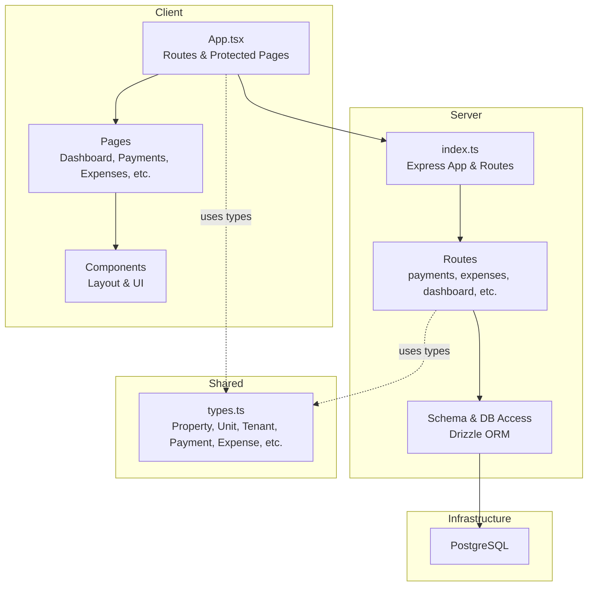
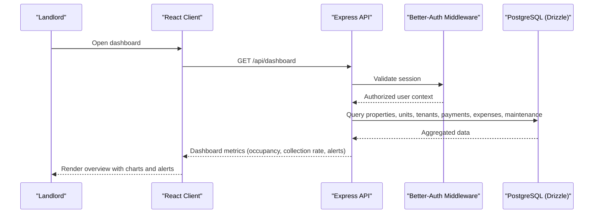
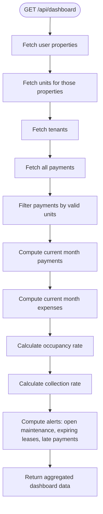
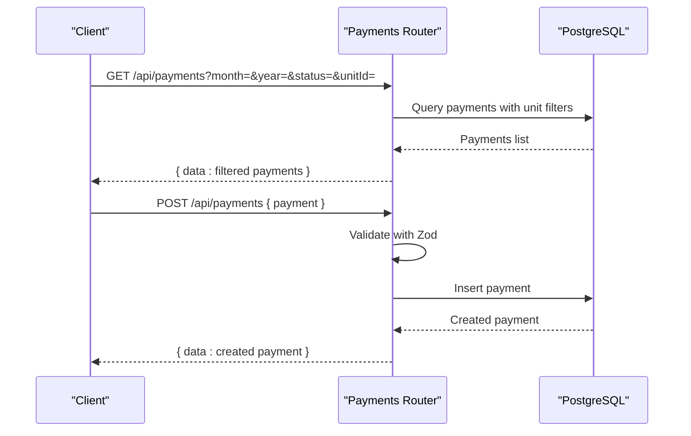
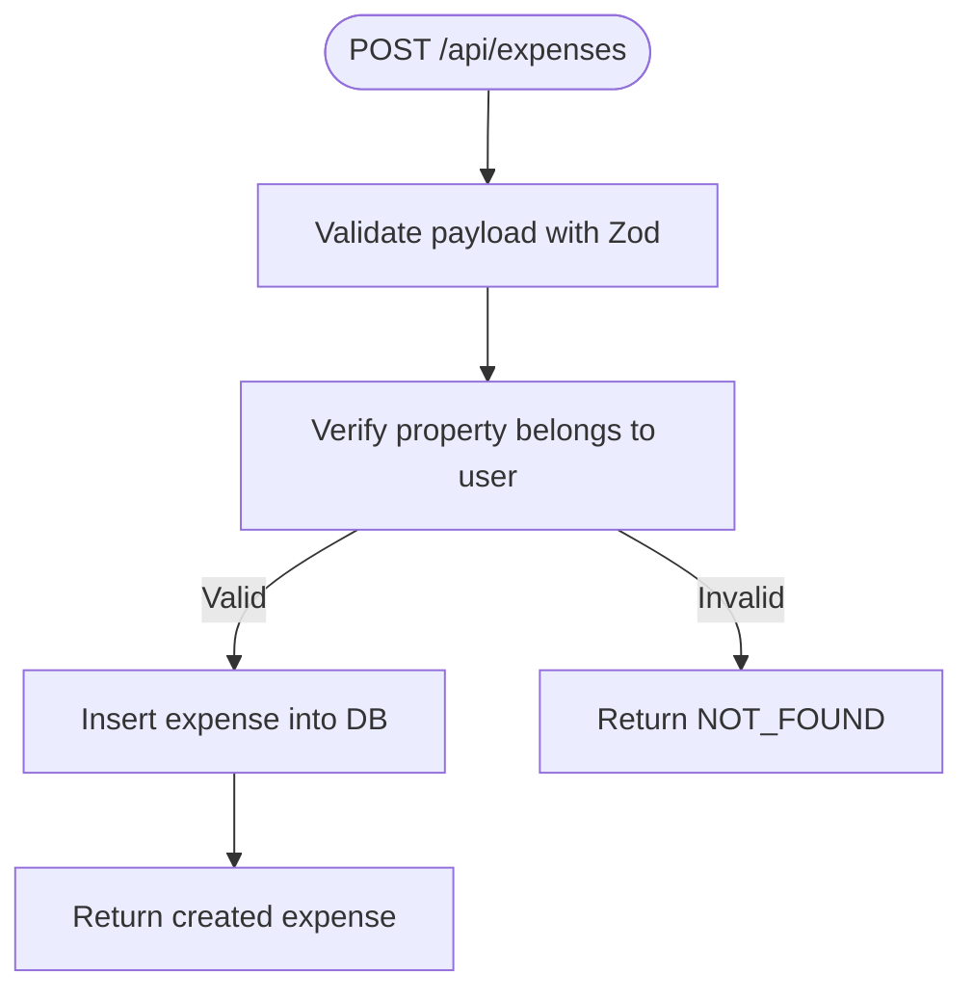
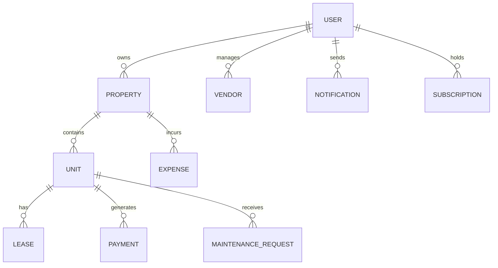
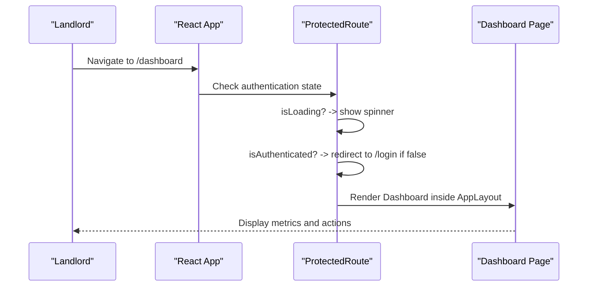
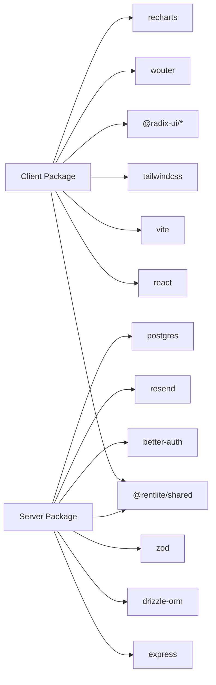

# Project Overview

<cite>
**Referenced Files in This Document**
- [RentLite-Product-Spec-Sheet.md](file://RentLite-Product-Spec-Sheet.md)
- [package.json](file://package.json)
- [client/package.json](file://client/package.json)
- [server/package.json](file://server/package.json)
- [shared/package.json](file://shared/package.json)
- [docker-compose.yml](file://docker-compose.yml)
- [server/src/index.ts](file://server/src/index.ts)
- [client/src/App.tsx](file://client/src/App.tsx)
- [shared/src/types.ts](file://shared/src/types.ts)
- [server/src/db/schema.ts](file://server/src/db/schema.ts)
- [server/src/routes/dashboard.ts](file://server/src/routes/dashboard.ts)
- [server/src/routes/payments.ts](file://server/src/routes/payments.ts)
- [server/src/routes/expenses.ts](file://server/src/routes/expenses.ts)
</cite>

## Table of Contents
1. Introduction
2. Project Structure
3. Core Components
4. Architecture Overview
5. Detailed Component Analysis
6. Dependency Analysis
7. Performance Considerations
8. Troubleshooting Guide
9. Conclusion

## Introduction
RentLite is a landlord property management SaaS designed for small landlords managing 2–20 residential rental units. It solves the gap between spreadsheet-based chaos and over-engineered enterprise tools by delivering an embarrassingly simple, mobile-friendly experience focused on rent tracking, maintenance coordination, expense management, and tax-time reporting. The product targets individual landlords who currently juggle spreadsheets, text messages, email threads, and paper receipts, and need a single place to organize their rental business without learning complex software or paying enterprise prices.

Key differentiators:
- Purpose-built for small portfolios (2–20 units), not scaled-up enterprise platforms
- Simple workflows that reduce time spent on rent collection, maintenance requests, expenses, and Schedule E preparation
- Mobile-first design aligned with how small landlords actually work
- Clear per-unit pricing that scales as portfolios grow

Problem statement:
- Small landlords are stuck between unreliable manual processes and bloated PM tools priced for large portfolios
- Rent tracking, maintenance coordination, expense capture, and tax-time reporting are fragmented across apps, texts, and paper
- Existing tools often cost too much and include features small landlords never use

Technology stack highlights:
- Frontend: React with Vite, TypeScript, Tailwind CSS, Radix UI, Wouter routing, Recharts for dashboards
- Backend: Express.js API server with TypeScript, Drizzle ORM, Zod validation, Better-Auth authentication
- Database: PostgreSQL via Docker Compose; schema defined with Drizzle
- Shared types: A shared package exports TypeScript types used by both client and server for type safety

Monorepo architecture:
- client: Vite + React application serving the landlord dashboard and tenant-facing pages
- server: Express API with routes for properties, units, tenants, leases, payments, maintenance, expenses, vendors, reports, and dashboard
- shared: Centralized TypeScript types and utilities consumed by both client and server
- docker-compose: Local development environment including PostgreSQL, server, and client services

How RentLite addresses small landlord pain points:
- Rent tracking: Monthly ledgers, payment status, late fees, and collection rate summaries
- Maintenance coordination: Request portal with priority levels, status tracking, vendor links, and completion documentation
- Expense management: Categorized expenses with receipt storage, recurring entries, and per-property/property-wide tracking
- Tax-time reporting: IRS-aligned expense categories and report-ready data for Schedule E preparation

**Section sources**
- [RentLite-Product-Spec-Sheet.md:14-23](file://RentLite-Product-Spec-Sheet.md#L14-L23)
- [RentLite-Product-Spec-Sheet.md:37-63](file://RentLite-Product-Spec-Sheet.md#L37-L63)
- [RentLite-Product-Spec-Sheet.md:109-179](file://RentLite-Product-Spec-Sheet.md#L109-L179)
- [RentLite-Product-Spec-Sheet.md:272-290](file://RentLite-Product-Spec-Sheet.md#L272-L290)
- [RentLite-Product-Spec-Sheet.md:350-382](file://RentLite-Product-Spec-Sheet.md#L350-L382)
- [RentLite-Product-Spec-Sheet.md:448-489](file://RentLite-Product-Spec-Sheet.md#L448-L489)

## Project Structure
RentLite uses a monorepo with three primary packages:
- client: React frontend built with Vite, TypeScript, Tailwind CSS, and Radix UI components
- server: Express backend with typed routes, database access via Drizzle, and authentication middleware
- shared: TypeScript types exported for consistent contracts across client and server

Development and deployment are orchestrated with Docker Compose, which provisions PostgreSQL, the API server, and the client dev server.

**Diagram sources**
- [client/src/App.tsx:1-78](file://client/src/App.tsx#L1-L78)
- [server/src/index.ts:1-59](file://server/src/index.ts#L1-L59)
- [shared/src/types.ts:1-251](file://shared/src/types.ts#L1-L251)
- [server/src/db/schema.ts:1-403](file://server/src/db/schema.ts#L1-L403)
- [docker-compose.yml:1-64](file://docker-compose.yml#L1-L64)

**Section sources**
- [package.json:1-21](file://package.json#L1-L21)
- [client/package.json:1-44](file://client/package.json#L1-L44)
- [server/package.json:1-37](file://server/package.json#L1-L37)
- [shared/package.json:1-22](file://shared/package.json#L1-L22)
- [docker-compose.yml:1-64](file://docker-compose.yml#L1-L64)

## Core Components
- Authentication and authorization: Better-Auth integration with protected routes ensuring users can only access their own properties and related data
- Property and unit management: CRUD operations for properties and units, with statuses like active, vacant, under renovation
- Tenant and lease management: Tenant profiles, lease documents, and lease lifecycle tracking
- Payment tracking: Monthly rent ledgers, payment methods, statuses, late fees, and collection metrics
- Maintenance requests: Prioritized requests with photo attachments, vendor assignment, and status progression
- Expense management: Categorized expenses with receipt storage, recurring entries, and per-property/unit association
- Dashboard and reports: Aggregated metrics including occupancy, collection rates, monthly income/expenses, and alerts

These components map directly to the core value proposition: simplifying rent tracking, maintenance coordination, expense management, and tax-time reporting for small landlords.

**Section sources**
- [server/src/routes/dashboard.ts:1-124](file://server/src/routes/dashboard.ts#L1-L124)
- [server/src/routes/payments.ts:1-137](file://server/src/routes/payments.ts#L1-L137)
- [server/src/routes/expenses.ts:1-106](file://server/src/routes/expenses.ts#L1-L106)
- [shared/src/types.ts:1-251](file://shared/src/types.ts#L1-L251)
- [server/src/db/schema.ts:189-403](file://server/src/db/schema.ts#L189-L403)

## Architecture Overview
RentLite follows a modern, modular architecture:
- Client: React SPA with route protection and reusable UI components
- Server: Express API with feature-based route modules, middleware for auth, and Drizzle ORM for database interactions
- Shared: Centralized TypeScript types ensure consistency across client and server
- Infrastructure: PostgreSQL containerized for local development and easy scaling

**Diagram sources**
- [client/src/App.tsx:16-32](file://client/src/App.tsx#L16-L32)
- [server/src/index.ts:16-44](file://server/src/index.ts#L16-L44)
- [server/src/routes/dashboard.ts:11-121](file://server/src/routes/dashboard.ts#L11-L121)
- [server/src/db/schema.ts:189-403](file://server/src/db/schema.ts#L189-L403)

## Detailed Component Analysis

### Dashboard Metrics and Alerts
The dashboard endpoint aggregates key landlord metrics:
- Properties and units counts with occupancy rate
- Tenants count
- Rent collection metrics: expected vs collected, outstanding, collection rate
- Financials: monthly income, expenses, net; yearly totals
- Alerts: open maintenance requests, expiring leases, late payments

This provides a single view for landlords to monitor performance and take action quickly.

**Diagram sources**
- [server/src/routes/dashboard.ts:11-121](file://server/src/routes/dashboard.ts#L11-L121)

**Section sources**
- [server/src/routes/dashboard.ts:1-124](file://server/src/routes/dashboard.ts#L1-L124)

### Payments Tracking
Payment routes support listing, filtering, creating, updating, and deleting payments:
- List payments with filters by month, year, status, and unit
- Summary endpoint computes expected, collected, outstanding amounts and collection rate
- Create/update/delete endpoints validate input using Zod schemas and enforce ownership constraints

**Diagram sources**
- [server/src/routes/payments.ts:24-137](file://server/src/routes/payments.ts#L24-L137)

**Section sources**
- [server/src/routes/payments.ts:1-137](file://server/src/routes/payments.ts#L1-L137)

### Expense Management
Expense routes provide full CRUD with categorization aligned to IRS categories:
- List expenses with filters by property, category, year, and month
- Create expenses with validation and property ownership verification
- Update and delete expenses with existence checks

**Diagram sources**
- [server/src/routes/expenses.ts:65-79](file://server/src/routes/expenses.ts#L65-L79)

**Section sources**
- [server/src/routes/expenses.ts:1-106](file://server/src/routes/expenses.ts#L1-L106)

### Data Model and Relationships
The database schema defines core entities and relationships:
- User, Session, Account, Verification tables for authentication
- Property and Unit tables with status enums and JSON fields for photos
- Tenant and Lease tables linking tenants to units with lease lifecycle
- Payment table tracking rent due dates, amounts paid, methods, and status
- MaintenanceRequest table with priority, status, photos, vendor links, and costs
- Expense table with IRS-aligned categories, receipt URLs, and recurring flags
- Vendor table for contractor contacts and insurance tracking
- Notification and Subscription tables for communications and billing

**Diagram sources**
- [server/src/db/schema.ts:137-403](file://server/src/db/schema.ts#L137-L403)

**Section sources**
- [server/src/db/schema.ts:1-403](file://server/src/db/schema.ts#L1-L403)

### Client Routing and Protection
The React client uses Wouter for routing and protects authenticated routes:
- Public routes: login, signup
- Protected routes: dashboard, properties, tenants, payments, maintenance, expenses, reports
- ProtectedRoute component handles loading states and redirects unauthenticated users

**Diagram sources**
- [client/src/App.tsx:16-78](file://client/src/App.tsx#L16-L78)

**Section sources**
- [client/src/App.tsx:1-78](file://client/src/App.tsx#L1-L78)

## Dependency Analysis
RentLite’s dependencies reflect a modern, type-safe stack:
- Client dependencies include React, Vite, Tailwind CSS, Radix UI, Wouter, Recharts, and TanStack Query for data fetching
- Server dependencies include Express, Drizzle ORM, Zod for validation, Better-Auth for authentication, Resend for email, and Postgres driver
- Shared package centralizes TypeScript types used by both client and server
- Docker Compose orchestrates PostgreSQL, server, and client services for local development

**Diagram sources**
- [client/package.json:12-42](file://client/package.json#L12-L42)
- [server/package.json:15-35](file://server/package.json#L15-L35)
- [shared/package.json:1-22](file://shared/package.json#L1-L22)

**Section sources**
- [client/package.json:1-44](file://client/package.json#L1-L44)
- [server/package.json:1-37](file://server/package.json#L1-L37)
- [shared/package.json:1-22](file://shared/package.json#L1-L22)

## Performance Considerations
- Use Drizzle ORM queries efficiently by selecting only needed columns and filtering at the database layer where possible
- Cache frequently accessed dashboard metrics if dataset grows beyond small landlord scale
- Implement pagination for large lists (payments, expenses, maintenance requests) to improve client rendering performance
- Optimize image uploads and storage for maintenance photos and receipts to reduce payload sizes
- Leverage environment variables and configuration for CORS, API limits, and service endpoints to avoid misconfiguration in production

[No sources needed since this section provides general guidance]

## Troubleshooting Guide
Common issues and resolutions:
- Authentication failures: Ensure Better-Auth secrets and URLs are configured correctly in environment variables; verify client URL matches CORS settings
- Database connectivity errors: Confirm PostgreSQL container is healthy and DATABASE_URL is set; check port mappings and credentials in docker-compose
- Validation errors: Review Zod schemas in route handlers; ensure client payloads match expected types from shared package
- CORS errors: Verify CLIENT_URL and origin settings in Express middleware; ensure browser requests include credentials when required
- Missing data: Check ownership filters in routes to ensure users only see their own properties and related data

**Section sources**
- [server/src/index.ts:19-31](file://server/src/index.ts#L19-L31)
- [docker-compose.yml:20-46](file://docker-compose.yml#L20-L46)
- [server/src/routes/expenses.ts:65-79](file://server/src/routes/expenses.ts#L65-L79)

## Conclusion
RentLite delivers a focused, practical solution for small landlords by addressing the most critical pain points: rent tracking, maintenance coordination, expense management, and tax-time reporting. Its monorepo architecture with React frontend, Express backend, PostgreSQL database, and shared TypeScript types enables rapid development and strong type safety. By staying intentionally simple and purpose-built for 2–20 units, RentLite avoids the complexity and cost of enterprise tools while providing the essential features landlords need to run their rental business efficiently.

[No sources needed since this section summarizes without analyzing specific files]