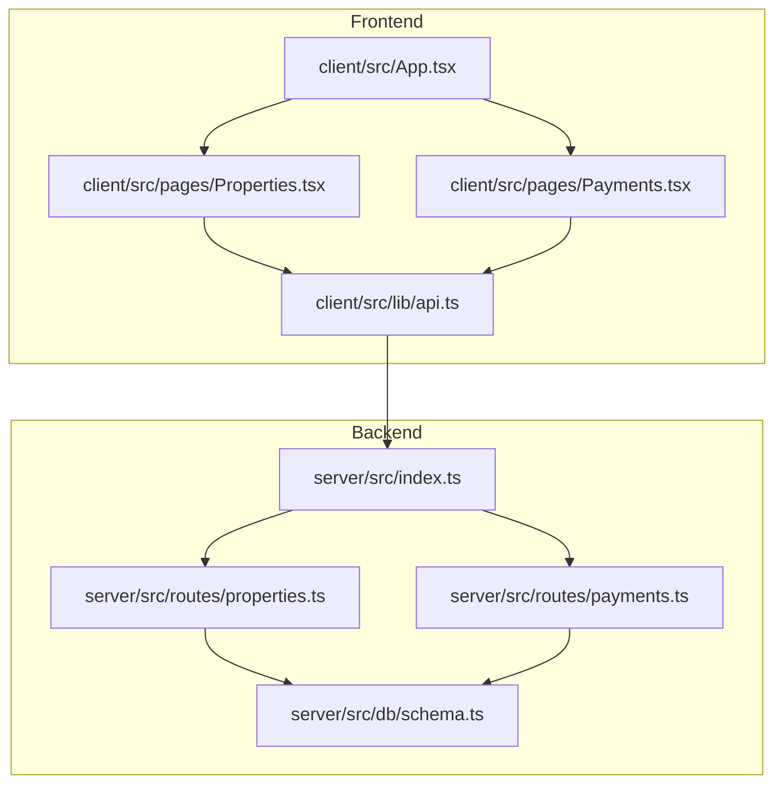
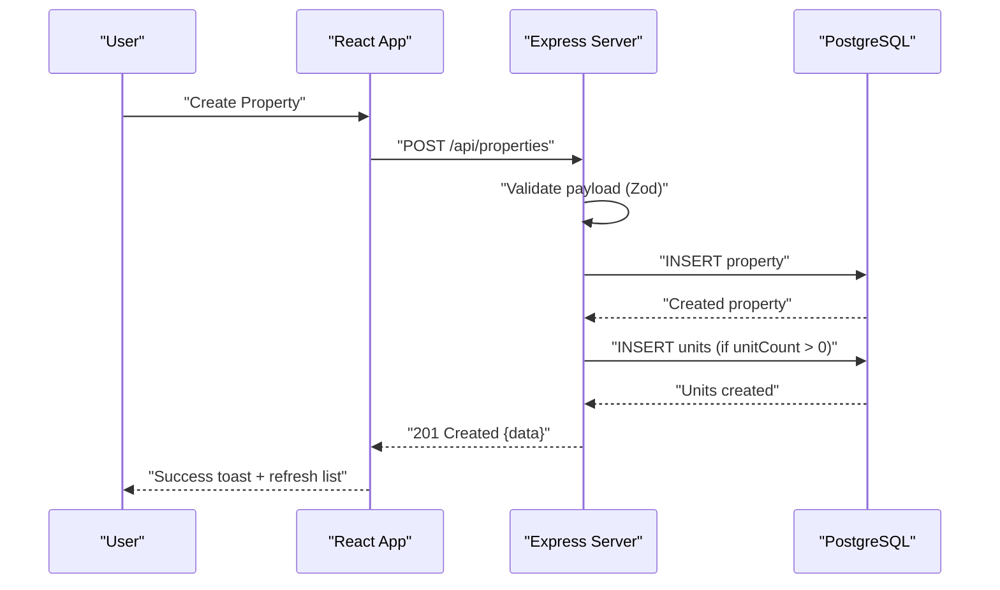
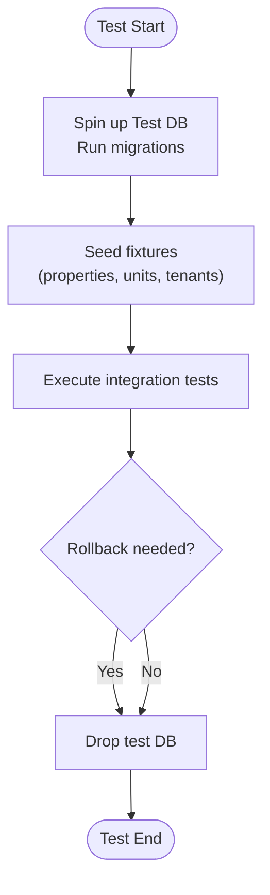
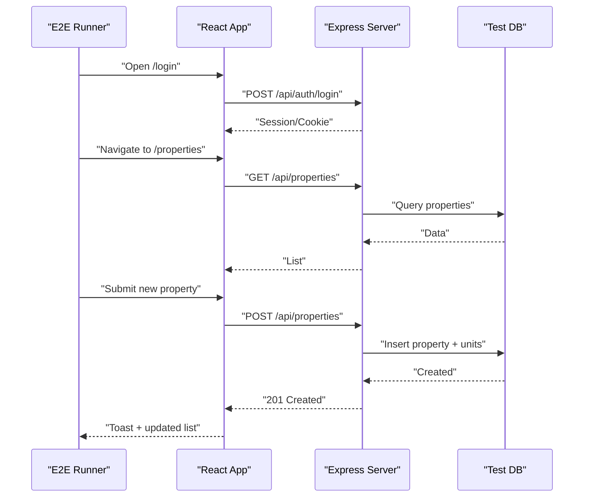
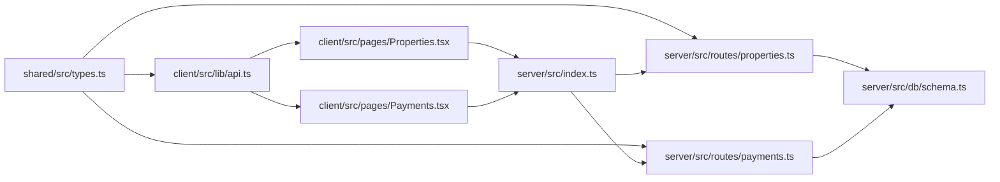

# Testing Strategy

<cite>
**Referenced Files in This Document**
- [package.json](file://package.json)
- [client/package.json](file://client/package.json)
- [server/package.json](file://server/package.json)
- [client/src/App.tsx](file://client/src/App.tsx)
- [client/src/lib/api.ts](file://client/src/lib/api.ts)
- [client/src/pages/Properties.tsx](file://client/src/pages/Properties.tsx)
- [client/src/pages/Payments.tsx](file://client/src/pages/Payments.tsx)
- [server/src/index.ts](file://server/src/index.ts)
- [server/src/routes/properties.ts](file://server/src/routes/properties.ts)
- [server/src/routes/payments.ts](file://server/src/routes/payments.ts)
- [server/src/db/schema.ts](file://server/src/db/schema.ts)
- [shared/src/types.ts](file://shared/src/types.ts)
</cite>

## Table of Contents
1. Introduction
2. Project Structure
3. Core Components
4. Architecture Overview
5. Detailed Component Analysis
6. Dependency Analysis
7. Performance Considerations
8. Troubleshooting Guide
9. Conclusion
10. Appendices

## Introduction
This document defines a comprehensive testing strategy for the RentLite application, covering unit tests for React components and backend API endpoints, integration tests for database operations and external services, end-to-end (E2E) tests for critical workflows (property management, payment processing, maintenance requests), test data management and mocking strategies, tools and frameworks, naming conventions, organization patterns, continuous integration setup, and performance/load testing approaches. The goal is to ensure reliability, maintainability, and scalability across the full stack.

## Project Structure
RentLite is a monorepo with:
- client: React + Vite frontend using TanStack Query and an internal ApiClient
- server: Express API with Drizzle ORM and Zod validation
- shared: TypeScript types used by both client and server

Key entry points and routes:
- Server bootstrap and route registration
- Client routing and protected routes
- Domain-specific routes for properties and payments

**Diagram sources**
- [client/src/App.tsx:1-78](file://client/src/App.tsx#L1-L78)
- [client/src/lib/api.ts:1-82](file://client/src/lib/api.ts#L1-L82)
- [client/src/pages/Properties.tsx:1-280](file://client/src/pages/Properties.tsx#L1-L280)
- [client/src/pages/Payments.tsx:1-297](file://client/src/pages/Payments.tsx#L1-L297)
- [server/src/index.ts:1-59](file://server/src/index.ts#L1-L59)
- [server/src/routes/properties.ts:1-106](file://server/src/routes/properties.ts#L1-L106)
- [server/src/routes/payments.ts:1-137](file://server/src/routes/payments.ts#L1-L137)
- [server/src/db/schema.ts:1-403](file://server/src/db/schema.ts#L1-L403)

**Section sources**
- [package.json:1-21](file://package.json#L1-L21)
- [client/package.json:1-44](file://client/package.json#L1-L44)
- [server/package.json:1-37](file://server/package.json#L1-L37)

## Core Components
- Frontend API client: Centralized fetch wrapper handling base URL, params, credentials, and error handling.
- Property management: CRUD via Express router with Zod validation and Drizzle queries; auto-creates units on property creation.
- Payment tracking: List, summary, create, update, delete; filters by month/year/status/unitId.
- Shared types: Strongly typed domain models for properties, units, tenants, leases, payments, maintenance, expenses, vendors, notifications, subscriptions.

Testing implications:
- Mock or stub the ApiClient for component tests.
- Use supertest against Express app for endpoint tests.
- Use an in-memory Postgres or test container for DB-backed integration tests.
- Validate schema-driven behavior (Zod + Drizzle enums).

**Section sources**
- [client/src/lib/api.ts:1-82](file://client/src/lib/api.ts#L1-L82)
- [server/src/routes/properties.ts:1-106](file://server/src/routes/properties.ts#L1-L106)
- [server/src/routes/payments.ts:1-137](file://server/src/routes/payments.ts#L1-L137)
- [shared/src/types.ts:1-251](file://shared/src/types.ts#L1-L251)

## Architecture Overview
The system follows a standard SPA + REST API pattern:
- React UI consumes typed APIs via ApiClient.
- Express server enforces auth middleware, validates inputs with Zod, persists via Drizzle ORM to PostgreSQL.
- Shared types ensure contract consistency between client and server.

**Diagram sources**
- [client/src/pages/Properties.tsx:54-77](file://client/src/pages/Properties.tsx#L54-L77)
- [server/src/routes/properties.ts:48-71](file://server/src/routes/properties.ts#L48-L71)
- [server/src/db/schema.ts:191-226](file://server/src/db/schema.ts#L191-L226)

## Detailed Component Analysis

### Unit Testing Strategy

#### Frontend (React)
- Frameworks:
  - Jest + React Testing Library for unit and component tests.
  - MSW (Mock Service Worker) to intercept network calls at the browser level.
  - Vitest can be added for faster unit tests if desired.
- Scope:
  - Pure presentational components (Button, Card, Input, Badge, StatCard).
  - Container components that call ApiClient (Properties, Payments).
  - Auth context interactions and protected route behavior.
- Key targets:
  - Properties page: query invalidation, form submission, success/error toasts, modal open/close, delete confirmation.
  - Payments page: summary display, record payment flow, select dropdowns populated from units/tenants.
  - ApiClient: request method behavior, unauthorized redirect, error mapping.
- Mocking:
  - Mock ApiClient methods (get/post/put/delete) or use MSW to respond with fixtures.
  - Stub TanStack Query hooks for controlled rendering and assertions.
- Naming conventions:
  - <component>.test.tsx
  - describe blocks grouped by feature; it("should ...") for behaviors.
- Example coverage areas:
  - Rendering empty state when no properties exist.
  - Submitting a valid property form triggers mutation and shows success toast.
  - Deleting a property prompts confirmation and removes item from list.
  - Payments summary updates after recording a payment.

**Section sources**
- [client/src/pages/Properties.tsx:36-83](file://client/src/pages/Properties.tsx#L36-L83)
- [client/src/pages/Payments.tsx:58-107](file://client/src/pages/Payments.tsx#L58-L107)
- [client/src/lib/api.ts:26-54](file://client/src/lib/api.ts#L26-L54)

#### Backend (Express + Drizzle)
- Frameworks:
  - Jest for unit tests.
  - Supertest for HTTP-level endpoint tests.
  - In-memory Postgres (e.g., pg-mem) or Dockerized Postgres for integration tests.
- Scope:
  - Route handlers for properties and payments.
  - Validation logic via Zod schemas.
  - Database interactions via Drizzle ORM.
- Key targets:
  - GET /api/properties: returns user-scoped properties with units.
  - POST /api/properties: validates input, creates property, auto-creates units.
  - PUT/DELETE /api/properties/:id: ownership checks and side effects.
  - GET /api/payments and /api/payments/summary: filtering and aggregation.
  - POST/PUT/DELETE /api/payments: CRUD with validation and existence checks.
- Mocking:
  - For unit tests, mock db module or use a real DB in transactions that roll back.
  - For auth, mock req.userId via middleware or test harness.
- Naming conventions:
  - <route>.test.ts under server/tests or alongside routes.
  - describe("Properties API", ...) and it("should return 400 on invalid payload").
- Example coverage areas:
  - Validation errors return 400 with details.
  - Creating a property with unitCount > 0 inserts corresponding units.
  - Summary endpoint computes totals and collection rate correctly.

**Section sources**
- [server/src/routes/properties.ts:11-23](file://server/src/routes/properties.ts#L11-L23)
- [server/src/routes/properties.ts:26-103](file://server/src/routes/properties.ts#L26-L103)
- [server/src/routes/payments.ts:11-22](file://server/src/routes/payments.ts#L11-L22)
- [server/src/routes/payments.ts:25-134](file://server/src/routes/payments.ts#L25-L134)

### Integration Testing Strategy

#### Database Operations
- Use a dedicated test database per run (Docker Compose service or ephemeral instance).
- Seed deterministic fixtures for properties, units, tenants, leases, payments.
- Wrap each test in a transaction that rolls back to keep tests isolated.
- Validate constraints and relationships defined in schema (enums, foreign keys).

**Diagram sources**
- [server/src/db/schema.ts:191-403](file://server/src/db/schema.ts#L191-L403)

**Section sources**
- [server/src/db/schema.ts:191-403](file://server/src/db/schema.ts#L191-L403)

#### External Service Interactions
- Email via Resend:
  - Mock email sending in tests to avoid real emails.
  - Assert that correct payloads are queued/sent via spies/stubs.
- Authentication via Better-Auth:
  - Use test tokens or bypass auth in tests where appropriate.
  - Ensure middleware sets req.userId consistently.

**Section sources**
- [server/package.json:15-25](file://server/package.json#L15-L25)

### End-to-End Testing Strategy

- Tooling:
  - Playwright or Cypress for E2E across login, navigation, and critical flows.
  - Use environment variables to point to test server and DB.
- Critical workflows:
  - Property Management:
    - Login -> Navigate to Properties -> Add Property -> Verify list update -> Delete Property.
  - Payment Processing:
    - Login -> Navigate to Payments -> Record Payment -> Verify summary metrics update.
  - Maintenance Requests:
    - Create maintenance request -> Update status -> Mark completed.
- Data isolation:
  - Pre-seed minimal dataset per scenario.
  - Reset state between scenarios.

**Diagram sources**
- [client/src/App.tsx:16-32](file://client/src/App.tsx#L16-L32)
- [client/src/pages/Properties.tsx:49-77](file://client/src/pages/Properties.tsx#L49-L77)
- [server/src/routes/properties.ts:48-71](file://server/src/routes/properties.ts#L48-L71)

**Section sources**
- [client/src/App.tsx:16-32](file://client/src/App.tsx#L16-L32)
- [client/src/pages/Properties.tsx:49-77](file://client/src/pages/Properties.tsx#L49-L77)
- [server/src/routes/properties.ts:48-71](file://server/src/routes/properties.ts#L48-L71)

### Test Data Management and Mocks

- Test data:
  - Define fixtures for Property, Unit, Tenant, Lease, Payment, Expense, Vendor, Notification, Subscription aligned with shared types.
  - Use factories to generate realistic but minimal datasets per test.
- Mocks:
  - ApiClient: intercept get/post/put/delete to return fixtures.
  - TanStack Query: provide custom queryClient with preloaded data.
  - External services: mock Resend and Better-Auth helpers.
- Environment:
  - Separate .env.test files for test URLs and secrets.
  - Use docker-compose to provision Postgres and any required services.

**Section sources**
- [shared/src/types.ts:1-251](file://shared/src/types.ts#L1-L251)
- [client/src/lib/api.ts:1-82](file://client/src/lib/api.ts#L1-L82)

### Tools and Frameworks

- Frontend:
  - Jest + React Testing Library (unit/component tests).
  - MSW (network mocking).
  - Optional: Vitest for speed.
- Backend:
  - Jest (unit tests).
  - Supertest (HTTP tests).
  - Drizzle + Postgres (integration tests with test DB).
- E2E:
  - Playwright or Cypress.
- Linting/Formatting:
  - ESLint + Prettier for consistent code quality.

**Section sources**
- [client/package.json:1-44](file://client/package.json#L1-L44)
- [server/package.json:1-37](file://server/package.json#L1-L37)

### Guidelines for Writing Effective Tests

- Focus on behavior, not implementation details.
- Keep tests small and focused; one assertion per concept where possible.
- Prefer meaningful names over cleverness.
- Isolate side effects; never rely on global state.
- Use fixtures/factories for consistent data.
- Cover happy paths, edge cases, and error paths.
- Avoid flaky tests: stabilize timing and external dependencies.

### Test Naming Conventions

- File naming:
  - <feature>.test.ts(x)
  - <route>.test.ts
- Describe blocks:
  - Group by feature or component name.
- It blocks:
  - "should render X when Y"
  - "should return 400 when payload is invalid"
  - "should create a property and units"

### Test Organization Patterns

- Frontend:
  - __tests__ or *.test.tsx next to components/pages.
  - Separate utils/fixtures folder for shared test helpers.
- Backend:
  - tests/ directory mirroring src structure.
  - fixtures/ for seed data and factories.
- E2E:
  - e2e/ or tests/e2e/ with features grouped by workflow.

### Continuous Integration Setup

- CI pipeline steps:
  - Install dependencies (pnpm install).
  - Build shared, server, client.
  - Start Postgres (and optional services) via Docker Compose.
  - Run lint and type checks.
  - Execute unit tests (frontend and backend).
  - Execute integration tests against test DB.
  - Execute E2E tests headless.
  - Collect coverage reports.
- Scripts:
  - Add test scripts in package.json for each workspace.
  - Use pnpm workspaces to orchestrate runs.

**Section sources**
- [package.json:1-21](file://package.json#L1-L21)

### Performance and Load Testing

- Frontend:
  - Measure render times and memory usage with React DevTools Profiler.
  - Use Lighthouse for bundle size and runtime performance insights.
- Backend:
  - Use k6 or Artillery to simulate concurrent users hitting key endpoints (list properties, create property, payments summary).
  - Monitor DB query performance and indexes; add profiling for slow queries.
- Load testing procedures:
  - Define target SLIs (latency, throughput, error rate).
  - Ramp-up scenarios to find breaking points.
  - Analyze results and optimize bottlenecks (DB queries, N+1 issues, caching).

[No sources needed since this section provides general guidance]

## Dependency Analysis

**Diagram sources**
- [shared/src/types.ts:1-251](file://shared/src/types.ts#L1-L251)
- [client/src/lib/api.ts:1-82](file://client/src/lib/api.ts#L1-L82)
- [client/src/pages/Properties.tsx:1-280](file://client/src/pages/Properties.tsx#L1-L280)
- [client/src/pages/Payments.tsx:1-297](file://client/src/pages/Payments.tsx#L1-L297)
- [server/src/index.ts:1-59](file://server/src/index.ts#L1-L59)
- [server/src/routes/properties.ts:1-106](file://server/src/routes/properties.ts#L1-L106)
- [server/src/routes/payments.ts:1-137](file://server/src/routes/payments.ts#L1-L137)
- [server/src/db/schema.ts:1-403](file://server/src/db/schema.ts#L1-L403)

**Section sources**
- [server/src/index.ts:1-59](file://server/src/index.ts#L1-L59)
- [server/src/routes/properties.ts:1-106](file://server/src/routes/properties.ts#L1-L106)
- [server/src/routes/payments.ts:1-137](file://server/src/routes/payments.ts#L1-L137)

## Performance Considerations
- Prefer efficient queries with Drizzle; avoid N+1 by selecting only needed fields.
- Paginate large lists (properties, payments).
- Cache frequently accessed data on the client (TanStack Query already helps).
- Index database columns used in filters (e.g., dueDate, status, userId).
- Profile endpoints under load and identify hotspots.

[No sources needed since this section provides general guidance]

## Troubleshooting Guide
- Common issues:
  - Unauthorized redirects: verify ApiClient handles 401 and navigates to login.
  - Validation failures: ensure Zod schemas match expected payloads.
  - DB constraint violations: validate foreign keys and enum values.
  - Flaky E2E: stabilize waits and avoid relying on exact timings.
- Debugging tips:
  - Log request/response payloads in development.
  - Use test DB dumps to reproduce issues.
  - Inspect TanStack Query cache state during component tests.

**Section sources**
- [client/src/lib/api.ts:39-54](file://client/src/lib/api.ts#L39-L54)
- [server/src/routes/properties.ts:48-71](file://server/src/routes/properties.ts#L48-L71)
- [server/src/routes/payments.ts:104-134](file://server/src/routes/payments.ts#L104-L134)

## Conclusion
This testing strategy ensures robust coverage across unit, integration, and E2E layers for RentLite. By leveraging strong typing, validation, and structured test practices, the team can confidently iterate on features like property management, payment processing, and maintenance workflows while maintaining high reliability and performance.

[No sources needed since this section summarizes without analyzing specific files]

## Appendices

### A. Recommended Test Scripts
- Add scripts to package.json files:
  - client: jest, vitest, playwright/cypress commands
  - server: jest, supertest commands
  - root: orchestrate workspace-wide test runs

**Section sources**
- [package.json:1-21](file://package.json#L1-L21)
- [client/package.json:1-44](file://client/package.json#L1-L44)
- [server/package.json:1-37](file://server/package.json#L1-L37)

### B. Sample Test Scenarios Checklist
- Properties:
  - List, create, update, delete with ownership checks.
  - Auto-create units on creation.
- Payments:
  - List with filters, summary calculations, create/update/delete.
- Maintenance:
  - Create, update status, mark complete.
- Auth:
  - Protected routes enforce authentication.
- Errors:
  - Validation errors, not found, unauthorized.

[No sources needed since this section provides general guidance]