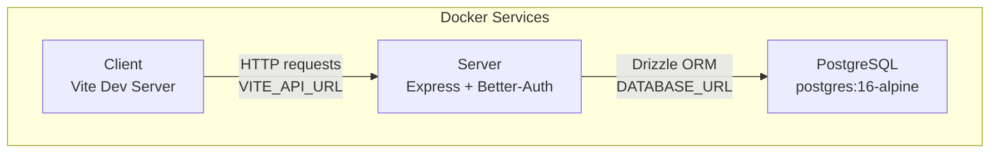
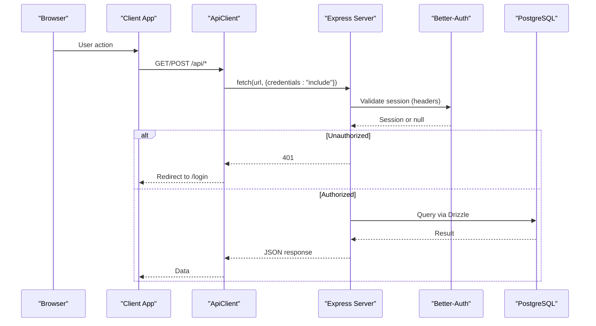
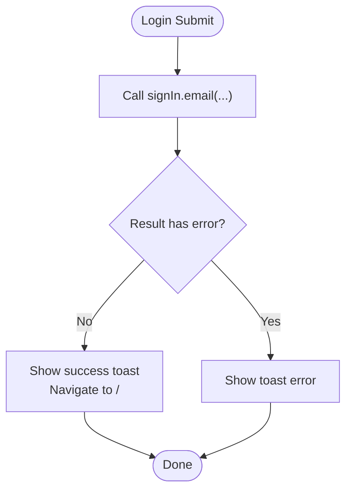
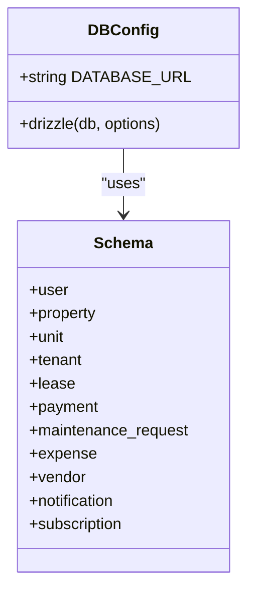
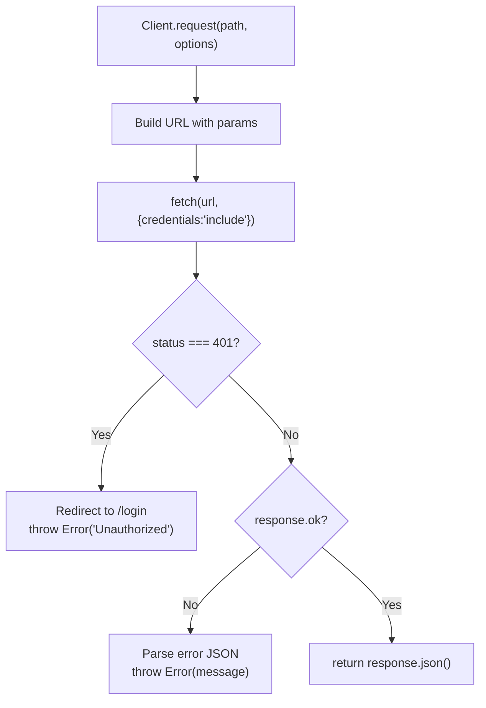
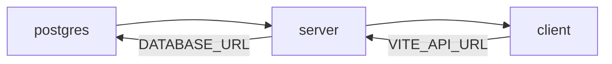

# Troubleshooting & FAQ

<cite>
**Referenced Files in This Document**
- [docker-compose.yml](file://docker-compose.yml)
- [package.json](file://package.json)
- [server/src/index.ts](file://server/src/index.ts)
- [server/src/auth/middleware.ts](file://server/src/auth/middleware.ts)
- [server/src/db/index.ts](file://server/src/db/index.ts)
- [server/src/db/schema.ts](file://server/src/db/schema.ts)
- [server/drizzle.config.ts](file://server/drizzle.config.ts)
- [server/package.json](file://server/package.json)
- [client/src/App.tsx](file://client/src/App.tsx)
- [client/src/lib/api.ts](file://client/src/lib/api.ts)
- [client/src/contexts/auth-context.tsx](file://client/src/contexts/auth-context.tsx)
- [client/src/pages/Login.tsx](file://client/src/pages/Login.tsx)
- [client/package.json](file://client/package.json)
</cite>

## Table of Contents
1. Introduction
2. Project Structure
3. Core Components
4. Architecture Overview
5. Detailed Component Analysis
6. Dependency Analysis
7. Performance Considerations
8. Troubleshooting Guide
9. Conclusion
10. Appendices

## Introduction
This document provides comprehensive troubleshooting and frequently asked questions for the RentLite application. It covers common setup issues during installation and development environment configuration, debugging techniques for frontend and backend issues (including browser developer tools usage and server log analysis), solutions for database connection problems, authentication errors, and API communication issues. It also includes performance troubleshooting approaches such as slow query identification and memory leak detection, step-by-step resolution guides for known issues with clear error messages and fixes, logging strategies and diagnostic tools, escalation procedures for complex issues, and community support resources.

## Project Structure
RentLite is a monorepo with three main packages:
- client: React + Vite frontend
- server: Express + Better-Auth backend
- shared: Shared TypeScript types

Key runtime components:
- Docker Compose orchestrates Postgres, server, and client services
- Server exposes REST endpoints under /api/* and mounts Better-Auth routes at /api/auth/*
- Client communicates with the server via an API client that handles credentials and redirects on 401

**Diagram sources**
- [docker-compose.yml:1-64](file://docker-compose.yml#L1-L64)
- [server/src/index.ts:16-56](file://server/src/index.ts#L16-L56)
- [server/src/db/index.ts:1-10](file://server/src/db/index.ts#L1-L10)
- [client/src/lib/api.ts:1-2](file://client/src/lib/api.ts#L1-L2)

**Section sources**
- [docker-compose.yml:1-64](file://docker-compose.yml#L1-L64)
- [package.json:6-14](file://package.json#L6-L14)

## Core Components
- Backend entrypoint registers CORS, JSON parsing, auth routes, resource routers, health check, and starts listening on PORT.
- Authentication uses Better-Auth; middleware extracts session and attaches user context to requests.
- Database layer uses Drizzle ORM with PostgreSQL; schema defines all entities and relations.
- Frontend routing protects routes and redirects unauthenticated users to login.
- API client centralizes fetch calls, sets credentials, handles 401 redirects, and normalizes errors.

**Section sources**
- [server/src/index.ts:16-56](file://server/src/index.ts#L16-L56)
- [server/src/auth/middleware.ts:1-45](file://server/src/auth/middleware.ts#L1-L45)
- [server/src/db/index.ts:1-10](file://server/src/db/index.ts#L1-L10)
- [server/src/db/schema.ts:137-403](file://server/src/db/schema.ts#L137-L403)
- [client/src/App.tsx:16-43](file://client/src/App.tsx#L16-L43)
- [client/src/lib/api.ts:26-54](file://client/src/lib/api.ts#L26-L54)

## Architecture Overview
The request flow involves the client making authenticated HTTP requests to the server, which validates sessions and queries the database via Drizzle ORM.

**Diagram sources**
- [client/src/lib/api.ts:26-54](file://client/src/lib/api.ts#L26-L54)
- [server/src/index.ts:21-44](file://server/src/index.ts#L21-L44)
- [server/src/auth/middleware.ts:9-27](file://server/src/auth/middleware.ts#L9-L27)
- [server/src/db/index.ts:6-9](file://server/src/db/index.ts#L6-L9)

## Detailed Component Analysis

### Authentication Flow and Error Handling
- The client’s Login page triggers sign-in and shows toast notifications based on results.
- The server’s Better-Auth handler is mounted at /api/auth/* and used by the client auth client.
- Protected routes redirect unauthenticated users to login.
- API client redirects to /login on 401 responses.

**Diagram sources**
- [client/src/pages/Login.tsx:16-35](file://client/src/pages/Login.tsx#L16-L35)
- [server/src/index.ts:29-31](file://server/src/index.ts#L29-L31)
- [client/src/App.tsx:16-32](file://client/src/App.tsx#L16-L32)
- [client/src/lib/api.ts:39-43](file://client/src/lib/api.ts#L39-L43)

**Section sources**
- [client/src/pages/Login.tsx:16-35](file://client/src/pages/Login.tsx#L16-L35)
- [client/src/App.tsx:16-43](file://client/src/App.tsx#L16-L43)
- [client/src/lib/api.ts:39-43](file://client/src/lib/api.ts#L39-L43)
- [server/src/index.ts:29-31](file://server/src/index.ts#L29-L31)

### Database Connection and Schema
- The server reads DATABASE_URL from environment and initializes Drizzle with schema and relations.
- Drizzle config points to schema file and uses the same DATABASE_URL.
- Schema defines tables for users, properties, units, tenants, leases, payments, maintenance, expenses, vendors, notifications, and subscriptions.

**Diagram sources**
- [server/src/db/index.ts:1-10](file://server/src/db/index.ts#L1-L10)
- [server/drizzle.config.ts:1-12](file://server/drizzle.config.ts#L1-L12)
- [server/src/db/schema.ts:137-403](file://server/src/db/schema.ts#L137-L403)

**Section sources**
- [server/src/db/index.ts:1-10](file://server/src/db/index.ts#L1-L10)
- [server/drizzle.config.ts:1-12](file://server/drizzle.config.ts#L1-L12)
- [server/src/db/schema.ts:137-403](file://server/src/db/schema.ts#L137-L403)

### API Communication and Error Handling
- The API client builds URLs using VITE_API_URL, sends credentials, and handles 401 by redirecting to login.
- Non-ok responses are parsed into a standardized error object and thrown.
- Routes return consistent JSON structures and validation errors include details.

**Diagram sources**
- [client/src/lib/api.ts:14-54](file://client/src/lib/api.ts#L14-L54)
- [server/src/routes/properties.ts:49-53](file://server/src/routes/properties.ts#L49-L53)

**Section sources**
- [client/src/lib/api.ts:14-54](file://client/src/lib/api.ts#L14-L54)
- [server/src/routes/properties.ts:49-53](file://server/src/routes/properties.ts#L49-L53)

## Dependency Analysis
- Docker Compose defines service dependencies: server depends on postgres being healthy; client depends on server.
- Environment variables wire services together: DATABASE_URL, CLIENT_URL, BETTER_AUTH_* secrets, RESEND_API_KEY, TWILIO_*, PLAID_*.
- Scripts orchestrate dev, build, and DB tasks across workspaces.

**Diagram sources**
- [docker-compose.yml:20-59](file://docker-compose.yml#L20-L59)
- [package.json:6-14](file://package.json#L6-L14)

**Section sources**
- [docker-compose.yml:1-64](file://docker-compose.yml#L1-L64)
- [package.json:6-14](file://package.json#L6-L14)

## Performance Considerations
- Use Drizzle query profiling to identify slow queries. In development, enable logging in the Postgres driver or use EXPLAIN ANALYZE for critical queries.
- Ensure indexes exist on frequently filtered columns (e.g., foreign keys like unit_id, tenant_id, property_id).
- Monitor memory usage of the Node process; look for growing heap snapshots if you suspect leaks.
- Keep payload sizes reasonable; the server accepts up to 10mb JSON bodies.

[No sources needed since this section provides general guidance]

## Troubleshooting Guide

### Installation and Development Setup Issues
- Symptoms:
  - Cannot start services with npm/pnpm scripts
  - Port conflicts on 3000 or 5173
  - Database container not ready when server starts
- Checks:
  - Verify Node and pnpm versions meet requirements
  - Ensure ports 3000 and 5173 are free
  - Confirm Docker is running and images can be pulled
- Fixes:
  - Stop conflicting processes
  - Rebuild containers if necessary
  - Use docker compose logs to inspect startup order and health checks

**Section sources**
- [package.json:16-18](file://package.json#L16-L18)
- [docker-compose.yml:14-18](file://docker-compose.yml#L14-L18)
- [docker-compose.yml:20-59](file://docker-compose.yml#L20-L59)

### Database Connection Problems
- Symptoms:
  - Server fails to connect to Postgres
  - Drizzle commands fail
  - Health endpoint works but data endpoints error
- Checks:
  - DATABASE_URL is set correctly in server environment
  - Postgres container is healthy and reachable on port 5432
  - Credentials match POSTGRES_USER and POSTGRES_PASSWORD
- Fixes:
  - Correct DATABASE_URL format and host
  - Restart postgres service and ensure it becomes healthy before server starts
  - Run drizzle push to apply schema changes

**Section sources**
- [docker-compose.yml:6-11](file://docker-compose.yml#L6-L11)
- [docker-compose.yml:29-31](file://docker-compose.yml#L29-L31)
- [server/src/db/index.ts:6-9](file://server/src/db/index.ts#L6-L9)
- [server/drizzle.config.ts:4-10](file://server/drizzle.config.ts#L4-L10)

### Authentication Errors
- Symptoms:
  - Login fails or redirects immediately
  - Protected pages show unauthorized
  - API calls return 401
- Checks:
  - BETTER_AUTH_SECRET and BETTER_AUTH_URL configured
  - CLIENT_URL matches the client origin
  - Cookies are sent with credentials
- Fixes:
  - Set proper BETTER_AUTH_SECRET and BETTER_AUTH_URL
  - Ensure CLIENT_URL allows CORS and matches the client
  - Verify client sets credentials: include on requests

**Section sources**
- [docker-compose.yml:29-34](file://docker-compose.yml#L29-L34)
- [server/src/index.ts:21-31](file://server/src/index.ts#L21-L31)
- [client/src/lib/api.ts:30-37](file://client/src/lib/api.ts#L30-L37)
- [server/src/auth/middleware.ts:9-27](file://server/src/auth/middleware.ts#L9-L27)

### API Communication Issues
- Symptoms:
  - Network errors in browser console
  - Cross-origin errors
  - Unexpected 400 or 404 responses
- Checks:
  - VITE_API_URL points to server address
  - CORS origin allows client domain
  - Request paths and methods match server routes
- Fixes:
  - Update VITE_API_URL to correct server URL
  - Adjust CLIENT_URL and CORS settings
  - Inspect route handlers for expected payloads and IDs

**Section sources**
- [docker-compose.yml:56-58](file://docker-compose.yml#L56-L58)
- [server/src/index.ts:21-44](file://server/src/index.ts#L21-L44)
- [client/src/lib/api.ts:14-24](file://client/src/lib/api.ts#L14-L24)

### Frontend Debugging Techniques
- Use browser Developer Tools:
  - Network tab: inspect requests, status codes, headers, and payloads
  - Console tab: view errors and logs
  - Application tab: verify cookies and storage
- Common issues:
  - 401 redirects to login due to missing or invalid session
  - CORS blocked requests due to mismatched origins
- Fixes:
  - Ensure credentials are included and cookies are present
  - Align CLIENT_URL and VITE_API_URL with server settings

**Section sources**
- [client/src/lib/api.ts:39-43](file://client/src/lib/api.ts#L39-L43)
- [server/src/index.ts:21-26](file://server/src/index.ts#L21-L26)

### Backend Debugging Techniques
- Check server logs for startup messages and errors
- Use health endpoint to verify server readiness
- Inspect route handlers for validation errors and database failures
- Enable verbose logging in development to trace request flows

**Section sources**
- [server/src/index.ts:48-56](file://server/src/index.ts#L48-L56)
- [server/src/routes/properties.ts:49-53](file://server/src/routes/properties.ts#L49-L53)

### Step-by-Step Resolution Guides

- Issue: “Cannot connect to database”
  - Steps:
    - Verify DATABASE_URL in server environment
    - Confirm Postgres container is healthy
    - Restart services and re-run drizzle push
  - Expected outcome: Server connects and routes respond

  **Section sources**
  - [docker-compose.yml:29-31](file://docker-compose.yml#L29-L31)
  - [server/src/db/index.ts:6-9](file://server/src/db/index.ts#L6-L9)
  - [server/drizzle.config.ts:4-10](file://server/drizzle.config.ts#L4-L10)

- Issue: “Login fails or immediate redirect to login”
  - Steps:
    - Check BETTER_AUTH_SECRET and BETTER_AUTH_URL
    - Ensure CLIENT_URL matches client origin
    - Confirm credentials are included in requests
  - Expected outcome: Successful sign-in and protected access

  **Section sources**
  - [docker-compose.yml:29-34](file://docker-compose.yml#L29-L34)
  - [client/src/lib/api.ts:30-37](file://client/src/lib/api.ts#L30-L37)
  - [server/src/auth/middleware.ts:9-27](file://server/src/auth/middleware.ts#L9-L27)

- Issue: “CORS error in browser”
  - Steps:
    - Verify CLIENT_URL and CORS origin configuration
    - Ensure VITE_API_URL points to server
  - Expected outcome: Requests succeed without CORS block

  **Section sources**
  - [server/src/index.ts:21-26](file://server/src/index.ts#L21-L26)
  - [docker-compose.yml:56-58](file://docker-compose.yml#L56-L58)

- Issue: “Validation error on create/update”
  - Steps:
    - Inspect request body against route schemas
    - Fix missing or invalid fields
  - Expected outcome: Validated request succeeds

  **Section sources**
  - [server/src/routes/properties.ts:11-23](file://server/src/routes/properties.ts#L11-L23)
  - [server/src/routes/properties.ts:49-53](file://server/src/routes/properties.ts#L49-L53)

### Logging Strategies and Diagnostic Tools
- Server:
  - Log startup message and listen port
  - Add structured logs around key operations (auth, DB queries)
  - Use health endpoint to monitor availability
- Client:
  - Log network requests and errors in the API client
  - Display user-facing toasts for errors and successes
- Database:
  - Use Drizzle Studio to inspect schema and data
  - Enable query logging in development to analyze performance

**Section sources**
- [server/src/index.ts:48-56](file://server/src/index.ts#L48-L56)
- [client/src/pages/Login.tsx:20-35](file://client/src/pages/Login.tsx#L20-L35)
- [server/package.json:11-13](file://server/package.json#L11-L13)

### Escalation Procedures and Community Support
- If issues persist after following steps:
  - Collect logs from server and browser console
  - Capture network traces for failing requests
  - Include environment variables (redacted) and Docker service status
- Seek help:
  - Open an issue with detailed reproduction steps
  - Provide logs and screenshots
  - Reference relevant files and configurations

[No sources needed since this section provides general guidance]

## Conclusion
This guide consolidates common setup, authentication, database, and API issues with actionable steps and references to the codebase. Use the provided diagrams and section sources to locate implementation details quickly. For performance issues, focus on query optimization and memory monitoring. When stuck, escalate with comprehensive logs and environment details.

## Appendices

### Frequently Asked Questions

- How do I run the app locally?
  - Use the workspace scripts to start services and databases.

  **Section sources**
  - [package.json:6-14](file://package.json#L6-L14)

- Where are environment variables configured?
  - Docker Compose sets DATABASE_URL, CLIENT_URL, and other secrets for services.

  **Section sources**
  - [docker-compose.yml:29-42](file://docker-compose.yml#L29-L42)

- How do I change the client API base URL?
  - Set VITE_API_URL in the client environment.

  **Section sources**
  - [docker-compose.yml:56-58](file://docker-compose.yml#L56-L58)

- Why am I getting 401 on API calls?
  - Ensure session is valid and credentials are included; check CORS and auth configuration.

  **Section sources**
  - [client/src/lib/api.ts:39-43](file://client/src/lib/api.ts#L39-L43)
  - [server/src/auth/middleware.ts:9-27](file://server/src/auth/middleware.ts#L9-L27)

- How do I apply schema changes?
  - Use Drizzle push to sync schema to the database.

  **Section sources**
  - [server/package.json:11-13](file://server/package.json#L11-L13)
  - [server/drizzle.config.ts:4-10](file://server/drizzle.config.ts#L4-L10)